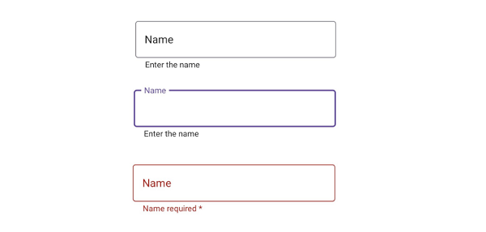
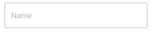

# States and Colors in .NET MAUI SfTextInputLayout

Customize the appearance of [SfTextInputLayout](https://help.syncfusion.com/cr/maui/Syncfusion.Maui.Core.SfTextInputLayout.html) by setting stroke and background colors, applying visual states, and styling the labels. This page covers the following customization points:

- The base [Stroke](https://help.syncfusion.com/cr/maui/Syncfusion.Maui.Core.SfTextInputLayout.html#Syncfusion_Maui_Core_SfTextInputLayout_Stroke) color and the per-state stroke values via the [Visual State Manager](https://learn.microsoft.com/en-us/dotnet/maui/user-interface/visual-states?view=net-maui-10.0).
- The [ContainerBackground](https://help.syncfusion.com/cr/maui/Syncfusion.Maui.Core.SfTextInputLayout.html#Syncfusion_Maui_Core_SfTextInputLayout_ContainerBackground) color for Filled and Outlined containers.
- The text color of the hint, helper, and error labels via [LabelStyle](https://help.syncfusion.com/cr/maui/Syncfusion.Maui.Core.LabelStyle.html).
- The disabled appearance via [IsEnabled](https://help.syncfusion.com/cr/maui/Syncfusion.Maui.Core.SfTextInputLayout.html#Syncfusion_Maui_Core_SfTextInputLayout_IsEnabled).

## Prerequisites

Before using the [SfTextInputLayout](https://help.syncfusion.com/cr/maui/Syncfusion.Maui.Core.SfTextInputLayout.html), ensure the following NuGet package is installed in your .NET MAUI project:

- `Syncfusion.Maui.Core`

For a step-by-step setup, refer to the [Getting Started](https://help.syncfusion.com/maui/textinputlayout/getting-started) documentation.

## Supported Visual States

The control exposes three visual states through the `Visual State Manager`. Each state can override the `Stroke`, `StrokeThickness`, and other brush properties.

| State | Trigger |
|-------|---------|
| `Normal` | Default state (no focus, no error). |
| `Focused` | The inner input view has focus. |
| `Error` | [HasError](https://help.syncfusion.com/cr/maui/Syncfusion.Maui.Core.SfTextInputLayout.html#Syncfusion_Maui_Core_SfTextInputLayout_HasError) is `true`. |

N> The current stroke color is exposed through the read-only [CurrentActiveColor](https://help.syncfusion.com/cr/maui/Syncfusion.Maui.Core.SfTextInputLayout.html#Syncfusion_Maui_Core_SfTextInputLayout_CurrentActiveColor) property (type `Color`). The error color is **not** set to `CurrentActiveColor` when `HasError` is `true`; instead, the control uses the `Stroke` value from the `Error` visual state (or the default error color if no state is defined).

## Stroke and visual states

The [Stroke](https://help.syncfusion.com/cr/maui/Syncfusion.Maui.Core.SfTextInputLayout.html#Syncfusion_Maui_Core_SfTextInputLayout_Stroke) property (`Color`, default: platform theme) is applied to the hint label and the border. Use the `Visual State Manager` to override `Stroke` per state.

N> The cursor color of the inner input view follows the `Accent` color of the application on each platform.




<VerticalStackLayout>
    <inputLayout:SfTextInputLayout Hint="Name"
                                Stroke="#00AFA0"
                                HelperText="Enter the name">
        <VisualStateManager.VisualStateGroups>
            <VisualStateGroupList>
                <VisualStateGroup x:Name="CommonStates">
                    <VisualState Name="Normal">
                        <VisualState.Setters>
                            <Setter Property="Stroke" Value="#79747E" />
                        </VisualState.Setters>
                    </VisualState>
                    <VisualState Name="Focused">
                        <VisualState.Setters>
                            <Setter Property="Stroke" Value="#6750A4" />
                        </VisualState.Setters>
                    </VisualState>
                    <VisualState Name="Error">
                        <VisualState.Setters>
                            <Setter Property="Stroke" Value="#B3261E" />
                        </VisualState.Setters>
                    </VisualState>
                </VisualStateGroup>
            </VisualStateGroupList>
        </VisualStateManager.VisualStateGroups>
        <Entry />
    </inputLayout:SfTextInputLayout>
</VerticalStackLayout>




var inputLayout = new SfTextInputLayout
{
    Hint = "Name",
    Stroke = Color.FromArgb("#00AFA0"),
    HelperText = "Enter the name",
    Content = new Entry()
};

var visualStateGroupList = new VisualStateGroupList();
var visualStateGroup = new VisualStateGroup { Name = "CommonStates" };

var normalState = new VisualState { Name = "Normal" };
normalState.Setters.Add(new Setter { Property = SfTextInputLayout.StrokeProperty, Value = Color.FromArgb("#79747E") });

var focusedState = new VisualState { Name = "Focused" };
focusedState.Setters.Add(new Setter { Property = SfTextInputLayout.StrokeProperty, Value = Color.FromArgb("#6750A4") });

var errorState = new VisualState { Name = "Error" };
errorState.Setters.Add(new Setter { Property = SfTextInputLayout.StrokeProperty, Value = Color.FromArgb("#B3261E") });

visualStateGroup.States.Add(normalState);
visualStateGroup.States.Add(focusedState);
visualStateGroup.States.Add(errorState);
visualStateGroupList.Add(visualStateGroup);

VisualStateManager.SetVisualStateGroups(inputLayout, visualStateGroupList);
Content = new VerticalStackLayout
{
    Children =
    {
        inputLayout
    }
};




## Disabled state

Disable the control by setting [IsEnabled](https://help.syncfusion.com/cr/maui/Syncfusion.Maui.Core.SfTextInputLayout.html#Syncfusion_Maui_Core_SfTextInputLayout_IsEnabled) to `false` (default: `true`). The container, hint, helper text, and border switch to the disabled theme. The disabled colors are not customizable.




<VerticalStackLayout>
    <inputLayout:SfTextInputLayout Hint="Name"
                                   IsEnabled="False">
        <Entry />
    </inputLayout:SfTextInputLayout>
</VerticalStackLayout>




var inputLayout = new SfTextInputLayout
{
    Hint = "Name",
    IsEnabled = false,
    Content = new Entry()
};
Content = new VerticalStackLayout
{
    Children =
    {
        inputLayout
    }
};




## Container background

The [ContainerBackground](https://help.syncfusion.com/cr/maui/Syncfusion.Maui.Core.SfTextInputLayout.html#Syncfusion_Maui_Core_SfTextInputLayout_ContainerBackground) property (`Color`, default: `Transparent` for Outlined; platform theme for Filled) is honored only when [ContainerType](https://help.syncfusion.com/cr/maui/Syncfusion.Maui.Core.SfTextInputLayout.html#Syncfusion_Maui_Core_SfTextInputLayout_ContainerType) is [Filled](https://help.syncfusion.com/cr/maui/Syncfusion.Maui.Core.ContainerType.html#Syncfusion_Maui_Core_ContainerType_Filled) or [Outlined](https://help.syncfusion.com/cr/maui/Syncfusion.Maui.Core.ContainerType.html#Syncfusion_Maui_Core_ContainerType_Outlined).

### Filled




<VerticalStackLayout>
    <inputLayout:SfTextInputLayout Hint="Name"
                                   Stroke="#0450C2"
                                   ContainerType="Filled"
                                   ContainerBackground="#E6EEF9">
        <Entry />
    </inputLayout:SfTextInputLayout>
</VerticalStackLayout>




var inputLayout = new SfTextInputLayout
{
    Hint = "Name",
    Stroke = Color.FromHex("#0450C2"),
    ContainerBackground = Color.FromHex("#E6EEF9"),
    ContainerType = ContainerType.Filled,
    Content = new Entry { Text = "John" }
};
Content = new VerticalStackLayout
{
    Children =
    {
        inputLayout
    }
};




### Outlined




<VerticalStackLayout>
    <inputLayout:SfTextInputLayout Hint="Name"
                                   Stroke="#0450C2"
                                   ContainerType="Outlined"
                                   ContainerBackground="#E6EEF9">
        <Entry />
    </inputLayout:SfTextInputLayout>
</VerticalStackLayout>




var inputLayout = new SfTextInputLayout
{
    Hint = "Name",
    ContainerType = ContainerType.Outlined,
    Stroke = Color.FromHex("#0450C2"),
    ContainerBackground = Color.FromHex("#E6EEF9"),
    Content = new Entry()
};
Content = new VerticalStackLayout
{
    Children =
    {
        inputLayout
    }
};




## Customize the label text color

Use the [TextColor](https://help.syncfusion.com/cr/maui/Syncfusion.Maui.Core.LabelStyle.html#Syncfusion_Maui_Core_LabelStyle_TextColor) property of the [LabelStyle](https://help.syncfusion.com/cr/maui/Syncfusion.Maui.Core.LabelStyle.html) class to customize the color of the hint, helper, and error labels (type `Color`, default: platform theme).




<VerticalStackLayout>
    <inputLayout:SfTextInputLayout Hint="Name"
                                   ContainerType="Outlined"
                                   Stroke="Red"
                                   HelperText="Enter your name"
                                   ErrorText="Invalid text">
        <inputLayout:SfTextInputLayout.HintLabelStyle>
            <inputLayout:LabelStyle TextColor="Green" />
        </inputLayout:SfTextInputLayout.HintLabelStyle>
        <inputLayout:SfTextInputLayout.HelperLabelStyle>
            <inputLayout:LabelStyle TextColor="Blue" />
        </inputLayout:SfTextInputLayout.HelperLabelStyle>
        <inputLayout:SfTextInputLayout.ErrorLabelStyle>
            <inputLayout:LabelStyle TextColor="Maroon" />
        </inputLayout:SfTextInputLayout.ErrorLabelStyle>
        <Entry Text="John" />
    </inputLayout:SfTextInputLayout>
</VerticalStackLayout>




var inputLayout = new SfTextInputLayout
{
    Hint = "Name",
    ContainerType = ContainerType.Outlined,
    Stroke = Colors.Red,
    HelperText = "Enter your name",
    ErrorText = "Invalid text",
    Content = new Entry(),
    HintLabelStyle = new LabelStyle { TextColor = Colors.Green },
    HelperLabelStyle = new LabelStyle { TextColor = Colors.Blue },
    ErrorLabelStyle = new LabelStyle { TextColor = Colors.Maroon }
};
Content = new VerticalStackLayout
{
    Children =
    {
        inputLayout
    }
};




## Troubleshooting

| Issue | Possible Cause | Recommended Action |
|-------|----------------|--------------------|
| The visual state does not change when the input is focused. | The visual state group is not named `CommonStates`, or the `VisualStateGroupList` is not attached. | Verify the group name is `CommonStates` and that `VisualStateManager.SetVisualStateGroups` (C#) or `<inputLayout:SfTextInputLayout.VisualStateGroups>` (XAML) is used. |
| The error state color is not applied. | `HasError` is `false`, or the `Error` visual state is not defined. | Set `HasError = true` and define an `Error` visual state. |
| `ContainerBackground` has no effect. | `ContainerType` is `None`, or the color is being overridden by the theme. | Set `ContainerType` to `Filled` or `Outlined`, and use a `Color` literal (e.g., `Color.FromHex("#E6EEF9")`). |
| The disabled colors cannot be customized. | Disabled colors are theme-defined and not exposed for customization. | Apply a custom opacity via the visual state manager, or use a `Grid` overlay to mimic the disabled appearance. |

## See Also

- [Container Types](https://help.syncfusion.com/maui/textinputlayout/container-type)
- [Assistive Labels](https://help.syncfusion.com/maui/textinputlayout/assistive-labels)
- [Custom Font](https://help.syncfusion.com/maui/textinputlayout/custom-font)
- [MAUI Visual State Manager](https://learn.microsoft.com/en-us/dotnet/maui/user-interface/visual-states?view=net-maui-10.0)
