# Supported Input Views in .NET MAUI SfTextInputLayout

Host any `View` inside [SfTextInputLayout](https://help.syncfusion.com/cr/maui/Syncfusion.Maui.Core.SfTextInputLayout.html) by assigning it to the [Content](https://help.syncfusion.com/cr/maui/Syncfusion.Maui.Core.SfContentView.html#Syncfusion_Maui_Core_SfContentView_Content) property. The most common input views are listed below.

## Prerequisites

Before using the [SfTextInputLayout](https://help.syncfusion.com/cr/maui/Syncfusion.Maui.Core.SfTextInputLayout.html), ensure the following NuGet package is installed in your .NET MAUI project:

- `Syncfusion.Maui.Core`

For a step-by-step setup, refer to the [Getting Started](https://help.syncfusion.com/maui/textinputlayout/getting-started) documentation.

## Supported Input Views

| Input View | Source | Notes |
|------------|--------|-------|
| [Entry](https://learn.microsoft.com/en-us/dotnet/maui/user-interface/controls/entry) | MAUI | Single-line text. |
| [Editor](https://learn.microsoft.com/en-us/dotnet/maui/user-interface/controls/editor) | MAUI | Multi-line text. Set `AutoSize="TextChanges"` to grow with content. |
| [Picker](https://learn.microsoft.com/en-us/dotnet/maui/user-interface/controls/picker) | MAUI | Drop-down list. Not supported on Windows. |
| [TimePicker](https://learn.microsoft.com/en-us/dotnet/maui/user-interface/controls/timepicker) | MAUI | Time selection. Not supported on Windows. |
| [DatePicker](https://learn.microsoft.com/en-us/dotnet/maui/user-interface/controls/datepicker) | MAUI | Date selection. Not supported on Windows. |
| [SfAutocomplete](https://help.syncfusion.com/maui/autocomplete/overview) | Syncfusion | Single or multiple selection. Requires `Syncfusion.Maui.Inputs`. |
| [SfComboBox](https://help.syncfusion.com/maui/combobox/overview) | Syncfusion | Single or multiple selection. Requires `Syncfusion.Maui.Inputs`. |
| [SfMaskedEntry](https://help.syncfusion.com/maui/masked-entry/overview) | Syncfusion | Masked text input. Requires `Syncfusion.Maui.MaskedEntry`. |
| [SfNumericEntry](https://help.syncfusion.com/maui/numeric-entry/overview) | Syncfusion | Numeric input with up/down. Requires `Syncfusion.Maui.NumericEntry`. |

N> The label, hint, helper text, error text, and visual states are forwarded from `SfTextInputLayout` to the hosted input view. The forwarded `HasError` state is reflected on the inner control.

## Entry

For single-line text input, host the MAUI [`Entry`](https://learn.microsoft.com/en-us/dotnet/maui/user-interface/controls/entry) control inside `SfTextInputLayout`.




<ContentPage xmlns="http://schemas.microsoft.com/dotnet/2021/maui"
             xmlns:x="http://schemas.microsoft.com/winfx/2009/xaml"
             xmlns:inputLayout="clr-namespace:Syncfusion.Maui.Core;assembly=Syncfusion.Maui.Core">
    <VerticalStackLayout>
        <inputLayout:SfTextInputLayout Hint="Name"
                                       HelperText="Enter the name"
                                       ContainerType="Outlined">
            <Entry />
        </inputLayout:SfTextInputLayout>
    </VerticalStackLayout>
</ContentPage>




using Syncfusion.Maui.Core;

var inputLayout = new SfTextInputLayout
{
    Hint = "Name",
    HelperText = "Enter the name",
    ContainerType = ContainerType.Outlined,
    Content = new Entry()
};
Content = new VerticalStackLayout
{
    Children =
    {
        inputLayout
    }
};




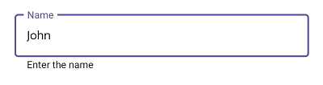

## Editor

For multi-line text input, host the MAUI [`Editor`](https://learn.microsoft.com/en-us/dotnet/maui/user-interface/controls/editor) and set [AutoSize](https://learn.microsoft.com/en-us/dotnet/api/microsoft.maui.controls.editor.autosize) to `TextChanges` so the editor grows with the entered text.




<ContentPage xmlns="http://schemas.microsoft.com/dotnet/2021/maui"
             xmlns:x="http://schemas.microsoft.com/winfx/2009/xaml"
             xmlns:inputLayout="clr-namespace:Syncfusion.Maui.Core;assembly=Syncfusion.Maui.Core">
    <VerticalStackLayout>
        <inputLayout:SfTextInputLayout Hint="Notes"
                                       HelperText="Enter the brief description"
                                       ContainerType="Outlined">
            <Editor AutoSize="TextChanges" />
        </inputLayout:SfTextInputLayout>
    </VerticalStackLayout>
</ContentPage>




using Microsoft.Maui;
using Syncfusion.Maui.Core;

var inputLayout = new SfTextInputLayout
{
    Hint = "Notes",
    HelperText = "Enter the brief description",
    ContainerType = ContainerType.Outlined,
    Content = new Editor { AutoSize = EditorAutoSizeOption.TextChanges }
};
Content = new VerticalStackLayout
{
    Children =
    {
        inputLayout
    }
};




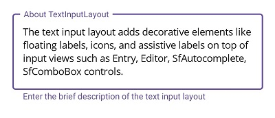

## SfAutocomplete

Host the Syncfusion [SfAutocomplete](https://help.syncfusion.com/cr/maui/Syncfusion.Maui.Inputs.SfAutocomplete.html) control for a text input with suggestion list. Install the `Syncfusion.Maui.Inputs` NuGet package and refer to the [Autocomplete getting started](https://help.syncfusion.com/maui/autocomplete/getting-started) page for platform setup.

### Selection Modes

| SelectionMode | Description |
|---------------|-------------|
| `Single` | Allows a single item to be selected. |
| `Multiple` | Allows multiple items to be selected. Tokens are displayed according to `MultiSelectionDisplayMode` and `TokensWrapMode`. |

### Single Selection




<ContentPage xmlns="http://schemas.microsoft.com/dotnet/2021/maui"
             xmlns:x="http://schemas.microsoft.com/winfx/2009/xaml"
             xmlns:inputLayout="clr-namespace:Syncfusion.Maui.Core;assembly=Syncfusion.Maui.Core"
             xmlns:autocomplete="clr-namespace:Syncfusion.Maui.Inputs;assembly=Syncfusion.Maui.Inputs">
    <VerticalStackLayout>
        <inputLayout:SfTextInputLayout Hint="Country" ContainerType="Outlined">
            <autocomplete:SfAutocomplete>
                <autocomplete:SfAutocomplete.ItemsSource>
                    <x:Array Type="{x:Type x:String}">
                        <x:String>Uganda</x:String>
                        <x:String>Ukraine</x:String>
                        <x:String>United Arab Emirates</x:String>
                        <x:String>United States</x:String>
                    </x:Array>
                </autocomplete:SfAutocomplete.ItemsSource>
            </autocomplete:SfAutocomplete>
        </inputLayout:SfTextInputLayout>
    </VerticalStackLayout>
</ContentPage>




using Syncfusion.Maui.Core;
using Syncfusion.Maui.Inputs;

var autocomplete = new SfAutocomplete
{
    ItemsSource = new[] { "Uganda", "Ukraine", "United Arab Emirates", "United States" }
};

var inputLayout = new SfTextInputLayout
{
    Hint = "Country",
    ContainerType = ContainerType.Outlined,
    Content = autocomplete
};
Content = new VerticalStackLayout
{
    Children =
    {
        inputLayout
    }
};




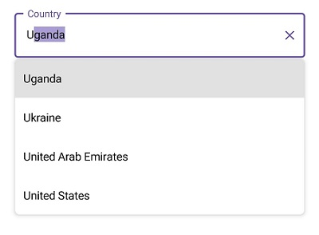

### Multiple Selection




<ContentPage xmlns="http://schemas.microsoft.com/dotnet/2021/maui"
             xmlns:x="http://schemas.microsoft.com/winfx/2009/xaml"
             xmlns:inputLayout="clr-namespace:Syncfusion.Maui.Core;assembly=Syncfusion.Maui.Core"
             xmlns:autocomplete="clr-namespace:Syncfusion.Maui.Inputs;assembly=Syncfusion.Maui.Inputs">
    <VerticalStackLayout Spacing="10">
        <inputLayout:SfTextInputLayout Hint="Delimiter" ContainerType="Outlined">
            <autocomplete:SfAutocomplete SelectionMode="Multiple"
                                         Placeholder="Enter"
                                         MultiSelectionDisplayMode="Delimiter">
                <autocomplete:SfAutocomplete.ItemsSource>
                    <x:Array Type="{x:Type x:String}">
                        <x:String>Uganda</x:String>
                        <x:String>Ukraine</x:String>
                        <x:String>United Arab Emirates</x:String>
                        <x:String>United States</x:String>
                    </x:Array>
                </autocomplete:SfAutocomplete.ItemsSource>
            </autocomplete:SfAutocomplete>
        </inputLayout:SfTextInputLayout>

        <inputLayout:SfTextInputLayout Hint="Token-None" ContainerType="Outlined">
            <autocomplete:SfAutocomplete SelectionMode="Multiple" Placeholder="Enter">
                <autocomplete:SfAutocomplete.ItemsSource>
                    <x:Array Type="{x:Type x:String}">
                        <x:String>Uganda</x:String>
                        <x:String>Ukraine</x:String>
                        <x:String>United Arab Emirates</x:String>
                        <x:String>United States</x:String>
                    </x:Array>
                </autocomplete:SfAutocomplete.ItemsSource>
            </autocomplete:SfAutocomplete>
        </inputLayout:SfTextInputLayout>

        <inputLayout:SfTextInputLayout Hint="Token-AutoSize" ContainerType="Outlined">
            <autocomplete:SfAutocomplete SelectionMode="Multiple"
                                         Placeholder="Enter"
                                         TokensWrapMode="Wrap"
                                         EnableAutoSize="True">
                <autocomplete:SfAutocomplete.ItemsSource>
                    <x:Array Type="{x:Type x:String}">
                        <x:String>Uganda</x:String>
                        <x:String>Ukraine</x:String>
                        <x:String>United Arab Emirates</x:String>
                        <x:String>United States</x:String>
                    </x:Array>
                </autocomplete:SfAutocomplete.ItemsSource>
            </autocomplete:SfAutocomplete>
        </inputLayout:SfTextInputLayout>
    </VerticalStackLayout>
</ContentPage>




using Syncfusion.Maui.Core;
using Syncfusion.Maui.Inputs;

var items = new[] { "Uganda", "Ukraine", "United Arab Emirates", "United States" };

var inputLayout = new SfTextInputLayout
{
    Hint = "Delimiter",
    ContainerType = ContainerType.Outlined,
    Content = new SfAutocomplete
    {
        SelectionMode = AutocompleteSelectionMode.Multiple,
        MultiSelectionDisplayMode = AutocompleteMultiSelectionDisplayMode.Delimiter,
        Placeholder = "Enter",
        ItemsSource = items
    }
};
Content = new VerticalStackLayout
{
    Children =
    {
        inputLayout
    }
};




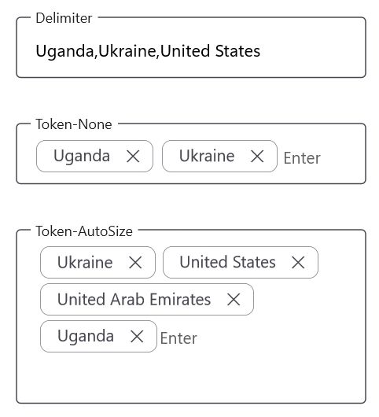

For more information, see the [Autocomplete Selection](https://help.syncfusion.com/maui/autocomplete/selection) documentation.

## SfComboBox

Host the Syncfusion [SfComboBox](https://help.syncfusion.com/cr/maui/Syncfusion.Maui.Inputs.SfComboBox.html) control for a drop-down selection. Install the `Syncfusion.Maui.Inputs` NuGet package and refer to the [ComboBox getting started](https://help.syncfusion.com/maui/combobox/getting-started) page for platform setup.

### Selection Modes

| SelectionMode | Description |
|---------------|-------------|
| `Single` | Allows a single item to be selected. |
| `Multiple` | Allows multiple items to be selected. Tokens are displayed according to `MultiSelectionDisplayMode` and `TokensWrapMode`. |

### Single Selection




<ContentPage xmlns="http://schemas.microsoft.com/dotnet/2021/maui"
             xmlns:x="http://schemas.microsoft.com/winfx/2009/xaml"
             xmlns:inputLayout="clr-namespace:Syncfusion.Maui.Core;assembly=Syncfusion.Maui.Core"
             xmlns:combobox="clr-namespace:Syncfusion.Maui.Inputs;assembly=Syncfusion.Maui.Inputs">
    <VerticalStackLayout Spacing="10">
        <inputLayout:SfTextInputLayout Hint="Country" ContainerType="Outlined">
            <combobox:SfComboBox>
                <combobox:SfComboBox.ItemsSource>
                    <x:Array Type="{x:Type x:String}">
                        <x:String>Uganda</x:String>
                        <x:String>Ukraine</x:String>
                        <x:String>United Arab Emirates</x:String>
                        <x:String>United States</x:String>
                    </x:Array>
                </combobox:SfComboBox.ItemsSource>
            </combobox:SfComboBox>
        </inputLayout:SfTextInputLayout>
    </VerticalStackLayout>
</ContentPage>




using Syncfusion.Maui.Core;
using Syncfusion.Maui.Inputs;

var combobox = new SfComboBox
{
    ItemsSource = new[] { "Uganda", "Ukraine", "United Arab Emirates", "United States" }
};

var inputLayout = new SfTextInputLayout
{
    Hint = "Country",
    ContainerType = ContainerType.Outlined,
    Content = combobox
};
Content = new VerticalStackLayout
{
    Children =
    {
        inputLayout
    }
};




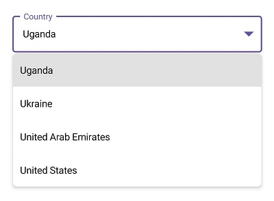

### Multiple Selection




<ContentPage xmlns="http://schemas.microsoft.com/dotnet/2021/maui"
             xmlns:x="http://schemas.microsoft.com/winfx/2009/xaml"
             xmlns:inputLayout="clr-namespace:Syncfusion.Maui.Core;assembly=Syncfusion.Maui.Core"
             xmlns:combobox="clr-namespace:Syncfusion.Maui.Inputs;assembly=Syncfusion.Maui.Inputs">
    <VerticalStackLayout Spacing="10">
        <inputLayout:SfTextInputLayout Hint="Delimiter" ContainerType="Outlined">
            <combobox:SfComboBox SelectionMode="Multiple"
                                 Placeholder="Enter"
                                 MultiSelectionDisplayMode="Delimiter">
                <combobox:SfComboBox.ItemsSource>
                    <x:Array Type="{x:Type x:String}">
                        <x:String>Uganda</x:String>
                        <x:String>Ukraine</x:String>
                        <x:String>United Arab Emirates</x:String>
                        <x:String>United States</x:String>
                    </x:Array>
                </combobox:SfComboBox.ItemsSource>
            </combobox:SfComboBox>
        </inputLayout:SfTextInputLayout>

        <inputLayout:SfTextInputLayout Hint="Token-None" ContainerType="Outlined">
            <combobox:SfComboBox SelectionMode="Multiple" Placeholder="Enter">
                <combobox:SfComboBox.ItemsSource>
                    <x:Array Type="{x:Type x:String}">
                        <x:String>Uganda</x:String>
                        <x:String>Ukraine</x:String>
                        <x:String>United Arab Emirates</x:String>
                        <x:String>United States</x:String>
                    </x:Array>
                </combobox:SfComboBox.ItemsSource>
            </combobox:SfComboBox>
        </inputLayout:SfTextInputLayout>

        <inputLayout:SfTextInputLayout Hint="Token-AutoSize" ContainerType="Outlined">
            <combobox:SfComboBox SelectionMode="Multiple"
                                 Placeholder="Enter"
                                 TokensWrapMode="Wrap"
                                 EnableAutoSize="True">
                <combobox:SfComboBox.ItemsSource>
                    <x:Array Type="{x:Type x:String}">
                        <x:String>Uganda</x:String>
                        <x:String>Ukraine</x:String>
                        <x:String>United Arab Emirates</x:String>
                        <x:String>United States</x:String>
                    </x:Array>
                </combobox:SfComboBox.ItemsSource>
            </combobox:SfComboBox>
        </inputLayout:SfTextInputLayout>
    </VerticalStackLayout>
</ContentPage>




using Syncfusion.Maui.Core;
using Syncfusion.Maui.Inputs;

var items = new[] { "Uganda", "Ukraine", "United Arab Emirates", "United States" };

var inputLayout = new SfTextInputLayout
{
    Hint = "Delimiter",
    ContainerType = ContainerType.Outlined,
    Content = new SfComboBox
    {
        SelectionMode = ComboBoxSelectionMode.Multiple,
        MultiSelectionDisplayMode = ComboBoxMultiSelectionDisplayMode.Delimiter,
        Placeholder = "Enter",
        ItemsSource = items
    }
};
Content = new VerticalStackLayout
{
    Children =
    {
        inputLayout
    }
};




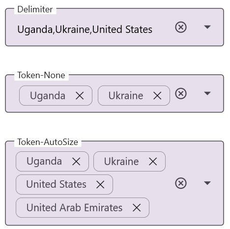

For more information, see the [ComboBox Selection](https://help.syncfusion.com/maui/combobox/selection) documentation.

## SfMaskedEntry

Host the Syncfusion [SfMaskedEntry](https://help.syncfusion.com/cr/maui/Syncfusion.Maui.Inputs.SfMaskedEntry.html) control for masked text input. Install the `Syncfusion.Maui.Inputs` NuGet package and refer to the [MaskedEntry getting started](https://help.syncfusion.com/maui/combobox/getting-started) page for platform setup.

| Property | Description |
|----------|-------------|
| `MaskType` | Defines the masking behavior. Common values: `Simple`, `RegEx`, `DateTime`, `Time`, `PhoneNumber`. |
| `Mask` | The mask pattern (e.g., `0000 0000 0000 0000` for a 16-digit card number). |




<ContentPage xmlns="http://schemas.microsoft.com/dotnet/2021/maui"
             xmlns:x="http://schemas.microsoft.com/winfx/2009/xaml"
             xmlns:inputLayout="clr-namespace:Syncfusion.Maui.Core;assembly=Syncfusion.Maui.Core"
             xmlns:maskedEntry="clr-namespace:Syncfusion.Maui.MaskedEntry;assembly=Syncfusion.Maui.MaskedEntry">
    <VerticalStackLayout Spacing="10">
        <inputLayout:SfTextInputLayout Hint="Card number"
                                       HelperText="Required *"
                                       ContainerType="Outlined">
            <maskedEntry:SfMaskedEntry MaskType="Simple"
                                       Mask="0000 0000 0000 0000" />
        </inputLayout:SfTextInputLayout>
    </VerticalStackLayout>
</ContentPage>




using Syncfusion.Maui.Core;
using Syncfusion.Maui.MaskedEntry;

var inputLayout = new SfTextInputLayout
{
    Hint = "Card number",
    HelperText = "Required *",
    ContainerType = ContainerType.Outlined,
    Content = new SfMaskedEntry
    {
        MaskType = MaskedEntryMaskType.Simple,
        Mask = "0000 0000 0000 0000"
    }
};
Content = new VerticalStackLayout
{
    Children =
    {
        inputLayout
    }
};




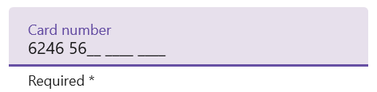

## SfNumericEntry

Host the Syncfusion [SfNumericEntry](https://help.syncfusion.com/cr/maui/Syncfusion.Maui.Inputs.SfNumericEntry.html) control for numeric input with optional up/down buttons. Install the `Syncfusion.Maui.Inputs` NuGet package and refer to the [NumericEntry getting started](https://help.syncfusion.com/maui/numericentry/getting-started) page for platform setup.

| Property | Description |
|----------|-------------|
| `Value` | The numeric value displayed in the control. |
| `ShowClearButton` | When `true`, shows a clear-text button. |
| `UpDownPlacementMode` | Position of the up/down buttons (for example, `Inline`). |




<ContentPage xmlns="http://schemas.microsoft.com/dotnet/2021/maui"
             xmlns:x="http://schemas.microsoft.com/winfx/2009/xaml"
             xmlns:inputLayout="clr-namespace:Syncfusion.Maui.Core;assembly=Syncfusion.Maui.Core"
             xmlns:numericEntry="clr-namespace:Syncfusion.Maui.NumericEntry;assembly=Syncfusion.Maui.NumericEntry">
    <VerticalStackLayout Spacing="10">
        <inputLayout:SfTextInputLayout Hint="Amount"
                                   HelperText="Enter the amount"
                                   ContainerType="Outlined">
            <numericEntry:SfNumericEntry Value="100"
                                     ShowClearButton="True"
                                     UpDownPlacementMode="Inline" />
        </inputLayout:SfTextInputLayout>
    </VerticalStackLayout>
</ContentPage>




using Syncfusion.Maui.Core;
using Syncfusion.Maui.NumericEntry;

var inputLayout = new SfTextInputLayout
{
    Hint = "Amount",
    HelperText = "Enter the amount",
    ContainerType = ContainerType.Outlined,
    Content = new SfNumericEntry
    {
        Value = 100,
        ShowClearButton = true,
        UpDownPlacementMode = NumericEntryUpDownPlacementMode.Inline
    }
};
Content = new VerticalStackLayout
{
    Children =
    {
        inputLayout
    }
};




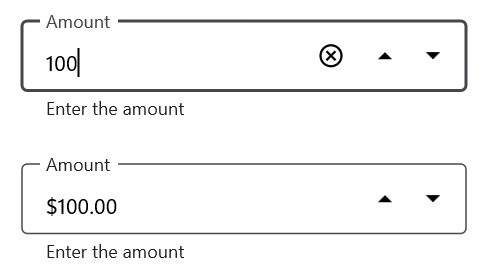

## Picker

Host the MAUI [Picker](https://learn.microsoft.com/en-us/dotnet/maui/user-interface/controls/picker) control for a drop-down list.




<VerticalStackLayout Spacing="10">
    <inputLayout:SfTextInputLayout Hint="Fruit"
                                   HelperText="Select a fruit"
                                   ContainerType="Outlined">
        <Picker>
            <Picker.ItemsSource>
                <x:Array Type="{x:Type x:String}">
                    <x:String>Apple</x:String>
                    <x:String>Orange</x:String>
                    <x:String>Strawberry</x:String>
                </x:Array>
            </Picker.ItemsSource>
        </Picker>
    </inputLayout:SfTextInputLayout>
</VerticalStackLayout>




using Microsoft.Maui.Controls;
using Syncfusion.Maui.Core;

var picker = new Picker
{
    ItemsSource = new[] { "Apple", "Orange", "Strawberry" }
};

var inputLayout = new SfTextInputLayout
{
    Hint = "Fruit",
    HelperText = "Select a fruit",
    ContainerType = ContainerType.Outlined,
    Content = picker
};
Content = new VerticalStackLayout
{
    Children =
    {
        inputLayout
    }
};




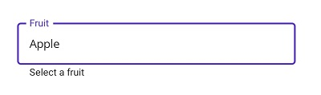

N> The Windows platform does not support the MAUI `Picker` as an input view of `SfTextInputLayout`. Use a Syncfusion input view (such as `SfComboBox` or `SfAutocomplete`) on Windows.

## TimePicker

Host the MAUI [TimePicker](https://learn.microsoft.com/en-us/dotnet/maui/user-interface/controls/timepicker) for time selection.




<ContentPage xmlns="http://schemas.microsoft.com/dotnet/2021/maui"
             xmlns:x="http://schemas.microsoft.com/winfx/2009/xaml"
             xmlns:inputLayout="clr-namespace:Syncfusion.Maui.Core;assembly=Syncfusion.Maui.Core">
    <inputLayout:SfTextInputLayout Hint="Time"
                                   HelperText="Select a start time"
                                   ContainerType="Outlined">
        <TimePicker />
    </inputLayout:SfTextInputLayout>
</ContentPage>




using Syncfusion.Maui.Core;

var inputLayout = new SfTextInputLayout
{
    Hint = "Time",
    HelperText = "Select a start time",
    ContainerType = ContainerType.Outlined,
    Content = new TimePicker()
};
Content = new VerticalStackLayout
{
    Children =
    {
        inputLayout
    }
};




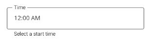

N> The Windows platform does not support the MAUI `TimePicker` as an input view of `SfTextInputLayout`. Use a Syncfusion input view on Windows.

## DatePicker

Host the MAUI [DatePicker](https://learn.microsoft.com/en-us/dotnet/maui/user-interface/controls/datepicker) for date selection.




<ContentPage xmlns="http://schemas.microsoft.com/dotnet/2021/maui"
             xmlns:x="http://schemas.microsoft.com/winfx/2009/xaml"
             xmlns:inputLayout="clr-namespace:Syncfusion.Maui.Core;assembly=Syncfusion.Maui.Core">
    <VerticalStackLayout Spacing="10">
        <inputLayout:SfTextInputLayout Hint="Date of Birth"
                                   HelperText="Select birth date"
                                   ContainerType="Outlined">
            <DatePicker />
        </inputLayout:SfTextInputLayout>
    </VerticalStackLayout>
</ContentPage>




using Syncfusion.Maui.Core;

var inputLayout = new SfTextInputLayout
{
    Hint = "Date of Birth",
    HelperText = "Select birth date",
    ContainerType = ContainerType.Outlined,
    Content = new DatePicker()
};
Content = new VerticalStackLayout
{
    Children =
    {
        inputLayout
    }
};




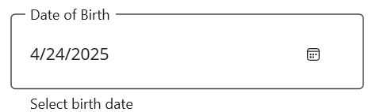

N> The Windows platform does not support the MAUI `DatePicker` as an input view of `SfTextInputLayout`. Use a Syncfusion input view on Windows.

## Troubleshooting

| Issue | Possible Cause | Recommended Action |
|-------|----------------|--------------------|
| The Syncfusion input view is not recognized. | The required Syncfusion NuGet package is not installed or the `xmlns` is missing. | Install the appropriate package (`Syncfusion.Maui.Inputs`, `Syncfusion.Maui.MaskedEntry`, or `Syncfusion.Maui.NumericEntry`) and add the `xmlns` declaration. |
| The MAUI `Picker`, `TimePicker`, or `DatePicker` does not appear. | The control is not supported as an input view on Windows. | Use a Syncfusion input view (`SfComboBox`, `SfAutocomplete`, or `SfMaskedEntry`) on Windows. |
| The hint or helper text does not reflect the input view's state. | The `HasError` state is not toggled in your validation logic. | Set `HasError = true` after validation fails and `HasError = false` after it succeeds. |
| The inner `Entry` does not grow with content. | `Editor.AutoSize` is not set to `TextChanges`. | Set `Editor.AutoSize = EditorAutoSizeOption.TextChanges`. |

## See Also

- [Container Types](https://help.syncfusion.com/maui/textinputlayout/container-type)
- [Assistive Labels](https://help.syncfusion.com/maui/textinputlayout/assistive-labels)
- [Custom Icons](https://help.syncfusion.com/maui/textinputlayout/custom-icons)
- [SfAutocomplete documentation](https://help.syncfusion.com/maui/autocomplete/overview)
- [SfComboBox documentation](https://help.syncfusion.com/maui/combobox/overview)
- [SfMaskedEntry documentation](https://help.syncfusion.com/maui/masked-entry/overview)
- [SfNumericEntry documentation](https://help.syncfusion.com/maui/numeric-entry/overview)

