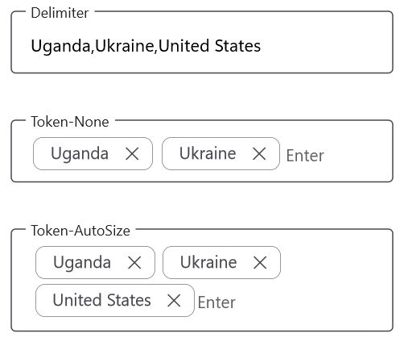
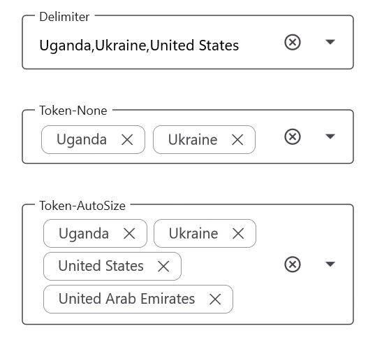
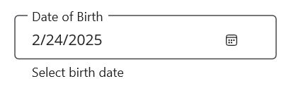

# Supported Input Views in .NET MAUI TextInputLayout (SfTextInputLayout)

Input views can be added to the text input layout control by setting the [Content](https://help.syncfusion.com/cr/maui/Syncfusion.Maui.Core.SfContentView.html#Syncfusion_Maui_Core_SfContentView_Content) property.

## Entry

For single-line text input, use the [`Entry`](https://learn.microsoft.com/en-us/dotnet/maui/user-interface/controls/entry) control.

 

 

<inputLayout:SfTextInputLayout Hint="Name"
                               HelperText="Enter the name"
                               ContainerType="Outlined">
   <Entry />
</inputLayout:SfTextInputLayout>  



 

SfTextInputLayout inputLayout = new SfTextInputLayout();
inputLayout.Hint = "Name"; 
inputLayout.HelperText = "Enter your name"
inputLayout.Content = new Entry(); 





## Editor

For multi-line text input, use the [`Editor`](https://learn.microsoft.com/en-us/dotnet/maui/user-interface/controls/editor) control, and set the [AutoSize](https://learn.microsoft.com/en-us/dotnet/api/microsoft.maui.controls.editor.autosize?view=net-maui-7.0#microsoft-maui-controls-editor-autosize) property to `TextChanges`.

 

 

<inputLayout:SfTextInputLayout Hint="About TextInputLayout" 
                               HelperText="Enter the brief description of the text input layout"
                               ContainerType="Outlined">
   <Editor AutoSize="TextChanges" />
</inputLayout:SfTextInputLayout>  



 

SfTextInputLayout inputLayout = new SfTextInputLayout();
inputLayout.Hint = "Notes"; 
inputLayout.Content = new Editor(); 





## Autocomplete

To use the [Autocomplete](https://help.syncfusion.com/maui/autocomplete/overview) control across platforms, refer to the [getting started with autocomplete](https://help.syncfusion.com/maui/autocomplete/getting-started) guide.

### Selection Mode

The [Autocomplete](https://help.syncfusion.com/maui/autocomplete/selection) control supports two selection modes: Single and Multiple.
N> For more details on Autocomplete selection modes, refer to the [Single Selection](https://help.syncfusion.com/maui/autocomplete/selection#single-selection) and [Multiple Selection](https://help.syncfusion.com/maui/autocomplete/selection#multiple-selection) documentation.

#### Single Selection

 

 

<inputLayout:SfTextInputLayout Hint="Country" ContainerType="Outlined">
   <autocomplete:SfAutocomplete>
      <autocomplete:SfAutocomplete.ItemsSource>
        <x:Array Type="{x:Type x:String}">
            <x:String>Uganda</x:String>
            <x:String>Ukraine</x:String>
            <x:String>United Arab Emirates</x:String>
            <x:String>United States</x:String>
         </x:Array>
      </autocomplete:SfAutocomplete.ItemsSource>
   </autocomplete:SfAutocomplete>
</inputLayout:SfTextInputLayout>



 

var autocomplete = new SfAutocomplete();
SfTextInputLayout inputLayout = new SfTextInputLayout();
inputLayout.Hint = "Country"; 
inputLayout.ContainerType = ContainerType.Outlined;
string[] countryNames = new string[4];
countryNames[0] = "Uganda";
countryNames[1] = "Ukraine";
countryNames[2] = "United Arab Emirates";
countryNames[3] = "United States";
autocomplete.ItemsSource = countryNames;
inputLayout.Content = autocomplete; 





#### Multiple Selection

 

 

<StackLayout Spacing="10">
<inputLayout:SfTextInputLayout Hint="Delimiter" ContainerType="Outlined" WidthRequest="300" HeightRequest="80" >
   <autocomplete:SfAutocomplete SelectionMode="Multiple" Placeholder="Enter" MultiSelectionDisplayMode="Delimiter" >
      <autocomplete:SfAutocomplete.ItemsSource>
        <x:Array Type="{x:Type x:String}">
            <x:String>Uganda</x:String>
            <x:String>Ukraine</x:String>
            <x:String>United Arab Emirates</x:String>
            <x:String>United States</x:String>
         </x:Array>
      </autocomplete:SfAutocomplete.ItemsSource>
   </autocomplete:SfAutocomplete>
</inputLayout:SfTextInputLayout>

<inputLayout:SfTextInputLayout Hint="Token-None" ContainerType="Outlined" WidthRequest="300" HeightRequest="80" >
   <autocomplete:SfAutocomplete SelectionMode="Multiple" Placeholder="Enter" >
      <autocomplete:SfAutocomplete.ItemsSource>
        <x:Array Type="{x:Type x:String}">
            <x:String>Uganda</x:String>
            <x:String>Ukraine</x:String>
            <x:String>United Arab Emirates</x:String>
            <x:String>United States</x:String>
         </x:Array>
      </autocomplete:SfAutocomplete.ItemsSource>
   </autocomplete:SfAutocomplete>
</inputLayout:SfTextInputLayout>

<inputLayout:SfTextInputLayout Hint="Token-AutoSize" ContainerType="Outlined" WidthRequest="300" >
   <autocomplete:SfAutocomplete SelectionMode="Multiple" Placeholder="Enter" TokensWrapMode="Wrap" EnableAutoSize="True" >
      <autocomplete:SfAutocomplete.ItemsSource>
        <x:Array Type="{x:Type x:String}">
            <x:String>Uganda</x:String>
            <x:String>Ukraine</x:String>
            <x:String>United Arab Emirates</x:String>
            <x:String>United States</x:String>
         </x:Array>
      </autocomplete:SfAutocomplete.ItemsSource>
   </autocomplete:SfAutocomplete>
</inputLayout:SfTextInputLayout>
</StackLayout>





## ComboBox

To initialize and launch the [ComboBox](https://help.syncfusion.com/maui/combobox/overview) control across platforms, refer to the [getting started with combo box](https://help.syncfusion.com/maui/combobox/getting-started) guide.

### Selection Mode

The [ComboBox](https://help.syncfusion.com/maui/combobox/selection) control supports two selection modes: Single and Multiple.
N> For more information on ComboBox selection modes, see the [Single Selection](https://help.syncfusion.com/maui/combobox/selection#single-selection) and [Multiple Selection](https://help.syncfusion.com/maui/combobox/selection#multiple-selection) documentation.

#### Single Selection

 

 

<inputLayout:SfTextInputLayout Hint="Country" ContainerType="Outlined">
   <combobox:SfComboBox>
      <combobox:SfComboBox.ItemsSource>
         <x:Array Type="{x:Type x:String}">
            <x:String>Uganda</x:String>
            <x:String>Ukraine</x:String>
            <x:String>United Arab Emirates</x:String>
            <x:String>United States</x:String>
         </x:Array>
      </combobox:SfComboBox.ItemsSource>
   </combobox:SfComboBox>
</inputLayout:SfTextInputLayout> 



 

var combobox = new SfComboBox();
SfTextInputLayout inputLayout = new SfTextInputLayout();
inputLayout.Hint = "Country"; 
inputLayout.ContainerType = ContainerType.Outlined;
string[] countryNames = new string[4];
countryNames[0] = "Uganda";
countryNames[1] = "Ukraine";
countryNames[2] = "United Arab Emirates";
countryNames[3] = "United States";
combobox.ItemsSource = countryNames;
inputLayout.Content = combobox; 





#### Multiple Selection

 

 

<StackLayout Spacing="10">
<inputLayout:SfTextInputLayout Hint="Delimiter" ContainerType="Outlined" WidthRequest="300" HeightRequest="80" >
   <combobox:SfComboBox SelectionMode="Multiple" Placeholder="Enter" MultiSelectionDisplayMode="Delimiter" >
      <combobox:SfComboBox.ItemsSource>
        <x:Array Type="{x:Type x:String}">
            <x:String>Uganda</x:String>
            <x:String>Ukraine</x:String>
            <x:String>United Arab Emirates</x:String>
            <x:String>United States</x:String>
         </x:Array>
      </combobox:SfComboBox.ItemsSource>
   </combobox:SfComboBox>
</inputLayout:SfTextInputLayout>

<inputLayout:SfTextInputLayout Hint="Token-None" ContainerType="Outlined" WidthRequest="300" HeightRequest="80" >
   <combobox:SfComboBox SelectionMode="Multiple" Placeholder="Enter" >
      <combobox:SfComboBox.ItemsSource>
        <x:Array Type="{x:Type x:String}">
            <x:String>Uganda</x:String>
            <x:String>Ukraine</x:String>
            <x:String>United Arab Emirates</x:String>
            <x:String>United States</x:String>
         </x:Array>
      </combobox:SfComboBox.ItemsSource>
   </combobox:SfComboBox>
</inputLayout:SfTextInputLayout>

<inputLayout:SfTextInputLayout Hint="Token-AutoSize" ContainerType="Outlined" WidthRequest="300" >
   <combobox:SfComboBox SelectionMode="Multiple" Placeholder="Enter" TokensWrapMode="Wrap" EnableAutoSize="True" >
      <combobox:SfComboBox.ItemsSource>
        <x:Array Type="{x:Type x:String}">
            <x:String>Uganda</x:String>
            <x:String>Ukraine</x:String>
            <x:String>United Arab Emirates</x:String>
            <x:String>United States</x:String>
         </x:Array>
      </combobox:SfComboBox.ItemsSource>
   </combobox:SfComboBox>
</inputLayout:SfTextInputLayout>
</StackLayout>





## Masked Entry

To initialize and launch the [MaskedEntry](https://help.syncfusion.com/maui/masked-entry/overview) control across platforms, refer to the [getting started with masked entry](https://help.syncfusion.com/maui/masked-entry/getting-started) guide.




<inputLayout:SfTextInputLayout Hint="Card number" 
                               HelperText="Required *"
                               ContainerType="Outlined">
   <maskedEntry:SfMaskedEntry MaskType="Simple"
                              Mask="0000 0000 0000 0000" />
</inputLayout:SfTextInputLayout> 




SfTextInputLayout inputLayout = new SfTextInputLayout();
inputLayout.Hint = "Card number"; 
inputLayout.HelperText = "Required *";
inputLayout.ContainerType = ContainerType.Outlined;
inputLayout.Content = new SfMaskedEntry() { MaskType = MaskedEntryMaskType.Simple, Mask = "0000 0000 0000 0000" }; 




## NumericEntry

To initialize and launch the `NumericEntry` control across platforms, refer to the `getting started with numeric entry` guide.




<inputLayout:SfTextInputLayout Hint="Amount" 
                               HelperText="Enter the amount"
                               ContainerType="Outlined">
   <numericEntry:SfNumericEntry Value="100" 
                                ShowClearButton="True" 
                                UpDownPlacementMode="Inline"/>
</inputLayout:SfTextInputLayout> 




SfTextInputLayout inputLayout = new SfTextInputLayout();
inputLayout.Hint = "Amount"; 
inputLayout.HelperText = "Enter the amount";
inputLayout.ContainerType = ContainerType.Outlined;
inputLayout.Content = new SfNumericEntry() { Value=100, 
                                             ShowClearButton=True, 
                                             UpDownPlacementMode=NumericEntryUpDownPlacementMode.Inline}; 




## Picker

To initialize and launch the [Picker](https://learn.microsoft.com/en-us/dotnet/maui/user-interface/controls/picker) control across platforms, refer to the `getting started with picker` guide.




<inputLayout:SfTextInputLayout Hint="Fruit" 
                               HelperText="Select a fruit"
                               ContainerType="Outlined" >
   <Picker SelectedItem="Apple">
        <Picker.ItemsSource>
            <x:Array Type="{x:Type x:String}">
                <x:String>Apple</x:String>
                <x:String>Orange</x:String>
                <x:String>Strawberry</x:String>
            </x:Array>
        </Picker.ItemsSource>
   </Picker>
</inputLayout:SfTextInputLayout> 




SfTextInputLayout inputLayout = new SfTextInputLayout();
inputLayout.Hint = "Fruit"; 
inputLayout.HelperText = "Select a fruit";
inputLayout.ContainerType = ContainerType.Outlined;
var picker = new Picker();
picker.Items.Add("Apple");
picker.Items.Add("Orange");
picker.Items.Add("Strawberry");
picker.SelectedItem = "Apple";
inputLayout.Content = picker;




N> The Windows platform does not support `.NET MAUI Picker` as an input view for the text input layout.

## TimePicker

To initialize and launch the [TimePicker](https://learn.microsoft.com/en-us/dotnet/maui/user-interface/controls/timepicker) control across platforms, refer to the `getting started with time picker` guide.




 <inputLayout:SfTextInputLayout Hint="Time" 
                               HelperText="Select a start time"
                               ContainerType="Outlined" >
    <TimePicker/>
 </inputLayout:SfTextInputLayout>




SfTextInputLayout inputLayout = new SfTextInputLayout();
inputLayout.Hint = "Time"; 
inputLayout.HelperText = "Select a start time";
inputLayout.ContainerType = ContainerType.Outlined;
inputLayout.Content = new TimePicker(); 




N> The Windows platform does not support `.NET MAUI TimePicker` as an input view for the text input layout.

## DatePicker

To initialize and launch the [DatePicker](https://learn.microsoft.com/en-us/dotnet/maui/user-interface/controls/datepicker) control across platforms, refer to the `getting started with date picker` guide.




<inputLayout:SfTextInputLayout Hint="Date of Birth" 
                               HelperText="Select birth date"
                               ContainerType="Outlined" >
    <DatePicker/>
</inputLayout:SfTextInputLayout> 




SfTextInputLayout inputLayout = new SfTextInputLayout();
inputLayout.Hint = "Date of Birth"; 
inputLayout.HelperText = "Select birth date";
inputLayout.ContainerType = ContainerType.Outlined;
inputLayout.Content = new DatePicker(); 




N> The Windows platform does not support `.NET MAUI DatePicker` as an input view for the text input layout.
