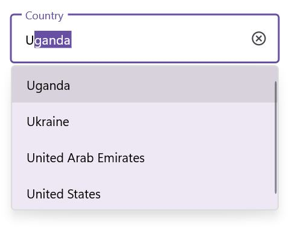
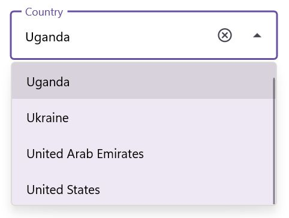

# Supported Input Views in .NET MAUI TextInputLayout (SfTextInputLayout)

Input views can be added to the text input layout control by setting the [Content](https://help.syncfusion.com/cr/maui/Syncfusion.Maui.Core.SfContentView.html#Syncfusion_Maui_Core_SfContentView_Content) property.

## Entry

To enter a single line text input, add [`Entry`](https://learn.microsoft.com/en-us/dotnet/maui/user-interface/controls/entry).

 

 

<inputLayout:SfTextInputLayout Hint="Name"
                               HelperText="Enter your name"
                               ContainerType="Outlined">
   <Entry />
</inputLayout:SfTextInputLayout>  



 

var inputLayout = new SfTextInputLayout();
inputLayout.Hint = "Name"; 
inputLayout.HelperText = "Enter your name"
inputLayout.Content = new Entry(); 





## Editor

To enter multi-line text input, add [`Editor`](https://learn.microsoft.com/en-us/dotnet/maui/user-interface/controls/editor), then set the [AutoSize](https://learn.microsoft.com/en-us/dotnet/api/microsoft.maui.controls.editor.autosize?view=net-maui-7.0#microsoft-maui-controls-editor-autosize) property to `TextChanges`.

 

 

<inputLayout:SfTextInputLayout Hint="About TextInputLayout" 
                               HelperText="Enter the brief description of the text input layout"
                               ContainerType="Outlined">
   <Editor AutoSize="TextChanges" />
</inputLayout:SfTextInputLayout>  



 

var inputLayout = new SfTextInputLayout();
inputLayout.Hint = "Notes"; 
inputLayout.Content = new Editor(); 





## Autocomplete

To initialize the [Autocomplete](https://help.syncfusion.com/maui/autocomplete/overview) control and launch it in each platform, refer to the [getting started with autocomplete](https://help.syncfusion.com/maui/autocomplete/getting-started) documentation.

 

 

<inputLayout:SfTextInputLayout Hint="Country" ContainerType="Outlined">
   <autocomplete:SfAutocomplete>
      <autocomplete:SfAutocomplete.ItemsSource>
        <x:Array Type="{x:Type x:String}">
            <x:String>Uganda</x:String>
            <x:String>Ukraine</x:String>
            <x:String>United Arab Emirates</x:String>
            <x:String>United States</x:String>
         </x:Array>
      </autocomplete:SfAutocomplete.ItemsSource>
   </autocomplete:SfAutocomplete>
</inputLayout:SfTextInputLayout>



 

var autocomplete = new SfAutocomplete();
var inputLayout = new SfTextInputLayout();
inputLayout.Hint = "Country"; 
inputLayout.ContainerType = ContainerType.Outlined;
string[] countryNames = new string[4];
countryNames[0] = "Uganda";
countryNames[1] = "Ukraine";
countryNames[2] = "United Arab Emirates";
countryNames[3] = "United States";
autocomplete.ItemsSource = countryNames;
inputLayout.Content = autocomplete; 





## Combo box

To initialize the [ComboBox](https://help.syncfusion.com/maui/combobox/overview) control and launch it in each platform, refer to the [getting started with combo box](https://help.syncfusion.com/maui/combobox/getting-started) documentation.

 

 

<inputLayout:SfTextInputLayout Hint="Country" ContainerType="Outlined">
   <combobox:SfComboBox>
      <combobox:SfComboBox.ItemsSource>
         <x:Array Type="{x:Type x:String}">
            <x:String>Uganda</x:String>
            <x:String>Ukraine</x:String>
            <x:String>United Arab Emirates</x:String>
            <x:String>United States</x:String>
         </x:Array>
      </combobox:SfComboBox.ItemsSource>
   </combobox:SfComboBox>
</inputLayout:SfTextInputLayout> 



 

var combobox = new SfComboBox();
var inputLayout = new SfTextInputLayout();
inputLayout.Hint = "Country"; 
inputLayout.ContainerType = ContainerType.Outlined;
string[] countryNames = new string[4];
countryNames[0] = "Uganda";
countryNames[1] = "Ukraine";
countryNames[2] = "United Arab Emirates";
countryNames[3] = "United States";
combobox.ItemsSource = countryNames;
inputLayout.Content = combobox; 





## Masked Entry

To initialize the `MaskedEntry` control and launch it in each platform, refer to the getting started with masked entry documentation.




<inputLayout:SfTextInputLayout Hint="Card number" 
                               HelperText="Required *"
                               ContainerType="Outlined"
                               ContainerBackground="Transparent" >
   <maskedEntry:SfMaskedEntry MaskType="Simple"
                              Mask="0000 0000 0000 0000" />
</inputLayout:SfTextInputLayout> 




var inputLayout = new SfTextInputLayout();
inputLayout.Hint = "Card number"; 
inputLayout.HelperText = "Required *"
inputLayout.ContainerType = ContainerType.OutLined;
inputLayout.ContainerBackground = Colors.Transparent;
inputLayout.Content = new SfMaskedEntry() { MaskType = MaskedEntryMaskType.Simple, Mask = "0000 0000 0000 0000" }; 




