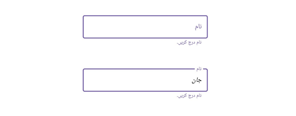

# Right-to-Left in .NET MAUI Text Input Layout (SfTextInputLayout)

The TextInputLayout supports to changing the flow of text to the right-to-left direction by setting the [FlowDirection](https://learn.microsoft.com/en-us/dotnet/api/microsoft.maui.controls.device.flowdirection?view=net-maui-7.0) to `RightToLeft.`




<inputLayout:SfTextInputLayout x:Name="inputLayout" 
                                FlowDirection="RightToLeft"
                                ContainerType="Outlined"
                                Hint="نام"
                                HelperText="نام درج کریں" >
        <Entry />
</inputLayout:SfTextInputLayout>




var inputLayout = new SfTextInputLayout();
inputLayout.FlowDirection = FlowDirection.RightToLeft;
inputLayout.ContainerType = ContainerType.Outlined;
inputLayout.Hint = "نام";
inputLayout.HelperText = " نام درج کریں";
inputLayout.Content = new Entry(); 




