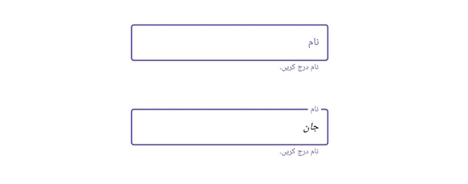

# Right-to-Left Support in .NET MAUI SfTextInputLayout

[SfTextInputLayout](https://help.syncfusion.com/cr/maui/Syncfusion.Maui.Core.SfTextInputLayout.html) supports right-to-left (RTL) text flow for languages such as Arabic, Hebrew, and Persian. The control honors the MAUI [FlowDirection](https://learn.microsoft.com/en-us/dotnet/maui/fundamentals/localization#right-to-left-layout) property, which can be set on the control itself or on any parent visual element (page, window, or app).

## Prerequisites

Before using the [SfTextInputLayout](https://help.syncfusion.com/cr/maui/Syncfusion.Maui.Core.SfTextInputLayout.html), ensure the following NuGet package is installed in your .NET MAUI project:

- `Syncfusion.Maui.Core`

For a step-by-step setup, refer to the [Getting Started](https://help.syncfusion.com/maui/textinputlayout/getting-started) documentation.

## FlowDirection Values

| Value | Description |
|-------|-------------|
| `LeftToRight` | LTR layout. The hint, helper text, and input view flow from left to right. This is the default. |
| `RightToLeft` | RTL layout. The hint, helper text, and input view flow from right to left. Leading and trailing views are also mirrored. |
| `MatchParent` | Inherits the `FlowDirection` from the visual parent. The default for most controls. |

N> When the layout direction changes, the hint label, helper text, error text, character counter, password toggle, and leading/trailing views are mirrored automatically. The `Content` (e.g., `Entry`) is also mirrored, so the cursor and selection behave correctly.

## Apply RTL to a single control

Set the [FlowDirection](https://learn.microsoft.com/en-us/dotnet/api/microsoft.maui.controls.flowdirection) property directly on the `SfTextInputLayout` instance.




<inputLayout:SfTextInputLayout x:Name="inputLayout"
                                FlowDirection="RightToLeft"
                                ContainerType="Outlined"
                                Hint="نام"
                                HelperText="نام درج کریں">
    <Entry />
</inputLayout:SfTextInputLayout>




SfTextInputLayout inputLayout = new SfTextInputLayout
{
    FlowDirection = FlowDirection.RightToLeft,
    ContainerType = ContainerType.Outlined,
    Hint = "نام",
    HelperText = "نام درج کریں",
    Content = new Entry()
};
Content = new VerticalStackLayout
{
    Children =
    {
        inputLayout
    }
};




## Apply RTL to the entire app

To enable RTL for the entire application, set `FlowDirection` on the root page or in the `MauiAppBuilder` configuration. This is the recommended approach for fully-localized apps.




var builder = MauiApp.CreateBuilder();
builder.UseMauiApp<App>();
builder.ConfigureLifecycleEvents(events =>
{
    // Force RTL for the entire app.
});
// Or set FlowDirection on the root page in App.xaml.cs.




You can also set `FlowDirection` on the root page in `App.xaml.cs`:




public App()
{
    InitializeComponent();
    MainPage = new MainPage { FlowDirection = FlowDirection.RightToLeft };
}




## Platform notes

| Platform | Required Configuration |
|----------|------------------------|
| Android | Add `android:supportsRtl="true"` to the `<application>` element in `Platforms/Android/AndroidManifest.xml`. |
| iOS / Mac Catalyst | Set the `SemanticContentAttribute` to `Playback` or use a storyboard/xib with `SemanticContentAttribute` set to force a layout direction. |
| Windows | The framework follows the system display language; no extra configuration is required. |

## How to test RTL

To verify the layout without changing the system language, set `FlowDirection="RightToLeft"` on a single page in your XAML and run the app. The hint, helper text, error text, character counter, password toggle, and leading/trailing views should all be mirrored.

## Troubleshooting

| Issue | Possible Cause | Recommended Action |
|-------|----------------|--------------------|
| The layout does not mirror. | `FlowDirection` is not set, or the parent visual element overrides it. | Set `FlowDirection="RightToLeft"` on the `SfTextInputLayout` or its parent. |
| The Android layout does not mirror. | `android:supportsRtl="true"` is missing in the manifest. | Add `android:supportsRtl="true"` to `Platforms/Android/AndroidManifest.xml`. |
| The hint and helper text mirror but the inner `Entry` does not. | The `Entry` has an explicit `FlowDirection` that conflicts. | Set the `Entry.FlowDirection` to `MatchParent` or remove the explicit value. |
| RTL is not applied to child controls. | The child control does not inherit the parent `FlowDirection`. | Set `FlowDirection` directly on each child, or wrap them in a container that has `FlowDirection="RightToLeft"`. |

## See Also

- [FlowDirection API reference](https://learn.microsoft.com/en-us/dotnet/api/microsoft.maui.flowdirection?view=net-maui-10.0)
- [Custom Icons](https://help.syncfusion.com/maui/textinputlayout/custom-icons)

