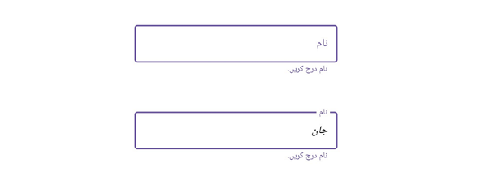

# Right-to-Left in .NET MAUI Text Input Layout

[.NET MAUI Text Input Layout](https://help.syncfusion.com/cr/maui/Syncfusion.Maui.Core.SfTextInputLayout.html) supports to changing the flow of text to the right-to-left direction by setting the [FlowDirection](https://learn.microsoft.com/en-us/dotnet/api/microsoft.maui.controls.device.flowdirection?view=net-maui-7.0) to `RightToLeft`.

## Prerequisites

Before using the [SfTextInputLayout](https://help.syncfusion.com/cr/maui/Syncfusion.Maui.Core.SfTextInputLayout.html), ensure the following NuGet package is installed in your .NET MAUI project:

- `Syncfusion.Maui.Core`

For a step-by-step setup, refer to the [Getting Started](https://help.syncfusion.com/maui/textinputlayout/getting-started) documentation.

## FlowDirection Values

| Value | Description |
|-------|-------------|
| `LeftToRight` | LTR layout. The hint, helper text, and input view flow from left to right. This is the default. |
| `RightToLeft` | RTL layout. The hint, helper text, and input view flow from right to left. Leading and trailing views are also mirrored. |
| `MatchParent` | Inherits the `FlowDirection` from the visual parent. The default for most controls. |

N> When the layout direction changes, the hint label, helper text, error text, character counter, password toggle, and leading/trailing views are mirrored automatically.

## Apply RTL to a single control

Set the [FlowDirection](https://learn.microsoft.com/en-us/dotnet/api/microsoft.maui.flowdirection?view=net-maui-10.0) property directly on the `Text Input Layout` instance.




<inputLayout:SfTextInputLayout x:Name="inputLayout"
                               FlowDirection="RightToLeft"
                               ContainerType="Outlined"
                               Hint="نام"
                               HelperText="نام درج کریں">
    <Entry />
</inputLayout:SfTextInputLayout>




SfTextInputLayout inputLayout = new SfTextInputLayout
{
    FlowDirection = FlowDirection.RightToLeft,
    ContainerType = ContainerType.Outlined,
    Hint = "نام",
    HelperText = "نام درج کریں",
    Content = new Entry()
};
Content = new VerticalStackLayout
{
    Children =
    {
        inputLayout
    }
};




## See Also

- [Container Types](https://help.syncfusion.com/maui/textinputlayout/container-type)
- [Custom Icons](https://help.syncfusion.com/maui/textinputlayout/custom-icons)
- [Assistive Labels](https://help.syncfusion.com/maui/textinputlayout/assistive-labels)