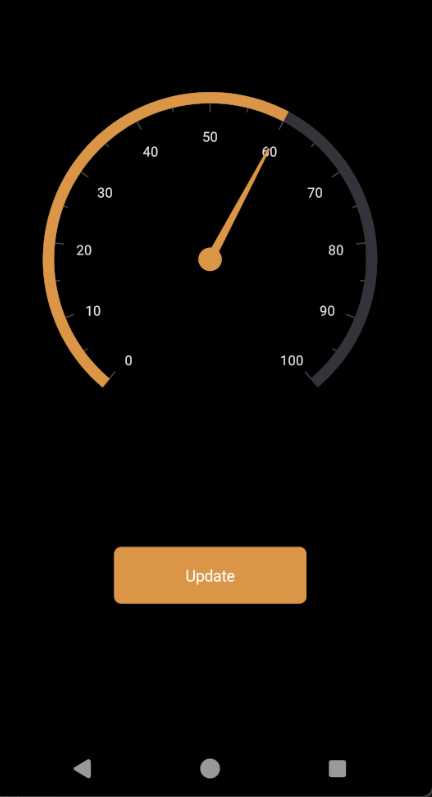
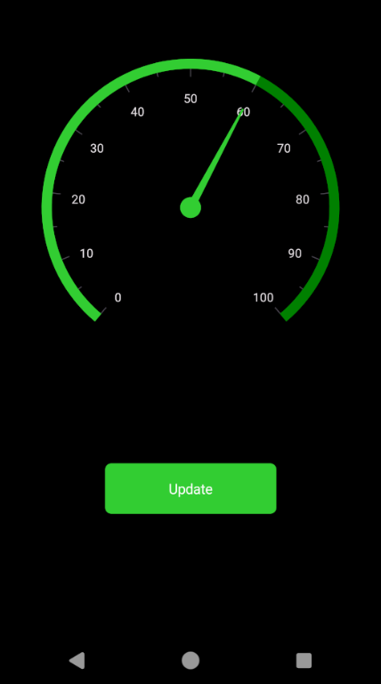

# Applying Themes in MAUI Controls

Syncfusion® themes allow you to apply colors across all the Syncfusion® controls, providing a uniform look and feel to your applications. This section covers the following topics:

* Applying light and dark themes
* Overriding the default theme
* Creating your own theme

## Applying light and dark themes

By default, Syncfusion® offers support for both light and dark themes through the inclusion of the [SyncfusionThemeResourceDictionary](https://help.syncfusion.com/cr/maui/Syncfusion.Maui.Themes.SyncfusionThemeResourceDictionary.html).

To apply themes to your application, merge the [SyncfusionThemeResourceDictionary](https://help.syncfusion.com/cr/maui/Syncfusion.Maui.Themes.SyncfusionThemeResourceDictionary.html) item.

#### Theme resource dictionary

This resource dictionary includes keys and their corresponding color codes for all Syncfusion® controls. Additionally, it contains the [VisualTheme](https://help.syncfusion.com/cr/maui/Syncfusion.Maui.Themes.SyncfusionThemeResourceDictionary.html#Syncfusion_Maui_Themes_SyncfusionThemeResourceDictionary_VisualTheme) property where we can declare the following two theme color values:

1. MaterialLight
2. MaterialDark

#### Automatic merging

When using multiple Syncfusion® controls in an application, to make the process easier for merging the control style dictionaries of the controls, the [SyncfusionThemeResourceDictionary](https://help.syncfusion.com/cr/maui/Syncfusion.Maui.Themes.SyncfusionThemeResourceDictionary.html) class has been provided for automatic merging.



<Application xmlns:base="clr-namespace:SampleBrowser.Maui.Base;assembly=SampleBrowser.Maui.Base"
             xmlns:syncTheme="clr-namespace:Syncfusion.Maui.Themes;assembly=Syncfusion.Maui.Core"
             x:Class="SampleBrowser.Maui.App"
             ...>
<Application.Resources>
        <ResourceDictionary>
            <ResourceDictionary.MergedDictionaries>
                <!-- Theme resource dictionary -->
                <syncTheme:SyncfusionThemeResourceDictionary VisualTheme="MaterialDark"/>
            </ResourceDictionary.MergedDictionaries>
        </ResourceDictionary>
</Application.Resources>

....

</Application>



## Overriding the default theme

The theme resource dictionary contains a set of keys mapped to styles in control style dictionaries. The default appearance of themes can be customized by overriding the key values.

The following section explains how to override the control specific keys.

### Overriding the control specific keys

In addition to the primary keys, the theme resource dictionary also contains the keys that are specific to each controls; these keys can also be overridden. You can find the keys and the UI elements to which they are mapped to all the controls in this [documentation](https://help.syncfusion.com/maui/themes/keys).



<Application xmlns:syncTheme="clr-namespace:Syncfusion.Maui.Themes;assembly=Syncfusion.Maui.Core"
             ...>
<Application.Resources>
    <ResourceDictionary>
        <ResourceDictionary.MergedDictionaries>
            <syncTheme:SyncfusionThemeResourceDictionary VisualTheme="MaterialDark"/>
            <ResourceDictionary>
                <Color x:Key="SfRadialGaugeNeedlePointerNeedleFillColor">LimeGreen</Color>
                <Color x:Key="SfRadialGaugeNeedlePointerKnobFillColor">LimeGreen</Color>
                <Color x:Key="SfRadialGaugeNeedlePointerTailFillColor">Black</Color>
                <Color x:Key="SfRadialGaugeAxisLineFillColor">Green</Color>
                <Color x:Key="SfRadialGaugeRangePointerFillColor">LimeGreen</Color>
            </ResourceDictionary>
        </ResourceDictionary.MergedDictionaries>
    </ResourceDictionary>
</Application.Resources>

....

</Application>



## Creating your own theme

You can also create your own theme as an alternative approach to the above methods. To create your own theme, first, you need to merge the resource, whose key name should be "ControlName" + "Theme" based on the controls. For example, the SfChartTheme and SfTextInputLayoutTheme. You can find this key for each control in this [documentation](https://help.syncfusion.com/maui/themes/keys). After merging this resource, you need to merge the required color resources based on the UI elements that need to be customized. You can find the keys and the UI elements to which they are mapped to all the controls in this [documentation](https://help.syncfusion.com/maui/themes/keys).
Using this approach, you can create your own theme for all the controls or specific controls you need.



<Application xmlns:syncTheme="clr-namespace:Syncfusion.Maui.Themes;assembly=Syncfusion.Maui.Core"
             ...>
 <Application.Resources>
    <ResourceDictionary>
        <ResourceDictionary.MergedDictionaries>
            <syncTheme:SyncfusionThemeResourceDictionary VisualTheme="MaterialDark"/>
            <ResourceDictionary>
                <x:String x:Key="SfRadialGaugeTheme">CommonTheme</x:String>
                <Color x:Key="SfRadialGaugeNeedlePointerNeedleFillColor">LimeGreen</Color>
                <Color x:Key="SfRadialGaugeNeedlePointerKnobFillColor">LimeGreen</Color>
                <Color x:Key="SfRadialGaugeNeedlePointerTailFillColor">Black</Color>
                <Color x:Key="SfRadialGaugeAxisLineFillColor">Green</Color>
                <Color x:Key="SfRadialGaugeRangePointerFillColor">LimeGreen</Color>
            </ResourceDictionary>
        </ResourceDictionary.MergedDictionaries>
    </ResourceDictionary>
</Application.Resources>

....

</Application>



 
