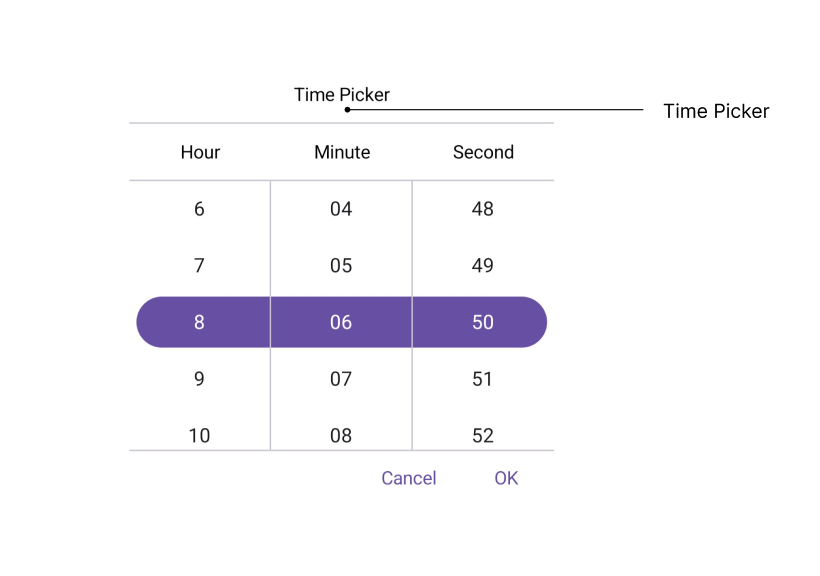
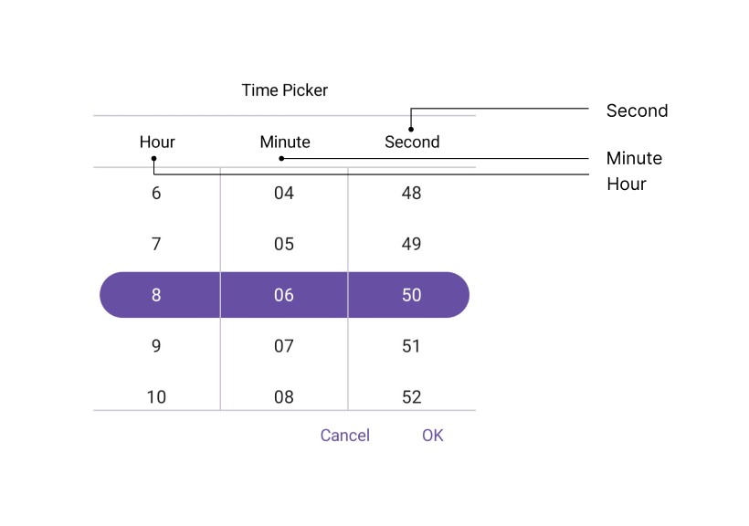
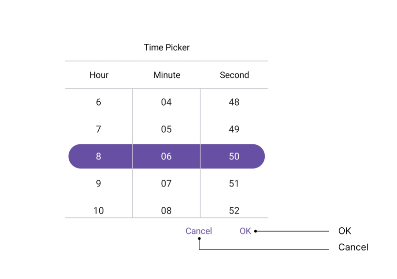
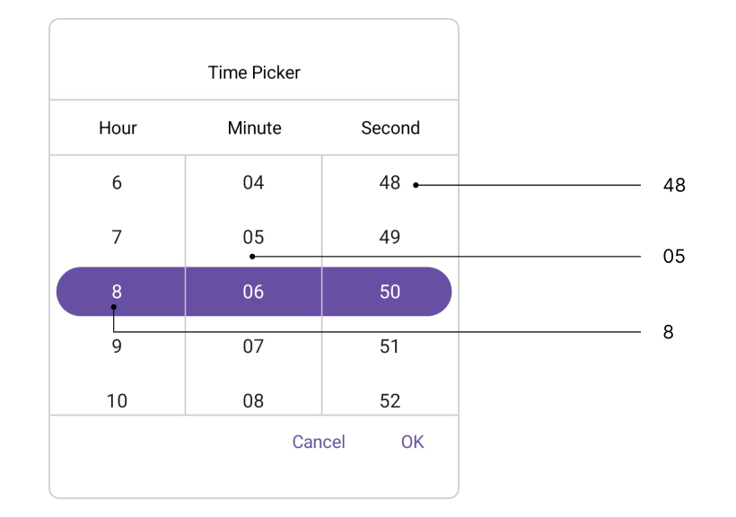

# Accessibility in .NET MAUI Time Picker (SfTimePicker)

The [.NET MAUI Time Picker](https://www.syncfusion.com/maui-controls/maui-timepicker) control has interact with the `Header`, `Column Header`, `Footer`, and `Picker Items`.

## Header Layout

The SfTimePicker control has interact [Header Text](https://help.syncfusion.com/cr/maui/Syncfusion.Maui.Picker.PickerHeaderView.html#Syncfusion_Maui_Picker_PickerHeaderView_Text) with localization of header layout.

## Column Header Layout

The SfTimePicker control has interact column header text with localization of column header layout. It contains [HourHeaderText](https://help.syncfusion.com/cr/maui/Syncfusion.Maui.Picker.TimePickerColumnHeaderView.html#Syncfusion_Maui_Picker_TimePickerColumnHeaderView_HourHeaderText), [MinuteHeaderText](https://help.syncfusion.com/cr/maui/Syncfusion.Maui.Picker.TimePickerColumnHeaderView.html#Syncfusion_Maui_Picker_TimePickerColumnHeaderView_MinuteHeaderText), [SecondHeaderText](https://help.syncfusion.com/cr/maui/Syncfusion.Maui.Picker.TimePickerColumnHeaderView.html#Syncfusion_Maui_Picker_TimePickerColumnHeaderView_SecondHeaderText), and [MeridiemHeaderText](https://help.syncfusion.com/cr/maui/Syncfusion.Maui.Picker.TimePickerColumnHeaderView.html#Syncfusion_Maui_Picker_TimePickerColumnHeaderView_MeridiemHeaderText) properties of the [TimePickerColumnHeaderView](https://help.syncfusion.com/cr/maui/Syncfusion.Maui.Picker.TimePickerColumnHeaderView.html).. The default value of the `HourHeaderText` property is "Hour", `MinuteHeaderText` is "Minute", `SecondHeaderText` is "Second", and `MerdiemHeaderText` is "string.Empty".

## Footer Layout

The SfTimePicker control has interact validation buttons (OK and Cancel) with localization of footer layout. The Default value of the [OkButtonText](https://help.syncfusion.com/cr/maui/Syncfusion.Maui.Picker.PickerFooterView.html#Syncfusion_Maui_Picker_PickerFooterView_OkButtonText) property is "OK", and [CancelButtonText](https://help.syncfusion.com/cr/maui/Syncfusion.Maui.Picker.PickerFooterView.html#Syncfusion_Maui_Picker_PickerFooterView_CancelButtonText) is "Cancel".

## Picker Items

The SfTimePicker control has interact with the item source in picker items. The item source contains based on the [Time format](https://help.syncfusion.com/cr/maui/Syncfusion.Maui.Picker.PickerTimeFormat.html). For example, 

<table>
<tr>
<th>Format</th>
<th>Example</th></tr>
<tr>
<td>h, H</td>
<td>1</td>
</tr>
<tr>
<td>hh, HH</td>
<td>01</td>
</tr>
<tr>
<td>mm, ss</td>
<td>01</td>
</tr> 
<tr>
<td>tt</td>
<td>AM/PM</td>
</tr> 
</table>

