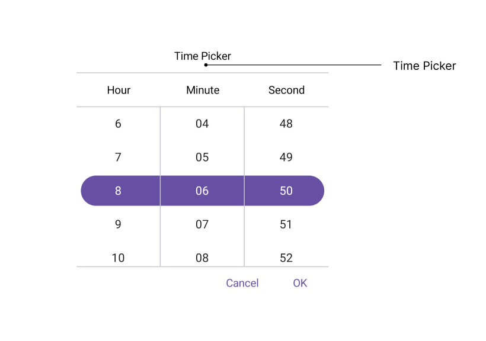
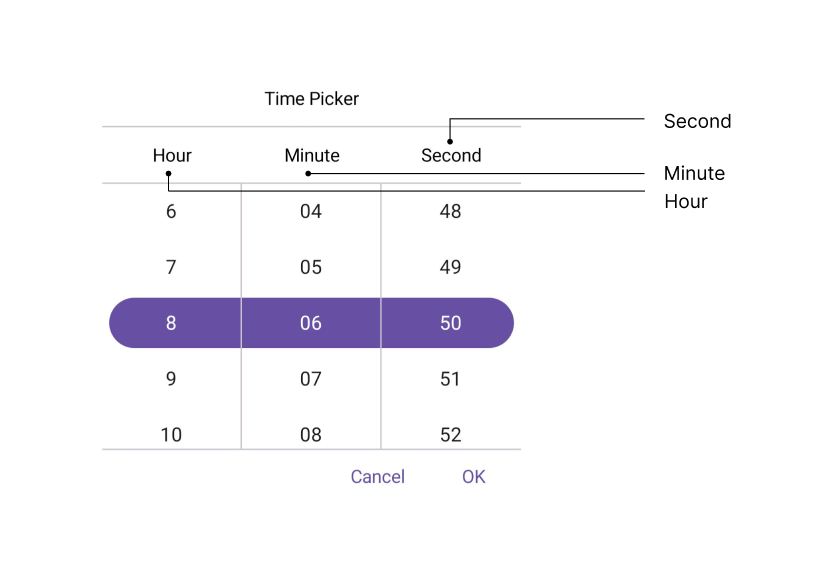
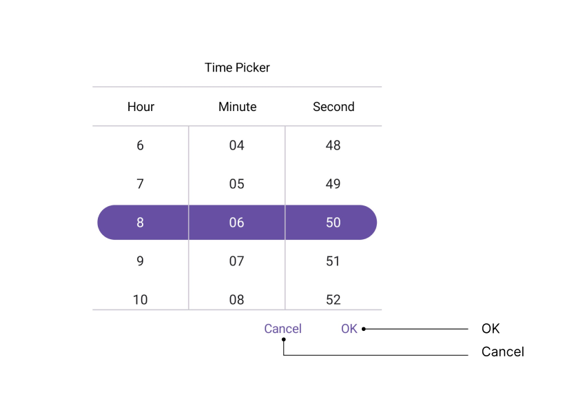
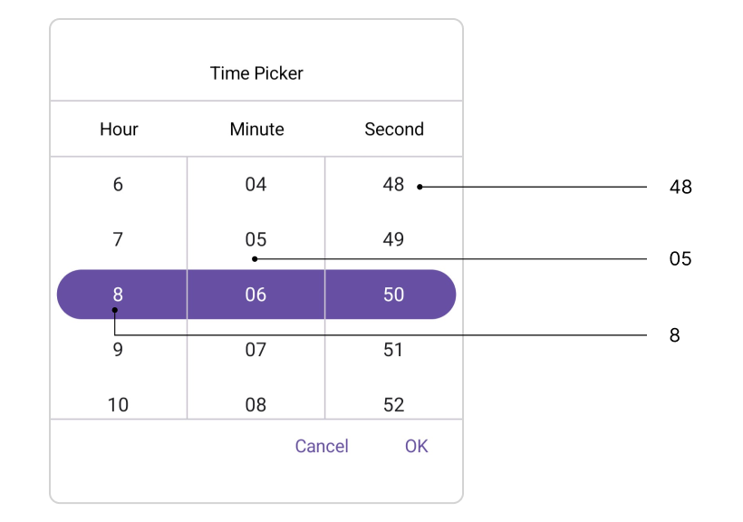

# Accessibility in .NET MAUI Time Picker (SfTimePicker)

The [.NET MAUI Time Picker](https://www.syncfusion.com/maui-controls/maui-timepicker) control exposes accessibility for the `Header`, `Column Header`, `Footer`, and `Picker Items`.

## Header Layout

The `SfTimePicker` exposes the [Header Text](https://help.syncfusion.com/cr/maui/Syncfusion.Maui.Picker.PickerHeaderView.html#Syncfusion_Maui_Picker_PickerHeaderView_Text) for screen readers through localization of header layout.

## Column Header Layout

The `SfTimePicker` exposes column header text through the [TimePickerColumnHeaderView](https://help.syncfusion.com/cr/maui/Syncfusion.Maui.Picker.TimePickerColumnHeaderView.html). It contains the [HourHeaderText](https://help.syncfusion.com/cr/maui/Syncfusion.Maui.Picker.TimePickerColumnHeaderView.html#Syncfusion_Maui_Picker_TimePickerColumnHeaderView_HourHeaderText), [MinuteHeaderText](https://help.syncfusion.com/cr/maui/Syncfusion.Maui.Picker.TimePickerColumnHeaderView.html#Syncfusion_Maui_Picker_TimePickerColumnHeaderView_MinuteHeaderText), [SecondHeaderText](https://help.syncfusion.com/cr/maui/Syncfusion.Maui.Picker.TimePickerColumnHeaderView.html#Syncfusion_Maui_Picker_TimePickerColumnHeaderView_SecondHeaderText), [MilliSecondHeaderText](https://help.syncfusion.com/cr/maui/Syncfusion.Maui.Picker.TimePickerColumnHeaderView.html#Syncfusion_Maui_Picker_TimePickerColumnHeaderView_MilliSecondHeaderText), and [MeridiemHeaderText](https://help.syncfusion.com/cr/maui/Syncfusion.Maui.Picker.TimePickerColumnHeaderView.html#Syncfusion_Maui_Picker_TimePickerColumnHeaderView_MeridiemHeaderText) properties. The default values are: `HourHeaderText` is "Hour", `MinuteHeaderText` is "Minute", `SecondHeaderText` is "Second", `MilliSecondHeaderText` is "MilliSecond", and `MeridiemHeaderText` is `string.Empty`.

## Footer Layout

The `SfTimePicker` exposes the validation buttons (OK and Cancel) through the `PickerFooterView`. The default value of the [OkButtonText](https://help.syncfusion.com/cr/maui/Syncfusion.Maui.Picker.PickerFooterView.html#Syncfusion_Maui_Picker_PickerFooterView_OkButtonText) property is "OK", and [CancelButtonText](https://help.syncfusion.com/cr/maui/Syncfusion.Maui.Picker.PickerFooterView.html#Syncfusion_Maui_Picker_PickerFooterView_CancelButtonText) is "Cancel".

## Picker Items

The `SfTimePicker` renders picker items based on the [Time format](https://help.syncfusion.com/cr/maui/Syncfusion.Maui.Picker.PickerTimeFormat.html). The screen reader announces each item based on the format, for example:

<table>
<tr>
<th>Format</th>
<th>Example</th></tr>
<tr>
<td>h, H</td>
<td>1</td>
</tr>
<tr>
<td>hh, HH</td>
<td>01</td>
</tr>
<tr>
<td>mm, ss</td>
<td>01</td>
</tr> 
<tr>
<td>tt</td>
<td>AM/PM</td>
</tr> 
</table>

## Keyboard

`SfTimePicker` supports selection using keyboard interactions.

<table>
<tr>
<th>Key</th>
<th>Description</th>
</tr>
<tr>
<td>Tab</td>
<td>Focus the picker.</td>
</tr>
<tr>
<td>Enter</td>
<td>Opens the selected picker.</td>
</tr>
<tr>
<td>DownArrow</td>
<td>Selects an item from the currently expanded list by moving downwards.</td>
</tr>
<tr>
<td>UpArrow</td>
<td>Selects an item from the currently expanded list by moving upwards.</td>
</tr>
<tr>
<td>RightArrow / Tab</td>
<td>Navigates to the right within the picker.</td>
</tr>
<tr>
<td>LeftArrow / Shift+Tab</td>
<td>Navigates to the left within the picker.</td>
</tr>
<tr>
<td>Esc / Enter</td>
<td>Exit and commit selection.</td>
</tr>
</table>
