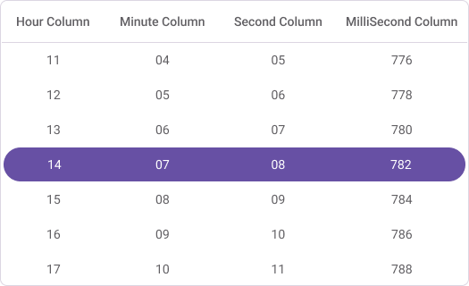
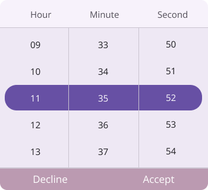

# Customizations in .NET MAUI Time Picker (SfTimePicker)

The [.NET MAUI Time Picker](https://www.syncfusion.com/maui-controls/maui-timepicker) header, column header, footer, and selection views can be customized.

## Header Customization

Customize the time picker header by using the `HeaderView` property of the `SfTimePicker`.

### Set the header text

The SfTimePicker control allows you to add the header text by setting the [Text](https://help.syncfusion.com/cr/maui/Syncfusion.Maui.Picker.PickerHeaderView.html#Syncfusion_Maui_Picker_PickerHeaderView_Text) property in the [PickerHeaderView](https://help.syncfusion.com/cr/maui/Syncfusion.Maui.Picker.PickerHeaderView.html). To enable the header view, set the [Height](https://help.syncfusion.com/cr/maui/Syncfusion.Maui.Picker.PickerHeaderView.html#Syncfusion_Maui_Picker_PickerHeaderView_Height) property of the [PickerHeaderView](https://help.syncfusion.com/cr/maui/Syncfusion.Maui.Picker.PickerHeaderView.html) to a value greater than 0. The default value of the `Height` property is 0.





<picker:SfTimePicker x:Name="timePicker" >
    <picker:SfTimePicker.HeaderView >
        <picker:PickerHeaderView Height="40" Text="Time Picker"/>
    </picker:SfTimePicker.HeaderView>
</picker:SfTimePicker>





SfTimePicker timePicker = new SfTimePicker();
timepicker.HeaderView = new PickerHeaderView()
{
    Height = 40,
    Text = "Time Picker"
};

this.Content = TimePicker;





### Set the divider color

The SfTimePicker control allows you to customize the header divider color by setting the [DividerColor](https://help.syncfusion.com/cr/maui/Syncfusion.Maui.Picker.PickerHeaderView.html#Syncfusion_Maui_Picker_PickerHeaderView_DividerColor) property of the [PickerHeaderView](https://help.syncfusion.com/cr/maui/Syncfusion.Maui.Picker.PickerHeaderView.html).





<picker:SfTimePicker x:Name="timePicker" >
    <picker:SfTimePicker.HeaderView >
        <picker:PickerHeaderView DividerColor="Red" />
    </picker:SfTimePicker.HeaderView>
</picker:SfTimePicker>





SfTimePicker timePicker = new SfTimePicker();
timepicker.HeaderView = new PickerHeaderView()
{
    DividerColor = Colors.Red,
};

this.Content = timePicker;





### Customization of the header

Customize the header text style and background color of the `Time picker` using the [TextStyle](https://help.syncfusion.com/cr/maui/Syncfusion.Maui.Picker.PickerHeaderView.html#Syncfusion_Maui_Picker_PickerHeaderView_TextStyle) and [Background](https://help.syncfusion.com/cr/maui/Syncfusion.Maui.Picker.PickerHeaderView.html#Syncfusion_Maui_Picker_PickerHeaderView_Background) properties of the [HeaderView](https://help.syncfusion.com/cr/maui/Syncfusion.Maui.Picker.SfTimePicker.html#Syncfusion_Maui_Picker_SfTimePicker_HeaderView) in the [PickerHeaderView](https://help.syncfusion.com/cr/maui/Syncfusion.Maui.Picker.PickerHeaderView.html).





<picker:SfTimePicker x:Name="timePicker" >
    <picker:SfTimePicker.HeaderView >
        <picker:PickerHeaderView Background="#D3D3D3">
            <picker:PickerHeaderView.TextStyle >
                <picker:PickerTextStyle FontSize="15" TextColor="Black" />
            </picker:PickerHeaderView.TextStyle>
        </picker:PickerHeaderView>
    </picker:SfTimePicker.HeaderView>
</picker:SfTimePicker>





SfTimePicker timePicker = new SfTimePicker();
timePicker.HeaderView = new PickerHeaderView()
{
    Background = Color.FromArgb("#6750A4"),
    TextStyle = new PickerTextStyle()
    {
        TextColor = Colors.White,
        FontSize = 15,
    }
};

this.Content = timePicker;





### Custom Header Appearance using Datatemplate

You can customize the time picker header appearance by using the [HeaderTemplate](https://help.syncfusion.com/cr/maui/Syncfusion.Maui.Picker.PickerBase.html#Syncfusion_Maui_Picker_PickerBase_HeaderTemplate) property in the [SfTimePicker](https://help.syncfusion.com/cr/maui/Syncfusion.Maui.Picker.SfTimePicker.html).





<picker:SfTimePicker x:Name="timePicker" >
    <picker:SfTimePicker.HeaderTemplate>
        <DataTemplate>
            <Grid BackgroundColor="#BB9AB1">
                <Label HorizontalOptions="Center" VerticalOptions="Center" Text="Select a Time" TextColor="White"/>
            </Grid>
        </DataTemplate>
    </picker:SfTimePicker.HeaderTemplate>
</picker:SfTimePicker>





N> If a template is applied to the header in the [PickerHeaderView](https://help.syncfusion.com/cr/maui/Syncfusion.Maui.Picker.PickerHeaderView.html), the remaining header properties will not have any effect, except for the [DividerColor](https://help.syncfusion.com/cr/maui/Syncfusion.Maui.Picker.PickerHeaderView.html#Syncfusion_Maui_Picker_PickerHeaderView_DividerColor) Property.

### Custom Header appearance using DataTemplateSelector

You can customize the time picker header appearance by using the [HeaderTemplate](https://help.syncfusion.com/cr/maui/Syncfusion.Maui.Picker.PickerBase.html#Syncfusion_Maui_Picker_PickerBase_HeaderTemplate) property in the [SfTimePicker](https://help.syncfusion.com/cr/maui/Syncfusion.Maui.Picker.SfTimePicker.html). The DataTemplateSelector allows you to choose a DataTemplate at runtime based on the value bound to the time picker header. This lets you apply a custom data template to the header and customize its appearance based on specific conditions.





<Grid.Resources>
    <DataTemplate x:Key="currentTimeTemplate">
        <Grid Background = "#987D9A" >
            <Label HorizontalOptions="Center" VerticalOptions="Center" Text="Select a Time" TextColor="Red"/>
        </Grid>
    </DataTemplate>
    <DataTemplate x:Key="futureTimeTemplate">
        <Grid Background = "LightGreen" >
            <Label HorizontalOptions="Center" VerticalOptions="Center" Text="Select a Time" TextColor="Orange"/>
        </Grid>
    </DataTemplate>
    <local:TimeTemplateSelector x:Key="headerTemplateSelector" CurrentTimeTemplate="{StaticResource currentTimeTemplate}"  FutureTimeTemplate="{StaticResource futureTimeTemplate}"/>
    <picker:SfTimePicker x:Name="timePicker" HeaderTemplate="{StaticResource headerTemplateSelector}">
    </picker:SfTimePicker>
</Grid.Resources>





public class TimeTemplateSelector : DataTemplateSelector
{
    public TimeTemplateSelector()
    {
    }
    public DataTemplate CurrentTimeTemplate { get; set; }
    public DataTemplate FutureTimeTemplate { get; set; }
    protected override DataTemplate OnSelectTemplate(object item, BindableObject container)
    {
        var Details = item as SfTimePicker;
        if (Details != null)
        {
            if (Details.SelectedTime <= DateTime.Now.TimeOfDay)
                return CurrentTimeTemplate;
        }
        return FutureTimeTemplate;
    }
}





## Column Header Customization

Customize the time picker column header by using the `ColumnHeaderView` property of the `SfTimePicker`.

### Set the custom column header

The [SfTimePicker](https://help.syncfusion.com/cr/maui/Syncfusion.Maui.Picker.SfTimePicker.html) provides a custom text to its column header by setting the [ColumnHeaderView](https://help.syncfusion.com/cr/maui/Syncfusion.Maui.Picker.SfTimePicker.html#Syncfusion_Maui_Picker_SfTimePicker_ColumnHeaderView) property of the [SfTimePicker](https://help.syncfusion.com/cr/maui/Syncfusion.Maui.Picker.SfTimePicker.html). It contains [HourHeaderText](https://help.syncfusion.com/cr/maui/Syncfusion.Maui.Picker.TimePickerColumnHeaderView.html#Syncfusion_Maui_Picker_TimePickerColumnHeaderView_HourHeaderText), [MinuteHeaderText](https://help.syncfusion.com/cr/maui/Syncfusion.Maui.Picker.TimePickerColumnHeaderView.html#Syncfusion_Maui_Picker_TimePickerColumnHeaderView_MinuteHeaderText), [SecondHeaderText](https://help.syncfusion.com/cr/maui/Syncfusion.Maui.Picker.TimePickerColumnHeaderView.html#Syncfusion_Maui_Picker_TimePickerColumnHeaderView_SecondHeaderText), and [MeridiemHeaderText](https://help.syncfusion.com/cr/maui/Syncfusion.Maui.Picker.TimePickerColumnHeaderView.html#Syncfusion_Maui_Picker_TimePickerColumnHeaderView_MeridiemHeaderText) properties of the [TimePickerColumnHeaderView](https://help.syncfusion.com/cr/maui/Syncfusion.Maui.Picker.TimePickerColumnHeaderView.html). The default value of the [HourHeaderText](https://help.syncfusion.com/cr/maui/Syncfusion.Maui.Picker.TimePickerColumnHeaderView.html#Syncfusion_Maui_Picker_TimePickerColumnHeaderView_HourHeaderText) property is "Hour", [MinuteHeaderText](https://help.syncfusion.com/cr/maui/Syncfusion.Maui.Picker.TimePickerColumnHeaderView.html#Syncfusion_Maui_Picker_TimePickerColumnHeaderView_MinuteHeaderText) is "Minute", [SecondHeaderText](https://help.syncfusion.com/cr/maui/Syncfusion.Maui.Picker.TimePickerColumnHeaderView.html#Syncfusion_Maui_Picker_TimePickerColumnHeaderView_SecondHeaderText) is "Second", [MilliSecondHeaderText](https://help.syncfusion.com/cr/maui/Syncfusion.Maui.Picker.TimePickerColumnHeaderView.html#Syncfusion_Maui_Picker_TimePickerColumnHeaderView_MilliSecondHeaderText) is "MilliSecond", and [MerdiemHeaderText](https://help.syncfusion.com/cr/maui/Syncfusion.Maui.Picker.TimePickerColumnHeaderView.html#Syncfusion_Maui_Picker_TimePickerColumnHeaderView_MeridiemHeaderText) is "string.Empty".





<picker:SfTimePicker x:Name="timePicker" >
    <picker:SfTimePicker.ColumnHeaderView >
        <picker:TimePickerColumnHeaderView HourHeaderText="Hour Column"
                                           MinuteHeaderText="Minute Column"
                                           SecondHeaderText="Second Column"
                                           MilliSecondHeaderText="MilliSecond Column"
                                           MeridiemHeaderText="Meridiem Column"/>
    </picker:SfTimePicker.ColumnHeaderView>
</picker:SfTimePicker>





SfTimePicker timePicker = new SfTimePicker();
timePicker.ColumnHeaderView = new TimePickerColumnHeaderView()
{
    HourHeaderText = "Hour Column",
    MinuteHeaderText = "Minute Column",
    SecondHeaderText = "Second Column",
    MilliSecondHeaderText = "MilliSecond Column"
    MeridiemHeaderText = "Meridiem Column"
};

this.Content = timePicker;





### Set the divider color

The SfTimePicker control allows you to customize the column header divider color by setting the [DividerColor](https://help.syncfusion.com/cr/maui/Syncfusion.Maui.Picker.TimePickerColumnHeaderView.html#Syncfusion_Maui_Picker_TimePickerColumnHeaderView_DividerColor) property of the [TimePickerColumnHeaderView](https://help.syncfusion.com/cr/maui/Syncfusion.Maui.Picker.TimePickerColumnHeaderView.html).





<picker:SfTimePicker x:Name="timePicker" >
    <picker:SfTimePicker.ColumnHeaderView >
        <picker:TimePickerColumnHeaderView DividerColor="Red" />
    </picker:SfTimePicker.ColumnHeaderView>
</picker:SfTimePicker>





SfTimePicker timePicker = new SfTimePicker();
timepicker.ColumnHeaderView = new TimePickerColumnHeaderView()
{
    DividerColor = Colors.Red,
};

this.Content = timePicker;





### Customization of the column header

Customize the column header view text style and background color of the `Time Picker` using the [TextStyle](https://help.syncfusion.com/cr/maui/Syncfusion.Maui.Picker.TimePickerColumnHeaderView.html#Syncfusion_Maui_Picker_TimePickerColumnHeaderView_TextStyle) and [Background](https://help.syncfusion.com/cr/maui/Syncfusion.Maui.Picker.TimePickerColumnHeaderView.html#Syncfusion_Maui_Picker_TimePickerColumnHeaderView_Background) properties of the [TimePickerColumnHeaderView](https://help.syncfusion.com/cr/maui/Syncfusion.Maui.Picker.TimePickerColumnHeaderView.html).





<picker:SfTimePicker x:Name="timePicker" >
    <picker:SfTimePicker.ColumnHeaderView >
        <picker:TimePickerColumnHeaderView Background="#D3D3D3">
            <picker:TimePickerColumnHeaderView.TextStyle >
                <picker:PickerTextStyle FontSize="15" TextColor="Black" />
            </picker:TimePickerColumnHeaderView.TextStyle>
        </picker:TimePickerColumnHeaderView>
    </picker:SfTimePicker.ColumnHeaderView>
</picker:SfTimePicker>





SfTimePicker timePicker = new SfTimePicker();
timePicker.ColumnHeaderView = new TimePickerColumnHeaderView()
{
    Background = Color.FromArgb("#D3D3D3"),
    TextStyle = new PickerTextStyle()
    {
        TextColor = Colors.Black,
        FontSize = 15,
    }
};

this.Content = timePicker;





### Custom Column Header Appearance using Datatemplate

You can customize the time picker column header appearance by using the [ColumnHeaderTemplate](https://help.syncfusion.com/cr/maui/Syncfusion.Maui.Picker.PickerBase.html#Syncfusion_Maui_Picker_PickerBase_ColumnHeaderTemplate) property in the [SfTimePicker](https://help.syncfusion.com/cr/maui/Syncfusion.Maui.Picker.SfTimePicker.html).





<picker:SfTimePicker x:Name="timePicker" >
    <picker:SfTimePicker.ColumnHeaderTemplate>
        <DataTemplate>
            <Grid BackgroundColor="#BB9AB1">
                <Grid.ColumnDefinitions>
                    <ColumnDefinition/>
                    <ColumnDefinition/>
                    <ColumnDefinition/>
                </Grid.ColumnDefinitions>
                <Label Text="Hour" Grid.Column="0" TextColor="White" HorizontalTextAlignment="Center" VerticalTextAlignment="Center"/>
                <Label Text="Minute" Grid.Column="1" TextColor="White"  HorizontalTextAlignment="Center" VerticalTextAlignment="Center"/>
                <Label Text="Second" Grid.Column="2" TextColor="White" HorizontalTextAlignment="Center" VerticalTextAlignment="Center"/>
            </Grid>
        </DataTemplate>
    </picker:SfTimePicker.ColumnHeaderTemplate>
</picker:SfTimePicker>





N> If a template is applied to the column header in the [TimePickerColumnHeaderView](https://help.syncfusion.com/cr/maui/Syncfusion.Maui.Picker.TimePickerColumnHeaderView.html), the remaining column header properties will not have any effect, except for the [DividerColor](https://help.syncfusion.com/cr/maui/Syncfusion.Maui.Picker.TimePickerColumnHeaderView.html#Syncfusion_Maui_Picker_TimePickerColumnHeaderView_DividerColor).

### Custom Column Header appearance using DataTemplateSelector

You can customize the time picker column header appearance by using the [ColumnHeaderTemplate](https://help.syncfusion.com/cr/maui/Syncfusion.Maui.Picker.PickerBase.html#Syncfusion_Maui_Picker_PickerBase_ColumnHeaderTemplate) property in the [SfTimePicker](https://help.syncfusion.com/cr/maui/Syncfusion.Maui.Picker.SfTimePicker.html). The DataTemplateSelector allows you to choose a DataTemplate at runtime based on the value bound to the time picker column header. This lets you apply a custom data template to the column header and customize its appearance based on specific conditions.





<Grid.Resources>
    <DataTemplate x:Key="currentTimeTemplate">
        <Grid Background="LightBlue">
            <Grid.ColumnDefinitions>
                <ColumnDefinition/>
                <ColumnDefinition/>
                <ColumnDefinition/>
            </Grid.ColumnDefinitions>
            <Label Text="Hour" Grid.Column="0" TextColor="Red" HorizontalTextAlignment="Center" VerticalTextAlignment="Center"/>
            <Label Text="Minute" Grid.Column="1" TextColor="Red"  HorizontalTextAlignment="Center" VerticalTextAlignment="Center"/>
            <Label Text="Second" Grid.Column="2" TextColor="Red" HorizontalTextAlignment="Center" VerticalTextAlignment="Center"/>
        </Grid>
    </DataTemplate>
    <DataTemplate x:Key="futureTimeTemplate">
        <Grid Background="LightGreen">
            <Grid.ColumnDefinitions>
                <ColumnDefinition/>
                <ColumnDefinition/>
                <ColumnDefinition/>
            </Grid.ColumnDefinitions>
            <Label Text="Hour" Grid.Column="0" TextColor="Orange" HorizontalTextAlignment="Center" VerticalTextAlignment="Center"/>
            <Label Text="Minute" Grid.Column="1" TextColor="Orange"  HorizontalTextAlignment="Center" VerticalTextAlignment="Center"/>
            <Label Text="Second" Grid.Column="2" TextColor="Orange" HorizontalTextAlignment="Center" VerticalTextAlignment="Center"/>
        </Grid>
    </DataTemplate>
    <local:TimeTemplateSelector x:Key="columnHeaderTemplateSelector" CurrentTimeTemplate="{StaticResource currentTimeTemplate}"  FutureTimeTemplate="{StaticResource futureTimeTemplate}"/>
    <picker:SfTimePicker x:Name="timePicker" ColumnHeaderTemplate="{StaticResource columnHeaderTemplateSelector}">
    </picker:SfTimePicker>
</Grid.Resources>





public class TimeTemplateSelector : DataTemplateSelector
{
    public TimeTemplateSelector()
    {
    }
    public DataTemplate CurrentTimeTemplate { get; set; }
    public DataTemplate FutureTimeTemplate { get; set; }
    protected override DataTemplate OnSelectTemplate(object item, BindableObject container)
    {
        var Details = item as SfTimePicker;
        if (Details != null)
        {
            if (Details.SelectedTime <= DateTime.Now.TimeOfDay)
                return CurrentTimeTemplate;
        }
        return FutureTimeTemplate;
    }
}





## Footer Customization

Customize the time picker footer view by using the `FooterView` property of the`SfTimePicker`.

### Set the footer with OK and Cancel button customizations

In the SfTimePicker control, validation buttons (OK and Cancel) can be customized by setting the [OkButtonText](https://help.syncfusion.com/cr/maui/Syncfusion.Maui.Picker.PickerFooterView.html#Syncfusion_Maui_Picker_PickerFooterView_OkButtonText) and [CancelButtonText](https://help.syncfusion.com/cr/maui/Syncfusion.Maui.Picker.PickerFooterView.html#Syncfusion_Maui_Picker_PickerFooterView_CancelButtonText) properties of the [PickerFooterView](https://help.syncfusion.com/cr/maui/Syncfusion.Maui.Picker.PickerFooterView.html). It allows you to confirm or cancel the selected time. The `OkButtonText` can be enabled using the [ShowOkButton](https://help.syncfusion.com/cr/maui/Syncfusion.Maui.Picker.PickerFooterView.html#Syncfusion_Maui_Picker_PickerFooterView_ShowOkButton) property in the [PickerFooterView](https://help.syncfusion.com/cr/maui/Syncfusion.Maui.Picker.PickerFooterView.html).
The Default value of the [OkButtonText](https://help.syncfusion.com/cr/maui/Syncfusion.Maui.Picker.PickerFooterView.html#Syncfusion_Maui_Picker_PickerFooterView_OkButtonText) property is "OK", and [CancelButtonText](https://help.syncfusion.com/cr/maui/Syncfusion.Maui.Picker.PickerFooterView.html#Syncfusion_Maui_Picker_PickerFooterView_CancelButtonText) is "Cancel". To enable the footer view, set the [Height](https://help.syncfusion.com/cr/maui/Syncfusion.Maui.Picker.PickerFooterView.html#Syncfusion_Maui_Picker_PickerFooterView_Height) property of the [PickerFooterView](https://help.syncfusion.com/cr/maui/Syncfusion.Maui.Picker.PickerFooterView.html) to a value greater than 0. The default value of the `Height` property is 0.





<picker:SfTimePicker x:Name="timePicker" >
    <picker:SfTimePicker.FooterView >
        <picker:PickerFooterView Height="40" OkButtonText="Save"
                                 CancelButtonText="Exit"/>
    </picker:SfTimePicker.FooterView>
</picker:SfTimePicker>





SfTimePicker timePicker = new SfTimePicker();
timePicker.FooterView = new PickerFooterView()
{
    Height = 40,
    OkButtonText = "Save",
    CancelButtonText = "Exit",
};

this.Content = timePicker;





### Set the divider color

The SfTimePicker control allows you to customize the footer divider color by setting the [DividerColor](https://help.syncfusion.com/cr/maui/Syncfusion.Maui.Picker.PickerFooterView.html#Syncfusion_Maui_Picker_PickerFooterView_DividerColor) property of the [PickerFooterView](https://help.syncfusion.com/cr/maui/Syncfusion.Maui.Picker.PickerFooterView.html).





<picker:SfTimePicker x:Name="timePicker" >
    <picker:SfTimePicker.FooterView >
        <picker:PickerFooterView DividerColor="Red" />
    </picker:SfTimePicker.FooterView>
</picker:SfTimePicker>





SfTimePicker timePicker = new SfTimePicker();
timepicker.FooterView = new PickerFooterView()
{
    DividerColor = Colors.Red,
};

this.Content = timePicker;





### Customization of the footer

Customize the footer text style and background color of the `Time Picker` using the [TextStyle](https://help.syncfusion.com/cr/maui/Syncfusion.Maui.Picker.PickerFooterView.html#Syncfusion_Maui_Picker_PickerFooterView_TextStyle) and [Background](https://help.syncfusion.com/cr/maui/Syncfusion.Maui.Picker.PickerFooterView.html#Syncfusion_Maui_Picker_PickerFooterView_Background) properties of the [PickerFooterView](https://help.syncfusion.com/cr/maui/Syncfusion.Maui.Picker.PickerFooterView.html).





<picker:SfTimePicker x:Name="timePicker" >
    <picker:SfTimePicker.FooterView >
        <picker:PickerFooterView Background="#D3D3D3">
            <picker:PickerFooterView.TextStyle >
                <picker:PickerTextStyle FontSize="15" TextColor="Black" />
            </picker:PickerFooterView.TextStyle>
        </picker:PickerFooterView>
    </picker:SfTimePicker.FooterView>
</picker:SfTimePicker>





SfTimePicker timePicker = new SfTimePicker();
timePicker.FooterView = new PickerFooterView()
{
    Background = Color.FromArgb("#D3D3D3"),
    TextStyle = new PickerTextStyle()
    {
        TextColor = Colors.Black,
        FontSize = 15,
    }
};

this.Content = timePicker;





### Custom Footer Appearance using Datatemplate

You can customize the time picker footer appearance by using the [FooterTemplate](https://help.syncfusion.com/cr/maui/Syncfusion.Maui.Picker.PickerBase.html#Syncfusion_Maui_Picker_PickerBase_FooterTemplate) property in the [SfTimePicker](https://help.syncfusion.com/cr/maui/Syncfusion.Maui.Picker.SfTimePicker.html).





<picker:SfTimePicker x:Name="timePicker">
    <picker:SfTimePicker.FooterTemplate>
        <DataTemplate>
            <Grid BackgroundColor="#BB9AB1">
                <Grid.ColumnDefinitions>
                    <ColumnDefinition/>
                    <ColumnDefinition/>
                </Grid.ColumnDefinitions>
                <Button Grid.Column="0" Text="Decline" TextColor="White" Background="Transparent"/>
                <Button Grid.Column="1" Text="Accept" TextColor="White" Background="Transparent"/>
            </Grid>
        </DataTemplate>
    </picker:SfTimePicker.FooterTemplate>
</picker:SfTimePicker>





N> If a template is applied to the footer in the [PickerFooterView](https://help.syncfusion.com/cr/maui/Syncfusion.Maui.Picker.PickerFooterView.html), the remaining footer properties will not have any effect, except for the [DividerColor](https://help.syncfusion.com/cr/maui/Syncfusion.Maui.Picker.PickerFooterView.html#Syncfusion_Maui_Picker_PickerFooterView_DividerColor) Property.

### Custom Footer appearance using DataTemplateSelector

You can customize the time picker footer appearance by using the [FooterTemplate](https://help.syncfusion.com/cr/maui/Syncfusion.Maui.Picker.PickerBase.html#Syncfusion_Maui_Picker_PickerBase_FooterTemplate) property in the [SfTimePicker](https://help.syncfusion.com/cr/maui/Syncfusion.Maui.Picker.SfTimePicker.html). The DataTemplateSelector allows you to choose a DataTemplate at runtime based on the value bound to the time picker footer. This lets you apply a custom data template to the footer and customize its appearance based on specific conditions.





<Grid.Resources>
    <DataTemplate x:Key="currentTimeTemplate">
        <Grid Background="LightBlue">
            <Grid.ColumnDefinitions>
                <ColumnDefinition/>
                <ColumnDefinition/>
            </Grid.ColumnDefinitions>
            <Button Grid.Column="0" Text="Decline" TextColor="Red" Background="Transparent"/>
            <Button Grid.Column="1" Text="Accept" TextColor="Red" Background="Transparent"/>
        </Grid>
    </DataTemplate>
    <DataTemplate x:Key="futureTimeTemplate">
        <Grid Background="LightGreen">
            <Grid.ColumnDefinitions>
                <ColumnDefinition/>
                <ColumnDefinition/>
            </Grid.ColumnDefinitions>
            <Button Grid.Column="0" Text="Decline" TextColor="Orange" Background="Transparent"/>
            <Button Grid.Column="1" Text="Accept" TextColor="Orange" Background="Transparent"/>
        </Grid>
    </DataTemplate>
    <local:TimeTemplateSelector x:Key="footerTemplateSelector" CurrentTimeTemplate="{StaticResource currentTimeTemplate}"  FutureTimeTemplate="{StaticResource futureTimeTemplate}"/>
    <picker:SfTimePicker x:Name="timePicker" FooterTemplate="{StaticResource footerTemplateSelector}">
    </picker:SfTimePicker>
</Grid.Resources>





public class TimeTemplateSelector : DataTemplateSelector
{
    public TimeTemplateSelector()
    {
    }
    public DataTemplate CurrentTimeTemplate { get; set; }
    public DataTemplate FutureTimeTemplate { get; set; }
    protected override DataTemplate OnSelectTemplate(object item, BindableObject container)
    {
        var Details = item as SfTimePicker;
        if (Details != null)
        {
            if (Details.SelectedTime <= DateTime.Now.TimeOfDay)
                return CurrentTimeTemplate;
        }
        return FutureTimeTemplate;
    }
}





## Selection View Customization

Customize the time picker selection view by using the `SelectionView` property of the `SfTimePicker`.

### Set the selection view

In the SfTimePicker control, the corner radius, stroke, and padding can be customized by setting the [CornerRadius](https://help.syncfusion.com/cr/maui/Syncfusion.Maui.Picker.PickerSelectionView.html#Syncfusion_Maui_Picker_PickerSelectionView_CornerRadius), [Stroke](https://help.syncfusion.com/cr/maui/Syncfusion.Maui.Picker.PickerSelectionView.html#Syncfusion_Maui_Picker_PickerSelectionView_Stroke), and [Padding](https://help.syncfusion.com/cr/maui/Syncfusion.Maui.Picker.PickerSelectionView.html#Syncfusion_Maui_Picker_PickerSelectionView_Padding) properties in the [PickerSelectionView](https://help.syncfusion.com/cr/maui/Syncfusion.Maui.Picker.PickerSelectionView.html).





<picker:SfTimePicker x:Name="timePicker" >
    <picker:SfTimePicker.SelectionView >
        <picker:PickerSelectionView CornerRadius="10" Stroke="#36454F" Padding="10, 5, 10, 5" Background="#808080" />
    </picker:SfTimePicker.SelectionView>
</picker:SfTimePicker>





SfTimePicker timePicker = new SfTimePicker();
timePicker.SelectionView = new PickerSelectionView()
{
    CornerRadius = 10,
    Stroke = Color.FromArgb("#36454F"),
    Pading = new Thickness(10, 5, 10, 5),
    Background = Color.FromArgb("#808080"),
};

this.Content = timePicker;





### Customization of the selected item

Customize the selected view text style of the `Time Picker` using the [SelectedTextStyle](https://help.syncfusion.com/cr/maui/Syncfusion.Maui.Picker.PickerBase.html#Syncfusion_Maui_Picker_PickerBase_SelectedTextStyle) property of the [SfTimePicker](https://help.syncfusion.com/cr/maui/Syncfusion.Maui.Picker.SfTimePicker.html).





<picker:SfTimePicker x:Name="timePicker" >
    <picker:SfTimePicker.SelectedTextStyle >
        <picker:PickerTextStyle FontSize="15" TextColor="White"/>
    </picker:SfTimePicker.SelectedTextStyle>
</picker:SfTimePicker>





SfTimePicker timePicker = new SfTimePicker();
timePicker.SelectedTextStyle = new PickerTextStyle()
{
    TextStyle = new PickerTextStyle()
    {
        TextColor = Colors.White,
        FontSize = 15,
    }
};

this.Content = timePicker;





## Column divider color

Customize the column divider color using the [ColumnDividerColor](https://help.syncfusion.com/cr/maui/Syncfusion.Maui.Picker.PickerBase.html#Syncfusion_Maui_Picker_PickerBase_ColumnDividerColor) property in [SfPicker](https://help.syncfusion.com/cr/maui/Syncfusion.Maui.Picker.SfPicker.html).




<picker:SfTimePicker x:Name="timePicker"
                     ColumnDividerColor="Red">
</picker:SfTimePicker>




SfTimePicker timePicker = new SfTimePicker();
timePicker.ColumnDividerColor = Colors.Red;
this.Content = picker;




### Customization of the hour column text style

Customize the hour column text style of the `Time Picker` using The [HourColumnTextStyle](https://help.syncfusion.com/cr/maui/Syncfusion.Maui.Picker.PickerBase.html#Syncfusion_Maui_Picker_PickerBase_HourColumnTextStyle) property of the [SfTimePicker](https://help.syncfusion.com/cr/maui/Syncfusion.Maui.Picker.SfTimePicker.html).

N>
* In custom column text style, hour, minute, second, meridiem and millisecond columns are applicable for `SfTimePicker` and `SfDateTimePicker` only.





<picker:SfTimePicker x:Name="timePicker" >
    <picker:SfTimePicker.HourColumnTextStyle>
        <picker:PickerTextStyle FontSize="15" TextColor="DeepPink"/>
    </picker:SfTimePicker.HourColumnTextStyle>
</picker:SfTimePicker>





SfTimePicker timePicker = new SfTimePicker();
timePicker.HourColumnTextStyle = new PickerTextStyle()
{
    TextColor = Colors.DeepPink,
    FontSize = 15,
};

this.Content = timePicker;





### Customization of the minute column text style

Customize the minute column text style of the `Time Picker` using The [MinuteColumnTextStyle](https://help.syncfusion.com/cr/maui/Syncfusion.Maui.Picker.PickerBase.html#Syncfusion_Maui_Picker_PickerBase_MinuteColumnTextStyle) property of the [SfTimePicker](https://help.syncfusion.com/cr/maui/Syncfusion.Maui.Picker.SfTimePicker.html).





<picker:SfTimePicker x:Name="timePicker" >
    <picker:SfTimePicker.MinuteColumnTextStyle>
        <picker:PickerTextStyle FontSize="15" TextColor="MediumPurple"/>
    </picker:SfTimePicker.MinuteColumnTextStyle>
</picker:SfTimePicker>





SfTimePicker timePicker = new SfTimePicker();
timePicker.MinuteColumnTextStyle = new PickerTextStyle()
{
    TextColor = Colors.MediumPurple,
    FontSize = 15,
};

this.Content = timePicker;





### Customization of the second column text style

Customize the second column text style of the `Time Picker` using The [SecondColumnTextStyle](https://help.syncfusion.com/cr/maui/Syncfusion.Maui.Picker.PickerBase.html#Syncfusion_Maui_Picker_PickerBase_SecondColumnTextStyle) property of the [SfTimePicker](https://help.syncfusion.com/cr/maui/Syncfusion.Maui.Picker.SfTimePicker.html).





<picker:SfTimePicker x:Name="timePicker" >
    <picker:SfTimePicker.SecondColumnTextStyle>
        <picker:PickerTextStyle FontSize="15" TextColor="DarkCyan"/>
    </picker:SfTimePicker.SecondColumnTextStyle>
</picker:SfTimePicker>





SfTimePicker timePicker = new SfTimePicker();
timePicker.SecondColumnTextStyle = new PickerTextStyle()
{
    TextColor = Colors.DarkCyan,
    FontSize = 15,
};

this.Content = timePicker;





### Customization of the meridiem column text style

Customize the meridiem column text style of the `Time Picker` using The [MeridiemColumnTextStyle](https://help.syncfusion.com/cr/maui/Syncfusion.Maui.Picker.PickerBase.html#Syncfusion_Maui_Picker_PickerBase_MeridiemColumnTextStyle) property of the [SfTimePicker](https://help.syncfusion.com/cr/maui/Syncfusion.Maui.Picker.SfTimePicker.html).





<picker:SfTimePicker x:Name="timePicker" >
    <picker:SfTimePicker.MeridiemColumnTextStyle>
        <picker:PickerTextStyle FontSize="15" TextColor="DarkCyan"/>
    </picker:SfTimePicker.MeridiemColumnTextStyle>
</picker:SfTimePicker>





SfTimePicker timePicker = new SfTimePicker();
timePicker.MeridiemColumnTextStyle = new PickerTextStyle()
{
    TextColor = Colors.DarkCyan,
    FontSize = 15,
};

this.Content = timePicker;





### Customization of the millisecond column text style

Customize the millisecond column text style of the `Time Picker` using The [MilliSecondColumnTextStyle](https://help.syncfusion.com/cr/maui/Syncfusion.Maui.Picker.PickerBase.html#Syncfusion_Maui_Picker_PickerBase_MilliSecondColumnTextStyle) property of the [SfTimePicker](https://help.syncfusion.com/cr/maui/Syncfusion.Maui.Picker.SfTimePicker.html).





<picker:SfTimePicker x:Name="timePicker" >
    <picker:SfTimePicker.MilliSecondColumnTextStyle>
        <picker:PickerTextStyle FontSize="15" TextColor="DarkCyan"/>
    </picker:SfTimePicker.MilliSecondColumnTextStyle>
</picker:SfTimePicker>





SfTimePicker timePicker = new SfTimePicker();
timePicker.MilliSecondColumnTextStyle = new PickerTextStyle()
{
    TextColor = Colors.DarkCyan,
    FontSize = 15,
};

this.Content = timePicker;





### Customization of the hour column width

Customize the hour column width of the `Time Picker` using the [HourColumnWidth](https://help.syncfusion.com/cr/maui/Syncfusion.Maui.Picker.PickerBase.html#Syncfusion_Maui_Picker_PickerBase_HourColumnWidth) property in the [SfTimePicker](https://help.syncfusion.com/cr/maui/Syncfusion.Maui.Picker.SfTimePicker.html).

N>
* In custom column width, hour, minute, second, meridiem and millisecond columns are applicable for `SfTimePicker` and `SfDatetimepicker` only.





<picker:SfTimePicker x:Name="timePicker" HourColumnWidth="150"/>





SfTimePicker timePicker = new SfTimePicker();
timePicker.HourColumnWidth = 150;

this.Content = timePicker;





### Customization of the minute column width

Customize the minute column width of the `Time Picker` using the [MinuteColumnWidth](https://help.syncfusion.com/cr/maui/Syncfusion.Maui.Picker.PickerBase.html#Syncfusion_Maui_Picker_PickerBase_MinuteColumnWidth) property in the [SfTimePicker](https://help.syncfusion.com/cr/maui/Syncfusion.Maui.Picker.SfTimePicker.html).





<picker:SfTimePicker x:Name="timePicker" MinuteColumnWidth="150"/>





SfTimePicker timePicker = new SfTimePicker();
timePicker.MinuteColumnWidth = 150;

this.Content = timePicker;





### Customization of the second column width

Customize the second column width of the `Time Picker` using the [SecondColumnWidth](https://help.syncfusion.com/cr/maui/Syncfusion.Maui.Picker.PickerBase.html#Syncfusion_Maui_Picker_PickerBase_SecondColumnWidth) property in the [SfTimePicker](https://help.syncfusion.com/cr/maui/Syncfusion.Maui.Picker.SfTimePicker.html).





<picker:SfTimePicker x:Name="timePicker" SecondColumnWidth="150"/>





SfTimePicker timePicker = new SfTimePicker();
timePicker.SecondColumnWidth = 150;

this.Content = timePicker;





### Customization of the meridiem column width

Customize the meridiem column width of the `Time Picker` using the [MeridiemColumnWidth](https://help.syncfusion.com/cr/maui/Syncfusion.Maui.Picker.PickerBase.html#Syncfusion_Maui_Picker_PickerBase_MeridiemColumnWidth) property in the [SfTimePicker](https://help.syncfusion.com/cr/maui/Syncfusion.Maui.Picker.SfTimePicker.html).





<picker:SfTimePicker x:Name="timePicker" MeridiemColumnWidth="150"/>





SfTimePicker timePicker = new SfTimePicker();
timePicker.MeridiemColumnWidth = 150;

this.Content = timePicker;





### Customization of the millisecond column width

Customize the millisecond column width of the `Time Picker` using the [MilliSecondColumnWidth](https://help.syncfusion.com/cr/maui/Syncfusion.Maui.Picker.PickerBase.html#Syncfusion_Maui_Picker_PickerBase_MilliSecondColumnWidth) property in the [SfTimePicker](https://help.syncfusion.com/cr/maui/Syncfusion.Maui.Picker.SfTimePicker.html).





<picker:SfTimePicker x:Name="timePicker" MilliSecondColumnWidth="150"/>





SfTimePicker timePicker = new SfTimePicker();
timePicker.MilliSecondColumnWidth = 150;

this.Content = timePicker;



