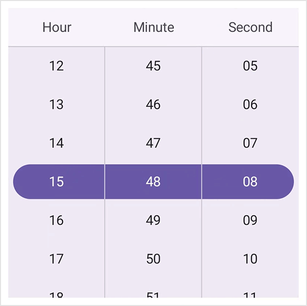
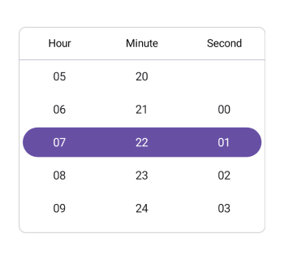

# Looping support in .NET MAUI Time Picker (SfTimePicker)

The [EnableLooping](https://help.syncfusion.com/cr/maui/Syncfusion.Maui.Picker.PickerBase.html#Syncfusion_Maui_Picker_PickerBase_EnableLooping) property allows you to enable looping support in the time picker control. With looping enabled, the control seamlessly navigates from the last item to the first item and back again, iterating in both forward and backward directions.

To enable the looping in time picker by setting the [EnableLooping](https://help.syncfusion.com/cr/maui/Syncfusion.Maui.Picker.PickerBase.html#Syncfusion_Maui_Picker_PickerBase_EnableLooping) property as `true`. The default value is `false`.





<picker:SfTimePicker x:Name="timePicker"
                     EnableLooping="True"/>



  

SfTimePicker timePicker = new SfTimePicker()
{
    EnableLooping = True,
};

this.Content = timePicker;





{:width="330" height="360"}

## Set selected time to the Time Picker

The SfTimePicker control allows you to select the time using the [SelectedTime](https://help.syncfusion.com/cr/maui/Syncfusion.Maui.Picker.SfTimePicker.html#Syncfusion_Maui_Picker_SfTimePicker_SelectedTime) property in the [SfTimePicker](https://help.syncfusion.com/cr/maui/Syncfusion.Maui.Picker.SfTimePicker.html). The default value of the `SelectedTime` is the current time.




<picker:SfTimePicker x:Name="picker" 
                     SelectedTime="07:22:01">
</picker:SfTimePicker>




SfTimePicker picker = new SfTimePicker()
{
    SelectedTime = new TimeSpan(07, 22, 01),
};

this.Content = picker;

  


## Clear selection

The .NET MAUI TimePicker provides clear selection support, allowing you to clear the selected time by setting the `SelectedTime` property to `null`.




<picker:SfTimePicker x:Name="picker" />




    this.picker.SelectedTime = null;

  
