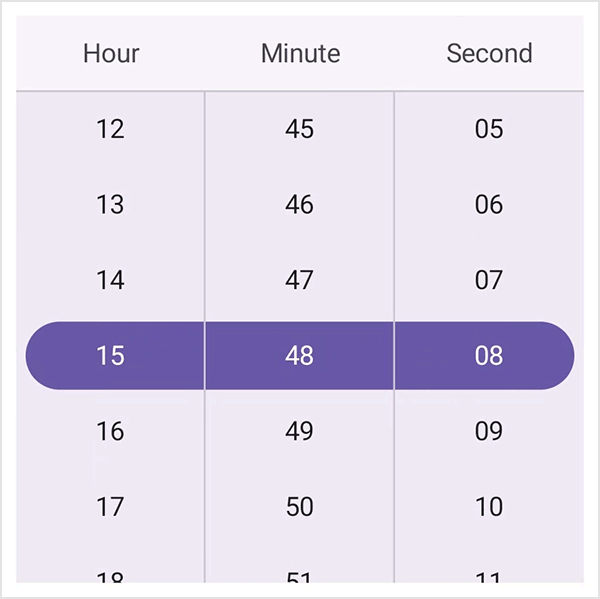
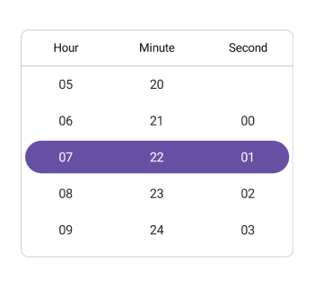

# Looping Support in .NET MAUI Time Picker

The [EnableLooping](https://help.syncfusion.com/cr/maui/Syncfusion.Maui.Picker.PickerBase.html#Syncfusion_Maui_Picker_PickerBase_EnableLooping) property allows you to enable looping support in the Time Picker control. With looping enabled, the control seamlessly navigates from the last item to the first item and back again, iterating in both forward and backward directions.

To enable looping in the Time Picker, set the [EnableLooping](https://help.syncfusion.com/cr/maui/Syncfusion.Maui.Picker.PickerBase.html#Syncfusion_Maui_Picker_PickerBase_EnableLooping) property to `true`. The default value is `false`.





<ContentPage xmlns="http://schemas.microsoft.com/dotnet/2021/maui"
             xmlns:x="http://schemas.microsoft.com/winfx/2009/xaml"
             xmlns:picker="clr-namespace:Syncfusion.Maui.Picker;assembly=Syncfusion.Maui.Picker">
    <picker:SfTimePicker x:Name="timePicker"
                         EnableLooping="True"/>
</ContentPage>





using Syncfusion.Maui.Picker;
. . .

SfTimePicker timePicker = new SfTimePicker()
{
    EnableLooping = true,
};

this.Content = timePicker;





{:width="330" height="360"}

## Set selected time to the Time Picker

The `SfTimePicker` control allows you to select the time using the [SelectedTime](https://help.syncfusion.com/cr/maui/Syncfusion.Maui.Picker.SfTimePicker.html#Syncfusion_Maui_Picker_SfTimePicker_SelectedTime) property, which is a nullable `TimeSpan?`. The default value is the current local time (`DateTime.Now.TimeOfDay`).




<ContentPage xmlns="http://schemas.microsoft.com/dotnet/2021/maui"
             xmlns:x="http://schemas.microsoft.com/winfx/2009/xaml"
             xmlns:picker="clr-namespace:Syncfusion.Maui.Picker;assembly=Syncfusion.Maui.Picker">
    <picker:SfTimePicker x:Name="picker"
                         SelectedTime="07:22:01">
    </picker:SfTimePicker>
</ContentPage>




using Syncfusion.Maui.Picker;
. . .

SfTimePicker picker = new SfTimePicker()
{
    SelectedTime = new TimeSpan(7, 22, 1),
};

this.Content = picker;




## Clear selection

The .NET MAUI Time Picker provides clear selection support, allowing you to clear the selected time by setting the `SelectedTime` property to `null`.




<ContentPage xmlns="http://schemas.microsoft.com/dotnet/2021/maui"
             xmlns:x="http://schemas.microsoft.com/winfx/2009/xaml"
             xmlns:picker="clr-namespace:Syncfusion.Maui.Picker;assembly=Syncfusion.Maui.Picker">
    <picker:SfTimePicker x:Name="picker" />
</ContentPage>




public partial class MainPage : ContentPage
{
    public MainPage()
    {
        InitializeComponent();
        this.picker.SelectedTime = null;
    }
}


