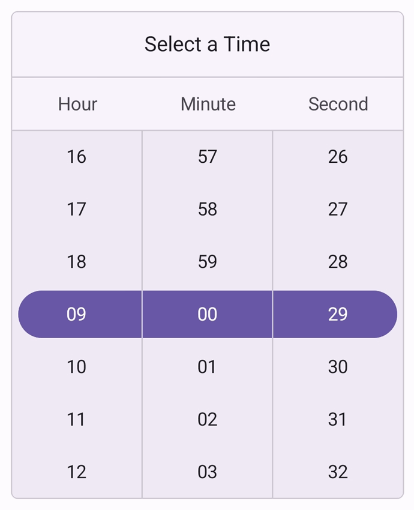

# Looping support in .NET MAUI Time Picker (SfTimePicker)

The [EnableLooping](https://help.syncfusion.com/cr/maui/Syncfusion.Maui.Picker.EnableLooping.html) property allows you to enable looping support in the time picker control. With looping enabled, the control seamlessly navigates from the last item to the first item and back again, iterating in both forward and backward directions.

To enable the looping in time picker by setting the [EnableLooping](https://help.syncfusion.com/cr/maui/Syncfusion.Maui.Picker.EnableLooping.html) property as `true`. The default value is `false`.





<picker:SfTimePicker x:Name="timePicker"
                     EnableLooping="True"/>



  

SfTimePicker timePicker = new SfTimePicker()
{
    EnableLooping = True,
};

this.Content = timePicker;





{:width="330" height="360"}