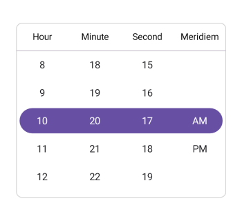

# Formatting in .NET MAUI Time Picker (SfTimePicker)

Format is a way to represent the time in a different string format. You can customize the time format using the [Format](https://help.syncfusion.com/cr/maui/Syncfusion.Maui.Picker.SfTimePicker.html#Syncfusion_Maui_Picker_SfTimePicker_Format) property in [PickerTimeFormat](https://help.syncfusion.com/cr/maui/Syncfusion.Maui.Picker.PickerTimeFormat.html). The default format is `HH_mm_ss`.

The different types of formats are:

[`H_mm`](https://help.syncfusion.com/cr/maui/Syncfusion.Maui.Picker.PickerTimeFormat.html#Syncfusion_Maui_Picker_PickerTimeFormat_H_mm) - Represents the hour minute in H_mm format.

[`H_mm_ss`](https://help.syncfusion.com/cr/maui/Syncfusion.Maui.Picker.PickerTimeFormat.html#Syncfusion_Maui_Picker_PickerTimeFormat_H_mm_ss) - Represents the hour minute second in H_mm_ss format.

[`h_mm_ss_tt`](https://help.syncfusion.com/cr/maui/Syncfusion.Maui.Picker.PickerTimeFormat.html#Syncfusion_Maui_Picker_PickerTimeFormat_h_mm_ss_tt) - Represents the hour minute second meridiem in h_mm_ss_tt format.

[`h_mm_tt`](https://help.syncfusion.com/cr/maui/Syncfusion.Maui.Picker.PickerTimeFormat.html#Syncfusion_Maui_Picker_PickerTimeFormat_h_mm_tt) - Represents the hour minute meridiem in h_mm_tt format.

[`HH_mm`](https://help.syncfusion.com/cr/maui/Syncfusion.Maui.Picker.PickerTimeFormat.html#Syncfusion_Maui_Picker_PickerTimeFormat_HH_mm) - Represents the hour minute in HH_mm format.

[`HH_mm_ss`](https://help.syncfusion.com/cr/maui/Syncfusion.Maui.Picker.PickerTimeFormat.html#Syncfusion_Maui_Picker_PickerTimeFormat_HH_mm_ss) - Represents the hour minute second in HH_mm_ss format.

[`HH_mm_ss_fff`](https://help.syncfusion.com/cr/maui/Syncfusion.Maui.Picker.PickerTimeFormat.html#Syncfusion_Maui_Picker_PickerTimeFormat_HH_mm_ss_fff) - Represents the hour minute second millisecond in HH_mm_ss_fff format.

[`hh_mm_ss_tt`](https://help.syncfusion.com/cr/maui/Syncfusion.Maui.Picker.PickerTimeFormat.html#Syncfusion_Maui_Picker_PickerTimeFormat_hh_mm_ss_tt) - Represents the hour minute second meridiem in hh_mm_ss_tt format.

[`hh_mm_ss_fff_tt`](https://help.syncfusion.com/cr/maui/Syncfusion.Maui.Picker.PickerTimeFormat.html#Syncfusion_Maui_Picker_PickerTimeFormat_hh_mm_ss_fff_tt) - Represents the hour minute second millisecond meridiem in hh_mm_ss_fff_tt format.

[`hh_mm_tt`](https://help.syncfusion.com/cr/maui/Syncfusion.Maui.Picker.PickerTimeFormat.html#Syncfusion_Maui_Picker_PickerTimeFormat_hh_mm_tt) - Represents the hour minute meridiem in hh_mm_tt format.

[`hh_tt`](https://help.syncfusion.com/cr/maui/Syncfusion.Maui.Picker.PickerTimeFormat.html#Syncfusion_Maui_Picker_PickerTimeFormat_hh_tt) - Represents the hour meridiem in hh_tt format.

[`ss_fff`](https://help.syncfusion.com/cr/maui/Syncfusion.Maui.Picker.PickerTimeFormat.html#Syncfusion_Maui_Picker_PickerTimeFormat_ss_fff) - Represents the second millisecond in ss_fff format.

[`mm_ss`](https://help.syncfusion.com/cr/maui/Syncfusion.Maui.Picker.PickerTimeFormat.html#Syncfusion_Maui_Picker_PickerTimeFormat_mm_ss) - Represents the minute second in mm_ss format.

[`mm_ss_fff`](https://help.syncfusion.com/cr/maui/Syncfusion.Maui.Picker.PickerTimeFormat.html#Syncfusion_Maui_Picker_PickerTimeFormat_mm_ss_fff) - Represents the minute second millisecond in mm_ss_fff format.

[`Default`](https://help.syncfusion.com/cr/maui/Syncfusion.Maui.Picker.PickerTimeFormat.html#Syncfusion_Maui_Picker_PickerTimeFormat_Default) - Represents the hour minute second meridiem in default culture based format.

The following example demonstrates the Time Picker with the custom format [PickerTimeFormat.hh_mm_ss_tt](https://help.syncfusion.com/cr/maui/Syncfusion.Maui.Picker.PickerTimeFormat.html#Syncfusion_Maui_Picker_PickerTimeFormat_h_mm_ss_tt)





<picker:SfTimePicker x:Name="timePicker" 
                     Format="hh_mm_ss_tt"/>



  

SfTimePicker timePicker = new SfTimePicker()
{
    Format = PickerTimeFormat.hh_mm_ss_tt;
};

this.Content = timePicker;





