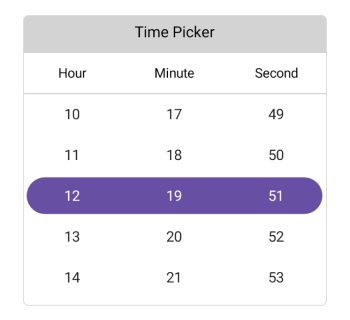
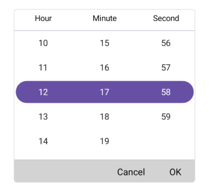
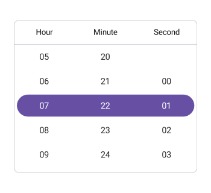

# Getting started with .NET MAUI Time Picker (SfTimePicker)
This section explains how to add the Time Picker control. It covers only the basic features needed to get started with the Syncfusion Time Picker.

## Creating an application using the .NET MAUI Time Picker

1. Create a new .NET MAUI application in Visual Studio.

2. Syncfusion .NET MAUI components are available on [nuget.org](https://www.nuget.org/). To add `SfTimePicker` to your project, open the NuGet package manager in Visual Studio, search for [Syncfusion.Maui.Picker](https://www.nuget.org/packages/Syncfusion.Maui.Picker), then install it.

3. To initialize the control, import the control namespace `Syncfusion.Maui.Picker` in XAML or C# code.

4. Initialize `SfTimePicker.`




<ContentPage   
    . . .
    xmlns:picker="clr-namespace:Syncfusion.Maui.Picker;assembly=Syncfusion.Maui.Picker">

    <picker:SfTimePicker />
</ContentPage>




using Syncfusion.Maui.Picker;
. . .

public partial class MainPage : ContentPage
{
    public MainPage()
    {
        InitializeComponent();
        SfTimePicker picker = new SfTimePicker();
        this.Content = picker;
    }
}




## Register the handler

The `Syncfusion.Maui.Core` NuGet is a dependent package for all Syncfusion controls of .NET MAUI. In the `MauiProgram.cs` file, register the handler for Syncfusion core.




using Syncfusion.Maui.Core.Hosting;
namespace GettingStarted
{
    public static class MauiProgram
    {
        public static MauiApp CreateMauiApp()
        {
            var builder = MauiApp.CreateBuilder();

            builder.ConfigureSyncfusionCore();
            builder
            .UseMauiApp<App>()
            .ConfigureFonts(fonts =>
            {
                fonts.AddFont("OpenSans-Regular.ttf", "OpenSansRegular");
                fonts.AddFont("Segoe-mdl2.ttf", "SegoeMDL2");
            });

            return builder.Build();
        }
    }
}




## Set header to the Time Picker

The SfTimePicker control allows you to add the header text by setting the [Text](https://help.syncfusion.com/cr/maui/Syncfusion.Maui.Picker.PickerHeaderView.html#Syncfusion_Maui_Picker_PickerHeaderView_Text) property in the [PickerHeaderView](https://help.syncfusion.com/cr/maui/Syncfusion.Maui.Picker.PickerHeaderView.html). Enable the header view by setting the [Height](https://help.syncfusion.com/cr/maui/Syncfusion.Maui.Picker.PickerHeaderView.html#Syncfusion_Maui_Picker_PickerHeaderView_HeightProperty) property in the [PickerHeaderView](https://help.syncfusion.com/cr/maui/Syncfusion.Maui.Picker.PickerHeaderView.html).




<picker:SfTimePicker x:Name="picker">
    <picker:SfTimePicker.HeaderView>
        <picker:PickerHeaderView Text="Time Picker" Height="40" />
    </picker:SfTimePicker.HeaderView>
</picker:SfTimePicker>




SfTimePicker picker = new SfTimePicker();
picker.HeaderView = new PickerHeaderView()
{
    Text = "Time Picker",
    Height = 40,
};

this.Content = picker;




   

## Set footer to the Time Picker

In the SfTimePicker control, validation buttons (OK and Cancel) can be customized by setting the [OkButtonText](https://help.syncfusion.com/cr/maui/Syncfusion.Maui.Picker.PickerFooterView.html#Syncfusion_Maui_Picker_PickerFooterView_OkButtonText) and [CancelButtonText](https://help.syncfusion.com/cr/maui/Syncfusion.Maui.Picker.PickerFooterView.html#Syncfusion_Maui_Picker_PickerFooterView_CancelButtonText) properties in the [PickerFooterView](https://help.syncfusion.com/cr/maui/Syncfusion.Maui.Picker.PickerFooterView.html). It allows you to confirm or cancel the selected time. The `OkButtonText` can be enabled using the [ShowOkButton](https://help.syncfusion.com/cr/maui/Syncfusion.Maui.Picker.PickerFooterView.html#Syncfusion_Maui_Picker_PickerFooterView_ShowOkButton) property in the [PickerFooterView](https://help.syncfusion.com/cr/maui/Syncfusion.Maui.Picker.PickerFooterView.html).




<picker:SfTimePicker x:Name="Picker">
    <picker:SfTimePicker.FooterView>
        <picker:PickerFooterView ShowOkButton="True" Height="40" />
    </picker:SfTimePicker.FooterView>
</picker:SfTimePicker>




SfTimePicker picker = new SfTimePicker();
picker.FooterView= new PickerFooterView()
{  
    ShowOkButton = true,
    Height = 40,
};

this.Content = picker;

  


   

## Set height and width to the Time Picker

The SfTimePicker control allows you to change the height and width by using the [HeightRequest] and [WidthRequest] properties in the [SfTimePicker](https://help.syncfusion.com/cr/maui/Syncfusion.Maui.Picker.SfTimePicker.html).




<picker:SfTimePicker x:Name="Picker" 
                    HeightRequest="280" 
                    WidthRequest="300">
</picker:SfTimePicker>




SfTimePicker picker = new SfTimePicker()
{
    HeightRequest = 280,
    WidthRequest = 300,
};

this.Content = picker;

  


   

## Set selected time to the Time Picker

The SfTimePicker control allows you to select the time using the [SelectedTime](https://help.syncfusion.com/cr/maui/Syncfusion.Maui.Picker.SfTimePicker.html#Syncfusion_Maui_Picker_SfTimePicker_SelectedTime) property in the [SfTimePicker](https://help.syncfusion.com/cr/maui/Syncfusion.Maui.Picker.SfTimePicker.html). The default value of the `SelectedTime` is the current time.




<picker:SfTimePicker x:Name="Picker" 
                     SelectedTime="07:22:01">
</picker:SfTimePicker>




SfTimePicker picker = new SfTimePicker()
{
    SelectedTime = new TimeSpan(07, 22, 01),
};

this.Content = picker;

  


   

## Clear selection

The .NET MAUI TimePicker provides clear selection support, allowing you to clear the selected time by setting the `SelectedTime` property to `null`.




<picker:SfTimePicker x:Name="Picker" />




    this.Picker.SelectedTime = null;

  
