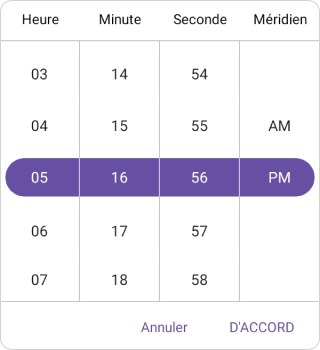
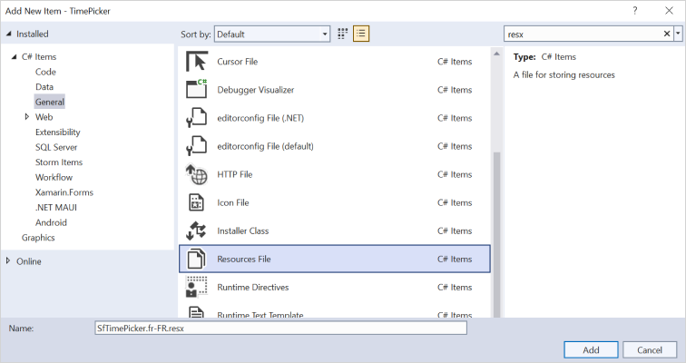
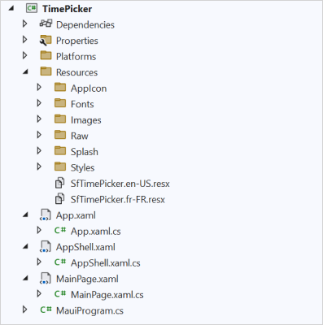

# Localization in .NET MAUI Time Picker (SfTimePicker)

Localization is the process of translating the application resources into different languages for specific cultures. The `SfTimePicker` can be localized by adding `resource` file. In `SfTimePicker`, provides support to localize the following strings

   * `Hour`
   * `Minute`
   * `Second`
   * `Meridiem`
   * `OK`
   * `Cancel`

## Setting CurrentUICulture to the application

The application's culture can be changed by setting `CurrentUICulture` in `App.xaml.cs` file.




using Syncfusion.Maui.Picker;
using System.Globalization;
using System.Resources;

namespace TimePicker;
public partial class App : Application
{
   public App()
   {
      InitializeComponent();
      CultureInfo.CurrentUICulture = new CultureInfo("fr-FR");
      //// ResXPath => Full path of the resx file; For example : //SfPickerResources.ResourceManager = new ResourceManager
      // ("TimePicker.Resources.SfTimePicker", Application.Current.GetType().Assembly);

      SfPickerResources.ResourceManager = new ResourceManager("ResxPath", Application.Current.GetType().Assembly);
      MainPage = new MainPage();
   }
}




   

N>
The required `resx` files with `Build Action` as `EmbeddedResource` (File name should contain culture code) into the `Resources` folder.

## Localize application level

To localize the `TimePicker` based on `CurrentUICulture` using `resource` files, follow the below steps.

   1. Create a new folder named `Resources` in the application.

   2. Right-click on the `Resources` folder, select `Add` and then `New Item.`

   3. In the Add New Item wizard, select the Resource File option and name the filename as `SfTimePicker.<culture name>.resx.` For example, name the file `SfTimePicker.fr-FR.resx` for French culture.

   4. The culture name indicates the language and country.

      

   5. Now, select the `Add` option to add the resource file in **Resources** folder.

      

   6. Add the Name/Value pair in Resource Designer of `SfTimePicker.fr-FR.resx` file and change its value to the corresponding culture.

   