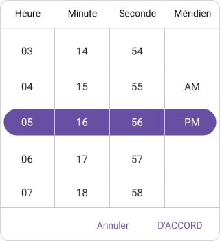
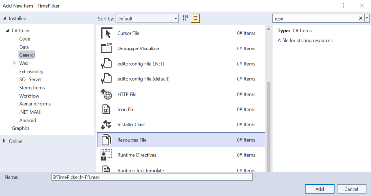
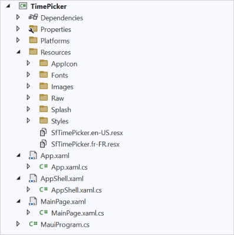
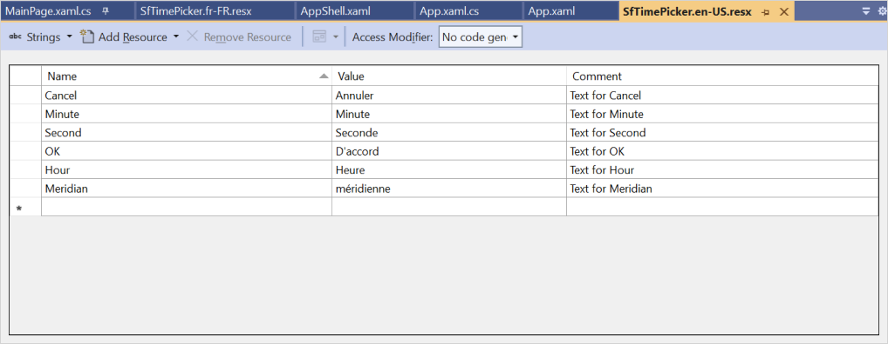

# Localization in .NET MAUI Time Picker (SfTimePicker)

Localization is the process of translating the application resources into different languages for specific cultures. The `SfTimePicker` can be localized by adding `resource` files. `SfTimePicker` provides support to localize the following strings:

* `Hour`
* `Minute`
* `Second`
* `Meridiem`
* `OK`
* `Cancel`

## Setting CurrentUICulture to the application

The application culture can be changed by setting `CurrentUICulture` in the `App.xaml.cs` file.




using Syncfusion.Maui.Core;
using Syncfusion.Maui.Picker;
using System.Globalization;
using System.Resources;

namespace TimePicker;
public partial class App : Application
{
	public App()
	{
		InitializeComponent();
		CultureInfo.CurrentUICulture = new CultureInfo("fr-FR");
      //// ResXPath => Full path of the resx file; For example : //SfPickerResources.ResourceManager = new ResourceManager
      // ("TimePicker.Resources.SfTimePicker", Application.Current.GetType().Assembly);

		SfPickerResources.ResourceManager = new ResourceManager("ResxPath", Application.Current.GetType().Assembly);
		MainPage = new MainPage();
	}
}




N>
The required `resx` files must have their `Build Action` set to `EmbeddedResource`, and the file name must contain the culture code. Place the files in the `Resources` folder.

## Localize application level

To localize the `SfTimePicker` based on `CurrentUICulture` using resource files, follow the steps below.

   1. Create a new folder named `Resources` in the application.

   2. Right-click on the `Resources` folder, select `Add`, and then choose `New Item`.

   3. In the `Add New Item` wizard, select the `Resource File` option and name the file `SfTimePicker.<culture name>.resx`. For example, use `SfTimePicker.fr-FR.resx` for French culture.

   4. The culture name indicates the language and country.

      

   5. Select `Add` to add the resource file to the `Resources` folder.

      

   6. Add a Name/Value pair in the Resource Designer of `SfTimePicker.fr-FR.resx` and change the value to the corresponding culture.

   