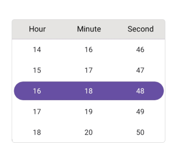
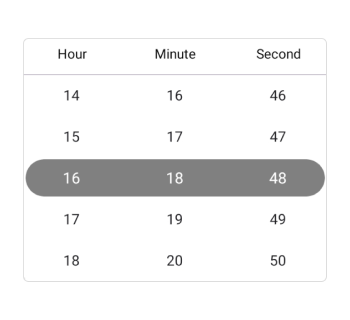
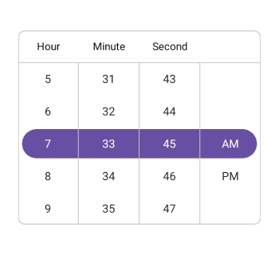
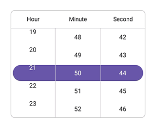

> **Notice**: After **Volume 3 2025 (Mid of Sep 2025)**, feature enhancements for this control will no longer be available in the Syncfusion® package. Please switch to the **Syncfusion® Toolkit for .NET MAUI** for continued support. For a smooth transition refer this [migration document](https://help.syncfusion.com/maui-toolkit/migration).

# Overview of .NET MAUI Time Picker (SfTimePicker)

Syncfusion&reg; .NET MAUI Time Picker (SfTimePicker) control allows you to select the time and visualize its items inside a popup or a drop-down UI element. The Time Picker also enables you to set time formats and customize its dialog appearance by configuring its header, footer, and more.

## Key features

* **Header view**: The Time Picker allows you to add and customize the header text.

   

* **Column header view**: The .NET MAUI Time Picker provides pre-defined column header text and also you can customize it.

   

* **Footer view**: Provides validation buttons (OK and Cancel) in the footer view. The footer text and background color can be customized.

   

* **Selection view**: The selection view is used to show the selected time, and it can be customized.

   

* **Time format**: Offers 9 predefined formats to represent the value of the time.

   

* **Picker mode**: Show the picker in a Popup with a dialog mode. The relative dialog mode is used to align the picker in a specific position.

   

* **Intervals**: The time values can be populated individually with intervals for hours, minutes, and seconds.

   

* **Picker interactions**: The .NET MAUI Time Picker allows you to select the times through tap and scroll interaction.

   