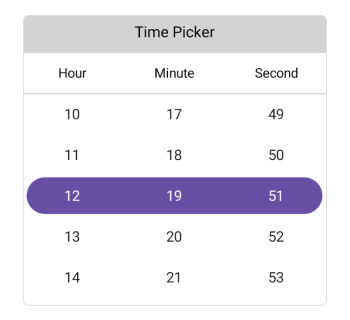
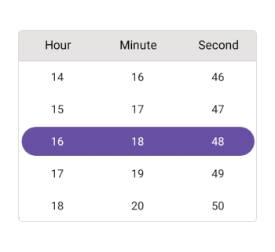
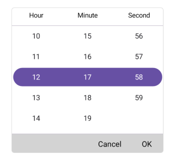
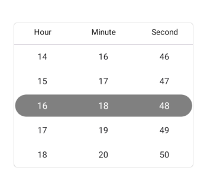
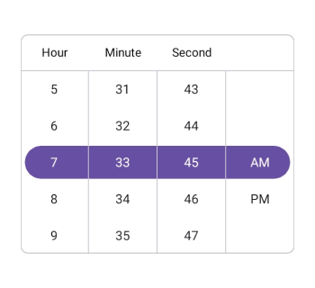
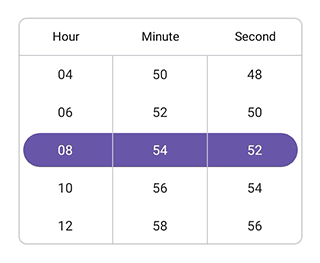
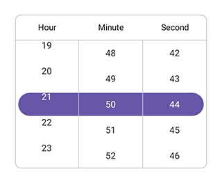

# Overview of .NET MAUI Time Picker (SfTimePicker)

Syncfusion&reg; .NET MAUI Time Picker (SfTimePicker) control allows you to select the time and visualize its items inside a popup or a drop-down UI element. The Time Picker also enables you to set time formats and customize its dialog appearance by configuring its header, footer, and more.

## Business use cases

- Scheduling applications that require time selection for appointments, meetings, or reminders.  
- Booking systems that allow users to choose available time slots efficiently.  
- Form-based applications that collect time inputs such as start and end times.  
- Business applications that require customizable time selection UI with validation and formatting. 

## Key features

- **Header view** allows adding and customizing header text for contextual information.

   

- **Column header** allows displaying and customizing labels for hours, minutes, and seconds.

   

- **Footer view** allows providing confirmation actions such as OK and Cancel with customizable appearance. 

   

- **Selection view** allows displaying the selected time clearly with configurable UI.  

   

- **Time format** allows presenting values in predefined formats for better readability.  

   

- **Picker mode** allows displaying the control in popup or dialog modes with flexible positioning. 

   

- **Interval** allows defining custom intervals for hours, minutes, and seconds.

   

- **User interaction** allows selecting time values through tap and scroll gestures. 

   
 

## Globalization

The following table summarizes the globalization support available in this control.

    
    Full Support

<table>
<tr>
<th align="center">Control</th>
<th align="center">Localization</th>
<th align="center">RTL</th>
<th align="center">Time zone</th>
<th align="center">Screen reader</th>
<th align="center">Keyboard navigation</th>
</tr>
<tr>
<td><a href="/maui/timepicker/overview">Time Picker</a></td>
<td align="center"></td>
<td align="center"></td>
<td align="center"></td>
<td align="center"></td>
<td align="center"></td>
</tr> 
</table>

## Related controls

- [Date Picker](https://help.syncfusion.com/maui/datepicker/overview) for selecting date values in applications.  
- [DateTime Picker](https://help.syncfusion.com/maui/datetimepicker/overview) for selecting combined date and time values.  
- [Picker](https://help.syncfusion.com/maui/picker/overview) for general-purpose item selection.  

## See Also

Explore further resources:

- [Getting Started](https://help.syncfusion.com/maui/timepicker/getting-started) shows a step‑by‑step guide to begin using the Time Picker control.  
- [Customization](https://help.syncfusion.com/maui/timepicker/customizations) explains how to customize layout and appearance.  
- [Formatting](https://help.syncfusion.com/maui/timepicker/formatting) helps configure time formats and intervals.  
- [UI Kit](https://www.syncfusion.com/demos/maui#maui-ui-control) provides interactive demos and ready‑made UI examples.

## Resources

<!-- Card 1 -->
<a href="https://www.syncfusion.com/maui-controls/maui-timepicker" class="form-card" target="_blank">
  

    <h3 class="form-title">Feature Tour</h3>
    

      Walk through highlights and core capabilities.
    

  

</a>
<!-- Card 2 -->
<a href="https://github.com/syncfusion/maui-demos/tree/master/MAUI/Picker" class="form-card" target="_blank">
  

    <h3 class="form-title">Showcase Samples</h3>
    

      Explore sample scenarios for real apps.
    

  

</a>
<!-- Card 3 -->
<a href="https://www.syncfusion.com/tutorial-videos/maui/time-picker" class="form-card" target="_blank">
  

    <h3 class="form-title">Tutorial Videos</h3>
    

      Step‑by‑step guidance through video tutorials.
    

  

</a>
<!-- Card 4 -->
<a href="https://support.syncfusion.com/kb/cross-platforms/category/76" class="form-card" target="_blank">
  

    <h3 class="form-title">Explore KB's</h3>
    

      Find quick solutions and step‑by‑step guidance.
    

  

</a>
<!-- Card 5 -->
<a href="https://www.syncfusion.com/blogs/category/net-maui" class="form-card" target="_blank">
  

    <h3 class="form-title">Explore Blogs</h3>
    

      Read insights, tutorials, and developer journeys.
    

  

</a>
