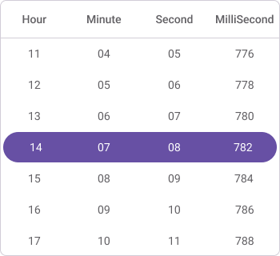

# Time Interval in .NET MAUI Time Picker(SfTimePicker)

The `SfTimePicker` provides three intervals in [.NET MAUI Time Picker](https://www.syncfusion.com/maui-controls/maui-timepicker).

 * [`HourInterval`](https://help.syncfusion.com/cr/maui/Syncfusion.Maui.Picker.SfTimePicker.html#Syncfusion_Maui_Picker_SfTimePicker_HourInterval)
 * [`MinuteInterval`](https://help.syncfusion.com/cr/maui/Syncfusion.Maui.Picker.SfTimePicker.html#Syncfusion_Maui_Picker_SfTimePicker_MinuteInterval)
 * [`SecondInterval`](https://help.syncfusion.com/cr/maui/Syncfusion.Maui.Picker.SfTimePicker.html#Syncfusion_Maui_Picker_SfTimePicker_SecondInterval)
  * [`MilliSecondInterval`](https://help.syncfusion.com/cr/maui/Syncfusion.Maui.Picker.SfTimePicker.html#Syncfusion_Maui_Picker_SfTimePicker_MilliSecondInterval)

## Hour interval

Time Picker provides an option to give an interval between hours using the [HourInterval](https://help.syncfusion.com/cr/maui/Syncfusion.Maui.Picker.SfTimePicker.html#Syncfusion_Maui_Picker_SfTimePicker_HourInterval) property of [SfTimePicker](https://help.syncfusion.com/cr/maui/Syncfusion.Maui.Picker.SfTimePicker.html).





<picker:SfTimePicker x:Name="timePicker"
                     HourInterval="2"/>



  

SfTimePicker timePicker = new SfTimePicker()
{
    HourInterval = 2
};

this.Content = timePicker;





## Minute interval

Time Picker provides an option to give an interval between minutes using the [MinuteInterval](https://help.syncfusion.com/cr/maui/Syncfusion.Maui.Picker.SfTimePicker.html#Syncfusion_Maui_Picker_SfTimePicker_MinuteInterval) property of [SfTimePicker](https://help.syncfusion.com/cr/maui/Syncfusion.Maui.Picker.SfTimePicker.html).





<picker:SfTimePicker x:Name="timePicker"
                     MinuteInterval="2"/>



  

SfTimePicker timePicker = new SfTimePicker()
{
    MinuteInterval = 2
};

this.Content = timePicker;





## Second interval

Time Picker provides an option to give an interval between seconds using the [SecondInterval](https://help.syncfusion.com/cr/maui/Syncfusion.Maui.Picker.SfTimePicker.html#Syncfusion_Maui_Picker_SfTimePicker_SecondInterval) property of [SfTimePicker](https://help.syncfusion.com/cr/maui/Syncfusion.Maui.Picker.SfTimePicker.html).





<picker:SfTimePicker x:Name="timePicker"
                     SecondInterval="2"/>



  

SfTimePicker timePicker = new SfTimePicker()
{
    SecondInterval = 2
};

this.Content = timePicker;





## MilliSecond interval

Time Picker provides an option to give an interval between milliseconds using the [MilliSecondInterval](https://help.syncfusion.com/cr/maui/Syncfusion.Maui.Picker.SfTimePicker.html#Syncfusion_Maui_Picker_SfTimePicker_MilliSecondInterval) property of [SfTimePicker](https://help.syncfusion.com/cr/maui/Syncfusion.Maui.Picker.SfTimePicker.html).





<picker:SfTimePicker x:Name="timePicker"
                     MilliSecondInterval="2"/>



  

SfTimePicker timePicker = new SfTimePicker()
{
    MilliSecondInterval = 2
};

this.Content = timePicker;





