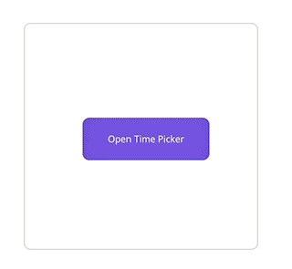
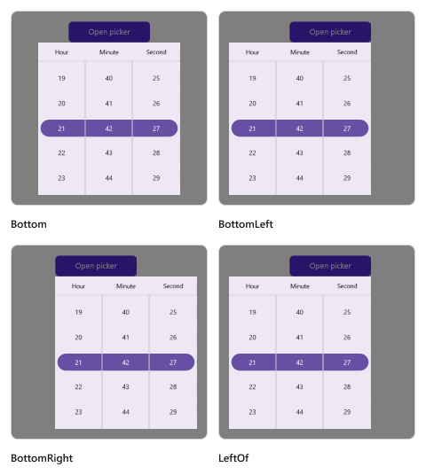
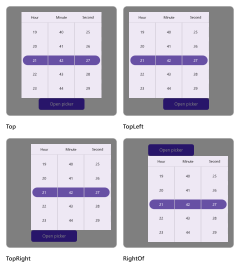

# Time Picker mode in .NET MAUI Time Picker (SfTimePicker)

The Time picker mode is specified in the picker property enumeration, which is used to display the time picker based on the modes. It offers three modes: `Default`, `Dialog`, and `RelativeDialog`. The default picker mode is `Default` in the [SfTimePicker](https://help.syncfusion.com/cr/maui/Syncfusion.Maui.Picker.SfTimePicker.html).

## Dialog Mode

The dialog mode is used to display the time picker in a pop-up by setting the [Mode](https://help.syncfusion.com/cr/maui/Syncfusion.Maui.Picker.PickerBase.html#Syncfusion_Maui_Picker_PickerBase_Mode) property to [`Dialog`](https://help.syncfusion.com/cr/maui/Syncfusion.Maui.Picker.PickerMode.html#Syncfusion_Maui_Picker_PickerMode_Dialog) in [SfTimePicker](https://help.syncfusion.com/cr/maui/Syncfusion.Maui.Picker.SfTimePicker.html).





<picker:SfTimePicker x:Name="timePicker"
                     Mode="Dialog"/>





SfTimePicker timePicker = new SfTimePicker()
{
    Mode = PickerMode.Dialog
};

this.Content = timePicker;





The Time Picker can be opened programmatically by setting the [IsOpen](https://help.syncfusion.com/cr/maui/Syncfusion.Maui.Picker.PickerBase.html#Syncfusion_Maui_Picker_PickerBase_IsOpen) property to `true` of [SfTimePicker](https://help.syncfusion.com/cr/maui/Syncfusion.Maui.Picker.SfTimePicker.html). By default, the `IsOpen` property is `false`.

Note: This property is automatically changed to `false` when you close the dialog by clicking outside of it.





<Grid>
    <picker:SfTimePicker x:Name="timePicker"
                         Mode="Dialog"/>
    <Button Text="Open Picker" 
            x:Name="pickerButton"
            Clicked="Button_Clicked"
            HorizontalOptions="Center"
            VerticalOptions="Center"
            HeightRequest="50" 
            WidthRequest="150">
    </Button>
</Grid>





private void Button_Clicked(object sender, System.EventArgs e)
{
    this.timePicker.IsOpen = true;
}





   

## Relative Dialog Mode

The relative dialog mode displays the time picker in a pop-up by setting the [Mode](https://help.syncfusion.com/cr/maui/Syncfusion.Maui.Picker.PickerBase.html#Syncfusion_Maui_Picker_PickerBase_Mode) property to [RelativeDialog](https://help.syncfusion.com/cr/maui/Syncfusion.Maui.Picker.PickerMode.html#Syncfusion_Maui_Picker_PickerMode_RelativeDialog). It is used to align the picker in a specific position. You can set the position by setting the [RelativePosition](https://help.syncfusion.com/cr/maui/Syncfusion.Maui.Picker.PickerBase.html#Syncfusion_Maui_Picker_PickerBase_RelativePosition) property in the [SfTimePicker](https://help.syncfusion.com/cr/maui/Syncfusion.Maui.Picker.SfTimePicker.html).

### Relative position

The [RelativePosition](https://help.syncfusion.com/cr/maui/Syncfusion.Maui.Picker.PickerBase.html#Syncfusion_Maui_Picker_PickerBase_RelativePosition) is specified in the picker property enumeration, which is used to align the picker in a specific position accepts the following values. The default relative position is [AlignTop](https://help.syncfusion.com/cr/maui/Syncfusion.Maui.Picker.PickerRelativePosition.html#Syncfusion_Maui_Picker_PickerRelativePosition_AlignTop) in the [SfTimePicker](https://help.syncfusion.com/cr/maui/Syncfusion.Maui.Picker.SfTimePicker.html).
* [AlignTop](https://help.syncfusion.com/cr/maui/Syncfusion.Maui.Picker.PickerRelativePosition.html#Syncfusion_Maui_Picker_PickerRelativePosition_AlignTop) - Above the relative view, horizontally aligned to its center.
* [AlignToLeftOf](https://help.syncfusion.com/cr/maui/Syncfusion.Maui.Picker.PickerRelativePosition.html#Syncfusion_Maui_Picker_PickerRelativePosition_AlignToLeftOf) - To the left of the relative view, vertically aligned to its center.
* [AlignToRightOf](https://help.syncfusion.com/cr/maui/Syncfusion.Maui.Picker.PickerRelativePosition.html#Syncfusion_Maui_Picker_PickerRelativePosition_AlignToRightOf) - To the right of the relative view, vertically aligned to its center.
* [AlignBottom](https://help.syncfusion.com/cr/maui/Syncfusion.Maui.Picker.PickerRelativePosition.html#Syncfusion_Maui_Picker_PickerRelativePosition_AlignBottom) - Below the relative view, horizontally aligned to its center.
* [AlignTopLeft](https://help.syncfusion.com/cr/maui/Syncfusion.Maui.Picker.PickerRelativePosition.html#Syncfusion_Maui_Picker_PickerRelativePosition_AlignTopLeft) - Above and to the left of the relative view.
* [AlignTopRight](https://help.syncfusion.com/cr/maui/Syncfusion.Maui.Picker.PickerRelativePosition.html#Syncfusion_Maui_Picker_PickerRelativePosition_AlignTopRight) - Above and to the right of the relative view.
* [AlignBottomLeft](https://help.syncfusion.com/cr/maui/Syncfusion.Maui.Picker.PickerRelativePosition.html#Syncfusion_Maui_Picker_PickerRelativePosition_AlignBottomLeft) - Below and to the left of the relative view.
* [AlignBottomRight](https://help.syncfusion.com/cr/maui/Syncfusion.Maui.Picker.PickerRelativePosition.html#Syncfusion_Maui_Picker_PickerRelativePosition_AlignBottomRight) - Below and to the right of the relative view.

The Time Picker can be opened programmatically by setting the [`IsOpen`](https://help.syncfusion.com/cr/maui/Syncfusion.Maui.Picker.PickerBase.html#Syncfusion_Maui_Picker_PickerBase_IsOpen) property to `true` of [SfTimePicker](https://help.syncfusion.com/cr/maui/Syncfusion.Maui.Picker.SfTimePicker.html). By default, the `IsOpen` property is `false`.

Note: This property is automatically changed to `false` when you close the dialog by clicking outside of it.





<Grid>
    <picker:SfTimePicker x:Name="timePicker" 
                         Mode="RelativeDialog"
                         RelativePosition="AlignTopLeft">
    </picker:SfTimePicker>
    <Button Text="Open picker" 
            x:Name="pickerButton"
            Clicked="Button_Clicked"
            HorizontalOptions="Center"
            VerticalOptions="Center"
            HeightRequest="50" 
            WidthRequest="150">
    </Button>
</Grid>





private void Button_Clicked(object sender, System.EventArgs e)
{
    this.timePicker.IsOpen = true;
}





### Relative view

The [RelativeView](https://help.syncfusion.com/cr/maui/Syncfusion.Maui.Picker.PickerBase.html#Syncfusion_Maui_Picker_PickerBase_RelativeView) is specified in the picker's property enumeration and is used to display the picker dialog relative to a view by setting the [Mode](https://help.syncfusion.com/cr/maui/Syncfusion.Maui.Picker.PickerBase.html#Syncfusion_Maui_Picker_PickerBase_Mode) property to [RelativeDialog](https://help.syncfusion.com/cr/maui/Syncfusion.Maui.Picker.PickerMode.html#Syncfusion_Maui_Picker_PickerMode_RelativeDialog). You can set the position by setting the [RelativePosition](https://help.syncfusion.com/cr/maui/Syncfusion.Maui.Picker.PickerBase.html#Syncfusion_Maui_Picker_PickerBase_RelativePosition) property in the [SfTimePicker](https://help.syncfusion.com/cr/maui/Syncfusion.Maui.Picker.SfTimePicker.html).

N> It is only applicable in `RelativeDialog` mode. If `no relative view` is specified, the picker base will be set as the `default` relative view.





<Grid>
    <picker:SfTimePicker x:Name="timePicker" 
                         Mode="RelativeDialog"
                         RelativePosition="AlignTopLeft"
                         RelativeView = "{x:Reference pickerButton}">
    </picker:SfTimePicker>
    <Button Text="Open picker" 
            x:Name="pickerButton"
            Clicked="Button_Clicked"
            HorizontalOptions="Center"
            VerticalOptions="Center"
            HeightRequest="50" 
            WidthRequest="150">
    </Button>
</Grid>





private void Button_Clicked(object sender, System.EventArgs e)
{
    this.timePicker.IsOpen = true;
    this.timePicker.RelativeView = pickerButton;
}





   

   

### Custom Popup Size

SfTimePicker allows the display of the popup to render at any desired size by setting the [PopupWidth](https://help.syncfusion.com/cr/maui/Syncfusion.Maui.Picker.PickerBase.html#Syncfusion_Maui_Picker_PickerBase_PopupWidth) and [PopupHeight](https://help.syncfusion.com/cr/maui/Syncfusion.Maui.Picker.PickerBase.html#Syncfusion_Maui_Picker_PickerBase_PopupHeight) properties.





<picker:SfTimePicker x:Name="timePicker" 
                         Mode="Dialog"
                         PopupWidth="300"
                         PopupHeight="400"/>





this.timePicker.PopupWidth = 300;
this.timePicker.PopupHeight = 400;

 


