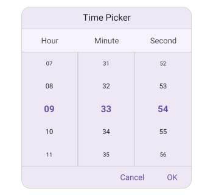
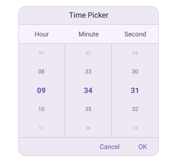

# Time Picker Text display mode in .NET MAUI Picker (SfTimePicker)

The time picker text display mode is specified in the time picker property enumeration, which is used to display the time picker items based on the modes. It offers four modes: `Default`, `Fade`, `Shrink` and `FadeAndShrink`. The default time picker text display mode is `Default` in the `SfTimePicker`.

## Fade Mode

The fade mode in the time picker gradually decreases the visibility of unselected items relative to the selected item. This effect is achieved by setting the `TextDisplayMode` property to `Fade` in `SfTimePicker`.





<timePicker:SfTimePicker x:Name="timePicker"
                 TextDisplayMode="Fade"/>





SfTimePicker timePicker = new SfTimePicker()
{
    TextDisplayMode = PickerTextDisplayMode.Fade
};

this.Content = timePicker;





## Shrink Mode

The shrink mode is used to display the font size of time picker items decreased from the selected item by setting the `TextDisplayMode` property to `Shrink` in `SfTimePicker`.





<timePicker:SfTimePicker x:Name="timePicker"
                 TextDisplayMode="Shrink"/>





SfTimePicker timePicker = new SfTimePicker()
{
    TextDisplayMode = PickerTextDisplayMode.Shrink
};

this.Content = timePicker;





## FadeAndShrink Mode

The fade and shrink mode are used to decrease the opacity and font size of time picker items from the selected item by setting the `TextDisplayMode` property to `FadeAndShrink` in `SfTimePicker`.





<timePicker:SfTimePicker x:Name="timePicker"
                 TextDisplayMode="FadeAndShrink"/>





SfTimePicker timePicker = new SfTimePicker()
{
    TextDisplayMode = PickerTextDisplayMode.FadeAndShrink
};

this.Content = timePicker;





