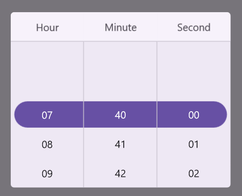
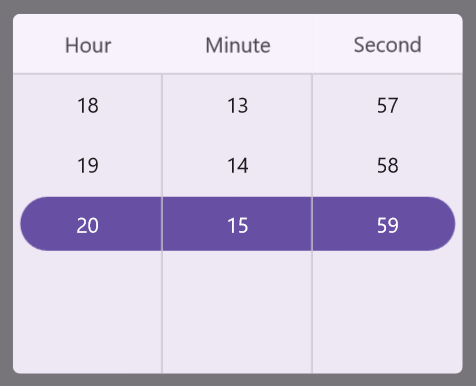

---
layout: post
title: Time Restriction in .NET MAUI Time Picker Control | Syncfusion
description: Learn about time restriction support in Syncfusion .NET MAUI Time Picker (SfTImePicker) control and its basic features.
platform: maui
control: SfTimePicker
documentation: ug
---  

# Time restriction in .NET MAUI Time Picker (SfTimePicker)

## Minimum Time

The time picker provides an option to restrict the selection of time items using the [MinimumTime]() property. This ensures that times beyond the specified minimum time range cannot be selected. The `MinimumTime` value must be less than the `MaximumTime` value. When setting the minimum time, only the hour and minute components are considered.




<picker:SfTimePicker x:Name="Picker"
                     MinimumTime="7:40:0">
</picker:SfTimePicker>




SfTimePicker picker = new SfTimePicker();
picker.MinimumTime = new TimeSpan(7, 40, 0);
this.Content = picker;

  


## Maximum Time

The time picker provides an option to restrict the selection of time items using the [MaximumTime]() property. This ensures that times beyond the specified minimum time range cannot be selected. The `MaximumTime` value must be higher than the `MinimumTime` value. When setting the minimum time, only the hour and minute components are considered.




<picker:SfTimePicker x:Name="Picker"
                     MaximumTime="20:15:0">
</picker:SfTimePicker>




SfTimePicker picker = new SfTimePicker();
picker.MaximumTime = new TimeSpan(20, 15, 0);
this.Content = picker;

  


