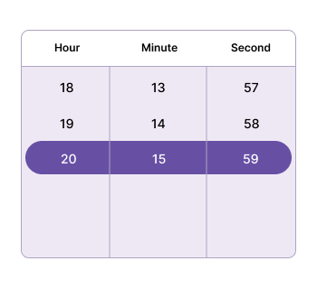

---
layout: post
title: Time Restriction in .NET MAUI Time Picker Control | Syncfusion
description: Learn about time restriction support in Syncfusion .NET MAUI Time Picker (SfTImePicker) control and its basic features.
platform: maui
control: SfTimePicker
documentation: ug
---  

# Time Restriction in .NET MAUI Time Picker (SfTimePicker)

## Minimum Time

The Time picker provides an option to restrict the selection of Time items by using the [MinimumTime]() property in [SfTimePicker](), and you cannot select the times beyond the minimum time range. The MinimumTime value has to be lesser than the MaximumTime value.




<picker:SfTimePicker x:Name="Picker"
                     MinimumTime="7:40:10">
</picker:SfTimePicker>




SfTiePicker picker = new SfTimePicker();
picker.MinimumTime = new TimeSpan(7, 40, 10);
this.Content = picker;

  


## Maximum Time

The Timer picker provides an option to restrict the selection of time items by using the [MaximumTime]() property in [SfTimePicker](), and you cannot select the times beyond the maximum time range.




<picker:SfTimePicker x:Name="Picker"
                     MaximumTime="20:15:30">
</picker:SfTimePicker>




SfTimePicker picker = new SfTimePicker();
picker.MaximumTime = new TimeSpan(20, 15, 30);
this.Content = picker;

  


