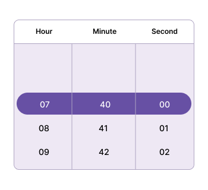

---
layout: post
title: Time Restriction in .NET MAUI Time Picker Control | Syncfusion&reg;
description: Learn about time restriction support in Syncfusion&reg; .NET MAUI Time Picker (SfTImePicker) control and its basic features.
platform: maui
control: SfTimePicker
documentation: ug
---  

# Time restriction in .NET MAUI Time Picker (SfTimePicker)

## Minimum Time

The time picker provides an option to restrict the selection of time items using the [MinimumTime](https://help.syncfusion.com/cr/maui/Syncfusion.Maui.Picker.SfTimePicker.html#Syncfusion_Maui_Picker_SfTimePicker_MinimumTime) property. This ensures that times beyond the specified minimum time range cannot be selected. The `MinimumTime` value must be less than the `MaximumTime` value. When setting the minimum time, only the hour and minute components are considered.




<picker:SfTimePicker x:Name="picker"
                     MinimumTime="7:40:0">
</picker:SfTimePicker>




SfTimePicker picker = new SfTimePicker();
picker.MinimumTime = new TimeSpan(7, 40, 0);
this.Content = picker;

  


## Maximum Time

The time picker provides an option to restrict the selection of time items using the [MaximumTime](https://help.syncfusion.com/cr/maui/Syncfusion.Maui.Picker.SfTimePicker.html#Syncfusion_Maui_Picker_SfTimePicker_MaximumTime) property. This ensures that times beyond the specified minimum time range cannot be selected. The `MaximumTime` value must be higher than the `MinimumTime` value. When setting the minimum time, only the hour and minute components are considered.




<picker:SfTimePicker x:Name="picker"
                     MaximumTime="20:15:0">
</picker:SfTimePicker>




SfTimePicker picker = new SfTimePicker();
picker.MaximumTime = new TimeSpan(20, 15, 0);
this.Content = picker;

  


## Blackout Times

The [BlackoutTimes](https://help.syncfusion.com/cr/maui/Syncfusion.Maui.Picker.SfTimePicker.html#Syncfusion_Maui_Picker_SfTimePicker_BlackoutTimes) property in the [SfTimePicker](https://help.syncfusion.com/cr/maui/Syncfusion.Maui.Picker.SfTimePicker.html) component enables you to limit the selection of certain times. You can specify a set of times to disable, preventing users from choosing those times. This feature is helpful for managing availability, such as excluding specific hours of the day.




<picker:SfTimePicker x:Name="picker">
    <picker:SfTimePicker.BlackoutTimes>
        <x:TimeSpan>12:28:00</x:TimeSpan>
        <x:TimeSpan>12:26:00</x:TimeSpan>
        <x:TimeSpan>12:24:00</x:TimeSpan>
        <x:TimeSpan>12:22:00</x:TimeSpan>
        <x:TimeSpan>12:37:00</x:TimeSpan>
        <x:TimeSpan>12:35:00</x:TimeSpan>
        <x:TimeSpan>12:33:00</x:TimeSpan>
        <x:TimeSpan>12:32:00</x:TimeSpan>
    </picker:SfTimePicker.BlackoutTimes>
</picker:SfTimePicker>




SfTimePicker picker = new SfTimePicker();
picker.BlackoutTimes.Add(new TimeSpan(12, 28, 0));
picker.BlackoutTimes.Add(new TimeSpan(12, 26, 0));
picker.BlackoutTimes.Add(new TimeSpan(12, 24, 0));
picker.BlackoutTimes.Add(new TimeSpan(12, 22, 0));
picker.BlackoutTimes.Add(new TimeSpan(12, 37, 0));
picker.BlackoutTimes.Add(new TimeSpan(12, 35, 0));
picker.BlackoutTimes.Add(new TimeSpan(12, 33, 0));
picker.BlackoutTimes.Add(new TimeSpan(12, 32, 0));
this.Content = picker;

  


N> The `Selection View` will not be applicable when setting `Blackout times`.