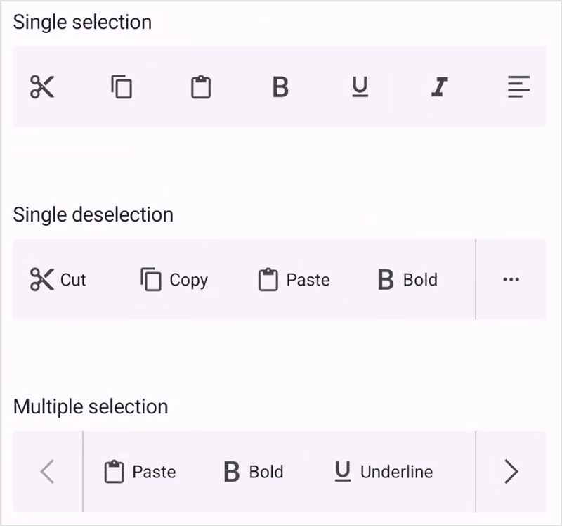

# Selection Mode in .NET MAUI Toolbar (SfToolbar)

The Selection mode is specified in the Toolbar property enumeration. You can select the toolbar item by tapping the item in the toolbar. SfToolbar provides three types of modes such as Single, SingleDeselect, and Multiple. The default SelectionMode is Single, which allows the user to select only one item at a time.

## Single Selection

The Single selection can be performed in the Toolbar by setting the ToolbarSelectionMode property to Single. In this selection, you can select a single item at a time in the toolbar.




<toolbar:SfToolbar x:Name="Toolbar" HeightRequest="56" SelectionMode="Single">
        <toolbar:SfToolbar.Items>
            <toolbar:SfToolbarItem Name="Bold">
                <toolbar:SfToolbarItem.Icon>
                    <FontImageSource Glyph="&#xE770;"
                                FontFamily="MauiMaterialAssets" />
                </toolbar:SfToolbarItem.Icon>
            </toolbar:SfToolbarItem>
            <toolbar:SfToolbarItem Name="Underline">
                <toolbar:SfToolbarItem.Icon>
                    <FontImageSource Glyph="&#xE762;"
                                FontFamily="MauiMaterialAssets" />
                </toolbar:SfToolbarItem.Icon>
            </toolbar:SfToolbarItem>
            <toolbar:SfToolbarItem Name="Italic">
                <toolbar:SfToolbarItem.Icon>
                    <FontImageSource Glyph="&#xE771;"
                                FontFamily="MauiMaterialAssets" />
                </toolbar:SfToolbarItem.Icon>
            </toolbar:SfToolbarItem>
            <toolbar:SfToolbarItem Name="AlignLeft">
                <toolbar:SfToolbarItem.Icon>
                    <FontImageSource Glyph="&#xE751;"
                                FontFamily="MauiMaterialAssets" />
                </toolbar:SfToolbarItem.Icon>
            </toolbar:SfToolbarItem>
            <toolbar:SfToolbarItem Name="AlignRight">
                <toolbar:SfToolbarItem.Icon>
                    <FontImageSource Glyph="&#xE753;"
                    FontFamily="MauiMaterialAssets" />
                </toolbar:SfToolbarItem.Icon>
            </toolbar:SfToolbarItem>
            <toolbar:SfToolbarItem Name="AlignCenter">
                <toolbar:SfToolbarItem.Icon>
                    <FontImageSource Glyph="&#xE752;"
                    FontFamily="MauiMaterialAssets" />
                </toolbar:SfToolbarItem.Icon>
            </toolbar:SfToolbarItem>
            <toolbar:SfToolbarItem Name="AlignJustify">
                <toolbar:SfToolbarItem.Icon>
                    <FontImageSource Glyph="&#xE74F;"
                    FontFamily="MauiMaterialAssets" />
                </toolbar:SfToolbarItem.Icon>
            </toolbar:SfToolbarItem>
        </toolbar:SfToolbar.Items>
    </toolbar:SfToolbar>




using Syncfusion.Maui.Toolbar;

namespace ToolbarSample
{
    public partial class MainPage : ContentPage
    {
        public MainPage()
        {
            InitializeComponent();
            SfToolbar toolbar = new SfToolbar();
            toolbar.HeightRequest = 56;
            toolbar.Selection = ToolbarSelectionMode.Single;
            ObservableCollection<BaseToolbarItem> itemCollection = new ObservableCollection<BaseToolbarItem>
            {
                new SfToolbarItem
                {
                    Name = "Bold",
                    Icon = new FontImageSource { Glyph = "\uE770", FontFamily = "MauiMaterialAssets" }
                },
                new SfToolbarItem
                {
                    Name = "Underline",
                    Icon = new FontImageSource { Glyph = "\uE762", FontFamily = "MauiMaterialAssets" }
                },
                new SfToolbarItem
                {
                    Name = "Italic",
                    Icon = new FontImageSource { Glyph = "\uE771", FontFamily = "MauiMaterialAssets" }
                },
                new SfToolbarItem
                {
                    Name = "AlignLeft",
                    Icon = new FontImageSource { Glyph = "\uE751", FontFamily = "MauiMaterialAssets" }
                },
                new SfToolbarItem
                {
                    Name = "AlignRight",
                    Icon = new FontImageSource { Glyph = "\uE753", FontFamily = "MauiMaterialAssets" }
                },
                new SfToolbarItem
                {
                    Name = "AlignCenter",
                    Icon = new FontImageSource { Glyph = "\uE752", FontFamily = "MauiMaterialAssets" }
                },
                new SfToolbarItem
                {
                    Name = "AlignJustify",
                    Icon = new FontImageSource { Glyph = "\uE74F", FontFamily = "MauiMaterialAssets" }
                }
            };
            toolbar.Items = itemCollection;
            this.Content = toolbar;
        }
    }
}





## Single Deselection

The Single Deselection can be performed in the Toolbar by setting the ToolbarSelectionMode property to SingleDeselect. In this selection, you can clear the selection by click the selected item.




<toolbar:SfToolbar x:Name="Toolbar" HeightRequest="56" SelectionMode="SingleDeselect">
        <toolbar:SfToolbar.Items>
            <toolbar:SfToolbarItem Name="Bold">
                <toolbar:SfToolbarItem.Icon>
                    <FontImageSource Glyph="&#xE770;"
                                FontFamily="MauiMaterialAssets" />
                </toolbar:SfToolbarItem.Icon>
            </toolbar:SfToolbarItem>
            <toolbar:SfToolbarItem Name="Underline">
                <toolbar:SfToolbarItem.Icon>
                    <FontImageSource Glyph="&#xE762;"
                                FontFamily="MauiMaterialAssets" />
                </toolbar:SfToolbarItem.Icon>
            </toolbar:SfToolbarItem>
            <toolbar:SfToolbarItem Name="Italic">
                <toolbar:SfToolbarItem.Icon>
                    <FontImageSource Glyph="&#xE771;"
                                FontFamily="MauiMaterialAssets" />
                </toolbar:SfToolbarItem.Icon>
            </toolbar:SfToolbarItem>
            <toolbar:SfToolbarItem Name="AlignLeft">
                <toolbar:SfToolbarItem.Icon>
                    <FontImageSource Glyph="&#xE751;"
                                FontFamily="MauiMaterialAssets" />
                </toolbar:SfToolbarItem.Icon>
            </toolbar:SfToolbarItem>
            <toolbar:SfToolbarItem Name="AlignRight">
                <toolbar:SfToolbarItem.Icon>
                    <FontImageSource Glyph="&#xE753;"
                    FontFamily="MauiMaterialAssets" />
                </toolbar:SfToolbarItem.Icon>
            </toolbar:SfToolbarItem>
            <toolbar:SfToolbarItem Name="AlignCenter">
                <toolbar:SfToolbarItem.Icon>
                    <FontImageSource Glyph="&#xE752;"
                    FontFamily="MauiMaterialAssets" />
                </toolbar:SfToolbarItem.Icon>
            </toolbar:SfToolbarItem>
            <toolbar:SfToolbarItem Name="AlignJustify">
                <toolbar:SfToolbarItem.Icon>
                    <FontImageSource Glyph="&#xE74F;"
                    FontFamily="MauiMaterialAssets" />
                </toolbar:SfToolbarItem.Icon>
            </toolbar:SfToolbarItem>
        </toolbar:SfToolbar.Items>
    </toolbar:SfToolbar>




using Syncfusion.Maui.Toolbar;

namespace ToolbarSample
{
    public partial class MainPage : ContentPage
    {
        public MainPage()
        {
            InitializeComponent();
            SfToolbar toolbar = new SfToolbar();
            toolbar.HeightRequest = 56;
            toolbar.Selection = ToolbarSelectionMode.SingleDeselect;
            ObservableCollection<BaseToolbarItem> itemCollection = new ObservableCollection<BaseToolbarItem>
            {
                new SfToolbarItem
                {
                    Name = "Bold",
                    Icon = new FontImageSource { Glyph = "\uE770", FontFamily = "MauiMaterialAssets" }
                },
                new SfToolbarItem
                {
                    Name = "Underline",
                    Icon = new FontImageSource { Glyph = "\uE762", FontFamily = "MauiMaterialAssets" }
                },
                new SfToolbarItem
                {
                    Name = "Italic",
                    Icon = new FontImageSource { Glyph = "\uE771", FontFamily = "MauiMaterialAssets" }
                },
                new SfToolbarItem
                {
                    Name = "AlignLeft",
                    Icon = new FontImageSource { Glyph = "\uE751", FontFamily = "MauiMaterialAssets" }
                },
                new SfToolbarItem
                {
                    Name = "AlignRight",
                    Icon = new FontImageSource { Glyph = "\uE753", FontFamily = "MauiMaterialAssets" }
                },
                new SfToolbarItem
                {
                    Name = "AlignCenter",
                    Icon = new FontImageSource { Glyph = "\uE752", FontFamily = "MauiMaterialAssets" }
                },
                new SfToolbarItem
                {
                    Name = "AlignJustify",
                    Icon = new FontImageSource { Glyph = "\uE74F", FontFamily = "MauiMaterialAssets" }
                }
            };
            toolbar.Items = itemCollection;
            this.Content = toolbar;
        }
    }
}





## Multiple Selection

The Multiple selection can be performed in the Toolbar by setting the ToolbarSelectionMode property to Multiple. In this selection, you can select a multiple items in the toolbar. You can remove the selected items by click the selected items.




<toolbar:SfToolbar x:Name="Toolbar" HeightRequest="56" SelectionMode="Multiple">
        <toolbar:SfToolbar.Items>
            <toolbar:SfToolbarItem Name="Bold">
                <toolbar:SfToolbarItem.Icon>
                    <FontImageSource Glyph="&#xE770;"
                                FontFamily="MauiMaterialAssets" />
                </toolbar:SfToolbarItem.Icon>
            </toolbar:SfToolbarItem>
            <toolbar:SfToolbarItem Name="Underline">
                <toolbar:SfToolbarItem.Icon>
                    <FontImageSource Glyph="&#xE762;"
                                FontFamily="MauiMaterialAssets" />
                </toolbar:SfToolbarItem.Icon>
            </toolbar:SfToolbarItem>
            <toolbar:SfToolbarItem Name="Italic">
                <toolbar:SfToolbarItem.Icon>
                    <FontImageSource Glyph="&#xE771;"
                                FontFamily="MauiMaterialAssets" />
                </toolbar:SfToolbarItem.Icon>
            </toolbar:SfToolbarItem>
            <toolbar:SfToolbarItem Name="AlignLeft">
                <toolbar:SfToolbarItem.Icon>
                    <FontImageSource Glyph="&#xE751;"
                                FontFamily="MauiMaterialAssets" />
                </toolbar:SfToolbarItem.Icon>
            </toolbar:SfToolbarItem>
            <toolbar:SfToolbarItem Name="AlignRight">
                <toolbar:SfToolbarItem.Icon>
                    <FontImageSource Glyph="&#xE753;"
                    FontFamily="MauiMaterialAssets" />
                </toolbar:SfToolbarItem.Icon>
            </toolbar:SfToolbarItem>
            <toolbar:SfToolbarItem Name="AlignCenter">
                <toolbar:SfToolbarItem.Icon>
                    <FontImageSource Glyph="&#xE752;"
                    FontFamily="MauiMaterialAssets" />
                </toolbar:SfToolbarItem.Icon>
            </toolbar:SfToolbarItem>
            <toolbar:SfToolbarItem Name="AlignJustify">
                <toolbar:SfToolbarItem.Icon>
                    <FontImageSource Glyph="&#xE74F;"
                    FontFamily="MauiMaterialAssets" />
                </toolbar:SfToolbarItem.Icon>
            </toolbar:SfToolbarItem>
        </toolbar:SfToolbar.Items>
    </toolbar:SfToolbar>




using Syncfusion.Maui.Toolbar;

namespace ToolbarSample
{
    public partial class MainPage : ContentPage
    {
        public MainPage()
        {
            InitializeComponent();
            SfToolbar toolbar = new SfToolbar();
            toolbar.HeightRequest = 56;
            toolbar.Selection = ToolbarSelectionMode.Multiple;
            ObservableCollection<BaseToolbarItem> itemCollection = new ObservableCollection<BaseToolbarItem>
            {
                new SfToolbarItem
                {
                    Name = "Bold",
                    Icon = new FontImageSource { Glyph = "\uE770", FontFamily = "MauiMaterialAssets" }
                },
                new SfToolbarItem
                {
                    Name = "Underline",
                    Icon = new FontImageSource { Glyph = "\uE762", FontFamily = "MauiMaterialAssets" }
                },
                new SfToolbarItem
                {
                    Name = "Italic",
                    Icon = new FontImageSource { Glyph = "\uE771", FontFamily = "MauiMaterialAssets" }
                },
                new SfToolbarItem
                {
                    Name = "AlignLeft",
                    Icon = new FontImageSource { Glyph = "\uE751", FontFamily = "MauiMaterialAssets" }
                },
                new SfToolbarItem
                {
                    Name = "AlignRight",
                    Icon = new FontImageSource { Glyph = "\uE753", FontFamily = "MauiMaterialAssets" }
                },
                new SfToolbarItem
                {
                    Name = "AlignCenter",
                    Icon = new FontImageSource { Glyph = "\uE752", FontFamily = "MauiMaterialAssets" }
                },
                new SfToolbarItem
                {
                    Name = "AlignJustify",
                    Icon = new FontImageSource { Glyph = "\uE74F", FontFamily = "MauiMaterialAssets" }
                }
            };
            toolbar.Items = itemCollection;
            this.Content = toolbar;
        }
    }
}





