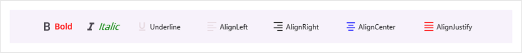
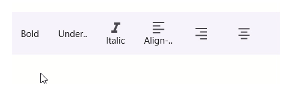
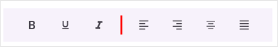
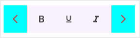
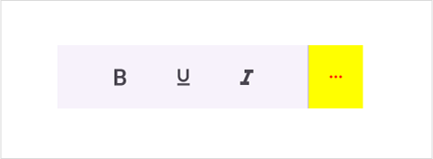
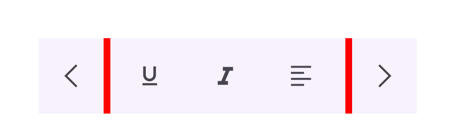
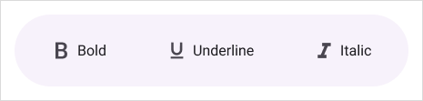

# Customization in .NET MAUI Toolbar (SfToolbar)

This section explains the ways about support for customization in syncfusion .NET MAUI Toolbar (SfToolbar) control.

## Toolbar Item Customization

The toolbar control supports customization of toolbar items using properties [IsEnabled](https://help.syncfusion.com/cr/maui/Syncfusion.Maui.Toolbar.SfToolbarItem.html#Syncfusion_Maui_Toolbar_SfToolbarItem_IsEnabled),[TextStyle](https://help.syncfusion.com/cr/maui/Syncfusion.Maui.Toolbar.SfToolbarItem.html#Syncfusion_Maui_Toolbar_SfToolbarItem_TextStyle) and `Color`.

* **IsEnabled** : This property is used to enable or disable the toolbar item.
* **TextStyle** : This property is used to customize the text style of the toolbar item.
* **Color** : This property is used to set color for the icon in the toolbar.
* **SelectionHighlightColor** : This property is used to set the color for the selected toolbar item. 

The following code sample demonstrates how to create a toolbar control with toolbar Items customization.





<VerticalStackLayout  VerticalOptions="Center">
    <toolbar:SfToolbar x:Name="Toolbar" HeightRequest="56" WidthRequest="850">
        <toolbar:SfToolbar.Items>
            <toolbar:SfToolbarItem Name="Bold"
                        Text="Bold"
                        TextPosition="Right"
                        ToolTipText="Bold"
                        Size="60,56">
                <toolbar:SfToolbarItem.Icon>
                    <FontImageSource Glyph="&#xE770;"
 FontFamily="MauiMaterialAssets" />
                </toolbar:SfToolbarItem.Icon>
                <toolbar:SfToolbarItem.TextStyle>
                    <toolbar:ToolbarTextStyle TextColor="Red"
                  FontSize="14"
                  FontAttributes="Bold"
                  FontFamily="OpenSansSemibold"
                  FontAutoScalingEnabled="True"/>
                </toolbar:SfToolbarItem.TextStyle>
            </toolbar:SfToolbarItem>
            <toolbar:SfToolbarItem Name="Italic"
                       Text="Italic"
                       TextPosition="Right"
                       ToolTipText="Italic"
                       Size="60,56">
                <toolbar:SfToolbarItem.Icon>
                    <FontImageSource Glyph="&#xE771;"
 FontFamily="MauiMaterialAssets" />
                </toolbar:SfToolbarItem.Icon>
                <toolbar:SfToolbarItem.TextStyle>
                    <toolbar:ToolbarTextStyle TextColor="Green"
                  FontSize="16"
                  FontAttributes="Italic"
                  FontFamily="OpenSansRegular"
                  FontAutoScalingEnabled="False"/>
                </toolbar:SfToolbarItem.TextStyle>
            </toolbar:SfToolbarItem>
            <toolbar:SfToolbarItem Text="Underline" 
        TextPosition="Right" Size="100,56" IsEnabled="False"
                ToolTipText="Underline">
                <toolbar:SfToolbarItem.Icon>
                    <FontImageSource Glyph="&#xE762;"
            FontFamily="MauiMaterialAssets" />
                </toolbar:SfToolbarItem.Icon>
            </toolbar:SfToolbarItem>
            <toolbar:SfToolbarItem Text="AlignLeft" TextPosition="Right" Size="100,56" IsEnabled="False"
                        ToolTipText="Align-Left">
                <toolbar:SfToolbarItem.Icon>
                    <FontImageSource Glyph="&#xE751;"
            FontFamily="MauiMaterialAssets" />
                </toolbar:SfToolbarItem.Icon>
            </toolbar:SfToolbarItem>
            <toolbar:SfToolbarItem Text="AlignRight" TextPosition="Right" Size="100,56"
                        ToolTipText="Align-Right">
                <toolbar:SfToolbarItem.Icon>
                    <FontImageSource Glyph="&#xE753;" Color="Black"
            FontFamily="MauiMaterialAssets" />
                </toolbar:SfToolbarItem.Icon>
            </toolbar:SfToolbarItem>
            <toolbar:SfToolbarItem Text="AlignCenter" TextPosition="Right" Size="120,56"
                        ToolTipText="Align-Center">
                <toolbar:SfToolbarItem.Icon>
                    <FontImageSource Glyph="&#xE752;" Color="Blue"
            FontFamily="MauiMaterialAssets" />
                </toolbar:SfToolbarItem.Icon>
            </toolbar:SfToolbarItem>
            <toolbar:SfToolbarItem Text="AlignJustify" TextPosition="Right" Size="110,56"
                        ToolTipText="Align-Justify">
                <toolbar:SfToolbarItem.Icon>
                    <FontImageSource Color="Red" Glyph="&#xE74F;"
            FontFamily="MauiMaterialAssets" />
                </toolbar:SfToolbarItem.Icon>
            </toolbar:SfToolbarItem>
        </toolbar:SfToolbar.Items>
    </toolbar:SfToolbar>
</VerticalStackLayout> 





 public partial class MainPage : ContentPage
 {
     public MainPage()
     {
         InitializeComponent();
         SfToolbar toolbar = new SfToolbar();
         toolbar.HeightRequest = 56;
         ObservableCollection<BaseToolbarItem> itemCollection = new ObservableCollection<BaseToolbarItem>
         {
             new SfToolbarItem
             {
                 Name = "Bold",
                 Text = "Bold",
                 TextPosition = ToolbarItemTextPosition.Right,
                 ToolTipText = "Bold",
                 Size = new Size(60, 56),
                 Icon = new FontImageSource { Glyph = "\uE770", FontFamily = "MauiMaterialAssets" },
                 TextStyle = new ToolbarTextStyle
                 {
                     TextColor = Colors.Red,
                     FontSize = 14,
                     FontAttributes = FontAttributes.Bold,
                     FontFamily = "OpenSansSemibold",
                     FontAutoScalingEnabled = true
                 }
             },
             new SfToolbarItem
             {
                 Name = "Italic",
                 Text = "Italic",
                 TextPosition = ToolbarItemTextPosition.Right,
                 ToolTipText = "Italic",
                 Size = new Size(60, 56),
                 Icon = new FontImageSource { Glyph = "\uE771", FontFamily = "MauiMaterialAssets" },
                 TextStyle = new ToolbarTextStyle
                 {
                     TextColor = Colors.Green,
                     FontSize = 16,
                     FontAttributes = FontAttributes.Italic,
                     FontFamily = "OpenSansRegular",
                     FontAutoScalingEnabled = false
                 }
             },
             new SfToolbarItem
             {
                 Text = "Underline",
                 TextPosition = ToolbarItemTextPosition.Right,
                 ToolTipText = "Underline",
                 Size = new Size(100, 56),
                 Icon = new FontImageSource { Glyph = "\uE762", FontFamily = "MauiMaterialAssets" },
             },
             new SfToolbarItem
             {
                 Text = "Italic",
                 TextPosition = ToolbarItemTextPosition.Right,
                 ToolTipText = "Italic",
                 Size = new Size(60, 56),
                 Icon = new FontImageSource { Glyph = "\uE771", FontFamily = "MauiMaterialAssets" },
             },
             new SfToolbarItem
             {
                 Text = "AlignLeft",
                 TextPosition = ToolbarItemTextPosition.Right,
                 ToolTipText = "Align-Left",
                 Size = new Size(100, 56),
                 Icon = new FontImageSource { Glyph = "\uE751", FontFamily = "MauiMaterialAssets" },
             },
             new SfToolbarItem
             {
                 Text = "AlignRight",
                 TextPosition = ToolbarItemTextPosition.Right,
                 ToolTipText = "Align-Right",
                 Size = new Size(100, 56),
                 Icon = new FontImageSource { Color="Black", Glyph = "\uE753", FontFamily = "MauiMaterialAssets" },
             },
             new SfToolbarItem
             {
                 Text = "AlignCenter",
                 TextPosition = ToolbarItemTextPosition.Right,
                 ToolTipText = "Align-Center",
                 Size = new Size(120, 56),
                 Icon = new FontImageSource { Color="Blue", Glyph = "\uE752", FontFamily = "MauiMaterialAssets" },
             },
             new SfToolbarItem
             {
                 Text = "AlignJustify",
                 TextPosition = ToolbarItemTextPosition.Right,
                 ToolTipText = "Align-Justify",
                 Size = new Size(110, 56),
                 Icon = new FontImageSource { Color="Red", Glyph = "\uE74F", FontFamily = "MauiMaterialAssets" },
             }
         };

         toolbar.Items = itemCollection;
         this.Content = toolbar;
     }
 }





## Set Highlight Color for Selected Toolbar Item

The [`SelectionHighlightColor`](https://help.syncfusion.com/cr/maui/Syncfusion.Maui.Toolbar.SfToolbarItem.html#Syncfusion_Maui_Toolbar_SfToolbarItem_SelectionHighlightColor) property of the [SfToolbarItem](https://help.syncfusion.com/cr/maui/Syncfusion.Maui.Toolbar.SfToolbarItem.html) is used to define the color that highlights a toolbar item when it is tapped. This makes the selected item visually distinct from the others in the toolbar.




<ContentPage
    . . .    
    xmlns:toolbar="clr-namespace:Syncfusion.Maui.Toolbar;assembly=Syncfusion.Maui.Toolbar">

<toolbar:SfToolbar x:Name="toolbar">
    <toolbar:SfToolbar.Items>
        <toolbar:SfToolbarItem Name="Bold"
                               Text="Bold"
                               SelectionHighlightColor="LightGreen"></toolbar:SfToolbarItem>
        <toolbar:SfToolbarItem Name="Underline"
                               Text="Underline"
                               SelectionHighlightColor="LightBlue"></toolbar:SfToolbarItem>
        <toolbar:SfToolbarItem Name="Italic"
                               Text="Italic"
                               SelectionHighlightColor="Violet">
                <toolbar:SfToolbarItem.Icon>
                    <FontImageSource Glyph="&#xE771;"
                                     FontFamily="MauiMaterialAssets"/>
                </toolbar:SfToolbarItem.Icon>
        </toolbar:SfToolbarItem>
        <toolbar:SfToolbarItem Name="AlignLeft"
                               Text="Align-Left"
                               SelectionHighlightColor="Yellow">
                <toolbar:SfToolbarItem.Icon>
                    <FontImageSource Glyph="&#xE751;"
                                     FontFamily="MauiMaterialAssets" />
                </toolbar:SfToolbarItem.Icon>
        </toolbar:SfToolbarItem>
        <toolbar:SfToolbarItem Name="AlignRight"
                               ToolTipText="Align-Right"
                               SelectionHighlightColor="Turquoise">
                <toolbar:SfToolbarItem.Icon>
                    <FontImageSource Glyph="&#xE753;"
                                     FontFamily="MauiMaterialAssets" />
                </toolbar:SfToolbarItem.Icon>
        </toolbar:SfToolbarItem>
        <toolbar:SfToolbarItem Name="AlignCenter"
                               ToolTipText="Align-Center"
                               SelectionHighlightColor="LavenderBlush">
                <toolbar:SfToolbarItem.Icon>
                    <FontImageSource Glyph="&#xE752;"
                                     FontFamily="MauiMaterialAssets" />
                </toolbar:SfToolbarItem.Icon>
        </toolbar:SfToolbarItem>
    </toolbar:SfToolbar.Items>
</toolbar:SfToolbar>

</ContentPage>




public partial class MainPage : ContentPage
{
     public MainPage()
     {
            InitializeComponent();
            SfToolbar toolbar = new SfToolbar();
            ObservableCollection<BaseToolbarItem> itemCollection = new ObservableCollection<BaseToolbarItem>
            {
                new SfToolbarItem
                {
                    Name = "Bold",
                    Text = "Bold",
                    SelectionHighlightColor = Colors.LightGreen
                },
                new SfToolbarItem
                {
                    Name = "Underline",
                    Text = "Underline",
                    SelectionHighlightColor = Colors.LightBlue
                },
                new SfToolbarItem
                {
                    Name = "Italic",
                    Text = "Italic",
                    Icon = new FontImageSource { Glyph = "\uE771", FontFamily="MauiMaterialAssets" },
                    SelectionHighlightColor = Colors.Violet
                },
                new SfToolbarItem
                {
                    Name = "AlignLeft",
                    Text = "Align-Left",
                    Icon = new FontImageSource { Glyph = "\uE751", FontFamily="MauiMaterialAssets" },
                    SelectionHighlightColor = Colors.Yellow
                },
                new SfToolbarItem
                {
                    Name = "AlignRight",
                    ToolTipText = "Align-Right",
                    Icon = new FontImageSource { Glyph = "\uE753", FontFamily="MauiMaterialAssets" },
                    SelectionHighlightColor = Colors.Turquoise
                },
                new SfToolbarItem
                {
                    Name = "AlignCenter",
                    ToolTipText = "Align-Center",
                    Icon = new FontImageSource { Glyph = "\uE752", FontFamily="MauiMaterialAssets" },
                    SelectionHighlightColor = Colors.LavenderBlush
                }
            };

            toolbar.Items = itemCollection;
            this.Content = toolbar;
     }
 }




## Separator Item Customization

The toolbar control supports customization of separator item using properties [Stroke](https://help.syncfusion.com/cr/maui/Syncfusion.Maui.Toolbar.SeparatorToolbarItem.html#Syncfusion_Maui_Toolbar_SeparatorToolbarItem_Stroke) and [StrokeThickness](https://help.syncfusion.com/cr/maui/Syncfusion.Maui.Toolbar.SeparatorToolbarItem.html#Syncfusion_Maui_Toolbar_SeparatorToolbarItem_StrokeThickness).

* **Stroke** : This property is used to customize the stroke color of the separator item.
* **StrokeThickness** : This property is used to customize the stroke thickness of the separator item.

The following code sample demonstrates how to create a toolbar control with separator item customization.





<VerticalStackLayout>
    <toolbar:SfToolbar x:Name="Toolbar" HeightRequest="56" WidthRequest="450">
        <toolbar:SfToolbar.Items>
            <toolbar:SfToolbarItem Name="Bold"
            ToolTipText="Bold">
                <toolbar:SfToolbarItem.Icon>
                    <FontImageSource Glyph="&#xE770;"
                         FontFamily="MauiMaterialAssets" />
                </toolbar:SfToolbarItem.Icon>
            </toolbar:SfToolbarItem>
            <toolbar:SfToolbarItem Name="Underline"
            ToolTipText="Underline">
                <toolbar:SfToolbarItem.Icon>
                    <FontImageSource Glyph="&#xE762;"
                         FontFamily="MauiMaterialAssets" />
                </toolbar:SfToolbarItem.Icon>
            </toolbar:SfToolbarItem>
            <toolbar:SfToolbarItem Name="Italic"
            ToolTipText="Italic">
                <toolbar:SfToolbarItem.Icon>
                    <FontImageSource Glyph="&#xE771;"
                         FontFamily="MauiMaterialAssets" />
                </toolbar:SfToolbarItem.Icon>
            </toolbar:SfToolbarItem>
            <toolbar:SeparatorToolbarItem Stroke="Red" StrokeThickness="3"/>
            <toolbar:SfToolbarItem Name="AlignLeft"
                       ToolTipText="Align-Left">
                <toolbar:SfToolbarItem.Icon>
                    <FontImageSource Glyph="&#xE751;"
                         FontFamily="MauiMaterialAssets" />
                </toolbar:SfToolbarItem.Icon>
            </toolbar:SfToolbarItem>
            <toolbar:SfToolbarItem Name="AlignRight"
                       ToolTipText="Align-Right">
                <toolbar:SfToolbarItem.Icon>
                    <FontImageSource Glyph="&#xE753;"
             FontFamily="MauiMaterialAssets" />
                </toolbar:SfToolbarItem.Icon>
            </toolbar:SfToolbarItem>
            <toolbar:SfToolbarItem Name="AlignCenter"
                       ToolTipText="Align-Center">
                <toolbar:SfToolbarItem.Icon>
                    <FontImageSource Glyph="&#xE752;"
             FontFamily="MauiMaterialAssets" />
                </toolbar:SfToolbarItem.Icon>
            </toolbar:SfToolbarItem>
            <toolbar:SfToolbarItem Name="AlignJustify"
                       ToolTipText="Align-Justify">
                <toolbar:SfToolbarItem.Icon>
                    <FontImageSource Glyph="&#xE74F;"
             FontFamily="MauiMaterialAssets" />
                </toolbar:SfToolbarItem.Icon>
            </toolbar:SfToolbarItem>
        </toolbar:SfToolbar.Items>
    </toolbar:SfToolbar>
</VerticalStackLayout>





public partial class MainPage : ContentPage
{
    public MainPage()
    {
        InitializeComponent();
        SfToolbar toolbar = new SfToolbar();
        toolbar.HeightRequest = 56;

        ObservableCollection<BaseToolbarItem> itemCollection = new ObservableCollection<BaseToolbarItem>
        {
            new SfToolbarItem
            {
                Name = "Bold",
                ToolTipText = "Bold",
                Icon = new FontImageSource { Glyph = "\uE770", FontFamily = "MauiMaterialAssets" }
            },
            new SfToolbarItem
            {
                Name = "Underline",
                ToolTipText = "Underline",
                Icon = new FontImageSource { Glyph = "\uE762", FontFamily = "MauiMaterialAssets" }
            },
            new SfToolbarItem
            {
                Name = "Italic",
                ToolTipText = "Italic",
                Icon = new FontImageSource { Glyph = "\uE771", FontFamily = "MauiMaterialAssets" }
            },
            new SeparatorToolbarItem
            {
                Stroke = Colors.Red,
                StrokeThickness = 3
            },
            new SfToolbarItem
            {
                Name = "AlignLeft",
                ToolTipText = "Align-Left",
                Icon = new FontImageSource { Glyph = "\uE751", FontFamily = "MauiMaterialAssets" }
            },
            new SfToolbarItem
            {
                Name = "AlignRight",
                ToolTipText = "Align-Right",
                Icon = new FontImageSource { Glyph = "\uE753", FontFamily = "MauiMaterialAssets" }
            },
            new SfToolbarItem
            {
                Name = "AlignCenter",
                ToolTipText = "Align-Center",
                Icon = new FontImageSource { Glyph = "\uE752", FontFamily = "MauiMaterialAssets" }
            },
            new SfToolbarItem
            {
                Name = "AlignJustify",
                ToolTipText = "Align-Justify",
                Icon = new FontImageSource { Glyph = "\uE74F", FontFamily = "MauiMaterialAssets" }
            }
        };

        toolbar.Items = itemCollection;
        this.Content = toolbar;
    }
}





## Navigation Button Customization

The toolbar control supports customization of navigation buttons using properties [ForwardButtonIconColor](https://help.syncfusion.com/cr/maui/Syncfusion.Maui.Toolbar.SfToolbar.html#Syncfusion_Maui_Toolbar_SfToolbar_ForwardButtonIconColor), [BackwardButtonIconColor](https://help.syncfusion.com/cr/maui/Syncfusion.Maui.Toolbar.SfToolbar.html#Syncfusion_Maui_Toolbar_SfToolbar_BackwardButtonIconColor), [ForwardButtonBackground](https://help.syncfusion.com/cr/maui/Syncfusion.Maui.Toolbar.SfToolbar.html#Syncfusion_Maui_Toolbar_SfToolbar_ForwardButtonBackground), [BackwardButtonBackground](https://help.syncfusion.com/cr/maui/Syncfusion.Maui.Toolbar.SfToolbar.html#Syncfusion_Maui_Toolbar_SfToolbar_BackwardButtonBackground).

* **ForwardButtonIconColor** : This property is used to customize the icon color of the forward button.
* **BackwardButtonIconColor** : This property is used to customize the icon color of the backward button.
* **ForwardButtonBackground** : This property is used to customize the background color of the forward button.
* **BackwardButtonBackground** : This property is used to customize the background color of the backward button.

The following code sample demonstrates how to create a toolbar control with navigation button customization.





<VerticalStackLayout>
     <toolbar:SfToolbar x:Name="Toolbar" HeightRequest="56" WidthRequest="270" OverflowMode="NavigationButtons" ForwardButtonIconColor="Red" BackwardButtonIconColor="Red" ForwardButtonBackground="Aqua" BackwardButtonBackground="Aqua">
         <toolbar:SfToolbar.Items>
             <toolbar:SfToolbarItem Name="Bold"
             ToolTipText="Bold">
                 <toolbar:SfToolbarItem.Icon>
                     <FontImageSource Glyph="&#xE770;"
                          FontFamily="MauiMaterialAssets" />
                 </toolbar:SfToolbarItem.Icon>
             </toolbar:SfToolbarItem>
             <toolbar:SfToolbarItem Name="Underline"
             ToolTipText="Underline">
                 <toolbar:SfToolbarItem.Icon>
                     <FontImageSource Glyph="&#xE762;"
                          FontFamily="MauiMaterialAssets" />
                 </toolbar:SfToolbarItem.Icon>
             </toolbar:SfToolbarItem>
             <toolbar:SfToolbarItem Name="Italic"
             ToolTipText="Italic">
                 <toolbar:SfToolbarItem.Icon>
                     <FontImageSource Glyph="&#xE771;"
                          FontFamily="MauiMaterialAssets" />
                 </toolbar:SfToolbarItem.Icon>
             </toolbar:SfToolbarItem>
             <toolbar:SfToolbarItem Name="AlignLeft"
                        ToolTipText="Align-Left">
                 <toolbar:SfToolbarItem.Icon>
                     <FontImageSource Glyph="&#xE751;"
                          FontFamily="MauiMaterialAssets" />
                 </toolbar:SfToolbarItem.Icon>
             </toolbar:SfToolbarItem>
             <toolbar:SfToolbarItem Name="AlignRight"
                        ToolTipText="Align-Right">
                 <toolbar:SfToolbarItem.Icon>
                     <FontImageSource Glyph="&#xE753;"
              FontFamily="MauiMaterialAssets" />
                 </toolbar:SfToolbarItem.Icon>
             </toolbar:SfToolbarItem>
             <toolbar:SfToolbarItem Name="AlignCenter"
                        ToolTipText="Align-Center">
                 <toolbar:SfToolbarItem.Icon>
                     <FontImageSource Glyph="&#xE752;"
              FontFamily="MauiMaterialAssets" />
                 </toolbar:SfToolbarItem.Icon>
             </toolbar:SfToolbarItem>
             <toolbar:SfToolbarItem Name="AlignJustify"
                        ToolTipText="Align-Justify">
                 <toolbar:SfToolbarItem.Icon>
                     <FontImageSource Glyph="&#xE74F;"
              FontFamily="MauiMaterialAssets" />
                 </toolbar:SfToolbarItem.Icon>
             </toolbar:SfToolbarItem>
         </toolbar:SfToolbar.Items>
     </toolbar:SfToolbar>
 </VerticalStackLayout>





public partial class MainPage : ContentPage
 {
     public MainPage()
     {
         InitializeComponent();
         SfToolbar toolbar = new SfToolbar();
         toolbar.HeightRequest = 56;
         toolbar.WidthRequest = 270;
         toolbar.OverflowMode = ToolbarItemOverflowMode.NavigationButtons;
         toolbar.ForwardButtonIconColor = Colors.Red;
         toolbar.BackwardButtonIconColor = Colors.Red;
         toolbar.ForwardButtonBackground = Colors.Aqua;
         toolbar.BackwardButtonBackground = Colors.Aqua;

         ObservableCollection<BaseToolbarItem> itemCollection = new ObservableCollection<BaseToolbarItem>();

         itemCollection.Add(new SfToolbarItem
         {
             Name = "Bold",
             ToolTipText = "Bold",
             Icon = new FontImageSource { Glyph = "\uE770", FontFamily = "MauiMaterialAssets" }
         });

         itemCollection.Add(new SfToolbarItem
         {
             Name = "Underline",
             ToolTipText = "Underline",
             Icon = new FontImageSource { Glyph = "\uE762", FontFamily = "MauiMaterialAssets" }
         });

         itemCollection.Add(new SfToolbarItem
         {
             Name = "Italic",
             ToolTipText = "Italic",
             Icon = new FontImageSource { Glyph = "\uE771", FontFamily = "MauiMaterialAssets" }
         });

         itemCollection.Add(new SfToolbarItem
         {
             Name = "AlignLeft",
             ToolTipText = "Align-Left",
             Icon = new FontImageSource { Glyph = "\uE751", FontFamily = "MauiMaterialAssets" }
         });

         itemCollection.Add(new SfToolbarItem
         {
             Name = "AlignRight",
             ToolTipText = "Align-Right",
             Icon = new FontImageSource { Glyph = "\uE753", FontFamily = "MauiMaterialAssets" }
         });

         itemCollection.Add(new SfToolbarItem
         {
             Name = "AlignCenter",
             ToolTipText = "Align-Center",
             Icon = new FontImageSource { Glyph = "\uE752", FontFamily = "MauiMaterialAssets" }
         });

         itemCollection.Add(new SfToolbarItem
         {
             Name = "AlignJustify",
             ToolTipText = "Align-Justify",
             Icon = new FontImageSource { Glyph = "\uE74F", FontFamily = "MauiMaterialAssets" }
         });

         toolbar.Items = itemCollection;
         this.Content = toolbar;
     }
 }





## Navigation Button appearance using DataTemplate
You can customize the navigation appearance by using the [ForwardButtonTemplate](https://help.syncfusion.com/cr/maui/Syncfusion.Maui.Toolbar.SfToolbar.html#Syncfusion_Maui_Toolbar_SfToolbar_ForwardButtonTemplate) and [BackwardButtonTemplate](https://help.syncfusion.com/cr/maui/Syncfusion.Maui.Toolbar.SfToolbar.html#Syncfusion_Maui_Toolbar_SfToolbar_BackwardButtonTemplate) Properties.

* **ForwardButtonTemplate** : Enables customization of the forward navigation button by allowing the integration of user-defined views.
* **BackwardButtonTemplate** : Enables customization of the backward navigation button by allowing the integration of user-defined views.

The following code sample demonstrates how to create a toolbar control with navigation button customization.





<VerticalStackLayout>
     <toolbar:SfToolbar x:Name="Toolbar" HeightRequest="56" WidthRequest="270" OverflowMode="NavigationButtons">
        <toolbar:SfToolbar.BackwardButtonTemplate>
            <DataTemplate>
                <Grid  HorizontalOptions="Start">
                    <Image Source="less.png"  WidthRequest="18" HeightRequest="20"/>
                </Grid>
            </DataTemplate>
        </toolbar:SfToolbar.BackwardButtonTemplate>
        <toolbar:SfToolbar.ForwardButtonTemplate>
            <DataTemplate>
                <ViewCell>
                    <Grid HorizontalOptions="Start">
                        <Image Source="greater.png" WidthRequest="18" HeightRequest="20" />
                    </Grid>
                </ViewCell>
            </DataTemplate>
        </toolbar:SfToolbar.ForwardButtonTemplate>
         <toolbar:SfToolbar.Items>
             <toolbar:SfToolbarItem Name="Bold"
             ToolTipText="Bold">
                 <toolbar:SfToolbarItem.Icon>
                     <FontImageSource Glyph="&#xE770;"
                          FontFamily="MauiMaterialAssets" />
                 </toolbar:SfToolbarItem.Icon>
             </toolbar:SfToolbarItem>
             <toolbar:SfToolbarItem Name="Underline"
             ToolTipText="Underline">
                 <toolbar:SfToolbarItem.Icon>
                     <FontImageSource Glyph="&#xE762;"
                          FontFamily="MauiMaterialAssets" />
                 </toolbar:SfToolbarItem.Icon>
             </toolbar:SfToolbarItem>
             <toolbar:SfToolbarItem Name="Italic"
             ToolTipText="Italic">
                 <toolbar:SfToolbarItem.Icon>
                     <FontImageSource Glyph="&#xE771;"
                          FontFamily="MauiMaterialAssets" />
                 </toolbar:SfToolbarItem.Icon>
             </toolbar:SfToolbarItem>
             <toolbar:SfToolbarItem Name="AlignLeft"
                        ToolTipText="Align-Left">
                 <toolbar:SfToolbarItem.Icon>
                     <FontImageSource Glyph="&#xE751;"
                          FontFamily="MauiMaterialAssets" />
                 </toolbar:SfToolbarItem.Icon>
             </toolbar:SfToolbarItem>
             <toolbar:SfToolbarItem Name="AlignRight"
                        ToolTipText="Align-Right">
                 <toolbar:SfToolbarItem.Icon>
                     <FontImageSource Glyph="&#xE753;"
              FontFamily="MauiMaterialAssets" />
                 </toolbar:SfToolbarItem.Icon>
             </toolbar:SfToolbarItem>
             <toolbar:SfToolbarItem Name="AlignCenter"
                        ToolTipText="Align-Center">
                 <toolbar:SfToolbarItem.Icon>
                     <FontImageSource Glyph="&#xE752;"
              FontFamily="MauiMaterialAssets" />
                 </toolbar:SfToolbarItem.Icon>
             </toolbar:SfToolbarItem>
             <toolbar:SfToolbarItem Name="AlignJustify"
                        ToolTipText="Align-Justify">
                 <toolbar:SfToolbarItem.Icon>
                     <FontImageSource Glyph="&#xE74F;"
              FontFamily="MauiMaterialAssets" />
                 </toolbar:SfToolbarItem.Icon>
             </toolbar:SfToolbarItem>
         </toolbar:SfToolbar.Items>
     </toolbar:SfToolbar>
 </VerticalStackLayout>





 public partial class MainPage : ContentPage
 {
     public MainPage()
     {
         InitializeComponent();
         SfToolbar toolbar = new SfToolbar();
         toolbar.HeightRequest = 56;
         toolbar.WidthRequest = 270;
         toolbar.OverflowMode = ToolbarItemOverflowMode.NavigationButtons;

        // Backward Button Template
        var backwardTemplate = new DataTemplate(() =>
        {
            var grid = new Grid
            {
                HorizontalOptions = LayoutOptions.Start
            };

            var image = new Image
            {
                Source = "less.png",
                WidthRequest = 18,
                HeightRequest = 20
            };

            grid.Children.Add(image);
            return grid;
        });

        // Forward Button Template
        var forwardTemplate = new DataTemplate(() =>
        {
            var grid = new Grid
            {
                HorizontalOptions = LayoutOptions.Start
            };

            var image = new Image
            {
                Source = "greater.png",
                WidthRequest = 18,
                HeightRequest = 20
            };

            grid.Children.Add(image);
            return new ViewCell { View = grid };
        });

        toolbar.BackwardButtonTemplate = backwardTemplate;
        toolbar.ForwardButtonTemplate = forwardTemplate;

         ObservableCollection<BaseToolbarItem> itemCollection = new ObservableCollection<BaseToolbarItem>();

         itemCollection.Add(new SfToolbarItem
         {
             Name = "Bold",
             ToolTipText = "Bold",
             Icon = new FontImageSource { Glyph = "\uE770", FontFamily = "MauiMaterialAssets" }
         });

         itemCollection.Add(new SfToolbarItem
         {
             Name = "Underline",
             ToolTipText = "Underline",
             Icon = new FontImageSource { Glyph = "\uE762", FontFamily = "MauiMaterialAssets" }
         });

         itemCollection.Add(new SfToolbarItem
         {
             Name = "Italic",
             ToolTipText = "Italic",
             Icon = new FontImageSource { Glyph = "\uE771", FontFamily = "MauiMaterialAssets" }
         });

         itemCollection.Add(new SfToolbarItem
         {
             Name = "AlignLeft",
             ToolTipText = "Align-Left",
             Icon = new FontImageSource { Glyph = "\uE751", FontFamily = "MauiMaterialAssets" }
         });

         itemCollection.Add(new SfToolbarItem
         {
             Name = "AlignRight",
             ToolTipText = "Align-Right",
             Icon = new FontImageSource { Glyph = "\uE753", FontFamily = "MauiMaterialAssets" }
         });

         itemCollection.Add(new SfToolbarItem
         {
             Name = "AlignCenter",
             ToolTipText = "Align-Center",
             Icon = new FontImageSource { Glyph = "\uE752", FontFamily = "MauiMaterialAssets" }
         });

         itemCollection.Add(new SfToolbarItem
         {
             Name = "AlignJustify",
             ToolTipText = "Align-Justify",
             Icon = new FontImageSource { Glyph = "\uE74F", FontFamily = "MauiMaterialAssets" }
         });

         toolbar.Items = itemCollection;
         this.Content = toolbar;
     }
 }





## More Button Customization

The toolbar control supports customization of more button using properties [MoreButtonIconColor](https://help.syncfusion.com/cr/maui/Syncfusion.Maui.Toolbar.SfToolbar.html#Syncfusion_Maui_Toolbar_SfToolbar_MoreButtonIconColor), [MoreButtonBackground](https://help.syncfusion.com/cr/maui/Syncfusion.Maui.Toolbar.SfToolbar.html#Syncfusion_Maui_Toolbar_SfToolbar_MoreButtonBackground).

* **MoreButtonIconColor** : This property is used to customize the icon color of the more button.
* **MoreButtonBackground** : This property is used to customize the background color of the more button.

The following code sample demonstrates how to create a toolbar control with more button customization.





<VerticalStackLayout>
    <toolbar:SfToolbar x:Name="Toolbar" HeightRequest="56" WidthRequest="270" OverflowMode="MoreButton" MoreButtonIconColor="Red" MoreButtonBackground="Yellow">
        <toolbar:SfToolbar.Items>
            <toolbar:SfToolbarItem Name="Bold"
         ToolTipText="Bold">
                <toolbar:SfToolbarItem.Icon>
                    <FontImageSource Glyph="&#xE770;"
                      FontFamily="MauiMaterialAssets" />
                </toolbar:SfToolbarItem.Icon>
            </toolbar:SfToolbarItem>
            <toolbar:SfToolbarItem Name="Underline"
         ToolTipText="Underline">
                <toolbar:SfToolbarItem.Icon>
                    <FontImageSource Glyph="&#xE762;"
                      FontFamily="MauiMaterialAssets" />
                </toolbar:SfToolbarItem.Icon>
            </toolbar:SfToolbarItem>
            <toolbar:SfToolbarItem Name="Italic"
         ToolTipText="Italic">
                <toolbar:SfToolbarItem.Icon>
                    <FontImageSource Glyph="&#xE771;"
                      FontFamily="MauiMaterialAssets" />
                </toolbar:SfToolbarItem.Icon>
            </toolbar:SfToolbarItem>
            <toolbar:SfToolbarItem Name="AlignLeft"
                    ToolTipText="Align-Left">
                <toolbar:SfToolbarItem.Icon>
                    <FontImageSource Glyph="&#xE751;"
                      FontFamily="MauiMaterialAssets" />
                </toolbar:SfToolbarItem.Icon>
            </toolbar:SfToolbarItem>
            <toolbar:SfToolbarItem Name="AlignRight"
                    ToolTipText="Align-Right">
                <toolbar:SfToolbarItem.Icon>
                    <FontImageSource Glyph="&#xE753;"
          FontFamily="MauiMaterialAssets" />
                </toolbar:SfToolbarItem.Icon>
            </toolbar:SfToolbarItem>
            <toolbar:SfToolbarItem Name="AlignCenter"
                    ToolTipText="Align-Center">
                <toolbar:SfToolbarItem.Icon>
                    <FontImageSource Glyph="&#xE752;"
          FontFamily="MauiMaterialAssets" />
                </toolbar:SfToolbarItem.Icon>
            </toolbar:SfToolbarItem>
            <toolbar:SfToolbarItem Name="AlignJustify"
                    ToolTipText="Align-Justify">
                <toolbar:SfToolbarItem.Icon>
                    <FontImageSource Glyph="&#xE74F;"
          FontFamily="MauiMaterialAssets" />
                </toolbar:SfToolbarItem.Icon>
            </toolbar:SfToolbarItem>
        </toolbar:SfToolbar.Items>
    </toolbar:SfToolbar>
 </VerticalStackLayout>





public partial class MainPage : ContentPage
{
    public MainPage()
    {
        InitializeComponent();
        SfToolbar toolbar = new SfToolbar();
        toolbar.HeightRequest = 56;
        toolbar.WidthRequest = 270;
        toolbar.OverflowMode = ToolbarItemOverflowMode.MoreButton;
        toolbar.MoreButtonIconColor = Colors.Red;
        toolbar.MoreButtonBackground = Colors.Red;
        

        ObservableCollection<BaseToolbarItem> itemCollection = new ObservableCollection<BaseToolbarItem>();

        itemCollection.Add(new SfToolbarItem
        {
            Name = "Bold",
            ToolTipText = "Bold",
            Icon = new FontImageSource { Glyph = "\uE770", FontFamily = "MauiMaterialAssets" }
        });

        itemCollection.Add(new SfToolbarItem
        {
            Name = "Underline",
            ToolTipText = "Underline",
            Icon = new FontImageSource { Glyph = "\uE762", FontFamily = "MauiMaterialAssets" }
        });

        itemCollection.Add(new SfToolbarItem
        {
            Name = "Italic",
            ToolTipText = "Italic",
            Icon = new FontImageSource { Glyph = "\uE771", FontFamily = "MauiMaterialAssets" }
        });

        itemCollection.Add(new SfToolbarItem
        {
            Name = "AlignLeft",
            ToolTipText = "Align-Left",
            Icon = new FontImageSource { Glyph = "\uE751", FontFamily = "MauiMaterialAssets" }
        });

        itemCollection.Add(new SfToolbarItem
        {
            Name = "AlignRight",
            ToolTipText = "Align-Right",
            Icon = new FontImageSource { Glyph = "\uE753", FontFamily = "MauiMaterialAssets" }
        });

        itemCollection.Add(new SfToolbarItem
        {
            Name = "AlignCenter",
            ToolTipText = "Align-Center",
            Icon = new FontImageSource { Glyph = "\uE752", FontFamily = "MauiMaterialAssets" }
        });

        itemCollection.Add(new SfToolbarItem
        {
            Name = "AlignJustify",
            ToolTipText = "Align-Justify",
            Icon = new FontImageSource { Glyph = "\uE74F", FontFamily = "MauiMaterialAssets" }
        });

        toolbar.Items = itemCollection;
        this.Content = toolbar;
    }
}





## Divider Customization

The toolbar control supports customization for dividerLine using properties [DividedLineStroke](https://help.syncfusion.com/cr/maui/Syncfusion.Maui.Toolbar.SfToolbar.html#Syncfusion_Maui_Toolbar_SfToolbar_DividedLineStroke) and [DividedLineStrokeThickness](https://help.syncfusion.com/cr/maui/Syncfusion.Maui.Toolbar.SfToolbar.html#Syncfusion_Maui_Toolbar_SfToolbar_DividedLineStrokeThickness).

* **DividedLineStroke** : This property is used to customize the stroke color of the divider line.
* **DividedLineStrokeThickness** : This property is used to customize the stroke thickness of the divider line.

The following code sample demonstrates how to create a toolbar control with divider line customization.





<Grid>
    <toolbar:SfToolbar x:Name="toolbar"
                        HeightRequest="56"
                        WidthRequest="280"
                        Orientation="Horizontal"
                        OverflowMode="NavigationButtons"
                    DividedLineStrokeThickness="5"
                    DividedLineStroke="Red">
        <toolbar:SfToolbar.Items>
            <toolbar:SfToolbarItem Name="Bold"
         ToolTipText="Bold">
                <toolbar:SfToolbarItem.Icon>
                    <FontImageSource Glyph="&#xE770;"
                      FontFamily="MauiMaterialAssets" />
                </toolbar:SfToolbarItem.Icon>
            </toolbar:SfToolbarItem>
            <toolbar:SfToolbarItem Name="Underline"
         ToolTipText="Underline">
                <toolbar:SfToolbarItem.Icon>
                    <FontImageSource Glyph="&#xE762;"
                      FontFamily="MauiMaterialAssets" />
                </toolbar:SfToolbarItem.Icon>
            </toolbar:SfToolbarItem>
            <toolbar:SfToolbarItem Name="Italic"
         ToolTipText="Italic">
                <toolbar:SfToolbarItem.Icon>
                    <FontImageSource Glyph="&#xE771;"
                      FontFamily="MauiMaterialAssets" />
                </toolbar:SfToolbarItem.Icon>
            </toolbar:SfToolbarItem>
            <toolbar:SfToolbarItem Name="AlignLeft"
                    ToolTipText="Align-Left">
                <toolbar:SfToolbarItem.Icon>
                    <FontImageSource Glyph="&#xE751;"
                      FontFamily="MauiMaterialAssets" />
                </toolbar:SfToolbarItem.Icon>
            </toolbar:SfToolbarItem>
            <toolbar:SfToolbarItem Name="AlignRight"
                    ToolTipText="Align-Right">
                <toolbar:SfToolbarItem.Icon>
                    <FontImageSource Glyph="&#xE753;"
          FontFamily="MauiMaterialAssets" />
                </toolbar:SfToolbarItem.Icon>
            </toolbar:SfToolbarItem>
            <toolbar:SfToolbarItem Name="AlignCenter"
                    ToolTipText="Align-Center">
                <toolbar:SfToolbarItem.Icon>
                    <FontImageSource Glyph="&#xE752;"
          FontFamily="MauiMaterialAssets" />
                </toolbar:SfToolbarItem.Icon>
            </toolbar:SfToolbarItem>
            <toolbar:SfToolbarItem Name="AlignJustify"
                    ToolTipText="Align-Justify">
                <toolbar:SfToolbarItem.Icon>
                    <FontImageSource Glyph="&#xE74F;"
          FontFamily="MauiMaterialAssets" />
                </toolbar:SfToolbarItem.Icon>
            </toolbar:SfToolbarItem>
        </toolbar:SfToolbar.Items>
    </toolbar:SfToolbar>
</Grid>





public partial class MainPage : ContentPage
{
    public MainPage()
    {
        InitializeComponent();
        SfToolbar toolbar = new SfToolbar();
        toolbar.HeightRequest = 56;
        toolbar.WidthRequest = 280;
        toolbar.OverflowMode = ToolbarItemOverflowMode.NavigationButtons;
        toolbar.DividedLineStroke = Colors.Red;
        toolbar.DividedLineStrokeThickness = 5;
        ObservableCollection<BaseToolbarItem> itemCollection = new ObservableCollection<BaseToolbarItem>();

        itemCollection.Add(new SfToolbarItem
        {
            Name = "Bold",
            ToolTipText = "Bold",
            Icon = new FontImageSource { Glyph = "\uE770", FontFamily = "MauiMaterialAssets" }
        });

        itemCollection.Add(new SfToolbarItem
        {
            Name = "Underline",
            ToolTipText = "Underline",
            Icon = new FontImageSource { Glyph = "\uE762", FontFamily = "MauiMaterialAssets" }
        });

        itemCollection.Add(new SfToolbarItem
        {
            Name = "Italic",
            ToolTipText = "Italic",
            Icon = new FontImageSource { Glyph = "\uE771", FontFamily = "MauiMaterialAssets" }
        });

        itemCollection.Add(new SfToolbarItem
        {
            Name = "AlignLeft",
            ToolTipText = "Align-Left",
            Icon = new FontImageSource { Glyph = "\uE751", FontFamily = "MauiMaterialAssets" }
        });

        itemCollection.Add(new SfToolbarItem
        {
            Name = "AlignRight",
            ToolTipText = "Align-Right",
            Icon = new FontImageSource { Glyph = "\uE753", FontFamily = "MauiMaterialAssets" }
        });

        itemCollection.Add(new SfToolbarItem
        {
            Name = "AlignCenter",
            ToolTipText = "Align-Center",
            Icon = new FontImageSource { Glyph = "\uE752", FontFamily = "MauiMaterialAssets" }
        });

        itemCollection.Add(new SfToolbarItem
        {
            Name = "AlignJustify",
            ToolTipText = "Align-Justify",
            Icon = new FontImageSource { Glyph = "\uE74F", FontFamily = "MauiMaterialAssets" }
        });

        toolbar.Items = itemCollection;
        this.Content = toolbar;
    }
}





## Corner Radius Customization

The toolbar control supports customizing its corners using the [CornerRadius] property, allowing rounded or sharp edges to match your design preferences.

The following code sample demonstrates how to set the corner radius of the toolbar.





<Grid>
    <toolbar:SfToolbar x:Name="Toolbar"
                   HeightRequest="56"
                   WidthRequest="330"
                   CornerRadius="30">
        <toolbar:SfToolbar.Items>
            <toolbar:SfToolbarItem Name="Bold"
               Text="Bold"
               TextPosition="Right"
               ToolTipText="Bold"
               Size="90,40">
                <toolbar:SfToolbarItem.Icon>
                    <FontImageSource Glyph="&#xE770;"
                 FontFamily="MauiMaterialAssets"/>
                </toolbar:SfToolbarItem.Icon>
            </toolbar:SfToolbarItem>
            <toolbar:SfToolbarItem Name="Underline"
               Text="Underline"
               TextPosition="Right"
               ToolTipText="Underline"
               Size="90,40">
                <toolbar:SfToolbarItem.Icon>
                    <FontImageSource Glyph="&#xE762;"
                 FontFamily="MauiMaterialAssets"/>
                </toolbar:SfToolbarItem.Icon>
            </toolbar:SfToolbarItem>
            <toolbar:SfToolbarItem Name="Italic"
               Text="Italic"
               TextPosition="Right"
               ToolTipText="Italic"
               Size="90,40">
                <toolbar:SfToolbarItem.Icon>
                    <FontImageSource Glyph="&#xE771;"
                 FontFamily="MauiMaterialAssets"/>
                </toolbar:SfToolbarItem.Icon>
            </toolbar:SfToolbarItem>
        </toolbar:SfToolbar.Items>
    </toolbar:SfToolbar>
</Grid>





public partial class MainPage : ContentPage
{
    public MainPage()
    {
        InitializeComponent();
        var grid = new Grid();

        var toolbar = new SfToolbar
        {
            HeightRequest = 56,
            WidthRequest = 330,
            CornerRadius = 30
        };

        toolbar.Items = new ObservableCollection<BaseToolbarItem>
        {
            new SfToolbarItem
            {
                Name = "Bold",
                Text = "Bold",
                TextPosition = ToolbarItemTextPosition.Right,
                ToolTipText = "Bold",
                Size = new Size(90, 40),
                Icon = new FontImageSource
                {
                    Glyph = "\uE770",
                    FontFamily = "MauiMaterialAssets"
                }
            },
            new SfToolbarItem
            {
                Name = "Underline",
                Text = "Underline",
                TextPosition = ToolbarItemTextPosition.Right,
                ToolTipText = "Underline",
                Size = new Size(90, 40),
                Icon = new FontImageSource
                {
                    Glyph = "\uE762",
                    FontFamily = "MauiMaterialAssets"
                }
            },
            new SfToolbarItem
            {
                Name = "Italic",
                Text = "Italic",
                TextPosition = ToolbarItemTextPosition.Right,
                ToolTipText = "Italic",
                Size = new Size(90, 40),
                Icon = new FontImageSource
                {
                    Glyph = "\uE771",
                    FontFamily = "MauiMaterialAssets"
                }
            }
        };

        grid.Children.Add(toolbar);
        Content = grid;
    }
}





## Selection Corner Radius Customization

The toolbar control supports customizing corners of the selection using the [SelectionCornerRadius] property, allowing the corners of the selected item to be rounded or sharp based on your preference.

The following code sample demonstrates how to set the selection corner radius for toolbar items.





<Grid>
    <toolbar:SfToolbar x:Name="Toolbar"
                   HeightRequest="56"
                   WidthRequest="330"
                   SelectionCornerRadius="20">
        <toolbar:SfToolbar.Items>
            <toolbar:SfToolbarItem Name="Bold"
               Text="Bold"
               TextPosition="Right"
               ToolTipText="Bold"
               Size="90,40">
                <toolbar:SfToolbarItem.Icon>
                    <FontImageSource Glyph="&#xE770;"
                 FontFamily="MauiMaterialAssets"/>
                </toolbar:SfToolbarItem.Icon>
            </toolbar:SfToolbarItem>
            <toolbar:SfToolbarItem Name="Underline"
               Text="Underline"
               TextPosition="Right"
               ToolTipText="Underline"
               Size="90,40">
                <toolbar:SfToolbarItem.Icon>
                    <FontImageSource Glyph="&#xE762;"
                 FontFamily="MauiMaterialAssets"/>
                </toolbar:SfToolbarItem.Icon>
            </toolbar:SfToolbarItem>
            <toolbar:SfToolbarItem Name="Italic"
               Text="Italic"
               TextPosition="Right"
               ToolTipText="Italic"
               Size="90,40">
                <toolbar:SfToolbarItem.Icon>
                    <FontImageSource Glyph="&#xE771;"
                 FontFamily="MauiMaterialAssets"/>
                </toolbar:SfToolbarItem.Icon>
            </toolbar:SfToolbarItem>
        </toolbar:SfToolbar.Items>
    </toolbar:SfToolbar>
</Grid>





public partial class MainPage : ContentPage
{
    public MainPage()
    {
        InitializeComponent();
        var grid = new Grid();

        var toolbar = new SfToolbar
        {
            HeightRequest = 56,
            WidthRequest = 330,
            SelectionCornerRadius = 20
        };

        toolbar.Items = new ObservableCollection<BaseToolbarItem>
        {
            new SfToolbarItem
            {
                Name = "Bold",
                Text = "Bold",
                TextPosition = ToolbarItemTextPosition.Right,
                ToolTipText = "Bold",
                Size = new Size(90, 40),
                Icon = new FontImageSource
                {
                    Glyph = "\uE770",
                    FontFamily = "MauiMaterialAssets"
                }
            },
            new SfToolbarItem
            {
                Name = "Underline",
                Text = "Underline",
                TextPosition = ToolbarItemTextPosition.Right,
                ToolTipText = "Underline",
                Size = new Size(90, 40),
                Icon = new FontImageSource
                {
                    Glyph = "\uE762",
                    FontFamily = "MauiMaterialAssets"
                }
            },
            new SfToolbarItem
            {
                Name = "Italic",
                Text = "Italic",
                TextPosition = ToolbarItemTextPosition.Right,
                ToolTipText = "Italic",
                Size = new Size(90, 40),
                Icon = new FontImageSource
                {
                    Glyph = "\uE771",
                    FontFamily = "MauiMaterialAssets"
                }
            }
        };

        grid.Children.Add(toolbar);
        Content = grid;
    }
}





