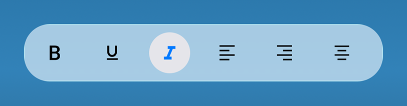

# Liquid Glass Effect in .NET MAUI Toolbar (SfToolbar)

The Liquid Glass Effect introduces a modern, translucent design with adaptive color tinting and light refraction, creating a sleek, glass like user experience that remains clear and accessible. This section explains how to enable and customize the effect in the Syncfusion® .NET MAUI Toolbar (SfToolbar) control.

## Apply liquid glass effect

Follow these steps to enable and configure the Liquid Glass Effect in the Toolbar control:

### Step 1: Enable the liquid glass effect on Toolbar

Set the [EnableLiquidGlassEffect](https://help.syncfusion.com/cr/maui/Syncfusion.Maui.Toolbar.SfToolbar.html#Syncfusion_Maui_Toolbar_SfToolbar_EnableLiquidGlassEffect) property to `true` in the [SfToolbar](https://help.syncfusion.com/cr/maui/Syncfusion.Maui.Toolbar.SfToolbar.html) control to apply the Liquid Glass Effect. When enabled, the effect is also applied to its dependent controls and provides responsive interaction for a smooth and engaging user experience.

### Step 2: Customize the background

To achieve a glass like background in the Toolbar, set the `Background` property to `Transparent`. The background will then be treated as a tinted color, ensuring a consistent glass effect across the controls.

The following code snippet demonstrates how to apply the Liquid Glass Effect to the [SfToolbar](https://help.syncfusion.com/cr/maui/Syncfusion.Maui.Toolbar.SfToolbar.html) control:




<ContentPage
    xmlns="http://schemas.microsoft.com/dotnet/2021/maui"
    xmlns:x="http://schemas.microsoft.com/winfx/2009/xaml"
    xmlns:toolbar="clr-namespace:Syncfusion.Maui.Toolbar;assembly=Syncfusion.Maui.Toolbar"
    x:Class="AcrylicToolbarPage">
    <Grid>
        <Grid.Background>
            <LinearGradientBrush StartPoint="0,0"
                                 EndPoint="0,1">
                <GradientStop Color="#0F4C75"
                              Offset="0.0"/>
                <GradientStop Color="#3282B8"
                              Offset="0.5"/>
                <GradientStop Color="#1B262C"
                              Offset="1.0"/>
            </LinearGradientBrush>
        </Grid.Background>
        <Grid>
            <toolbar:SfToolbar x:Name="Toolbar"
                    EnableLiquidGlassEffect="True"
                    HeightRequest="56"
                    CornerRadius="25"
                    SelectionCornerRadius="25"
                    Background="Transparent">
                <toolbar:SfToolbar.Items>
                    <toolbar:SfToolbarItem Name="Bold">
                        <toolbar:SfToolbarItem.Icon>
                            <FontImageSource Glyph="&#xE770;"
                                             FontFamily="MauiMaterialAssets"/>
                        </toolbar:SfToolbarItem.Icon>
                    </toolbar:SfToolbarItem>
                    <toolbar:SfToolbarItem Name="Underline">
                        <toolbar:SfToolbarItem.Icon>
                            <FontImageSource Glyph="&#xE762;"
                                             FontFamily="MauiMaterialAssets"/>
                        </toolbar:SfToolbarItem.Icon>
                    </toolbar:SfToolbarItem>
                    <toolbar:SfToolbarItem Name="Italic">
                        <toolbar:SfToolbarItem.Icon>
                            <FontImageSource Glyph="&#xE771;"
                                             FontFamily="MauiMaterialAssets"/>
                        </toolbar:SfToolbarItem.Icon>
                    </toolbar:SfToolbarItem>
                    <toolbar:SfToolbarItem Name="AlignLeft">
                        <toolbar:SfToolbarItem.Icon>
                            <FontImageSource Glyph="&#xE751;"
                                             FontFamily="MauiMaterialAssets"/>
                        </toolbar:SfToolbarItem.Icon>
                    </toolbar:SfToolbarItem>
                    <toolbar:SfToolbarItem Name="AlignRight">
                        <toolbar:SfToolbarItem.Icon>
                            <FontImageSource Glyph="&#xE753;"
                                             FontFamily="MauiMaterialAssets"/>
                        </toolbar:SfToolbarItem.Icon>
                    </toolbar:SfToolbarItem>
                    <toolbar:SfToolbarItem Name="AlignCenter">
                        <toolbar:SfToolbarItem.Icon>
                            <FontImageSource Glyph="&#xE752;"
                                             FontFamily="MauiMaterialAssets"/>
                        </toolbar:SfToolbarItem.Icon>
                    </toolbar:SfToolbarItem>
                    <toolbar:SfToolbarItem Name="AlignJustify">
                        <toolbar:SfToolbarItem.Icon>
                            <FontImageSource Glyph="&#xE74F;"
                                             FontFamily="MauiMaterialAssets"/>
                        </toolbar:SfToolbarItem.Icon>
                    </toolbar:SfToolbarItem>
                </toolbar:SfToolbar.Items>
            </toolbar:SfToolbar>
        </Grid>
    </Grid>
</ContentPage>




// Outer grid with gradient background
var mainGrid = new Grid()
{
    Background = new LinearGradientBrush()
    {
        StartPoint = new Point(0, 0),
        EndPoint = new Point(0, 1),
        GradientStops =
        {
            new GradientStop { Color = Color.FromArgb("#0F4C75"), Offset = 0.0f },
            new GradientStop { Color = Color.FromArgb("#3282B8"), Offset = 0.5f },
            new GradientStop { Color = Color.FromArgb("#1B262C"), Offset = 1.0f }
        }
    }
};

// Inner grid with fixed width
var innerGrid = new Grid();

// Toolbar with liquid glass effect
var toolbar = new SfToolbar()
{
    EnableLiquidGlassEffect = true,
    HeightRequest = 56,
    CornerRadius = 25,
    SelectionCornerRadius = 25,
    Background = Colors.Transparent,
};

// Toolbar items
ObservableCollection<BaseToolbarItem> itemCollection = new ObservableCollection<BaseToolbarItem>()
{
    new SfToolbarItem()
    {
        Name = "Bold",
        Icon = new FontImageSource { Glyph = "\uE770", FontFamily = "MauiMaterialAssets" }
    },
    new SfToolbarItem()
    {
        Name = "Underline",
        Icon = new FontImageSource { Glyph = "\uE762", FontFamily = "MauiMaterialAssets" }
    },
    new SfToolbarItem()
    {
        Name = "Italic",
        Icon = new FontImageSource { Glyph = "\uE771", FontFamily = "MauiMaterialAssets" }
    },
    new SfToolbarItem()
    {
        Name = "AlignLeft",
        Icon = new FontImageSource { Glyph = "\uE751", FontFamily = "MauiMaterialAssets" }
    },
    new SfToolbarItem()
    {
        Name = "AlignRight",
        Icon = new FontImageSource { Glyph = "\uE753", FontFamily = "MauiMaterialAssets" }
    },
    new SfToolbarItem()
    {
        Name = "AlignCenter",
        Icon = new FontImageSource { Glyph = "\uE752", FontFamily = "MauiMaterialAssets" }
    },
    new SfToolbarItem()
    {
        Name = "AlignJustify",
        Icon = new FontImageSource { Glyph = "\uE74F", FontFamily = "MauiMaterialAssets" }
    }
};
toolbar.Items = itemCollection;

innerGrid.Children.Add(toolbar);
mainGrid.Children.Add(innerGrid);
this.Content = mainGrid;




N>
* Supported on `macOS 26 or higher` and `iOS 26 or higher`.
* This feature is available only in `.NET 10.`
