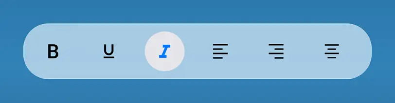
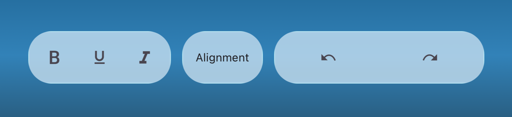

# Liquid Glass Effect in .NET MAUI Toolbar (SfToolbar)

The Liquid Glass Effect introduces a modern, translucent design with adaptive color tinting and light refraction, creating a sleek, glass like user experience that remains clear and accessible. This section explains how to enable and customize the effect in the Syncfusion® .NET MAUI Toolbar (SfToolbar) control.

## Apply liquid glass effect

Follow these steps to enable and configure the Liquid Glass Effect in the Toolbar control:

### Step 1: Enable the liquid glass effect on Toolbar

Set the [EnableLiquidGlassEffect](https://help.syncfusion.com/cr/maui/Syncfusion.Maui.Toolbar.SfToolbar.html#Syncfusion_Maui_Toolbar_SfToolbar_EnableLiquidGlassEffect) property to `true` in the [SfToolbar](https://help.syncfusion.com/cr/maui/Syncfusion.Maui.Toolbar.SfToolbar.html) control to apply the Liquid Glass Effect. When enabled, the effect is also applied to its dependent controls and provides responsive interaction for a smooth and engaging user experience.

### Step 2: Customize the background

To achieve a glass like background in the Toolbar, set the `Background` property to `Transparent`. The background will then be treated as a tinted color, ensuring a consistent glass effect across the controls.

The following code snippet demonstrates how to apply the Liquid Glass Effect to the [SfToolbar](https://help.syncfusion.com/cr/maui/Syncfusion.Maui.Toolbar.SfToolbar.html) control:




<ContentPage
    xmlns="http://schemas.microsoft.com/dotnet/2021/maui"
    xmlns:x="http://schemas.microsoft.com/winfx/2009/xaml"
    xmlns:toolbar="clr-namespace:Syncfusion.Maui.Toolbar;assembly=Syncfusion.Maui.Toolbar"
    x:Class="AcrylicToolbarPage">
    <Grid>
        <Grid.Background>
            <LinearGradientBrush StartPoint="0,0"
                                 EndPoint="0,1">
                <GradientStop Color="#0F4C75"
                              Offset="0.0"/>
                <GradientStop Color="#3282B8"
                              Offset="0.5"/>
                <GradientStop Color="#1B262C"
                              Offset="1.0"/>
            </LinearGradientBrush>
        </Grid.Background>
        <Grid>
            <toolbar:SfToolbar x:Name="Toolbar"
                    EnableLiquidGlassEffect="True"
                    HeightRequest="56"
                    CornerRadius="25"
                    SelectionCornerRadius="25"
                    Background="Transparent">
                <toolbar:SfToolbar.Items>
                    <toolbar:SfToolbarItem Name="Bold">
                        <toolbar:SfToolbarItem.Icon>
                            <FontImageSource Glyph="&#xE770;"
                                             FontFamily="MauiMaterialAssets"/>
                        </toolbar:SfToolbarItem.Icon>
                    </toolbar:SfToolbarItem>
                    <toolbar:SfToolbarItem Name="Underline">
                        <toolbar:SfToolbarItem.Icon>
                            <FontImageSource Glyph="&#xE762;"
                                             FontFamily="MauiMaterialAssets"/>
                        </toolbar:SfToolbarItem.Icon>
                    </toolbar:SfToolbarItem>
                    <toolbar:SfToolbarItem Name="Italic">
                        <toolbar:SfToolbarItem.Icon>
                            <FontImageSource Glyph="&#xE771;"
                                             FontFamily="MauiMaterialAssets"/>
                        </toolbar:SfToolbarItem.Icon>
                    </toolbar:SfToolbarItem>
                    <toolbar:SfToolbarItem Name="AlignLeft">
                        <toolbar:SfToolbarItem.Icon>
                            <FontImageSource Glyph="&#xE751;"
                                             FontFamily="MauiMaterialAssets"/>
                        </toolbar:SfToolbarItem.Icon>
                    </toolbar:SfToolbarItem>
                    <toolbar:SfToolbarItem Name="AlignRight">
                        <toolbar:SfToolbarItem.Icon>
                            <FontImageSource Glyph="&#xE753;"
                                             FontFamily="MauiMaterialAssets"/>
                        </toolbar:SfToolbarItem.Icon>
                    </toolbar:SfToolbarItem>
                    <toolbar:SfToolbarItem Name="AlignCenter">
                        <toolbar:SfToolbarItem.Icon>
                            <FontImageSource Glyph="&#xE752;"
                                             FontFamily="MauiMaterialAssets"/>
                        </toolbar:SfToolbarItem.Icon>
                    </toolbar:SfToolbarItem>
                    <toolbar:SfToolbarItem Name="AlignJustify">
                        <toolbar:SfToolbarItem.Icon>
                            <FontImageSource Glyph="&#xE74F;"
                                             FontFamily="MauiMaterialAssets"/>
                        </toolbar:SfToolbarItem.Icon>
                    </toolbar:SfToolbarItem>
                </toolbar:SfToolbar.Items>
            </toolbar:SfToolbar>
        </Grid>
    </Grid>
</ContentPage>




// Outer grid with gradient background
var mainGrid = new Grid()
{
    Background = new LinearGradientBrush()
    {
        StartPoint = new Point(0, 0),
        EndPoint = new Point(0, 1),
        GradientStops =
        {
            new GradientStop { Color = Color.FromArgb("#0F4C75"), Offset = 0.0f },
            new GradientStop { Color = Color.FromArgb("#3282B8"), Offset = 0.5f },
            new GradientStop { Color = Color.FromArgb("#1B262C"), Offset = 1.0f }
        }
    }
};

// Inner grid with fixed width
var innerGrid = new Grid();

// Toolbar with liquid glass effect
var toolbar = new SfToolbar()
{
    EnableLiquidGlassEffect = true,
    HeightRequest = 56,
    CornerRadius = 25,
    SelectionCornerRadius = 25,
    Background = Colors.Transparent,
};

// Toolbar items
ObservableCollection<BaseToolbarItem> itemCollection = new ObservableCollection<BaseToolbarItem>()
{
    new SfToolbarItem()
    {
        Name = "Bold",
        Icon = new FontImageSource { Glyph = "\uE770", FontFamily = "MauiMaterialAssets" }
    },
    new SfToolbarItem()
    {
        Name = "Underline",
        Icon = new FontImageSource { Glyph = "\uE762", FontFamily = "MauiMaterialAssets" }
    },
    new SfToolbarItem()
    {
        Name = "Italic",
        Icon = new FontImageSource { Glyph = "\uE771", FontFamily = "MauiMaterialAssets" }
    },
    new SfToolbarItem()
    {
        Name = "AlignLeft",
        Icon = new FontImageSource { Glyph = "\uE751", FontFamily = "MauiMaterialAssets" }
    },
    new SfToolbarItem()
    {
        Name = "AlignRight",
        Icon = new FontImageSource { Glyph = "\uE753", FontFamily = "MauiMaterialAssets" }
    },
    new SfToolbarItem()
    {
        Name = "AlignCenter",
        Icon = new FontImageSource { Glyph = "\uE752", FontFamily = "MauiMaterialAssets" }
    },
    new SfToolbarItem()
    {
        Name = "AlignJustify",
        Icon = new FontImageSource { Glyph = "\uE74F", FontFamily = "MauiMaterialAssets" }
    }
};
toolbar.Items = itemCollection;

innerGrid.Children.Add(toolbar);
mainGrid.Children.Add(innerGrid);
this.Content = mainGrid;




## Toolbar Grouping layout

When the Liquid Glass Effect is enabled, the toolbar automatically arrange items into groups. Each group appears as its own rounded rectangle with the glass effect applied. Separator items define where one group ends and the next begins, helping keep the toolbar visually organized.

### Understanding grouping behavior

When `EnableLiquidGlassEffect` is set to true, the toolbar groups consecutive items together.

- **Automatic group detection**: Consecutive toolbar items without a separator are automatically grouped together and rendered as a single glass effect container.
- **Separator-driven organization**: Add a [SeparatorToolbarItem](https://help.syncfusion.com/cr/maui/Syncfusion.Maui.Toolbar.SeparatorToolbarItem.html) to break the current group and start a new one, giving you precise control over group boundaries.
- **Independent glass effect**: Each group receives its own rounded, glass-like background with the liquid glass effect applied, maintaining clear visual separation.

### Customize group spacing with separator stroke thickness

The space between two groups is controlled by the separator’s [StrokeThickness](https://help.syncfusion.com/cr/maui/Syncfusion.Maui.Toolbar.SeparatorToolbarItem.html#Syncfusion_Maui_Toolbar_SeparatorToolbarItem_StrokeThickness) property. This helps you easily adjust spacing without changing the toolbar structure.

The following code snippet demonstrates how to add separator items and adjust the group gaps in the toolbar control:




<ContentPage
    xmlns="http://schemas.microsoft.com/dotnet/2021/maui"
    xmlns:x="http://schemas.microsoft.com/winfx/2009/xaml"
    xmlns:toolbar="clr-namespace:Syncfusion.Maui.Toolbar;assembly=Syncfusion.Maui.Toolbar"
    x:Class="GroupingPage">
    <Grid>
        <Grid.Background>
            <LinearGradientBrush StartPoint="0,0"
                                 EndPoint="0,1">
                <GradientStop Color="#0F4C75"
                              Offset="0.0"/>
                <GradientStop Color="#3282B8"
                              Offset="0.5"/>
                <GradientStop Color="#1B262C"
                              Offset="1.0"/>
            </LinearGradientBrush>
        </Grid.Background>
        <Grid>
            <toolbar:SfToolbar x:Name="Toolbar"
                               EnableLiquidGlassEffect="True"
                               HeightRequest="56"
                               CornerRadius="25"
                               SelectionCornerRadius="25"
                               Background="Transparent"
                               ItemSpacing="8">
                <toolbar:SfToolbar.Items>
                    <toolbar:SfToolbarItem Name="Bold">
                        <toolbar:SfToolbarItem.Icon>
                            <FontImageSource Glyph="&#xE770;"
                                             FontFamily="MauiMaterialAssets"/>
                        </toolbar:SfToolbarItem.Icon>
                    </toolbar:SfToolbarItem>
                    <toolbar:SfToolbarItem Name="Underline">
                        <toolbar:SfToolbarItem.Icon>
                            <FontImageSource Glyph="&#xE762;"
                                             FontFamily="MauiMaterialAssets"/>
                        </toolbar:SfToolbarItem.Icon>
                    </toolbar:SfToolbarItem>
                    <toolbar:SfToolbarItem Name="Italic">
                        <toolbar:SfToolbarItem.Icon>
                            <FontImageSource Glyph="&#xE771;"
                                             FontFamily="MauiMaterialAssets"/>
                        </toolbar:SfToolbarItem.Icon>
                    </toolbar:SfToolbarItem>

                    <!-- Separator with adjustable stroke thickness -->
                    <toolbar:SeparatorToolbarItem StrokeThickness="12"/>

                    <toolbar:SfToolbarItem Name="Alignment"
                                           Text="Alignment"
                                           ToolTipText="Tap to view the overlay toolbar"
                                           Size="70,40">
                        <toolbar:SfToolbarItem.OverlayToolbar>
                            <toolbar:SfOverlayToolbar x:Name="overlaytoolbar">
                                <toolbar:SfOverlayToolbar.Items>
                                    <toolbar:SfToolbarItem Name="AlignLeft"
                                                           ToolTipText="Align-Left">
                                        <toolbar:SfToolbarItem.Icon>
                                            <FontImageSource Glyph="&#xE751;"
                                                             FontFamily="MauiMaterialAssets"/>
                                        </toolbar:SfToolbarItem.Icon>
                                    </toolbar:SfToolbarItem>
                                    <toolbar:SfToolbarItem Name="AlignRight"
                                                           ToolTipText="Align-Right">
                                        <toolbar:SfToolbarItem.Icon>
                                            <FontImageSource Glyph="&#xE753;"
                                                             FontFamily="MauiMaterialAssets"/>
                                        </toolbar:SfToolbarItem.Icon>
                                    </toolbar:SfToolbarItem>
                                    <toolbar:SfToolbarItem Name="AlignCenter"
                                                           ToolTipText="Align-Center">
                                        <toolbar:SfToolbarItem.Icon>
                                            <FontImageSource Glyph="&#xE752;"
                                                             FontFamily="MauiMaterialAssets"/>
                                        </toolbar:SfToolbarItem.Icon>
                                    </toolbar:SfToolbarItem>
                                    <toolbar:SfToolbarItem Name="AlignJustify"
                                                           ToolTipText="Align-Justify">
                                        <toolbar:SfToolbarItem.Icon>
                                            <FontImageSource Glyph="&#xE74F;"
                                                             FontFamily="MauiMaterialAssets"/>
                                        </toolbar:SfToolbarItem.Icon>
                                    </toolbar:SfToolbarItem>
                                </toolbar:SfOverlayToolbar.Items>
                            </toolbar:SfOverlayToolbar>
                        </toolbar:SfToolbarItem.OverlayToolbar>
                    </toolbar:SfToolbarItem>

                    <!-- Separator with adjustable stroke thickness -->
                    <toolbar:SeparatorToolbarItem StrokeThickness="12"/>

                    <toolbar:SfToolbarItem Size="100,40">
                        <toolbar:SfToolbarItem.Icon>
                            <FontImageSource Glyph="&#xE744;"
                                             FontFamily="MauiMaterialAssets"/>
                        </toolbar:SfToolbarItem.Icon>
                    </toolbar:SfToolbarItem>
                    <toolbar:SfToolbarItem
                        Size="100,40">
                        <toolbar:SfToolbarItem.Icon>
                            <FontImageSource Glyph="&#xE745;"
                                             FontFamily="MauiMaterialAssets"/>
                        </toolbar:SfToolbarItem.Icon>
                    </toolbar:SfToolbarItem>
                </toolbar:SfToolbar.Items>
            </toolbar:SfToolbar>
        </Grid>
    </Grid>
</ContentPage>




// Outer grid with gradient background
var mainGrid = new Grid()
{
    Background = new LinearGradientBrush()
    {
        StartPoint = new Point(0, 0),
        EndPoint = new Point(0, 1),
        GradientStops =
        {
            new GradientStop { Color = Color.FromArgb("#0F4C75"), Offset = 0.0f },
            new GradientStop { Color = Color.FromArgb("#3282B8"), Offset = 0.5f },
            new GradientStop { Color = Color.FromArgb("#1B262C"), Offset = 1.0f }
        }
    }
};

// Inner grid
var innerGrid = new Grid();

// Toolbar with liquid glass effect and grouping
var toolbar = new SfToolbar()
{
    EnableLiquidGlassEffect = true,
    HeightRequest = 56,
    CornerRadius = 25,
    SelectionCornerRadius = 25,
    Background = Colors.Transparent,
    ItemSpacing = 8
};

// Create overlay toolbar with alignment options
var overlayToolbar = new SfOverlayToolbar();
overlayToolbar.Items = new ObservableCollection<BaseToolbarItem>()
{
    new SfToolbarItem()
    {
        Name = "AlignLeft",
        Icon = new FontImageSource { Glyph = "\uE751", FontFamily = "MauiMaterialAssets" }
    },
    new SfToolbarItem()
    {
        Name = "AlignRight",
        Icon = new FontImageSource { Glyph = "\uE753", FontFamily = "MauiMaterialAssets" }
    },
    new SfToolbarItem()
    {
        Name = "AlignCenter",
        Icon = new FontImageSource { Glyph = "\uE752", FontFamily = "MauiMaterialAssets" }
    },
    new SfToolbarItem()
    {
        Name = "AlignJustify",
        Icon = new FontImageSource { Glyph = "\uE74F", FontFamily = "MauiMaterialAssets" }
    }
};

// Toolbar items with separators and overlay
ObservableCollection<BaseToolbarItem> itemCollection = new ObservableCollection<BaseToolbarItem>()
{
    // First group: Text formatting
    new SfToolbarItem()
    {
        Name = "Bold",
        Icon = new FontImageSource { Glyph = "\uE770", FontFamily = "MauiMaterialAssets" }
    },
    new SfToolbarItem()
    {
        Name = "Underline",
        Icon = new FontImageSource { Glyph = "\uE762", FontFamily = "MauiMaterialAssets" }
    },
    new SfToolbarItem()
    {
        Name = "Italic",
        Icon = new FontImageSource { Glyph = "\uE771", FontFamily = "MauiMaterialAssets" }
    },
    
    // Separator with adjustable stroke thickness
    new SeparatorToolbarItem() { StrokeThickness = 12 },
    
    // Alignment item with overlay toolbar
    new SfToolbarItem()
    {
        Name = "Alignment",
        Text = "Alignment",
        ToolTipText = "Tap to view the overlay toolbar",
        Size = new Size(70, 40),
        OverlayToolbar = overlayToolbar
    },
    
    // Separator with adjustable stroke thickness
    new SeparatorToolbarItem() { StrokeThickness = 12 },
    
    // Additional items
    new SfToolbarItem()
    {
        Size = new Size(100, 40),
        Icon = new FontImageSource { Glyph = "\uE744", FontFamily = "MauiMaterialAssets" }
    },
    new SfToolbarItem()
    {
        Size = new Size(100, 40),
        Icon = new FontImageSource { Glyph = "\uE745", FontFamily = "MauiMaterialAssets" }
    }
};

toolbar.Items = itemCollection;

innerGrid.Children.Add(toolbar);
mainGrid.Children.Add(innerGrid);
this.Content = mainGrid;




N>
* Supported on `macOS 26 or higher` and `iOS 26 or higher`.
* This feature is available only in `.NET 10.`
* Grouping layout automatically applies when `EnableLiquidGlassEffect` is enabled on the toolbar.
