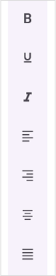

# Orientation in .NET MAUI Toolbar (SfToolbar)

This section covers support for horizontal and vertical layouts, allowing flexible arrangement via the [Orientation](https://help.syncfusion.com/cr/maui/Syncfusion.Maui.Toolbar.SfToolbar.html#Syncfusion_Maui_Toolbar_SfToolbar_Orientation) property . The default value is [Horizontal](https://help.syncfusion.com/cr/maui/Syncfusion.Maui.Toolbar.SfToolbar.html#Syncfusion_Maui_Toolbar_SfToolbar_Orientation).

## Horizontal Toolbar

To set up a horizontal toolbar using the [SfToolbar](https://help.syncfusion.com/cr/maui/Syncfusion.Maui.Toolbar.SfToolbar.html) component in .NET MAUI, you can specify the orientation by setting the [Orientation](https://help.syncfusion.com/cr/maui/Syncfusion.Maui.Toolbar.SfToolbar.html#Syncfusion_Maui_Toolbar_SfToolbar_Orientation) property to [Orientation](https://help.syncfusion.com/cr/maui/Syncfusion.Maui.Toolbar.SfToolbar.html#Syncfusion_Maui_Toolbar_SfToolbar_Orientation). This configuration arranges the toolbar items from left to right across the screen.

The following code sample demonstrates how to create a toolbar control with horizontal layout.





<?xml version="1.0" encoding="utf-8" ?>
<ContentPage xmlns="http://schemas.microsoft.com/dotnet/2021/maui"
             xmlns:x="http://schemas.microsoft.com/winfx/2009/xaml"
             xmlns:local="clr-namespace:ToolbarSample"
             xmlns:toolbar="clr-namespace:Syncfusion.Maui.Toolbar;assembly=Syncfusion.Maui.Toolbar"
             x:Class="ToolbarSample.MainPage">
    <ContentPage.BindingContext>
        <local:TextFormattingViewModel/>
    </ContentPage.BindingContext>
    <Grid>
        <toolbar:SfToolbar x:Name="Toolbar"
                        Items="{Binding ToolbarItems}"
                        Orientation="Horizontal"
                        HeightRequest="56"/>
    </Grid>
</ContentPage>





using Syncfusion.Maui.Toolbar;

namespace ToolbarSample
{
    public partial class MainPage : ContentPage
    {
        public MainPage()
        {
            InitializeComponent();
            SfToolbar toolbar = new SfToolbar();
            TextFormattingViewModel viewModel = new TextFormattingViewModel();
            toolbar.HeightRequest = 56;
            toolbar.Items = viewModel.ToolbarItems;
            toolbar.Orientation = ToolbarOrientation.Horizontal;
            this.Content = toolbar;
        }
    }
}





public class TextFormattingViewModel
{
    private ObservableCollection<BaseToolbarItem> toolbarItems = new ObservableCollection<BaseToolbarItem>();

    public ObservableCollection<BaseToolbarItem> ToolbarItems
    {
        get { return toolbarItems; }
        set { toolbarItems = value; }
    }

    public TextFormattingViewModel()
    {
        ToolbarItems.Add(new SfToolbarItem
        {
            Name = "Bold",
            ToolTipText = "Bold",
            Icon = new FontImageSource { Glyph = "\uE770", FontFamily = "MauiMaterialAssets" }
        });

        ToolbarItems.Add(new SfToolbarItem
        {
            Name = "Underline",
            ToolTipText = "Underline",
            Icon = new FontImageSource { Glyph = "\uE762", FontFamily = "MauiMaterialAssets" }
        });

        ToolbarItems.Add(new SfToolbarItem
        {
            Name = "Italic",
            ToolTipText = "Italic",
            Icon = new FontImageSource { Glyph = "\uE771", FontFamily = "MauiMaterialAssets" }
        });

        ToolbarItems.Add(new SfToolbarItem
        {
            Name = "AlignLeft",
            ToolTipText = "Align-Left",
            Icon = new FontImageSource { Glyph = "\uE751", FontFamily = "MauiMaterialAssets" }
        });

        ToolbarItems.Add(new SfToolbarItem
        {
            Name = "AlignRight",
            ToolTipText = "Align-Right",
            Icon = new FontImageSource { Glyph = "\uE753", FontFamily = "MauiMaterialAssets" }
        });

        ToolbarItems.Add(new SfToolbarItem
        {
            Name = "AlignCenter",
            ToolTipText = "Align-Center",
            Icon = new FontImageSource { Glyph = "\uE752", FontFamily = "MauiMaterialAssets" }
        });

        ToolbarItems.Add(new SfToolbarItem
        {
            Name = "AlignJustify",
            ToolTipText = "Align-Justify",
            Icon = new FontImageSource { Glyph = "\uE74F", FontFamily = "MauiMaterialAssets" }
        });
    }
}





## Vertical Toolbar

To set up a Vertical toolbar using the SfToolbar component in .NET MAUI, you can specify the orientation by setting the [Orientation](https://help.syncfusion.com/cr/maui/Syncfusion.Maui.Toolbar.SfToolbar.html#Syncfusion_Maui_Toolbar_SfToolbar_Orientation) property to [Vertical](https://help.syncfusion.com/cr/maui/Syncfusion.Maui.Toolbar.ToolbarOrientation.html#Syncfusion_Maui_Toolbar_ToolbarOrientation_Vertical). This configuration arranges the toolbar items from top to bottom across the screen.

The following code sample demonstrates how to create a toolbar control with vertical layout.




<?xml version="1.0" encoding="utf-8" ?>
<ContentPage xmlns="http://schemas.microsoft.com/dotnet/2021/maui"
             xmlns:x="http://schemas.microsoft.com/winfx/2009/xaml"
             xmlns:local="clr-namespace:ToolbarSample"
             xmlns:toolbar="clr-namespace:Syncfusion.Maui.Toolbar;assembly=Syncfusion.Maui.Toolbar"
             x:Class="ToolbarSample.MainPage">
    <ContentPage.BindingContext>
        <local:TextFormattingViewModel/>
    </ContentPage.BindingContext>
    <Grid>
        <toolbar:SfToolbar x:Name="Toolbar"
                    Items="{Binding ToolbarItems}"
                    Orientation="Vertical"
                    WidthRequest="56"
        />
    </Grid>
</ContentPage>





using Syncfusion.Maui.Toolbar;

namespace ToolbarSample
{
    public partial class MainPage : ContentPage
    {
        public MainPage()
        {
            InitializeComponent();
            SfToolbar toolbar = new SfToolbar();
            TextFormattingViewModel viewModel = new TextFormattingViewModel();
            toolbar.Items = viewModel.ToolbarItems;
            toolbar.WidthRequest = 56;
            toolbar.Orientation = ToolbarOrientation.Vertical;
            this.Content = toolbar;
        }
    }
}





public class TextFormattingViewModel
{
    private ObservableCollection<BaseToolbarItem> toolbarItems = new ObservableCollection<BaseToolbarItem>();

    public ObservableCollection<BaseToolbarItem> ToolbarItems
    {
        get { return toolbarItems; }
        set { toolbarItems = value; }
    }

    public TextFormattingViewModel()
    {
        ToolbarItems.Add(new SfToolbarItem
        {
            Name = "Bold",
            ToolTipText = "Bold",
            Icon = new FontImageSource { Glyph = "\uE770", FontFamily = "MauiMaterialAssets" }
        });

        ToolbarItems.Add(new SfToolbarItem
        {
            Name = "Underline",
            ToolTipText = "Underline",
            Icon = new FontImageSource { Glyph = "\uE762", FontFamily = "MauiMaterialAssets" }
        });

        ToolbarItems.Add(new SfToolbarItem
        {
            Name = "Italic",
            ToolTipText = "Italic",
            Icon = new FontImageSource { Glyph = "\uE771", FontFamily = "MauiMaterialAssets" }
        });

        ToolbarItems.Add(new SfToolbarItem
        {
            Name = "AlignLeft",
            ToolTipText = "Align-Left",
            Icon = new FontImageSource { Glyph = "\uE751", FontFamily = "MauiMaterialAssets" }
        });

        ToolbarItems.Add(new SfToolbarItem
        {
            Name = "AlignRight",
            ToolTipText = "Align-Right",
            Icon = new FontImageSource { Glyph = "\uE753", FontFamily = "MauiMaterialAssets" }
        });

        ToolbarItems.Add(new SfToolbarItem
        {
            Name = "AlignCenter",
            ToolTipText = "Align-Center",
            Icon = new FontImageSource { Glyph = "\uE752", FontFamily = "MauiMaterialAssets" }
        });

        ToolbarItems.Add(new SfToolbarItem
        {
            Name = "AlignJustify",
            ToolTipText = "Align-Justify",
            Icon = new FontImageSource { Glyph = "\uE74F", FontFamily = "MauiMaterialAssets" }
        });
    }
}





