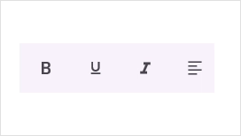
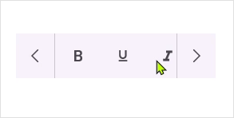
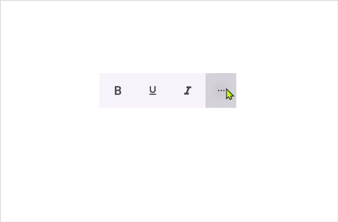
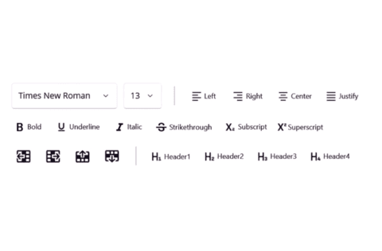
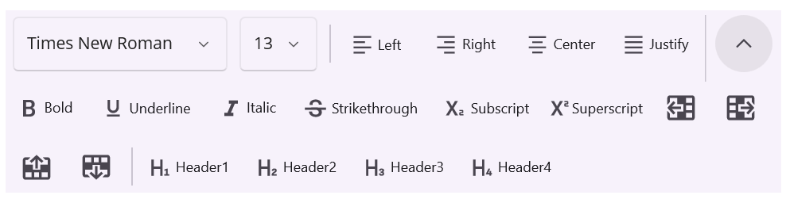

# Overflow Mode in .NET MAUI Toolbar (SfToolbar)

This section explains the ways about how overflowing items are managed - [Scroll](https://help.syncfusion.com/cr/maui/Syncfusion.Maui.Toolbar.ToolbarItemOverflowMode.html#Syncfusion_Maui_Toolbar_ToolbarItemOverflowMode_Scroll) for continuous navigation, [NavigationButtons](https://help.syncfusion.com/cr/maui/Syncfusion.Maui.Toolbar.ToolbarItemOverflowMode.html#Syncfusion_Maui_Toolbar_ToolbarItemOverflowMode_NavigationButtons) for stepping through items, and [MoreButton](https://help.syncfusion.com/cr/maui/Syncfusion.Maui.Toolbar.ToolbarItemOverflowMode.html#Syncfusion_Maui_Toolbar_ToolbarItemOverflowMode_MoreButton) to display excess items in a dropdown.

## Scroll Mode

The Toolbar control enables scrolling when its items extend beyond the view. By default, the [OverflowMode](https://help.syncfusion.com/cr/maui/Syncfusion.Maui.Toolbar.SfToolbar.html#Syncfusion_Maui_Toolbar_SfToolbar_OverflowMode) property is set to [Scroll](https://help.syncfusion.com/cr/maui/Syncfusion.Maui.Toolbar.ToolbarItemOverflowMode.html#Syncfusion_Maui_Toolbar_ToolbarItemOverflowMode_Scroll).





<?xml version="1.0" encoding="utf-8" ?>
<ContentPage xmlns="http://schemas.microsoft.com/dotnet/2021/maui"
             xmlns:x="http://schemas.microsoft.com/winfx/2009/xaml"
             xmlns:local="clr-namespace:ToolbarSample"
             xmlns:toolbar="clr-namespace:Syncfusion.Maui.Toolbar;assembly=Syncfusion.Maui.Toolbar"
             x:Class="ToolbarSample.MainPage">
    <Grid>
    <toolbar:SfToolbar x:Name="Toolbar" HeightRequest="56" WidthRequest="220" OverflowMode="Scroll">
        <toolbar:SfToolbar.Items>
            <toolbar:SfToolbarItem Name="Bold"
                    ToolTipText="Bold">
                <toolbar:SfToolbarItem.Icon>
                    <FontImageSource Glyph="&#xE770;"
                                FontFamily="MauiMaterialAssets" />
                </toolbar:SfToolbarItem.Icon>
            </toolbar:SfToolbarItem>
            <toolbar:SfToolbarItem Name="Underline"
                    ToolTipText="Underline">
                <toolbar:SfToolbarItem.Icon>
                    <FontImageSource Glyph="&#xE762;"
                                FontFamily="MauiMaterialAssets" />
                </toolbar:SfToolbarItem.Icon>
            </toolbar:SfToolbarItem>
            <toolbar:SfToolbarItem Name="Italic"
                    ToolTipText="Italic">
                <toolbar:SfToolbarItem.Icon>
                    <FontImageSource Glyph="&#xE771;"
                                FontFamily="MauiMaterialAssets" />
                </toolbar:SfToolbarItem.Icon>
            </toolbar:SfToolbarItem>
            <toolbar:SfToolbarItem Name="AlignLeft"
                            ToolTipText="Align-Left">
                <toolbar:SfToolbarItem.Icon>
                    <FontImageSource Glyph="&#xE751;"
                                FontFamily="MauiMaterialAssets" />
                </toolbar:SfToolbarItem.Icon>
            </toolbar:SfToolbarItem>
            <toolbar:SfToolbarItem Name="AlignRight"
                            ToolTipText="Align-Right">
                <toolbar:SfToolbarItem.Icon>
                    <FontImageSource Glyph="&#xE753;"
                    FontFamily="MauiMaterialAssets" />
                </toolbar:SfToolbarItem.Icon>
            </toolbar:SfToolbarItem>
            <toolbar:SfToolbarItem Name="AlignCenter"
                            ToolTipText="Align-Center">
                <toolbar:SfToolbarItem.Icon>
                    <FontImageSource Glyph="&#xE752;"
                    FontFamily="MauiMaterialAssets" />
                </toolbar:SfToolbarItem.Icon>
            </toolbar:SfToolbarItem>
            <toolbar:SfToolbarItem Name="AlignJustify"
                            ToolTipText="Align-Justify">
                <toolbar:SfToolbarItem.Icon>
                    <FontImageSource Glyph="&#xE74F;"
                    FontFamily="MauiMaterialAssets" />
                </toolbar:SfToolbarItem.Icon>
            </toolbar:SfToolbarItem>
        </toolbar:SfToolbar.Items>
    </toolbar:SfToolbar>
    </Grid>
</ContentPage>





using Syncfusion.Maui.Toolbar;

namespace ToolbarSample
{
    public partial class MainPage : ContentPage
    {
        public MainPage()
        {
            InitializeComponent();

            SfToolbar toolbar = new SfToolbar();
            toolbar.HeightRequest = 56;
            toolbar.WidthRequest = 220;
            toolbar.OverflowMode = ToolbarItemOverflowMode.Scroll;
            ObservableCollection<BaseToolbarItem> itemCollection = new ObservableCollection<BaseToolbarItem>
            {
                new SfToolbarItem
                {
                    Name = "Bold",
                    ToolTipText = "Bold",
                    Icon = new FontImageSource { Glyph = "\uE770", FontFamily = "MauiMaterialAssets" }
                },
                new SfToolbarItem
                {
                    Name = "Underline",
                    ToolTipText = "Underline",
                    Icon = new FontImageSource { Glyph = "\uE762", FontFamily = "MauiMaterialAssets" }
                },
                new SfToolbarItem
                {
                    Name = "Italic",
                    ToolTipText = "Italic",
                    Icon = new FontImageSource { Glyph = "\uE771", FontFamily = "MauiMaterialAssets" }
                },
                new SfToolbarItem
                {
                    Name = "AlignLeft",
                    ToolTipText = "Align-Left",
                    Icon = new FontImageSource { Glyph = "\uE751", FontFamily = "MauiMaterialAssets" }
                },
                new SfToolbarItem
                {
                    Name = "AlignRight",
                    ToolTipText = "Align-Right",
                    Icon = new FontImageSource { Glyph = "\uE753", FontFamily = "MauiMaterialAssets" }
                },
                new SfToolbarItem
                {
                    Name = "AlignCenter",
                    ToolTipText = "Align-Center",
                    Icon = new FontImageSource { Glyph = "\uE752", FontFamily = "MauiMaterialAssets" }
                },
                new SfToolbarItem
                {
                    Name = "AlignJustify",
                    ToolTipText = "Align-Justify",
                    Icon = new FontImageSource { Glyph = "\uE74F", FontFamily = "MauiMaterialAssets" }
                }
            };
            toolbar.Items = itemCollection;
            this.Content = toolbar;
        }
    }
}





## Navigation Buttons

The Toolbar control provides support for navigating buttons to display the overflow items by setting the [OverflowMode](https://help.syncfusion.com/cr/maui/Syncfusion.Maui.Toolbar.SfToolbar.html#Syncfusion_Maui_Toolbar_SfToolbar_OverflowMode) property to [NavigationButtons](https://help.syncfusion.com/cr/maui/Syncfusion.Maui.Toolbar.ToolbarItemOverflowMode.html#Syncfusion_Maui_Toolbar_ToolbarItemOverflowMode_NavigationButtons).





<?xml version="1.0" encoding="utf-8" ?>
<ContentPage xmlns="http://schemas.microsoft.com/dotnet/2021/maui"
             xmlns:x="http://schemas.microsoft.com/winfx/2009/xaml"
             xmlns:local="clr-namespace:ToolbarSample"
             xmlns:syncfusion="clr-namespace:Syncfusion.Maui.Toolbar;assembly=Syncfusion.Maui.Toolbar"
             x:Class="ToolbarSample.MainPage">
<Grid>
    <toolbar:SfToolbar x:Name="Toolbar" HeightRequest="56" WidthRequest="220" OverflowMode="NavigationButtons">
        <toolbar:SfToolbar.Items>
            <toolbar:SfToolbarItem Name="Bold"
                    ToolTipText="Bold">
                <toolbar:SfToolbarItem.Icon>
                    <FontImageSource Glyph="&#xE770;"
                                FontFamily="MauiMaterialAssets" />
                </toolbar:SfToolbarItem.Icon>
            </toolbar:SfToolbarItem>
            <toolbar:SfToolbarItem Name="Underline"
                    ToolTipText="Underline">
                <toolbar:SfToolbarItem.Icon>
                    <FontImageSource Glyph="&#xE762;"
                                FontFamily="MauiMaterialAssets" />
                </toolbar:SfToolbarItem.Icon>
            </toolbar:SfToolbarItem>
            <toolbar:SfToolbarItem Name="Italic"
                    ToolTipText="Italic">
                <toolbar:SfToolbarItem.Icon>
                    <FontImageSource Glyph="&#xE771;"
                                FontFamily="MauiMaterialAssets" />
                </toolbar:SfToolbarItem.Icon>
            </toolbar:SfToolbarItem>
            <toolbar:SfToolbarItem Name="AlignLeft"
                            ToolTipText="Align-Left">
                <toolbar:SfToolbarItem.Icon>
                    <FontImageSource Glyph="&#xE751;"
                                FontFamily="MauiMaterialAssets" />
                </toolbar:SfToolbarItem.Icon>
            </toolbar:SfToolbarItem>
            <toolbar:SfToolbarItem Name="AlignRight"
                            ToolTipText="Align-Right">
                <toolbar:SfToolbarItem.Icon>
                    <FontImageSource Glyph="&#xE753;"
                    FontFamily="MauiMaterialAssets" />
                </toolbar:SfToolbarItem.Icon>
            </toolbar:SfToolbarItem>
            <toolbar:SfToolbarItem Name="AlignCenter"
                            ToolTipText="Align-Center">
                <toolbar:SfToolbarItem.Icon>
                    <FontImageSource Glyph="&#xE752;"
                    FontFamily="MauiMaterialAssets" />
                </toolbar:SfToolbarItem.Icon>
            </toolbar:SfToolbarItem>
            <toolbar:SfToolbarItem Name="AlignJustify"
                            ToolTipText="Align-Justify">
                <toolbar:SfToolbarItem.Icon>
                    <FontImageSource Glyph="&#xE74F;"
                    FontFamily="MauiMaterialAssets" />
                </toolbar:SfToolbarItem.Icon>
            </toolbar:SfToolbarItem>
        </toolbar:SfToolbar.Items>
    </toolbar:SfToolbar>
    </Grid>
</ContentPage>





using Syncfusion.Maui.Toolbar;

namespace ToolbarSample
{
    public partial class MainPage : ContentPage
    {
        public MainPage()
        {
            InitializeComponent();

            SfToolbar toolbar = new SfToolbar();
            toolbar.HeightRequest = 56;
            toolbar.WidthRequest = 220;
            toolbar.OverflowMode = ToolbarItemOverflowMode.NavigationButtons;
            ObservableCollection<BaseToolbarItem> itemCollection = new ObservableCollection<BaseToolbarItem>
            {
                new SfToolbarItem
                {
                    Name = "Bold",
                    ToolTipText = "Bold",
                    Icon = new FontImageSource { Glyph = "\uE770", FontFamily = "MauiMaterialAssets" }
                },
                new SfToolbarItem
                {
                    Name = "Underline",
                    ToolTipText = "Underline",
                    Icon = new FontImageSource { Glyph = "\uE762", FontFamily = "MauiMaterialAssets" }
                },
                new SfToolbarItem
                {
                    Name = "Italic",
                    ToolTipText = "Italic",
                    Icon = new FontImageSource { Glyph = "\uE771", FontFamily = "MauiMaterialAssets" }
                },
                new SfToolbarItem
                {
                    Name = "AlignLeft",
                    ToolTipText = "Align-Left",
                    Icon = new FontImageSource { Glyph = "\uE751", FontFamily = "MauiMaterialAssets" }
                },
                new SfToolbarItem
                {
                    Name = "AlignRight",
                    ToolTipText = "Align-Right",
                    Icon = new FontImageSource { Glyph = "\uE753", FontFamily = "MauiMaterialAssets" }
                },
                new SfToolbarItem
                {
                    Name = "AlignCenter",
                    ToolTipText = "Align-Center",
                    Icon = new FontImageSource { Glyph = "\uE752", FontFamily = "MauiMaterialAssets" }
                },
                new SfToolbarItem
                {
                    Name = "AlignJustify",
                    ToolTipText = "Align-Justify",
                    Icon = new FontImageSource { Glyph = "\uE74F", FontFamily = "MauiMaterialAssets" }
                }
            };
            toolbar.Items = itemCollection;
            this.Content = toolbar;
        }
    }
}





## More Items Menu

The Toolbar control displays additional items in a dropdown menu when they extend beyond the view. This can be enabled by setting the [OverflowMode](https://help.syncfusion.com/cr/maui/Syncfusion.Maui.Toolbar.SfToolbar.html#Syncfusion_Maui_Toolbar_SfToolbar_OverflowMode) property to [MoreButton](https://help.syncfusion.com/cr/maui/Syncfusion.Maui.Toolbar.ToolbarItemOverflowMode.html#Syncfusion_Maui_Toolbar_ToolbarItemOverflowMode_MoreButton).

The following code sample demonstrates how to display more items in the overflow menu.





<?xml version="1.0" encoding="utf-8" ?>
<ContentPage xmlns="http://schemas.microsoft.com/dotnet/2021/maui"
             xmlns:x="http://schemas.microsoft.com/winfx/2009/xaml"
             xmlns:local="clr-namespace:ToolbarSample"
             xmlns:syncfusion="clr-namespace:Syncfusion.Maui.Toolbar;assembly=Syncfusion.Maui.Toolbar"
             x:Class="ToolbarSample.MainPage">
    <Grid>
        <toolbar:SfToolbar x:Name="Toolbar" HeightRequest="56" WidthRequest="220" OverflowMode="MoreButton">
        <toolbar:SfToolbar.Items>
            <toolbar:SfToolbarItem Name="Bold"
                ToolTipText="Bold">
                <toolbar:SfToolbarItem.Icon>
                    <FontImageSource Glyph="&#xE770;"
                            FontFamily="MauiMaterialAssets" />
                </toolbar:SfToolbarItem.Icon>
            </toolbar:SfToolbarItem>
            <toolbar:SfToolbarItem Name="Underline"
                ToolTipText="Underline">
                <toolbar:SfToolbarItem.Icon>
                    <FontImageSource Glyph="&#xE762;"
                            FontFamily="MauiMaterialAssets" />
                </toolbar:SfToolbarItem.Icon>
            </toolbar:SfToolbarItem>
            <toolbar:SfToolbarItem Name="Italic"
                ToolTipText="Italic">
                <toolbar:SfToolbarItem.Icon>
                    <FontImageSource Glyph="&#xE771;"
                            FontFamily="MauiMaterialAssets" />
                </toolbar:SfToolbarItem.Icon>
            </toolbar:SfToolbarItem>
            <toolbar:SfToolbarItem Name="AlignLeft"
                        ToolTipText="Align-Left">
                <toolbar:SfToolbarItem.Icon>
                    <FontImageSource Glyph="&#xE751;"
                            FontFamily="MauiMaterialAssets" />
                </toolbar:SfToolbarItem.Icon>
            </toolbar:SfToolbarItem>
            <toolbar:SfToolbarItem Name="AlignRight"
                        ToolTipText="Align-Right">
                <toolbar:SfToolbarItem.Icon>
                    <FontImageSource Glyph="&#xE753;"
                FontFamily="MauiMaterialAssets" />
                </toolbar:SfToolbarItem.Icon>
            </toolbar:SfToolbarItem>
            <toolbar:SfToolbarItem Name="AlignCenter"
                        ToolTipText="Align-Center">
                <toolbar:SfToolbarItem.Icon>
                    <FontImageSource Glyph="&#xE752;"
                FontFamily="MauiMaterialAssets" />
                </toolbar:SfToolbarItem.Icon>
            </toolbar:SfToolbarItem>
            <toolbar:SfToolbarItem Name="AlignJustify"
                        ToolTipText="Align-Justify">
                <toolbar:SfToolbarItem.Icon>
                    <FontImageSource Glyph="&#xE74F;"
                FontFamily="MauiMaterialAssets" />
                </toolbar:SfToolbarItem.Icon>
            </toolbar:SfToolbarItem>
        </toolbar:SfToolbar.Items>
    </toolbar:SfToolbar>
    </Grid>
</ContentPage>





using Syncfusion.Maui.Toolbar;

namespace ToolbarSample
{
    public partial class MainPage : ContentPage
    {
        public MainPage()
        {
            InitializeComponent();

            SfToolbar toolbar = new SfToolbar();
            toolbar.HeightRequest = 56;
            toolbar.WidthRequest = 220;
            toolbar.OverflowMode = ToolbarItemOverflowMode.MoreButton;

            ObservableCollection<BaseToolbarItem> itemCollection = new ObservableCollection<BaseToolbarItem>
            {
                new SfToolbarItem
                {
                    Name = "Bold",
                    ToolTipText = "Bold",
                    Icon = new FontImageSource { Glyph = "\uE770", FontFamily = "MauiMaterialAssets" }
                },
                new SfToolbarItem
                {
                    Name = "Underline",
                    ToolTipText = "Underline",
                    Icon = new FontImageSource { Glyph = "\uE762", FontFamily = "MauiMaterialAssets" }
                },
                new SfToolbarItem
                {
                    Name = "Italic",
                    ToolTipText = "Italic",
                    Icon = new FontImageSource { Glyph = "\uE771", FontFamily = "MauiMaterialAssets" }
                },
                new SfToolbarItem
                {
                    Name = "AlignLeft",
                    ToolTipText = "Align-Left",
                    Icon = new FontImageSource { Glyph = "\uE751", FontFamily = "MauiMaterialAssets" }
                },
                new SfToolbarItem
                {
                    Name = "AlignRight",
                    ToolTipText = "Align-Right",
                    Icon = new FontImageSource { Glyph = "\uE753", FontFamily = "MauiMaterialAssets" }
                },
                new SfToolbarItem
                {
                    Name = "AlignCenter",
                    ToolTipText = "Align-Center",
                    Icon = new FontImageSource { Glyph = "\uE752", FontFamily = "MauiMaterialAssets" }
                },
                new SfToolbarItem
                {
                    Name = "AlignJustify",
                    ToolTipText = "Align-Justify",
                    Icon = new FontImageSource { Glyph = "\uE74F", FontFamily = "MauiMaterialAssets" }
                }
            };

            toolbar.Items = itemCollection;
            this.Content = toolbar;
        }
    }
}





### More Items Menu Position

The Toolbar control provides support for changing the position of the More button using the [MoreItemsRelativePosition](https://help.syncfusion.com/cr/maui/Syncfusion.Maui.Toolbar.SfToolbar.html#Syncfusion_Maui_Toolbar_SfToolbar_MoreItemsRelativePosition) property. The default value of this property is [Auto](https://help.syncfusion.com/cr/maui/Syncfusion.Maui.Toolbar.ToolbarRelativePosition.html#Syncfusion_Maui_Toolbar_ToolbarRelativePosition_Auto). You can change the position of the More button by setting the [MoreItemsRelativePosition](https://help.syncfusion.com/cr/maui/Syncfusion.Maui.Toolbar.SfToolbar.html#Syncfusion_Maui_Toolbar_SfToolbar_MoreItemsRelativePosition) property to [Left](https://help.syncfusion.com/cr/maui/Syncfusion.Maui.Toolbar.ToolbarRelativePosition.html#Syncfusion_Maui_Toolbar_ToolbarRelativePosition_Left), [Right](https://help.syncfusion.com/cr/maui/Syncfusion.Maui.Toolbar.ToolbarRelativePosition.html#Syncfusion_Maui_Toolbar_ToolbarRelativePosition_Right), [Top](https://help.syncfusion.com/cr/maui/Syncfusion.Maui.Toolbar.ToolbarRelativePosition.html#Syncfusion_Maui_Toolbar_ToolbarRelativePosition_Top), or [Bottom](https://help.syncfusion.com/cr/maui/Syncfusion.Maui.Toolbar.ToolbarRelativePosition.html#Syncfusion_Maui_Toolbar_ToolbarRelativePosition_Bottom).





<?xml version="1.0" encoding="utf-8" ?>
<ContentPage xmlns="http://schemas.microsoft.com/dotnet/2021/maui"
             xmlns:x="http://schemas.microsoft.com/winfx/2009/xaml"
             xmlns:local="clr-namespace:ToolbarSample"
             xmlns:syncfusion="clr-namespace:Syncfusion.Maui.Toolbar;assembly=Syncfusion.Maui.Toolbar"
             x:Class="ToolbarSample.MainPage">
        <Grid>
        <toolbar:SfToolbar x:Name="Toolbar" HeightRequest="56" WidthRequest="220" OverflowMode="MoreButton" MoreItemsRelativePosition="Right">
        <toolbar:SfToolbar.Items>
            <toolbar:SfToolbarItem Name="Bold"
                ToolTipText="Bold">
                <toolbar:SfToolbarItem.Icon>
                    <FontImageSource Glyph="&#xE770;"
                            FontFamily="MauiMaterialAssets" />
                </toolbar:SfToolbarItem.Icon>
            </toolbar:SfToolbarItem>
            <toolbar:SfToolbarItem Name="Underline"
                ToolTipText="Underline">
                <toolbar:SfToolbarItem.Icon>
                    <FontImageSource Glyph="&#xE762;"
                            FontFamily="MauiMaterialAssets" />
                </toolbar:SfToolbarItem.Icon>
            </toolbar:SfToolbarItem>
            <toolbar:SfToolbarItem Name="Italic"
                ToolTipText="Italic">
                <toolbar:SfToolbarItem.Icon>
                    <FontImageSource Glyph="&#xE771;"
                            FontFamily="MauiMaterialAssets" />
                </toolbar:SfToolbarItem.Icon>
            </toolbar:SfToolbarItem>
            <toolbar:SfToolbarItem Name="AlignLeft"
                        ToolTipText="Align-Left">
                <toolbar:SfToolbarItem.Icon>
                    <FontImageSource Glyph="&#xE751;"
                            FontFamily="MauiMaterialAssets" />
                </toolbar:SfToolbarItem.Icon>
            </toolbar:SfToolbarItem>
            <toolbar:SfToolbarItem Name="AlignRight"
                        ToolTipText="Align-Right">
                <toolbar:SfToolbarItem.Icon>
                    <FontImageSource Glyph="&#xE753;"
                FontFamily="MauiMaterialAssets" />
                </toolbar:SfToolbarItem.Icon>
            </toolbar:SfToolbarItem>
            <toolbar:SfToolbarItem Name="AlignCenter"
                        ToolTipText="Align-Center">
                <toolbar:SfToolbarItem.Icon>
                    <FontImageSource Glyph="&#xE752;"
                FontFamily="MauiMaterialAssets" />
                </toolbar:SfToolbarItem.Icon>
            </toolbar:SfToolbarItem>
            <toolbar:SfToolbarItem Name="AlignJustify"
                        ToolTipText="Align-Justify">
                <toolbar:SfToolbarItem.Icon>
                    <FontImageSource Glyph="&#xE74F;"
                FontFamily="MauiMaterialAssets" />
                </toolbar:SfToolbarItem.Icon>
            </toolbar:SfToolbarItem>
        </toolbar:SfToolbar.Items>
    </toolbar:SfToolbar>    
    </Grid>
</ContentPage>





using Syncfusion.Maui.Toolbar;

namespace ToolbarSample
{
    public partial class MainPage : ContentPage
    {
        public MainPage()
        {
            InitializeComponent();

            SfToolbar toolbar = new SfToolbar();
            toolbar.HeightRequest = 56;
            toolbar.WidthRequest = 220;
            toolbar.OverflowMode = ToolbarItemOverflowMode.MoreButton;
            toolbar.MoreItemsRelativePosition = ToolbarRelativePosition.Right;

            ObservableCollection<BaseToolbarItem> itemCollection = new ObservableCollection<BaseToolbarItem>
            {
                new SfToolbarItem
                {
                    Name = "Bold",
                    ToolTipText = "Bold",
                    Icon = new FontImageSource { Glyph = "\uE770", FontFamily = "MauiMaterialAssets" }
                },
                new SfToolbarItem
                {
                    Name = "Underline",
                    ToolTipText = "Underline",
                    Icon = new FontImageSource { Glyph = "\uE762", FontFamily = "MauiMaterialAssets" }
                },
                new SfToolbarItem
                {
                    Name = "Italic",
                    ToolTipText = "Italic",
                    Icon = new FontImageSource { Glyph = "\uE771", FontFamily = "MauiMaterialAssets" }
                },
                new SfToolbarItem
                {
                    Name = "AlignLeft",
                    ToolTipText = "Align-Left",
                    Icon = new FontImageSource { Glyph = "\uE751", FontFamily = "MauiMaterialAssets" }
                },
                new SfToolbarItem
                {
                    Name = "AlignRight",
                    ToolTipText = "Align-Right",
                    Icon = new FontImageSource { Glyph = "\uE753", FontFamily = "MauiMaterialAssets" }
                },
                new SfToolbarItem
                {
                    Name = "AlignCenter",
                    ToolTipText = "Align-Center",
                    Icon = new FontImageSource { Glyph = "\uE752", FontFamily = "MauiMaterialAssets" }
                },
                new SfToolbarItem
                {
                    Name = "AlignJustify",
                    ToolTipText = "Align-Justify",
                    Icon = new FontImageSource { Glyph = "\uE74F", FontFamily = "MauiMaterialAssets" }
                }
            };

            toolbar.Items = itemCollection;
            this.Content = toolbar;
        }
    }
}





### Cancel the default item dropdown view

The In-build more items drop down menu view can be cancelled with the help of `Cancel` parameter in the [MoreButtonTapped](https://help.syncfusion.com/cr/maui/Syncfusion.Maui.Toolbar.ToolbarMoreButtonTappedEventArgs.html) event.





<toolbar:SfToolbar x:Name="Toolbar" 
                    HeightRequest="56" 
                    WidthRequest="220"
                    MoreButtonTapped="OnMoreButtonTapped" 
                    OverflowMode="MoreButton">
</toolbar:SfToolbar>





this.toolbar.MoreButtonTapped += this.OnMoreButtonTapped;
private void OnMoreButtonTapped(object? sender, ToolbarMoreButtonTappedEventArgs e)
{
    e.Cancel = true;
    var moreItems = e.ToolbarItems;
}





## MultiRow

The Toolbar now supports showing items on multiple rows by setting the [OverflowMode](https://help.syncfusion.com/cr/maui/Syncfusion.Maui.Toolbar.SfToolbar.html#Syncfusion_Maui_Toolbar_SfToolbar_OverflowMode) property to [MultiRow](https://help.syncfusion.com/cr/maui/Syncfusion.Maui.Toolbar.ToolbarItemOverflowMode.html#Syncfusion_Maui_Toolbar_ToolbarItemOverflowMode_MultiRow).When enabled, items wrap to additional rows based on available width, making it easier to manage many items.




<toolbar:SfToolbar ItemSpacing="10"
            WidthRequest="650"
            HeightRequest="200"
            OverflowMode="MultiRow">
        <toolbar:SfToolbar.Items>
            <toolbar:SfToolbarItem>
                <toolbar:SfToolbarItem.View>
                    <Picker Margin="0,50,0,0"
                            WidthRequest="180">
                        <Picker.Items>
                            <x:String>Calibri</x:String>
                            <x:String>Arial</x:String>
                            <x:String>Times New Roman</x:String>
                            <x:String>Georgia</x:String>
                            <x:String>Verdana</x:String>
                        </Picker.Items>
                    </Picker>
                </toolbar:SfToolbarItem.View>
            </toolbar:SfToolbarItem>
            <toolbar:SfToolbarItem>
                <toolbar:SfToolbarItem.View>
                    <Picker WidthRequest="65">
                        <Picker.Items>
                            <x:String>11</x:String>
                            <x:String>12</x:String>
                            <x:String>13</x:String>
                            <x:String>14</x:String>
                            <x:String>15</x:String>
                        </Picker.Items>
                    </Picker>
                </toolbar:SfToolbarItem.View>
            </toolbar:SfToolbarItem>
            <toolbar:SeparatorToolbarItem/>
            <toolbar:SfToolbarItem Name="AlignLeft"
                                   Text="Left"
                                   TextPosition="Right"
                                   ToolTipText="Align-Left"
                                   Size="60,40">
                <toolbar:SfToolbarItem.Icon>
                    <FontImageSource Glyph="&#xE751;"
                                     FontFamily="MauiMaterialAssets"/>
                </toolbar:SfToolbarItem.Icon>
            </toolbar:SfToolbarItem>
            <toolbar:SfToolbarItem Name="AlignRight"
                                   Text="Right"
                                   TextPosition="Right"
                                   ToolTipText="Align-Right"
                                   Size="70,40">
                <toolbar:SfToolbarItem.Icon>
                    <FontImageSource Glyph="&#xE753;"
                                     FontFamily="MauiMaterialAssets"/>
                </toolbar:SfToolbarItem.Icon>
            </toolbar:SfToolbarItem>
            <toolbar:SfToolbarItem Name="AlignCenter"
                                   Text="Center"
                                   TextPosition="Right"
                                   ToolTipText="Align-Center"
                                   Size="70,40">
                <toolbar:SfToolbarItem.Icon>
                    <FontImageSource Glyph="&#xE752;"
                                     FontFamily="MauiMaterialAssets"/>
                </toolbar:SfToolbarItem.Icon>
            </toolbar:SfToolbarItem>
            <toolbar:SfToolbarItem Name="AlignJustify"
                                   Text="Justify"
                                   TextPosition="Right"
                                   ToolTipText="Align-Justify"
                                   Size="70,40">
                <toolbar:SfToolbarItem.Icon>
                    <FontImageSource Glyph="&#xE74F;"
                                     FontFamily="MauiMaterialAssets"/>
                </toolbar:SfToolbarItem.Icon>
            </toolbar:SfToolbarItem>
            <toolbar:SfToolbarItem Name="Bold"
                                   Text="Bold"
                                   TextPosition="Right"
                                   ToolTipText="Bold"
                                   Size="60,40">
                <toolbar:SfToolbarItem.Icon>
                    <FontImageSource Glyph="&#xE770;"
                                     FontFamily="MauiMaterialAssets"/>
                </toolbar:SfToolbarItem.Icon>
            </toolbar:SfToolbarItem>
            <toolbar:SfToolbarItem Name="Underline"
                                   Text="Underline"
                                   TextPosition="Right"
                                   ToolTipText="Underline"
                                   Size="90,40">
                <toolbar:SfToolbarItem.Icon>
                    <FontImageSource Glyph="&#xE762;"
                                     FontFamily="MauiMaterialAssets"/>
                </toolbar:SfToolbarItem.Icon>
            </toolbar:SfToolbarItem>
            <toolbar:SfToolbarItem Name="Italic"
                                   Text="Italic"
                                   TextPosition="Right"
                                   ToolTipText="Italic"
                                   Size="60,40">
                <toolbar:SfToolbarItem.Icon>
                    <FontImageSource Glyph="&#xE771;"
                                     FontFamily="MauiMaterialAssets"/>
                </toolbar:SfToolbarItem.Icon>
            </toolbar:SfToolbarItem>
            <toolbar:SfToolbarItem Name="Strikethrough"
                                   Text="Strikethrough"
                                   TextPosition="Right"
                                   ToolTipText="Strikethrough"
                                   Size="110,40">
                <toolbar:SfToolbarItem.Icon>
                    <FontImageSource Glyph="&#xE763;"
                                     FontFamily="MauiMaterialAssets"/>
                </toolbar:SfToolbarItem.Icon>
            </toolbar:SfToolbarItem>
            <toolbar:SfToolbarItem Name="Subscript"
                                   Text="Subscript"
                                   TextPosition="Right"
                                   ToolTipText="Subscript"
                                   Size="80,40">
                <toolbar:SfToolbarItem.Icon>
                    <FontImageSource Glyph="&#xE7A8;"
                                     FontFamily="MauiMaterialAssets"/>
                </toolbar:SfToolbarItem.Icon>
            </toolbar:SfToolbarItem>
            <toolbar:SfToolbarItem Name="Superscript"
                                   Text="Superscript"
                                   TextPosition="Right"
                                   ToolTipText="Superscript"
                                   Size="80,40">
                <toolbar:SfToolbarItem.Icon>
                    <FontImageSource Glyph="&#xE7A9;"
                                     FontFamily="MauiMaterialAssets"/>
                </toolbar:SfToolbarItem.Icon>
            </toolbar:SfToolbarItem>
            <toolbar:SfToolbarItem Name="InsertLeft"
                                   TextPosition="Right"
                                   ToolTipText="Insert-Left"
                                   IconSize="25"
                                   Size="40,40">
                <toolbar:SfToolbarItem.Icon>
                    <FontImageSource Glyph="&#xE7C0;"
                                     FontFamily="MauiMaterialAssets"/>
                </toolbar:SfToolbarItem.Icon>
            </toolbar:SfToolbarItem>
            <toolbar:SfToolbarItem Name="InsertRight"
                                   TextPosition="Right"
                                   ToolTipText="Insert-Right"
                                   IconSize="25"
                                   Size="40,40">
                <toolbar:SfToolbarItem.Icon>
                    <FontImageSource Glyph="&#xE7C1;"
                                     FontFamily="MauiMaterialAssets"/>
                </toolbar:SfToolbarItem.Icon>
            </toolbar:SfToolbarItem>
            <toolbar:SfToolbarItem Name="InsertUp"
                                   TextPosition="Right"
                                   ToolTipText="Insert-Up"
                                   IconSize="25"
                                   Size="40,40">
                <toolbar:SfToolbarItem.Icon>
                    <FontImageSource Glyph="&#xE7C2;"
                                     FontFamily="MauiMaterialAssets"/>
                </toolbar:SfToolbarItem.Icon>
            </toolbar:SfToolbarItem>
            <toolbar:SfToolbarItem Name="InsertDown"
                                   TextPosition="Right"
                                   IconSize="25"
                                   ToolTipText="Insert-Down"
                                   Size="40,40">
                <toolbar:SfToolbarItem.Icon>
                    <FontImageSource Glyph="&#xE7C3;"
                                     FontFamily="MauiMaterialAssets"/>
                </toolbar:SfToolbarItem.Icon>
            </toolbar:SfToolbarItem>
            <toolbar:SeparatorToolbarItem/>
            <toolbar:SfToolbarItem Name="Header1"
                                   Text="Header1"
                                   TextPosition="Right"
                                   ToolTipText="Header1"
                                   Size="80,40">
                <toolbar:SfToolbarItem.Icon>
                    <FontImageSource Glyph="&#xE7C8;"
                                     FontFamily="MauiMaterialAssets"/>
                </toolbar:SfToolbarItem.Icon>
            </toolbar:SfToolbarItem>
            <toolbar:SfToolbarItem Name="Header2"
                                   Text="Header2"
                                   TextPosition="Right"
                                   ToolTipText="Header2"
                                   Size="80,40">
                <toolbar:SfToolbarItem.Icon>
                    <FontImageSource Glyph="&#xE7C9;"
                                     FontFamily="MauiMaterialAssets"/>
                </toolbar:SfToolbarItem.Icon>
            </toolbar:SfToolbarItem>
            <toolbar:SfToolbarItem Name="Header3"
                                   Text="Header3"
                                   TextPosition="Right"
                                   ToolTipText="Header3"
                                   Size="80,40">
                <toolbar:SfToolbarItem.Icon>
                    <FontImageSource Glyph="&#xE7CA;"
                                     FontFamily="MauiMaterialAssets"/>
                </toolbar:SfToolbarItem.Icon>
            </toolbar:SfToolbarItem>
            <toolbar:SfToolbarItem Name="Header4"
                                   Text="Header4"
                                   TextPosition="Right"
                                   ToolTipText="Header4"
                                   Size="80,40">
                <toolbar:SfToolbarItem.Icon>
                    <FontImageSource Glyph="&#xE7CB;"
                                     FontFamily="MauiMaterialAssets"/>
                </toolbar:SfToolbarItem.Icon>
            </toolbar:SfToolbarItem>
        </toolbar:SfToolbar.Items>
    </toolbar:SfToolbar>





public MainPage()
{
    InitializeComponent();
    SfToolbar toolbar = new SfToolbar
    {
        ItemSpacing = 10,
        WidthRequest = 650,
        HeightRequest = 200,
        OverflowMode = ToolbarItemOverflowMode.MultiRow
    };

    // Picker: Fonts
    var fontPicker = new Picker
    {
        Margin = new Thickness(0, 50, 0, 0),
        WidthRequest = 180
    };
    fontPicker.Items.Add("Calibri");
    fontPicker.Items.Add("Arial");
    fontPicker.Items.Add("Times New Roman");
    fontPicker.Items.Add("Georgia");
    fontPicker.Items.Add("Verdana");

    toolbar.Items.Add(new SfToolbarItem
    {
        View = fontPicker
    });

    // Picker: Font sizes
    var sizePicker = new Picker
    {
        WidthRequest = 65
    };
    sizePicker.Items.Add("11");
    sizePicker.Items.Add("12");
    sizePicker.Items.Add("13");
    sizePicker.Items.Add("14");
    sizePicker.Items.Add("15");

    toolbar.Items.Add(new SfToolbarItem
    {
        View = sizePicker
    });

    // Separators
    toolbar.Items.Add(new SeparatorToolbarItem());

    // Align Left
    toolbar.Items.Add(new SfToolbarItem
    {
        Name = "AlignLeft",
        Text = "Left",
        TextPosition = ToolbarItemTextPosition.Right,
        ToolTipText = "Align-Left",
        Size = new Size(60, 40),
        Icon = new FontImageSource
        {
            Glyph = "\uE751",
            FontFamily = "MauiMaterialAssets"
        }
    });

    // Align Right
    toolbar.Items.Add(new SfToolbarItem
    {
        Name = "AlignRight",
        Text = "Right",
        TextPosition = ToolbarItemTextPosition.Right,
        ToolTipText = "Align-Right",
        Size = new Size(70, 40),
        Icon = new FontImageSource
        {
            Glyph = "\uE753",
            FontFamily = "MauiMaterialAssets"
        }
    });

    // Align Center
    toolbar.Items.Add(new SfToolbarItem
    {
        Name = "AlignCenter",
        Text = "Center",
        TextPosition = ToolbarItemTextPosition.Right,
        ToolTipText = "Align-Center",
        Size = new Size(70, 40),
        Icon = new FontImageSource
        {
            Glyph = "\uE752",
            FontFamily = "MauiMaterialAssets"
        }
    });

    // Align Justify
    toolbar.Items.Add(new SfToolbarItem
    {
        Name = "AlignJustify",
        Text = "Justify",
        TextPosition = ToolbarItemTextPosition.Right,
        ToolTipText = "Align-Justify",
        Size = new Size(70, 40),
        Icon = new FontImageSource
        {
            Glyph = "\uE74F",
            FontFamily = "MauiMaterialAssets"
        }
    });

    // Bold
    toolbar.Items.Add(new SfToolbarItem
    {
        Name = "Bold",
        Text = "Bold",
        TextPosition = ToolbarItemTextPosition.Right,
        ToolTipText = "Bold",
        Size = new Size(60, 40),
        Icon = new FontImageSource
        {
            Glyph = "\uE770",
            FontFamily = "MauiMaterialAssets"
        }
    });

    // Underline
    toolbar.Items.Add(new SfToolbarItem
    {
        Name = "Underline",
        Text = "Underline",
        TextPosition = ToolbarItemTextPosition.Right,
        ToolTipText = "Underline",
        Size = new Size(90, 40),
        Icon = new FontImageSource
        {
            Glyph = "\uE762",
            FontFamily = "MauiMaterialAssets"
        }
    });

    // Italic
    toolbar.Items.Add(new SfToolbarItem
    {
        Name = "Italic",
        Text = "Italic",
        TextPosition = ToolbarItemTextPosition.Right,
        ToolTipText = "Italic",
        Size = new Size(60, 40),
        Icon = new FontImageSource
        {
            Glyph = "\uE771",
            FontFamily = "MauiMaterialAssets"
        }
    });

    // Strikethrough
    toolbar.Items.Add(new SfToolbarItem
    {
        Name = "Strikethrough",
        Text = "Strikethrough",
        TextPosition = ToolbarItemTextPosition.Right,
        ToolTipText = "Strikethrough",
        Size = new Size(110, 40),
        Icon = new FontImageSource
        {
            Glyph = "\uE763",
            FontFamily = "MauiMaterialAssets"
        }
    });

    // Subscript
    toolbar.Items.Add(new SfToolbarItem
    {
        Name = "Subscript",
        Text = "Subscript",
        TextPosition = ToolbarItemTextPosition.Right,
        ToolTipText = "Subscript",
        Size = new Size(80, 40),
        Icon = new FontImageSource
        {
            Glyph = "\uE7A8",
            FontFamily = "MauiMaterialAssets"
        }
    });

    // Superscript
    toolbar.Items.Add(new SfToolbarItem
    {
        Name = "Superscript",
        Text = "Superscript",
        TextPosition = ToolbarItemTextPosition.Right,
        ToolTipText = "Superscript",
        Size = new Size(80, 40),
        Icon = new FontImageSource
        {
            Glyph = "\uE7A9",
            FontFamily = "MauiMaterialAssets"
        }
    });

    // Insert Left
    toolbar.Items.Add(new SfToolbarItem
    {
        Name = "InsertLeft",
        TextPosition = ToolbarItemTextPosition.Right,
        ToolTipText = "Insert-Left",
        IconSize = 25,
        Size = new Size(40, 40),
        Icon = new FontImageSource
        {
            Glyph = "\uE7C0",
            FontFamily = "MauiMaterialAssets"
        }
    });

    // Insert Right
    toolbar.Items.Add(new SfToolbarItem
    {
        Name = "InsertRight",
        TextPosition = ToolbarItemTextPosition.Right,
        ToolTipText = "Insert-Right",
        IconSize = 25,
        Size = new Size(40, 40),
        Icon = new FontImageSource
        {
            Glyph = "\uE7C1",
            FontFamily = "MauiMaterialAssets"
        }
    });

    // Insert Up
    toolbar.Items.Add(new SfToolbarItem
    {
        Name = "InsertUp",
        TextPosition = ToolbarItemTextPosition.Right,
        ToolTipText = "Insert-Up",
        IconSize = 25,
        Size = new Size(40, 40),
        Icon = new FontImageSource
        {
            Glyph = "\uE7C2",
            FontFamily = "MauiMaterialAssets"
        }
    });

    // Insert Down
    toolbar.Items.Add(new SfToolbarItem
    {
        Name = "InsertDown",
        TextPosition = ToolbarItemTextPosition.Right,
        ToolTipText = "Insert-Down",
        IconSize = 25,
        Size = new Size(40, 40),
        Icon = new FontImageSource
        {
            Glyph = "\uE7C3",
            FontFamily = "MauiMaterialAssets"
        }
    });

    // Separators group
    toolbar.Items.Add(new SeparatorToolbarItem { Stroke = Colors.Transparent });
    toolbar.Items.Add(new SeparatorToolbarItem());
    toolbar.Items.Add(new SeparatorToolbarItem { Stroke = Colors.Transparent });

    // Header 1
    toolbar.Items.Add(new SfToolbarItem
    {
        Name = "Header1",
        Text = "Header1",
        TextPosition = ToolbarItemTextPosition.Right,
        ToolTipText = "Header1",
        Size = new Size(80, 40),
        Icon = new FontImageSource
        {
            Glyph = "\uE7C8",
            FontFamily = "MauiMaterialAssets"
        }
    });

    // Header 2
    toolbar.Items.Add(new SfToolbarItem
    {
        Name = "Header2",
        Text = "Header2",
        TextPosition = ToolbarItemTextPosition.Right,
        ToolTipText = "Header2",
        Size = new Size(80, 40),
        Icon = new FontImageSource
        {
            Glyph = "\uE7C9",
            FontFamily = "MauiMaterialAssets"
        }
    });

    // Header 3
    toolbar.Items.Add(new SfToolbarItem
    {
        Name = "Header3",
        Text = "Header3",
        TextPosition = ToolbarItemTextPosition.Right,
        ToolTipText = "Header3",
        Size = new Size(80, 40),
        Icon = new FontImageSource
        {
            Glyph = "\uE7CA",
            FontFamily = "MauiMaterialAssets"
        }
    });

    // Header 4
    toolbar.Items.Add(new SfToolbarItem
    {
        Name = "Header4",
        Text = "Header4",
        TextPosition = ToolbarItemTextPosition.Right,
        ToolTipText = "Header4",
        Size = new Size(80, 40),
        Icon = new FontImageSource
        {
            Glyph = "\uE7CB",
            FontFamily = "MauiMaterialAssets"
        }
    });

    this.Content = toolbar;
}





## Extended Row

Experience a more interactive Toolbar with `Extended Row` Support. When your items extend beyond the view, simply click the extended button to expand and display them on additional rows, making navigation seamless and efficient. Enable this feature by setting the [OverflowMode](https://help.syncfusion.com/cr/maui/Syncfusion.Maui.Toolbar.SfToolbar.html#Syncfusion_Maui_Toolbar_SfToolbar_OverflowMode) property to [Extended](https://help.syncfusion.com/cr/maui/Syncfusion.Maui.Toolbar.ToolbarItemOverflowMode.html#Syncfusion_Maui_Toolbar_ToolbarItemOverflowMode_Extended).




<toolbar:SfToolbar ItemSpacing="10"
            WidthRequest="650"
            VerticalOptions="Center"
            OverflowMode="Extended">
        <toolbar:SfToolbar.Items>
            <toolbar:SfToolbarItem>
                <toolbar:SfToolbarItem.View>
                    <Picker Margin="0,5"
                            WidthRequest="180">
                        <Picker.Items>
                            <x:String>Calibri</x:String>
                            <x:String>Arial</x:String>
                            <x:String>Times New Roman</x:String>
                            <x:String>Georgia</x:String>
                            <x:String>Verdana</x:String>
                        </Picker.Items>
                    </Picker>
                </toolbar:SfToolbarItem.View>
            </toolbar:SfToolbarItem>
            <toolbar:SfToolbarItem>
                <toolbar:SfToolbarItem.View>
                    <Picker Margin="0,5" WidthRequest="65">
                        <Picker.Items>
                            <x:String>11</x:String>
                            <x:String>12</x:String>
                            <x:String>13</x:String>
                            <x:String>14</x:String>
                            <x:String>15</x:String>
                        </Picker.Items>
                    </Picker>
                </toolbar:SfToolbarItem.View>
            </toolbar:SfToolbarItem>
            <toolbar:SeparatorToolbarItem/>
            <toolbar:SfToolbarItem Name="AlignLeft"
                                   Text="Left"
                                   TextPosition="Right"
                                   ToolTipText="Align-Left"
                                   Size="60,40">
                <toolbar:SfToolbarItem.Icon>
                    <FontImageSource Glyph="&#xE751;"
                                     FontFamily="MauiMaterialAssets"/>
                </toolbar:SfToolbarItem.Icon>
            </toolbar:SfToolbarItem>
            <toolbar:SfToolbarItem Name="AlignRight"
                                   Text="Right"
                                   TextPosition="Right"
                                   ToolTipText="Align-Right"
                                   Size="70,40">
                <toolbar:SfToolbarItem.Icon>
                    <FontImageSource Glyph="&#xE753;"
                                     FontFamily="MauiMaterialAssets"/>
                </toolbar:SfToolbarItem.Icon>
            </toolbar:SfToolbarItem>
            <toolbar:SfToolbarItem Name="AlignCenter"
                                   Text="Center"
                                   TextPosition="Right"
                                   ToolTipText="Align-Center"
                                   Size="70,40">
                <toolbar:SfToolbarItem.Icon>
                    <FontImageSource Glyph="&#xE752;"
                                     FontFamily="MauiMaterialAssets"/>
                </toolbar:SfToolbarItem.Icon>
            </toolbar:SfToolbarItem>
            <toolbar:SfToolbarItem Name="AlignJustify"
                                   Text="Justify"
                                   TextPosition="Right"
                                   ToolTipText="Align-Justify"
                                   Size="70,40">
                <toolbar:SfToolbarItem.Icon>
                    <FontImageSource Glyph="&#xE74F;"
                                     FontFamily="MauiMaterialAssets"/>
                </toolbar:SfToolbarItem.Icon>
            </toolbar:SfToolbarItem>
            <toolbar:SfToolbarItem Name="Bold"
                                   Text="Bold"
                                   TextPosition="Right"
                                   ToolTipText="Bold"
                                   Size="60,40">
                <toolbar:SfToolbarItem.Icon>
                    <FontImageSource Glyph="&#xE770;"
                                     FontFamily="MauiMaterialAssets"/>
                </toolbar:SfToolbarItem.Icon>
            </toolbar:SfToolbarItem>
            <toolbar:SfToolbarItem Name="Underline"
                                   Text="Underline"
                                   TextPosition="Right"
                                   ToolTipText="Underline"
                                   Size="90,40">
                <toolbar:SfToolbarItem.Icon>
                    <FontImageSource Glyph="&#xE762;"
                                     FontFamily="MauiMaterialAssets"/>
                </toolbar:SfToolbarItem.Icon>
            </toolbar:SfToolbarItem>
            <toolbar:SfToolbarItem Name="Italic"
                                   Text="Italic"
                                   TextPosition="Right"
                                   ToolTipText="Italic"
                                   Size="60,40">
                <toolbar:SfToolbarItem.Icon>
                    <FontImageSource Glyph="&#xE771;"
                                     FontFamily="MauiMaterialAssets"/>
                </toolbar:SfToolbarItem.Icon>
            </toolbar:SfToolbarItem>
            <toolbar:SfToolbarItem Name="Strikethrough"
                                   Text="Strikethrough"
                                   TextPosition="Right"
                                   ToolTipText="Strikethrough"
                                   Size="110,40">
                <toolbar:SfToolbarItem.Icon>
                    <FontImageSource Glyph="&#xE763;"
                                     FontFamily="MauiMaterialAssets"/>
                </toolbar:SfToolbarItem.Icon>
            </toolbar:SfToolbarItem>
            <toolbar:SfToolbarItem Name="Subscript"
                                   Text="Subscript"
                                   TextPosition="Right"
                                   ToolTipText="Subscript"
                                   Size="80,40">
                <toolbar:SfToolbarItem.Icon>
                    <FontImageSource Glyph="&#xE7A8;"
                                     FontFamily="MauiMaterialAssets"/>
                </toolbar:SfToolbarItem.Icon>
            </toolbar:SfToolbarItem>
            <toolbar:SfToolbarItem Name="Superscript"
                                   Text="Superscript"
                                   TextPosition="Right"
                                   ToolTipText="Superscript"
                                   Size="80,40">
                <toolbar:SfToolbarItem.Icon>
                    <FontImageSource Glyph="&#xE7A9;"
                                     FontFamily="MauiMaterialAssets"/>
                </toolbar:SfToolbarItem.Icon>
            </toolbar:SfToolbarItem>
            <toolbar:SfToolbarItem Name="InsertLeft"
                                   TextPosition="Right"
                                   ToolTipText="Insert-Left"
                                   IconSize="25"
                                   Size="40,40">
                <toolbar:SfToolbarItem.Icon>
                    <FontImageSource Glyph="&#xE7C0;"
                                     FontFamily="MauiMaterialAssets"/>
                </toolbar:SfToolbarItem.Icon>
            </toolbar:SfToolbarItem>
            <toolbar:SfToolbarItem Name="InsertRight"
                                   TextPosition="Right"
                                   ToolTipText="Insert-Right"
                                   IconSize="25"
                                   Size="40,40">
                <toolbar:SfToolbarItem.Icon>
                    <FontImageSource Glyph="&#xE7C1;"
                                     FontFamily="MauiMaterialAssets"/>
                </toolbar:SfToolbarItem.Icon>
            </toolbar:SfToolbarItem>
            <toolbar:SfToolbarItem Name="InsertUp"
                                   TextPosition="Right"
                                   ToolTipText="Insert-Up"
                                   IconSize="25"
                                   Size="40,40">
                <toolbar:SfToolbarItem.Icon>
                    <FontImageSource Glyph="&#xE7C2;"
                                     FontFamily="MauiMaterialAssets"/>
                </toolbar:SfToolbarItem.Icon>
            </toolbar:SfToolbarItem>
            <toolbar:SfToolbarItem Name="InsertDown"
                                   TextPosition="Right"
                                   IconSize="25"
                                   ToolTipText="Insert-Down"
                                   Size="40,40">
                <toolbar:SfToolbarItem.Icon>
                    <FontImageSource Glyph="&#xE7C3;"
                                     FontFamily="MauiMaterialAssets"/>
                </toolbar:SfToolbarItem.Icon>
            </toolbar:SfToolbarItem>
            <toolbar:SeparatorToolbarItem/>
            <toolbar:SfToolbarItem Name="Header1"
                                   Text="Header1"
                                   TextPosition="Right"
                                   ToolTipText="Header1"
                                   Size="80,40">
                <toolbar:SfToolbarItem.Icon>
                    <FontImageSource Glyph="&#xE7C8;"
                                     FontFamily="MauiMaterialAssets"/>
                </toolbar:SfToolbarItem.Icon>
            </toolbar:SfToolbarItem>
            <toolbar:SfToolbarItem Name="Header2"
                                   Text="Header2"
                                   TextPosition="Right"
                                   ToolTipText="Header2"
                                   Size="80,40">
                <toolbar:SfToolbarItem.Icon>
                    <FontImageSource Glyph="&#xE7C9;"
                                     FontFamily="MauiMaterialAssets"/>
                </toolbar:SfToolbarItem.Icon>
            </toolbar:SfToolbarItem>
            <toolbar:SfToolbarItem Name="Header3"
                                   Text="Header3"
                                   TextPosition="Right"
                                   ToolTipText="Header3"
                                   Size="80,40">
                <toolbar:SfToolbarItem.Icon>
                    <FontImageSource Glyph="&#xE7CA;"
                                     FontFamily="MauiMaterialAssets"/>
                </toolbar:SfToolbarItem.Icon>
            </toolbar:SfToolbarItem>
            <toolbar:SfToolbarItem Name="Header4"
                                   Text="Header4"
                                   TextPosition="Right"
                                   ToolTipText="Header4"
                                   Size="80,40">
                <toolbar:SfToolbarItem.Icon>
                    <FontImageSource Glyph="&#xE7CB;"
                                     FontFamily="MauiMaterialAssets"/>
                </toolbar:SfToolbarItem.Icon>
            </toolbar:SfToolbarItem>
        </toolbar:SfToolbar.Items>
    </toolbar:SfToolbar>





public MainPage()
{
    InitializeComponent();
    SfToolbar toolbar = new SfToolbar
    {
        ItemSpacing = 10,
        WidthRequest = 650,
        VerticalOptions = LayoutOptions.Center,
        OverflowMode = ToolbarItemOverflowMode.MultiRow
    };

    // Picker: Fonts
    var fontPicker = new Picker
    {
        Margin = new Thickness(0, 5, 0, 5),
        WidthRequest = 180
    };
    fontPicker.Items.Add("Calibri");
    fontPicker.Items.Add("Arial");
    fontPicker.Items.Add("Times New Roman");
    fontPicker.Items.Add("Georgia");
    fontPicker.Items.Add("Verdana");

    toolbar.Items.Add(new SfToolbarItem
    {
        View = fontPicker
    });

    // Picker: Font sizes
    var sizePicker = new Picker
    {
        Margin = new Thickness(0, 5, 0, 5),
        WidthRequest = 65
    };
    sizePicker.Items.Add("11");
    sizePicker.Items.Add("12");
    sizePicker.Items.Add("13");
    sizePicker.Items.Add("14");
    sizePicker.Items.Add("15");

    toolbar.Items.Add(new SfToolbarItem
    {
        View = sizePicker
    });

    // Separators
    toolbar.Items.Add(new SeparatorToolbarItem());

    // Align Left
    toolbar.Items.Add(new SfToolbarItem
    {
        Name = "AlignLeft",
        Text = "Left",
        TextPosition = ToolbarItemTextPosition.Right,
        ToolTipText = "Align-Left",
        Size = new Size(60, 40),
        Icon = new FontImageSource
        {
            Glyph = "\uE751",
            FontFamily = "MauiMaterialAssets"
        }
    });

    // Align Right
    toolbar.Items.Add(new SfToolbarItem
    {
        Name = "AlignRight",
        Text = "Right",
        TextPosition = ToolbarItemTextPosition.Right,
        ToolTipText = "Align-Right",
        Size = new Size(70, 40),
        Icon = new FontImageSource
        {
            Glyph = "\uE753",
            FontFamily = "MauiMaterialAssets"
        }
    });

    // Align Center
    toolbar.Items.Add(new SfToolbarItem
    {
        Name = "AlignCenter",
        Text = "Center",
        TextPosition = ToolbarItemTextPosition.Right,
        ToolTipText = "Align-Center",
        Size = new Size(70, 40),
        Icon = new FontImageSource
        {
            Glyph = "\uE752",
            FontFamily = "MauiMaterialAssets"
        }
    });

    // Align Justify
    toolbar.Items.Add(new SfToolbarItem
    {
        Name = "AlignJustify",
        Text = "Justify",
        TextPosition = ToolbarItemTextPosition.Right,
        ToolTipText = "Align-Justify",
        Size = new Size(70, 40),
        Icon = new FontImageSource
        {
            Glyph = "\uE74F",
            FontFamily = "MauiMaterialAssets"
        }
    });

    // Bold
    toolbar.Items.Add(new SfToolbarItem
    {
        Name = "Bold",
        Text = "Bold",
        TextPosition = ToolbarItemTextPosition.Right,
        ToolTipText = "Bold",
        Size = new Size(60, 40),
        Icon = new FontImageSource
        {
            Glyph = "\uE770",
            FontFamily = "MauiMaterialAssets"
        }
    });

    // Underline
    toolbar.Items.Add(new SfToolbarItem
    {
        Name = "Underline",
        Text = "Underline",
        TextPosition = ToolbarItemTextPosition.Right,
        ToolTipText = "Underline",
        Size = new Size(90, 40),
        Icon = new FontImageSource
        {
            Glyph = "\uE762",
            FontFamily = "MauiMaterialAssets"
        }
    });

    // Italic
    toolbar.Items.Add(new SfToolbarItem
    {
        Name = "Italic",
        Text = "Italic",
        TextPosition = ToolbarItemTextPosition.Right,
        ToolTipText = "Italic",
        Size = new Size(60, 40),
        Icon = new FontImageSource
        {
            Glyph = "\uE771",
            FontFamily = "MauiMaterialAssets"
        }
    });

    // Strikethrough
    toolbar.Items.Add(new SfToolbarItem
    {
        Name = "Strikethrough",
        Text = "Strikethrough",
        TextPosition = ToolbarItemTextPosition.Right,
        ToolTipText = "Strikethrough",
        Size = new Size(110, 40),
        Icon = new FontImageSource
        {
            Glyph = "\uE763",
            FontFamily = "MauiMaterialAssets"
        }
    });

    // Subscript
    toolbar.Items.Add(new SfToolbarItem
    {
        Name = "Subscript",
        Text = "Subscript",
        TextPosition = ToolbarItemTextPosition.Right,
        ToolTipText = "Subscript",
        Size = new Size(80, 40),
        Icon = new FontImageSource
        {
            Glyph = "\uE7A8",
            FontFamily = "MauiMaterialAssets"
        }
    });

    // Superscript
    toolbar.Items.Add(new SfToolbarItem
    {
        Name = "Superscript",
        Text = "Superscript",
        TextPosition = ToolbarItemTextPosition.Right,
        ToolTipText = "Superscript",
        Size = new Size(80, 40),
        Icon = new FontImageSource
        {
            Glyph = "\uE7A9",
            FontFamily = "MauiMaterialAssets"
        }
    });

    // Insert Left
    toolbar.Items.Add(new SfToolbarItem
    {
        Name = "InsertLeft",
        TextPosition = ToolbarItemTextPosition.Right,
        ToolTipText = "Insert-Left",
        IconSize = 25,
        Size = new Size(40, 40),
        Icon = new FontImageSource
        {
            Glyph = "\uE7C0",
            FontFamily = "MauiMaterialAssets"
        }
    });

    // Insert Right
    toolbar.Items.Add(new SfToolbarItem
    {
        Name = "InsertRight",
        TextPosition = ToolbarItemTextPosition.Right,
        ToolTipText = "Insert-Right",
        IconSize = 25,
        Size = new Size(40, 40),
        Icon = new FontImageSource
        {
            Glyph = "\uE7C1",
            FontFamily = "MauiMaterialAssets"
        }
    });

    // Insert Up
    toolbar.Items.Add(new SfToolbarItem
    {
        Name = "InsertUp",
        TextPosition = ToolbarItemTextPosition.Right,
        ToolTipText = "Insert-Up",
        IconSize = 25,
        Size = new Size(40, 40),
        Icon = new FontImageSource
        {
            Glyph = "\uE7C2",
            FontFamily = "MauiMaterialAssets"
        }
    });

    // Insert Down
    toolbar.Items.Add(new SfToolbarItem
    {
        Name = "InsertDown",
        TextPosition = ToolbarItemTextPosition.Right,
        ToolTipText = "Insert-Down",
        IconSize = 25,
        Size = new Size(40, 40),
        Icon = new FontImageSource
        {
            Glyph = "\uE7C3",
            FontFamily = "MauiMaterialAssets"
        }
    });

    // Separators group
    toolbar.Items.Add(new SeparatorToolbarItem { Stroke = Colors.Transparent });
    toolbar.Items.Add(new SeparatorToolbarItem());
    toolbar.Items.Add(new SeparatorToolbarItem { Stroke = Colors.Transparent });

    // Header 1
    toolbar.Items.Add(new SfToolbarItem
    {
        Name = "Header1",
        Text = "Header1",
        TextPosition = ToolbarItemTextPosition.Right,
        ToolTipText = "Header1",
        Size = new Size(80, 40),
        Icon = new FontImageSource
        {
            Glyph = "\uE7C8",
            FontFamily = "MauiMaterialAssets"
        }
    });

    // Header 2
    toolbar.Items.Add(new SfToolbarItem
    {
        Name = "Header2",
        Text = "Header2",
        TextPosition = ToolbarItemTextPosition.Right,
        ToolTipText = "Header2",
        Size = new Size(80, 40),
        Icon = new FontImageSource
        {
            Glyph = "\uE7C9",
            FontFamily = "MauiMaterialAssets"
        }
    });

    // Header 3
    toolbar.Items.Add(new SfToolbarItem
    {
        Name = "Header3",
        Text = "Header3",
        TextPosition = ToolbarItemTextPosition.Right,
        ToolTipText = "Header3",
        Size = new Size(80, 40),
        Icon = new FontImageSource
        {
            Glyph = "\uE7CA",
            FontFamily = "MauiMaterialAssets"
        }
    });

    // Header 4
    toolbar.Items.Add(new SfToolbarItem
    {
        Name = "Header4",
        Text = "Header4",
        TextPosition = ToolbarItemTextPosition.Right,
        ToolTipText = "Header4",
        Size = new Size(80, 40),
        Icon = new FontImageSource
        {
            Glyph = "\uE7CB",
            FontFamily = "MauiMaterialAssets"
        }
    });

    this.Content = toolbar;
}





