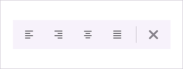

# Overlay Toolbar in .NET MAUI Toolbar (SfToolbar)

The toolbar control supports displaying an overlay toolbar in the view. You can add the [SfOverlayToolbar](https://help.syncfusion.com/cr/maui/Syncfusion.Maui.Toolbar.SfOverlayToolbar.html) to the [OverlayToolbar](https://help.syncfusion.com/cr/maui/Syncfusion.Maui.Toolbar.SfToolbarItem.html#Syncfusion_Maui_Toolbar_SfToolbarItem_OverlayToolbar) property of [SfToolbarItem](https://help.syncfusion.com/cr/maui/Syncfusion.Maui.Toolbar.SfToolbarItem.html). The [SfOverlayToolbar](https://help.syncfusion.com/cr/maui/Syncfusion.Maui.Toolbar.SfOverlayToolbar.html) includes a built-in back button, which can be used to close the overlay toolbar.

## How to display the overlay toolbar

To display an overlay toolbar, define the `OverlayToolbar` property for a toolbar item. When the toolbar item is tapped, the overlay toolbar will appear. The following example shows how to add an overlay toolbar to a toolbar item.





<?xml version="1.0" encoding="utf-8" ?>
<ContentPage xmlns="http://schemas.microsoft.com/dotnet/2021/maui"
             xmlns:x="http://schemas.microsoft.com/winfx/2009/xaml"
             xmlns:local="clr-namespace:ToolbarSample"
             xmlns:toolbar="clr-namespace:Syncfusion.Maui.Toolbar;assembly=Syncfusion.Maui.Toolbar"
             x:Class="ToolbarSample.MainPage">
    <Grid x:Name="layout">
        <toolbar:SfToolbar x:Name="Toolbar" 
                                HeightRequest="56" 
                                WidthRequest="300">
            <toolbar:SfToolbar.Items>
                <toolbar:SfToolbarItem Name="Bold"
                            ToolTipText="Bold">
                    <toolbar:SfToolbarItem.Icon>
                    <FontImageSource Glyph="&#xE770;"
                                            FontFamily="MauiMaterialAssets" />
                    </toolbar:SfToolbarItem.Icon>
                </toolbar:SfToolbarItem>
                <toolbar:SfToolbarItem Name="Underline"
                            ToolTipText="Underline">
                    <toolbar:SfToolbarItem.Icon>
                    <FontImageSource Glyph="&#xE762;"
                                            FontFamily="MauiMaterialAssets" />
                    </toolbar:SfToolbarItem.Icon>
                </toolbar:SfToolbarItem>
                <toolbar:SfToolbarItem Name="Italic"
                            ToolTipText="Italic">
                    <toolbar:SfToolbarItem.Icon>
                    <FontImageSource Glyph="&#xE771;"
                                            FontFamily="MauiMaterialAssets" />
                    </toolbar:SfToolbarItem.Icon>
                </toolbar:SfToolbarItem>
                <toolbar:SfToolbarItem Name="Alignment"
                                    Text="Alignment"
                                    ToolTipText="Tap to view the overlay toolbar"
                                    Size="70,40">
                <toolbar:SfToolbarItem.OverlayToolbar>
                    <toolbar:SfOverlayToolbar x:Name="overlaytoolbar">
                        <toolbar:SfOverlayToolbar.Items>
                            <toolbar:SfToolbarItem Name="AlignLeft"
                                                ToolTipText="Align-Left">
                                <toolbar:SfToolbarItem.Icon>
                                <FontImageSource Glyph="&#xE751;"
                                                        FontFamily="MauiMaterialAssets" />
                                </toolbar:SfToolbarItem.Icon>
                            </toolbar:SfToolbarItem>
                            <toolbar:SfToolbarItem Name="AlignRight"
                                                ToolTipText="Align-Right">
                                <toolbar:SfToolbarItem.Icon>
                                <FontImageSource Glyph="&#xE753;"
                                            FontFamily="MauiMaterialAssets" />
                                </toolbar:SfToolbarItem.Icon>
                            </toolbar:SfToolbarItem>
                            <toolbar:SfToolbarItem Name="AlignCenter"
                                                ToolTipText="Align-Center">
                                <toolbar:SfToolbarItem.Icon>
                                <FontImageSource Glyph="&#xE752;"
                                            FontFamily="MauiMaterialAssets" />
                                </toolbar:SfToolbarItem.Icon>
                            </toolbar:SfToolbarItem>
                            <toolbar:SfToolbarItem Name="AlignJustify"
                                                ToolTipText="Align-Justify">
                                <toolbar:SfToolbarItem.Icon>
                                <FontImageSource Glyph="&#xE74F;"
                                            FontFamily="MauiMaterialAssets" />
                                </toolbar:SfToolbarItem.Icon>
                            </toolbar:SfToolbarItem>
                        </toolbar:SfOverlayToolbar.Items>
                    </toolbar:SfOverlayToolbar>
                </toolbar:SfToolbarItem.OverlayToolbar>
                </toolbar:SfToolbarItem>
            </toolbar:SfToolbar.Items>
        </toolbar:SfToolbar>
    </Grid>
</ContentPage>





using Syncfusion.Maui.Toolbar;

namespace ToolbarSample
{
    public partial class MainPage : ContentPage
    {
        public MainPage()
        {
            InitializeComponent();
        }
    }
}





## Back icon customization
The toolbar control support customization of back icon using properties [BackIconAlignment](https://help.syncfusion.com/cr/maui/Syncfusion.Maui.Toolbar.SfOverlayToolbar.html#Syncfusion_Maui_Toolbar_SfOverlayToolbar_BackIconAlignment), [BackIconColor](https://help.syncfusion.com/cr/maui/Syncfusion.Maui.Toolbar.SfOverlayToolbar.html#Syncfusion_Maui_Toolbar_SfOverlayToolbar_BackIconColor), [BackIconToolTipText](https://help.syncfusion.com/cr/maui/Syncfusion.Maui.Toolbar.SfOverlayToolbar.html#Syncfusion_Maui_Toolbar_SfOverlayToolbar_BackIconToolTipText), [BackIconTemplate](https://help.syncfusion.com/cr/maui/Syncfusion.Maui.Toolbar.SfOverlayToolbar.html#Syncfusion_Maui_Toolbar_SfOverlayToolbar_BackIconTemplate).

*    **BackIconColor** – This property is used to define the color of the back icon displayed in the overlay toolbar.
*    **BackIconAlignment** – This property defines the position of the back icon within the overlay toolbar. It supports two position options: [Start](https://help.syncfusion.com/cr/maui/Syncfusion.Maui.Toolbar.OverlayToolbarBackIconPosition.html#Syncfusion_Maui_Toolbar_OverlayToolbarBackIconPosition_Start), which places the icon at the leading edge, and [End](https://help.syncfusion.com/cr/maui/Syncfusion.Maui.Toolbar.OverlayToolbarBackIconPosition.html#Syncfusion_Maui_Toolbar_OverlayToolbarBackIconPosition_End), which positions it at the trailing edge. By default, the back icon appears at the leading position.

N> For a `Horizontal` orientation, the `Start` position corresponds to the `left` side and the `End` position to the `right`. In a `Vertical` orientation, the `Start` position aligns with the `top`, while the `End` position aligns with the `bottom`.

*    **BackIconTemplate** – This property allows customization of the back icon's appearance by enabling the use of various view elements such as buttons, checkboxes, entries, and more.
*    **BackIconToolTipText** – This property is used to define the tooltip text displayed when hovering over the back icon.

N> TooltipText is only applicable to the default back icon. When using BackIconTemplate, tooltip behavior must be handled manually.





<Grid x:Name="layout">
    <toolbar:SfToolbar x:Name="Toolbar" 
                            HeightRequest="56" 
                            WidthRequest="300">
        <toolbar:SfToolbar.Items>
            <toolbar:SfToolbarItem Name="Bold"
                        ToolTipText="Bold">
                <toolbar:SfToolbarItem.Icon>
                    <FontImageSource Glyph="&#xE770;"
                                        FontFamily="MauiMaterialAssets" />
                </toolbar:SfToolbarItem.Icon>
            </toolbar:SfToolbarItem>
            <toolbar:SfToolbarItem Name="Underline"
                        ToolTipText="Underline">
                <toolbar:SfToolbarItem.Icon>
                    <FontImageSource Glyph="&#xE762;"
                                        FontFamily="MauiMaterialAssets" />
                </toolbar:SfToolbarItem.Icon>
            </toolbar:SfToolbarItem>
            <toolbar:SfToolbarItem Name="Italic"
                        ToolTipText="Italic">
                <toolbar:SfToolbarItem.Icon>
                    <FontImageSource Glyph="&#xE771;"
                                        FontFamily="MauiMaterialAssets" />
                </toolbar:SfToolbarItem.Icon>
            </toolbar:SfToolbarItem>
            <toolbar:SfToolbarItem Name="Alignment"
                                Text="Alignment"
                                ToolTipText="Tap to view the overlay toolbar"
                                Size="70,40">
                <toolbar:SfToolbarItem.OverlayToolbar>
                    <toolbar:SfOverlayToolbar x:Name="overlaytoolbar"
                                              BackIconAlignment="End"
                                              BackIconToolTipText="Back"
                                              BackIconColor="Red">
                        <toolbar:SfOverlayToolbar.BackIconTemplate>
                            <DataTemplate>
                                <ViewCell>
                                    <Grid WidthRequest="47" HeightRequest="33" HorizontalOptions="Start">
                                        <ImageButton Source="close.png" InputTransparent="True" />
                                    </Grid>
                                </ViewCell>
                            </DataTemplate>
                        </toolbar:SfOverlayToolbar.BackIconTemplate>
                        <toolbar:SfOverlayToolbar.Items>
                            <toolbar:SfToolbarItem Name="AlignLeft"
                                            ToolTipText="Align-Left">
                                <toolbar:SfToolbarItem.Icon>
                                    <FontImageSource Glyph="&#xE751;"
                                                    FontFamily="MauiMaterialAssets" />
                                </toolbar:SfToolbarItem.Icon>
                            </toolbar:SfToolbarItem>
                            <toolbar:SfToolbarItem Name="AlignRight"
                                            ToolTipText="Align-Right">
                                <toolbar:SfToolbarItem.Icon>
                                    <FontImageSource Glyph="&#xE753;"
                                        FontFamily="MauiMaterialAssets" />
                                </toolbar:SfToolbarItem.Icon>
                            </toolbar:SfToolbarItem>
                            <toolbar:SfToolbarItem Name="AlignCenter"
                                            ToolTipText="Align-Center">
                                <toolbar:SfToolbarItem.Icon>
                                    <FontImageSource Glyph="&#xE752;"
                                        FontFamily="MauiMaterialAssets" />
                                </toolbar:SfToolbarItem.Icon>
                            </toolbar:SfToolbarItem>
                            <toolbar:SfToolbarItem Name="AlignJustify"
                                            ToolTipText="Align-Justify">
                                <toolbar:SfToolbarItem.Icon>
                                    <FontImageSource Glyph="&#xE74F;"
                                        FontFamily="MauiMaterialAssets" />
                                </toolbar:SfToolbarItem.Icon>
                            </toolbar:SfToolbarItem>
                            
                        <toolbar:SeparatorToolbarItem/>
   
                        </toolbar:SfOverlayToolbar.Items>
                    </toolbar:SfOverlayToolbar>
                </toolbar:SfToolbarItem.OverlayToolbar>
            </toolbar:SfToolbarItem>
        </toolbar:SfToolbar.Items>
    </toolbar:SfToolbar>
</Grid>





namespace ToolbarSample
{
    public partial class MainPage : ContentPage
    {
        public MainPage()
        {
            InitializeComponent();
            var backIconTemplate = new DataTemplate(() =>
            {
            var grid = new Grid
            {
                WidthRequest = 47,
                HeightRequest = 33,
                HorizontalOptions = LayoutOptions.Start
            };
            var image = new ImageButton
            {
                Source = "close.png",
            };

            grid.Children.Add(image);

            var viewCell = new ViewCell
            {
                View = grid
            };

                return viewCell;
            });

            overlaytoolbar.BackIconTemplate = backIconTemplate;
            overlaytoolbar.BackIconColor = Colors.Blue;
            overlaytoolbar.BackIconToolTipText = "Back";
            overlaytoolbar.BackIconAlignment = OverlayToolbarBackIconPosition.End;
        }
    }
}





