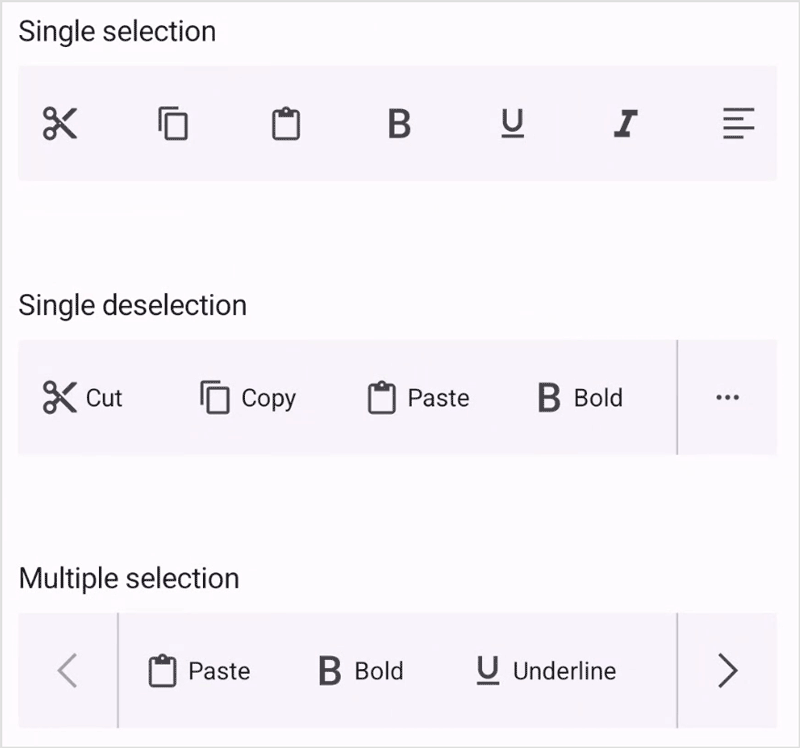

# Selection Mode in .NET MAUI Toolbar (SfToolbar)

The Selection mode is specified in the Toolbar property enumeration. You can select the toolbar item by tapping the item in the toolbar. SfToolbar[https://help.syncfusion.com/cr/maui/Syncfusion.Maui.Toolbar.SfToolbar.html] provides three types of modes such as `Single`, `SingleDeselect`, and `Multiple`. The default SelectionMode[https://help.syncfusion.com/cr/maui/Syncfusion.Maui.Toolbar.SfToolbar.html#Syncfusion_Maui_Toolbar_SfToolbar_SelectionMode] is Single[https://help.syncfusion.com/cr/maui/Syncfusion.Maui.Toolbar.ToolbarSelectionMode.html#Syncfusion_Maui_Toolbar_ToolbarSelectionMode_Single], which allows the user to select only one item at a time.

## Single Selection

The `Single` selection can be performed in the Toolbar by setting the SelectionMode[https://help.syncfusion.com/cr/maui/Syncfusion.Maui.Toolbar.SfToolbar.html#Syncfusion_Maui_Toolbar_SfToolbar_SelectionMode] property to Single[https://help.syncfusion.com/cr/maui/Syncfusion.Maui.Toolbar.ToolbarSelectionMode.html#Syncfusion_Maui_Toolbar_ToolbarSelectionMode_Single]. In this selection, you can select a single item at a time in the toolbar.




<toolbar:SfToolbar x:Name="Toolbar" HeightRequest="56" SelectionMode="Single">
        <toolbar:SfToolbar.Items>
            <toolbar:SfToolbarItem Name="Bold">
                <toolbar:SfToolbarItem.Icon>
                    <FontImageSource Glyph="&#xE770;"
                                FontFamily="MauiMaterialAssets" />
                </toolbar:SfToolbarItem.Icon>
            </toolbar:SfToolbarItem>
            <toolbar:SfToolbarItem Name="Underline">
                <toolbar:SfToolbarItem.Icon>
                    <FontImageSource Glyph="&#xE762;"
                                FontFamily="MauiMaterialAssets" />
                </toolbar:SfToolbarItem.Icon>
            </toolbar:SfToolbarItem>
            <toolbar:SfToolbarItem Name="Italic">
                <toolbar:SfToolbarItem.Icon>
                    <FontImageSource Glyph="&#xE771;"
                                FontFamily="MauiMaterialAssets" />
                </toolbar:SfToolbarItem.Icon>
            </toolbar:SfToolbarItem>
            <toolbar:SfToolbarItem Name="AlignLeft">
                <toolbar:SfToolbarItem.Icon>
                    <FontImageSource Glyph="&#xE751;"
                                FontFamily="MauiMaterialAssets" />
                </toolbar:SfToolbarItem.Icon>
            </toolbar:SfToolbarItem>
            <toolbar:SfToolbarItem Name="AlignRight">
                <toolbar:SfToolbarItem.Icon>
                    <FontImageSource Glyph="&#xE753;"
                    FontFamily="MauiMaterialAssets" />
                </toolbar:SfToolbarItem.Icon>
            </toolbar:SfToolbarItem>
            <toolbar:SfToolbarItem Name="AlignCenter">
                <toolbar:SfToolbarItem.Icon>
                    <FontImageSource Glyph="&#xE752;"
                    FontFamily="MauiMaterialAssets" />
                </toolbar:SfToolbarItem.Icon>
            </toolbar:SfToolbarItem>
            <toolbar:SfToolbarItem Name="AlignJustify">
                <toolbar:SfToolbarItem.Icon>
                    <FontImageSource Glyph="&#xE74F;"
                    FontFamily="MauiMaterialAssets" />
                </toolbar:SfToolbarItem.Icon>
            </toolbar:SfToolbarItem>
        </toolbar:SfToolbar.Items>
    </toolbar:SfToolbar>




using Syncfusion.Maui.Toolbar;

namespace ToolbarSample
{
    public partial class MainPage : ContentPage
    {
        public MainPage()
        {
            InitializeComponent();
            SfToolbar toolbar = new SfToolbar();
            toolbar.HeightRequest = 56;
            toolbar.SelectionMode = ToolbarSelectionMode.Single;
            ObservableCollection<BaseToolbarItem> itemCollection = new ObservableCollection<BaseToolbarItem>
            {
                new SfToolbarItem
                {
                    Name = "Bold",
                    Icon = new FontImageSource { Glyph = "\uE770", FontFamily = "MauiMaterialAssets" }
                },
                new SfToolbarItem
                {
                    Name = "Underline",
                    Icon = new FontImageSource { Glyph = "\uE762", FontFamily = "MauiMaterialAssets" }
                },
                new SfToolbarItem
                {
                    Name = "Italic",
                    Icon = new FontImageSource { Glyph = "\uE771", FontFamily = "MauiMaterialAssets" }
                },
                new SfToolbarItem
                {
                    Name = "AlignLeft",
                    Icon = new FontImageSource { Glyph = "\uE751", FontFamily = "MauiMaterialAssets" }
                },
                new SfToolbarItem
                {
                    Name = "AlignRight",
                    Icon = new FontImageSource { Glyph = "\uE753", FontFamily = "MauiMaterialAssets" }
                },
                new SfToolbarItem
                {
                    Name = "AlignCenter",
                    Icon = new FontImageSource { Glyph = "\uE752", FontFamily = "MauiMaterialAssets" }
                },
                new SfToolbarItem
                {
                    Name = "AlignJustify",
                    Icon = new FontImageSource { Glyph = "\uE74F", FontFamily = "MauiMaterialAssets" }
                }
            };
            toolbar.Items = itemCollection;
            this.Content = toolbar;
        }
    }
}





## Single Deselection

The `Single Deselection` can be performed in the Toolbar by setting the SelectionMode[https://help.syncfusion.com/cr/maui/Syncfusion.Maui.Toolbar.SfToolbar.html#Syncfusion_Maui_Toolbar_SfToolbar_SelectionMode] property to SingleDeselect[https://help.syncfusion.com/cr/maui/Syncfusion.Maui.Toolbar.ToolbarSelectionMode.html#Syncfusion_Maui_Toolbar_ToolbarSelectionMode_SingleDeselect]. In this mode, only one item can be selected at a time, and you can deselect the currently selected item by simply clicking on it again. This provides a quick way to clear the selection without needing additional actions.




<toolbar:SfToolbar x:Name="Toolbar" HeightRequest="56" SelectionMode="SingleDeselect">
        <toolbar:SfToolbar.Items>
            <toolbar:SfToolbarItem Name="Bold">
                <toolbar:SfToolbarItem.Icon>
                    <FontImageSource Glyph="&#xE770;"
                                FontFamily="MauiMaterialAssets" />
                </toolbar:SfToolbarItem.Icon>
            </toolbar:SfToolbarItem>
            <toolbar:SfToolbarItem Name="Underline">
                <toolbar:SfToolbarItem.Icon>
                    <FontImageSource Glyph="&#xE762;"
                                FontFamily="MauiMaterialAssets" />
                </toolbar:SfToolbarItem.Icon>
            </toolbar:SfToolbarItem>
            <toolbar:SfToolbarItem Name="Italic">
                <toolbar:SfToolbarItem.Icon>
                    <FontImageSource Glyph="&#xE771;"
                                FontFamily="MauiMaterialAssets" />
                </toolbar:SfToolbarItem.Icon>
            </toolbar:SfToolbarItem>
            <toolbar:SfToolbarItem Name="AlignLeft">
                <toolbar:SfToolbarItem.Icon>
                    <FontImageSource Glyph="&#xE751;"
                                FontFamily="MauiMaterialAssets" />
                </toolbar:SfToolbarItem.Icon>
            </toolbar:SfToolbarItem>
            <toolbar:SfToolbarItem Name="AlignRight">
                <toolbar:SfToolbarItem.Icon>
                    <FontImageSource Glyph="&#xE753;"
                    FontFamily="MauiMaterialAssets" />
                </toolbar:SfToolbarItem.Icon>
            </toolbar:SfToolbarItem>
            <toolbar:SfToolbarItem Name="AlignCenter">
                <toolbar:SfToolbarItem.Icon>
                    <FontImageSource Glyph="&#xE752;"
                    FontFamily="MauiMaterialAssets" />
                </toolbar:SfToolbarItem.Icon>
            </toolbar:SfToolbarItem>
            <toolbar:SfToolbarItem Name="AlignJustify">
                <toolbar:SfToolbarItem.Icon>
                    <FontImageSource Glyph="&#xE74F;"
                    FontFamily="MauiMaterialAssets" />
                </toolbar:SfToolbarItem.Icon>
            </toolbar:SfToolbarItem>
        </toolbar:SfToolbar.Items>
    </toolbar:SfToolbar>




using Syncfusion.Maui.Toolbar;

namespace ToolbarSample
{
    public partial class MainPage : ContentPage
    {
        public MainPage()
        {
            InitializeComponent();
            SfToolbar toolbar = new SfToolbar();
            toolbar.HeightRequest = 56;
            toolbar.SelectionMode = ToolbarSelectionMode.SingleDeselect;
            ObservableCollection<BaseToolbarItem> itemCollection = new ObservableCollection<BaseToolbarItem>
            {
                new SfToolbarItem
                {
                    Name = "Bold",
                    Icon = new FontImageSource { Glyph = "\uE770", FontFamily = "MauiMaterialAssets" }
                },
                new SfToolbarItem
                {
                    Name = "Underline",
                    Icon = new FontImageSource { Glyph = "\uE762", FontFamily = "MauiMaterialAssets" }
                },
                new SfToolbarItem
                {
                    Name = "Italic",
                    Icon = new FontImageSource { Glyph = "\uE771", FontFamily = "MauiMaterialAssets" }
                },
                new SfToolbarItem
                {
                    Name = "AlignLeft",
                    Icon = new FontImageSource { Glyph = "\uE751", FontFamily = "MauiMaterialAssets" }
                },
                new SfToolbarItem
                {
                    Name = "AlignRight",
                    Icon = new FontImageSource { Glyph = "\uE753", FontFamily = "MauiMaterialAssets" }
                },
                new SfToolbarItem
                {
                    Name = "AlignCenter",
                    Icon = new FontImageSource { Glyph = "\uE752", FontFamily = "MauiMaterialAssets" }
                },
                new SfToolbarItem
                {
                    Name = "AlignJustify",
                    Icon = new FontImageSource { Glyph = "\uE74F", FontFamily = "MauiMaterialAssets" }
                }
            };
            toolbar.Items = itemCollection;
            this.Content = toolbar;
        }
    }
}





## Multiple Selection

The `Multiple selection` can be performed in the Toolbar by setting the SelectionMode[https://help.syncfusion.com/cr/maui/Syncfusion.Maui.Toolbar.SfToolbar.html#Syncfusion_Maui_Toolbar_SfToolbar_SelectionMode] property to Multiple[https://help.syncfusion.com/cr/maui/Syncfusion.Maui.Toolbar.ToolbarSelectionMode.html#Syncfusion_Maui_Toolbar_ToolbarSelectionMode_Multiple]. In this mode, users can select more than one item at a time. You can remove selected items by clicking on them again, which will deselect them. This toggle-based interaction provides a clear and efficient method for managing selections without requiring additional controls.

N> Multiple selection not supported when ToolbarItem has Overlay toolbar.




<toolbar:SfToolbar x:Name="Toolbar" HeightRequest="56" SelectionMode="Multiple">
        <toolbar:SfToolbar.Items>
            <toolbar:SfToolbarItem Name="Bold">
                <toolbar:SfToolbarItem.Icon>
                    <FontImageSource Glyph="&#xE770;"
                                FontFamily="MauiMaterialAssets" />
                </toolbar:SfToolbarItem.Icon>
            </toolbar:SfToolbarItem>
            <toolbar:SfToolbarItem Name="Underline">
                <toolbar:SfToolbarItem.Icon>
                    <FontImageSource Glyph="&#xE762;"
                                FontFamily="MauiMaterialAssets" />
                </toolbar:SfToolbarItem.Icon>
            </toolbar:SfToolbarItem>
            <toolbar:SfToolbarItem Name="Italic">
                <toolbar:SfToolbarItem.Icon>
                    <FontImageSource Glyph="&#xE771;"
                                FontFamily="MauiMaterialAssets" />
                </toolbar:SfToolbarItem.Icon>
            </toolbar:SfToolbarItem>
            <toolbar:SfToolbarItem Name="AlignLeft">
                <toolbar:SfToolbarItem.Icon>
                    <FontImageSource Glyph="&#xE751;"
                                FontFamily="MauiMaterialAssets" />
                </toolbar:SfToolbarItem.Icon>
            </toolbar:SfToolbarItem>
            <toolbar:SfToolbarItem Name="AlignRight">
                <toolbar:SfToolbarItem.Icon>
                    <FontImageSource Glyph="&#xE753;"
                    FontFamily="MauiMaterialAssets" />
                </toolbar:SfToolbarItem.Icon>
            </toolbar:SfToolbarItem>
            <toolbar:SfToolbarItem Name="AlignCenter">
                <toolbar:SfToolbarItem.Icon>
                    <FontImageSource Glyph="&#xE752;"
                    FontFamily="MauiMaterialAssets" />
                </toolbar:SfToolbarItem.Icon>
            </toolbar:SfToolbarItem>
            <toolbar:SfToolbarItem Name="AlignJustify">
                <toolbar:SfToolbarItem.Icon>
                    <FontImageSource Glyph="&#xE74F;"
                    FontFamily="MauiMaterialAssets" />
                </toolbar:SfToolbarItem.Icon>
            </toolbar:SfToolbarItem>
        </toolbar:SfToolbar.Items>
    </toolbar:SfToolbar>




using Syncfusion.Maui.Toolbar;

namespace ToolbarSample
{
    public partial class MainPage : ContentPage
    {
        public MainPage()
        {
            InitializeComponent();
            SfToolbar toolbar = new SfToolbar();
            toolbar.HeightRequest = 56;
            toolbar.SelectionMode = ToolbarSelectionMode.Multiple;
            ObservableCollection<BaseToolbarItem> itemCollection = new ObservableCollection<BaseToolbarItem>
            {
                new SfToolbarItem
                {
                    Name = "Bold",
                    Icon = new FontImageSource { Glyph = "\uE770", FontFamily = "MauiMaterialAssets" }
                },
                new SfToolbarItem
                {
                    Name = "Underline",
                    Icon = new FontImageSource { Glyph = "\uE762", FontFamily = "MauiMaterialAssets" }
                },
                new SfToolbarItem
                {
                    Name = "Italic",
                    Icon = new FontImageSource { Glyph = "\uE771", FontFamily = "MauiMaterialAssets" }
                },
                new SfToolbarItem
                {
                    Name = "AlignLeft",
                    Icon = new FontImageSource { Glyph = "\uE751", FontFamily = "MauiMaterialAssets" }
                },
                new SfToolbarItem
                {
                    Name = "AlignRight",
                    Icon = new FontImageSource { Glyph = "\uE753", FontFamily = "MauiMaterialAssets" }
                },
                new SfToolbarItem
                {
                    Name = "AlignCenter",
                    Icon = new FontImageSource { Glyph = "\uE752", FontFamily = "MauiMaterialAssets" }
                },
                new SfToolbarItem
                {
                    Name = "AlignJustify",
                    Icon = new FontImageSource { Glyph = "\uE74F", FontFamily = "MauiMaterialAssets" }
                }
            };
            toolbar.Items = itemCollection;
            this.Content = toolbar;
        }
    }
}





{:width="350" height="320"}