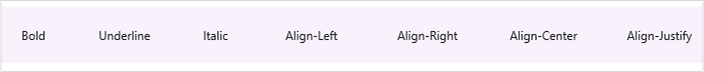
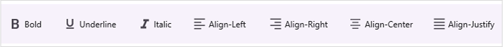
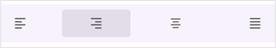
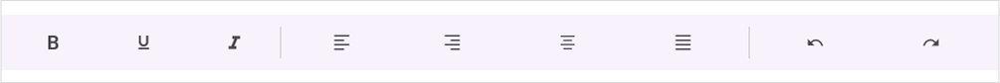
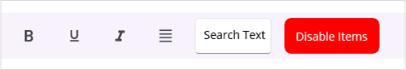
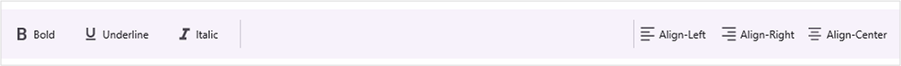

# Toolbar Items in .NET MAUI Toolbar (SfToolbar)

This section explains how to populate items for both default views and custom views using the `Items` properties in `SfToolbar`.

## Default View

The toolbar control supports displaying a default view for toolbar items when the `View` property of `SfToolbarItem` is not defined. To render the default view, you need to define either the `Icon` or `Text` property of `SfToolbarItem`.

### Icon

The control provides support to add icon to the toolbar items. You can add icon to the toolbar items by using the `Icon` property of `SfToolbarItem`.

The following code sample demonstrates how to create a toolbar control with items having the icons.





<?xml version="1.0" encoding="utf-8" ?>
<ContentPage xmlns="http://schemas.microsoft.com/dotnet/2021/maui"
             xmlns:x="http://schemas.microsoft.com/winfx/2009/xaml"
             xmlns:local="clr-namespace:ToolbarSample"
             xmlns:toolbar="clr-namespace:Syncfusion.Maui.Toolbar;assembly=Syncfusion.Maui.Toolbar"
             x:Class="ToolbarSample.MainPage">
    <Grid>
    <toolbar:SfToolbar x:Name="Toolbar" HeightRequest="56">
        <toolbar:SfToolbar.Items>
            <toolbar:SfToolbarItem Name="Bold">
                <toolbar:SfToolbarItem.Icon>
                    <FontImageSource Glyph="&#xE770;"
                                FontFamily="MauiMaterialAssets" />
                </toolbar:SfToolbarItem.Icon>
            </toolbar:SfToolbarItem>
            <toolbar:SfToolbarItem Name="Underline">
                <toolbar:SfToolbarItem.Icon>
                    <FontImageSource Glyph="&#xE762;"
                                FontFamily="MauiMaterialAssets" />
                </toolbar:SfToolbarItem.Icon>
            </toolbar:SfToolbarItem>
            <toolbar:SfToolbarItem Name="Italic">
                <toolbar:SfToolbarItem.Icon>
                    <FontImageSource Glyph="&#xE771;"
                                FontFamily="MauiMaterialAssets" />
                </toolbar:SfToolbarItem.Icon>
            </toolbar:SfToolbarItem>
            <toolbar:SfToolbarItem Name="AlignLeft">
                <toolbar:SfToolbarItem.Icon>
                    <FontImageSource Glyph="&#xE751;"
                                FontFamily="MauiMaterialAssets" />
                </toolbar:SfToolbarItem.Icon>
            </toolbar:SfToolbarItem>
            <toolbar:SfToolbarItem Name="AlignRight">
                <toolbar:SfToolbarItem.Icon>
                    <FontImageSource Glyph="&#xE753;"
                    FontFamily="MauiMaterialAssets" />
                </toolbar:SfToolbarItem.Icon>
            </toolbar:SfToolbarItem>
            <toolbar:SfToolbarItem Name="AlignCenter">
                <toolbar:SfToolbarItem.Icon>
                    <FontImageSource Glyph="&#xE752;"
                    FontFamily="MauiMaterialAssets" />
                </toolbar:SfToolbarItem.Icon>
            </toolbar:SfToolbarItem>
            <toolbar:SfToolbarItem Name="AlignJustify">
                <toolbar:SfToolbarItem.Icon>
                    <FontImageSource Glyph="&#xE74F;"
                    FontFamily="MauiMaterialAssets" />
                </toolbar:SfToolbarItem.Icon>
            </toolbar:SfToolbarItem>
        </toolbar:SfToolbar.Items>
    </toolbar:SfToolbar>
    </Grid>
</ContentPage>





using Syncfusion.Maui.Toolbar;

namespace ToolbarSample
{
    public partial class MainPage : ContentPage
    {
        public MainPage()
        {
            InitializeComponent();

            SfToolbar toolbar = new SfToolbar();
            toolbar.HeightRequest = 56;
            ObservableCollection<BaseToolbarItem> itemCollection = new ObservableCollection<BaseToolbarItem>
            {
                new SfToolbarItem
                {
                    Name = "Bold",
                    Icon = new FontImageSource { Glyph = "\uE770", FontFamily = "MauiMaterialAssets" }
                },
                new SfToolbarItem
                {
                    Name = "Underline",
                    Icon = new FontImageSource { Glyph = "\uE762", FontFamily = "MauiMaterialAssets" }
                },
                new SfToolbarItem
                {
                    Name = "Italic",
                    Icon = new FontImageSource { Glyph = "\uE771", FontFamily = "MauiMaterialAssets" }
                },
                new SfToolbarItem
                {
                    Name = "AlignLeft",
                    Icon = new FontImageSource { Glyph = "\uE751", FontFamily = "MauiMaterialAssets" }
                },
                new SfToolbarItem
                {
                    Name = "AlignRight",
                    Icon = new FontImageSource { Glyph = "\uE753", FontFamily = "MauiMaterialAssets" }
                },
                new SfToolbarItem
                {
                    Name = "AlignCenter",
                    Icon = new FontImageSource { Glyph = "\uE752", FontFamily = "MauiMaterialAssets" }
                },
                new SfToolbarItem
                {
                    Name = "AlignJustify",
                    Icon = new FontImageSource { Glyph = "\uE74F", FontFamily = "MauiMaterialAssets" }
                }
            };
            toolbar.Items = itemCollection;
            this.Content = toolbar;
        }
    }
}





#### Icon Size

The control provides an option to set the icon size for the toolbar items. You can set the icon size for the toolbar items using the `IconSize` property.





<?xml version="1.0" encoding="utf-8" ?>
<ContentPage xmlns="http://schemas.microsoft.com/dotnet/2021/maui"
             xmlns:x="http://schemas.microsoft.com/winfx/2009/xaml"
             xmlns:local="clr-namespace:ToolbarSample"
             xmlns:toolbar="clr-namespace:Syncfusion.Maui.Toolbar;assembly=Syncfusion.Maui.Toolbar"
             x:Class="ToolbarSample.MainPage">
    <Grid>
    <toolbar:SfToolbar x:Name="Toolbar" HeightRequest="56">
        <toolbar:SfToolbar.Items>
            <toolbar:SfToolbarItem Name="Bold" IconSize="20">
                <toolbar:SfToolbarItem.Icon>
                    <FontImageSource Glyph="&#xE770;"
                                FontFamily="MauiMaterialAssets" />
                </toolbar:SfToolbarItem.Icon>
            </toolbar:SfToolbarItem>
            <toolbar:SfToolbarItem Name="Underline" IconSize="20">
                <toolbar:SfToolbarItem.Icon>
                    <FontImageSource Glyph="&#xE762;"
                                FontFamily="MauiMaterialAssets" />
                </toolbar:SfToolbarItem.Icon>
            </toolbar:SfToolbarItem>
            <toolbar:SfToolbarItem Name="Italic" IconSize="20">
                <toolbar:SfToolbarItem.Icon>
                    <FontImageSource Glyph="&#xE771;"
                                FontFamily="MauiMaterialAssets" />
                </toolbar:SfToolbarItem.Icon>
            </toolbar:SfToolbarItem>
            <toolbar:SfToolbarItem Name="AlignLeft" IconSize="20">
                <toolbar:SfToolbarItem.Icon>
                    <FontImageSource Glyph="&#xE751;"
                                FontFamily="MauiMaterialAssets" />
                </toolbar:SfToolbarItem.Icon>
            </toolbar:SfToolbarItem>
            <toolbar:SfToolbarItem Name="AlignRight" IconSize="20">
                <toolbar:SfToolbarItem.Icon>
                    <FontImageSource Glyph="&#xE753;"
                    FontFamily="MauiMaterialAssets" />
                </toolbar:SfToolbarItem.Icon>
            </toolbar:SfToolbarItem>
            <toolbar:SfToolbarItem Name="AlignCenter" IconSize="20">
                <toolbar:SfToolbarItem.Icon>
                    <FontImageSource Glyph="&#xE752;"
                    FontFamily="MauiMaterialAssets" />
                </toolbar:SfToolbarItem.Icon>
            </toolbar:SfToolbarItem>
            <toolbar:SfToolbarItem Name="AlignJustify" IconSize="20">
                <toolbar:SfToolbarItem.Icon>
                    <FontImageSource Glyph="&#xE74F;"
                    FontFamily="MauiMaterialAssets" />
                </toolbar:SfToolbarItem.Icon>
            </toolbar:SfToolbarItem>
        </toolbar:SfToolbar.Items>
    </toolbar:SfToolbar>
    </Grid>
</ContentPage>





using Syncfusion.Maui.Toolbar;

namespace ToolbarSample
{
    public partial class MainPage : ContentPage
    {
        public MainPage()
        {
            InitializeComponent();

            SfToolbar toolbar = new SfToolbar();
            toolbar.HeightRequest = 56;
            ObservableCollection<BaseToolbarItem> itemCollection = new ObservableCollection<BaseToolbarItem>
            {
                new SfToolbarItem
                {
                    Name = "Bold",
                    IconSize="20",
                    Icon = new FontImageSource { Glyph = "\uE770", FontFamily = "MauiMaterialAssets" }
                },
                new SfToolbarItem
                {
                    Name = "Underline",
                    IconSize="20",
                    Icon = new FontImageSource { Glyph = "\uE762", FontFamily = "MauiMaterialAssets" }
                },
                new SfToolbarItem
                {
                    Name = "Italic",
                    IconSize="20",
                    Icon = new FontImageSource { Glyph = "\uE771", FontFamily = "MauiMaterialAssets" }
                },
                new SfToolbarItem
                {
                    Name = "AlignLeft",
                    IconSize="20",
                    Icon = new FontImageSource { Glyph = "\uE751", FontFamily = "MauiMaterialAssets" }
                },
                new SfToolbarItem
                {
                    Name = "AlignRight",
                    IconSize="20",
                    Icon = new FontImageSource { Glyph = "\uE753", FontFamily = "MauiMaterialAssets" }
                },
                new SfToolbarItem
                {
                    Name = "AlignCenter",
                    IconSize="20",
                    Icon = new FontImageSource { Glyph = "\uE752", FontFamily = "MauiMaterialAssets" }
                },
                new SfToolbarItem
                {
                    Name = "AlignJustify",
                    IconSize="20",
                    Icon = new FontImageSource { Glyph = "\uE74F", FontFamily = "MauiMaterialAssets" }
                }
            };
            toolbar.Items = itemCollection;
            this.Content = toolbar;
        }
    }
}





### Text

The control allows you to display text in the toolbar items. You can set the text for the toolbar items using the `Text` property.

The following code sample demonstrates how to display text in the toolbar items of the control.





<?xml version="1.0" encoding="utf-8" ?>
<ContentPage xmlns="http://schemas.microsoft.com/dotnet/2021/maui"
             xmlns:x="http://schemas.microsoft.com/winfx/2009/xaml"
             xmlns:local="clr-namespace:ToolbarSample"
             xmlns:syncfusion="clr-namespace:Syncfusion.Maui.Toolbar;assembly=Syncfusion.Maui.Toolbar"
             x:Class="ToolbarSample.MainPage">
    <Grid>
    <toolbar:SfToolbar x:Name="Toolbar" HeightRequest="56">
        <toolbar:SfToolbar.Items>
            <toolbar:SfToolbarItem Name="Bold"
                Text="Bold"
                Size="60,40">
            </toolbar:SfToolbarItem>
            <toolbar:SfToolbarItem Name="Underline"
                Text="Underline"
                Size="90,40">
            </toolbar:SfToolbarItem>
            <toolbar:SfToolbarItem Name="Italic"
                Text="Italic"
                Size="60,40">
            </toolbar:SfToolbarItem>
            <toolbar:SfToolbarItem Name="AlignLeft"
                        Text="Align-Left"
                        Size="100,40">
            </toolbar:SfToolbarItem>
            <toolbar:SfToolbarItem Name="AlignRight"
                        Text="Align-Right"
                        Size="100,40">
            </toolbar:SfToolbarItem>
            <toolbar:SfToolbarItem Name="AlignCenter"
                        Text="Align-Center"
                        Size="100,40">
            </toolbar:SfToolbarItem>
            <toolbar:SfToolbarItem Name="AlignJustify"
                        Text="Align-Justify"
                        Size="100,40">
            </toolbar:SfToolbarItem>
        </toolbar:SfToolbar.Items>
    </toolbar:SfToolbar>
    </Grid>
</ContentPage>





using Syncfusion.Maui.Toolbar;

namespace ToolbarSample
{
    public partial class MainPage : ContentPage
    {
        public MainPage()
        {
            InitializeComponent();

            SfToolbar toolbar = new SfToolbar();
            toolbar.HeightRequest = 56;

            ObservableCollection<BaseToolbarItem> itemCollection = new ObservableCollection<BaseToolbarItem>
            {
                new SfToolbarItem
                {
                    Name = "Bold",
                    Text = "Bold",
                    Size = new Size(60, 40),
                },
                new SfToolbarItem
                {
                    Name = "Underline",
                    Text = "Underline",
                    Size = new Size(90, 40),
                },
                new SfToolbarItem
                {
                    Name = "Italic",
                    Text = "Italic",
                    Size = new Size(60, 40),
                },
                new SfToolbarItem
                {
                    Name = "AlignLeft",
                    Text = "Align-Left",
                    Size = new Size(90, 40),
                },
                new SfToolbarItem
                {
                    Name = "AlignRight",
                    Text = "Align-Right",
                    Size = new Size(100, 40),
                },
                new SfToolbarItem
                {
                    Name = "AlignCenter",
                    Text = "Align-Center",
                    Size = new Size(100, 40),
                },
                new SfToolbarItem
                {
                    Name = "AlignJustify",
                    Text = "Align-Justify",
                    Size = new Size(100, 40),
                }
            };

            toolbar.Items = itemCollection;
            this.Content = toolbar;
        }
    }
}





### Icon with text

The control provides support to add icon with text to the toolbar items.

The following code sample demonstrates how to display icons and text in the toolbar items of the control.





<?xml version="1.0" encoding="utf-8" ?>
<ContentPage xmlns="http://schemas.microsoft.com/dotnet/2021/maui"
             xmlns:x="http://schemas.microsoft.com/winfx/2009/xaml"
             xmlns:local="clr-namespace:ToolbarSample"
             xmlns:syncfusion="clr-namespace:Syncfusion.Maui.Toolbar;assembly=Syncfusion.Maui.Toolbar"
             x:Class="ToolbarSample.MainPage">
    <Grid>
    <toolbar:SfToolbar x:Name="Toolbar" HeightRequest="56">
        <toolbar:SfToolbar.Items>
            <toolbar:SfToolbarItem Name="Bold"
                Text="Bold"
                TextPosition="Right"
                Size="60,40">
                <toolbar:SfToolbarItem.Icon>
                    <FontImageSource Glyph="&#xE770;"
                            FontFamily="MauiMaterialAssets" />
                </toolbar:SfToolbarItem.Icon>
            </toolbar:SfToolbarItem>
            <toolbar:SfToolbarItem Name="Underline"
                Text="Underline"
                TextPosition="Right"
                Size="90,40">
                <toolbar:SfToolbarItem.Icon>
                    <FontImageSource Glyph="&#xE762;"
                            FontFamily="MauiMaterialAssets" />
                </toolbar:SfToolbarItem.Icon>
            </toolbar:SfToolbarItem>
            <toolbar:SfToolbarItem Name="Italic"
                Text="Italic"
                TextPosition="Right"
                Size="60,40">
                <toolbar:SfToolbarItem.Icon>
                    <FontImageSource Glyph="&#xE771;"
                            FontFamily="MauiMaterialAssets" />
                </toolbar:SfToolbarItem.Icon>
            </toolbar:SfToolbarItem>
            <toolbar:SfToolbarItem Name="AlignLeft"
                        Text="Align-Left"
                        TextPosition="Right"
                        Size="90,40">
                <toolbar:SfToolbarItem.Icon>
                    <FontImageSource Glyph="&#xE751;"
                            FontFamily="MauiMaterialAssets" />
                </toolbar:SfToolbarItem.Icon>
            </toolbar:SfToolbarItem>
            <toolbar:SfToolbarItem Name="AlignRight"
                        Text="Align-Right"
                        TextPosition="Right"
                        Size="100,40">
                <toolbar:SfToolbarItem.Icon>
                    <FontImageSource Glyph="&#xE753;"
                FontFamily="MauiMaterialAssets" />
                </toolbar:SfToolbarItem.Icon>
            </toolbar:SfToolbarItem>
            <toolbar:SfToolbarItem Name="AlignCenter"
                        Text="Align-Center"
                        TextPosition="Right"
                        Size="100,40">
                <toolbar:SfToolbarItem.Icon>
                    <FontImageSource Glyph="&#xE752;"
                FontFamily="MauiMaterialAssets" />
                </toolbar:SfToolbarItem.Icon>
            </toolbar:SfToolbarItem>
            <toolbar:SfToolbarItem Name="AlignJustify"
                        Text="Align-Justify"
                        TextPosition="Right"
                        Size="100,40">
                <toolbar:SfToolbarItem.Icon>
                    <FontImageSource Glyph="&#xE74F;"
                FontFamily="MauiMaterialAssets" />
                </toolbar:SfToolbarItem.Icon>
            </toolbar:SfToolbarItem>
        </toolbar:SfToolbar.Items>
    </toolbar:SfToolbar>
    </Grid>
</ContentPage>





using Syncfusion.Maui.Toolbar;

namespace ToolbarSample
{
    public partial class MainPage : ContentPage
    {
        public MainPage()
        {
            InitializeComponent();

            SfToolbar toolbar = new SfToolbar();
            toolbar.HeightRequest = 56;

            ObservableCollection<BaseToolbarItem> itemCollection = new ObservableCollection<BaseToolbarItem>
            {
                new SfToolbarItem
                {
                    Name = "Bold",
                    Text = "Bold",
                    TextPosition = ToolbarItemTextPosition.Right,
                    Size = new Size(60, 40),
                    Icon = new FontImageSource { Glyph = "\uE770", FontFamily = "MauiMaterialAssets" }
                },
                new SfToolbarItem
                {
                    Name = "Underline",
                    Text = "Underline",
                    TextPosition = ToolbarItemTextPosition.Right,
                    Size = new Size(90, 40),
                    Icon = new FontImageSource { Glyph = "\uE762", FontFamily = "MauiMaterialAssets" }
                },
                new SfToolbarItem
                {
                    Name = "Italic",
                    Text = "Italic",
                    TextPosition = ToolbarItemTextPosition.Right,
                    Size = new Size(60, 40),
                    Icon = new FontImageSource { Glyph = "\uE771", FontFamily = "MauiMaterialAssets" }
                },
                new SfToolbarItem
                {
                    Name = "AlignLeft",
                    Text = "Align-Left",
                    TextPosition = ToolbarItemTextPosition.Right,
                    Size = new Size(90, 40),
                    Icon = new FontImageSource { Glyph = "\uE751", FontFamily = "MauiMaterialAssets" }
                },
                new SfToolbarItem
                {
                    Name = "AlignRight",
                    Text = "Align-Right",
                    TextPosition = ToolbarItemTextPosition.Right,
                    Size = new Size(100, 40),
                    Icon = new FontImageSource { Glyph = "\uE753", FontFamily = "MauiMaterialAssets" }
                },
                new SfToolbarItem
                {
                    Name = "AlignCenter",
                    Text = "Align-Center",
                    TextPosition = ToolbarItemTextPosition.Right,
                    Size = new Size(100, 40),
                    Icon = new FontImageSource { Glyph = "\uE752", FontFamily = "MauiMaterialAssets" }
                },
                new SfToolbarItem
                {
                    Name = "AlignJustify",
                    Text = "Align-Justify",
                    Size = new Size(100, 40),
                    Icon = new FontImageSource { Glyph = "\uE74F", FontFamily = "MauiMaterialAssets" }
                }
            };

            toolbar.Items = itemCollection;
            this.Content = toolbar;
        }
    }
}





#### Text Placement

The control provides an option to place the text in the toolbar items using the `TextPosition` property. The text can be placed on the left, right, top, and bottom of the toolbar items.

The following code sample demonstrates how to display toolbar items with text position of the control.





<?xml version="1.0" encoding="utf-8" ?>
<ContentPage xmlns="http://schemas.microsoft.com/dotnet/2021/maui"
             xmlns:x="http://schemas.microsoft.com/winfx/2009/xaml"
             xmlns:local="clr-namespace:ToolbarSample"
             xmlns:syncfusion="clr-namespace:Syncfusion.Maui.RadialMenu;assembly=Syncfusion.Maui.RadialMenu"
             x:Class="ToolbarSample.MainPage">
    <Grid>
        <toolbar:SfToolbar x:Name="Toolbar" HeightRequest="56">
            <toolbar:SfToolbar.Items>
                <toolbar:SfToolbarItem Name="AlignLeft"
                            Text="Align-Left"
                            TextPosition="Right"
                            Size="90,40">
                    <toolbar:SfToolbarItem.Icon>
                        <FontImageSource Glyph="&#xE751;"
                                FontFamily="MauiMaterialAssets" />
                    </toolbar:SfToolbarItem.Icon>
                </toolbar:SfToolbarItem>
                <toolbar:SfToolbarItem Name="AlignRight"
                            Text="Align-Right"
                            TextPosition="Right"
                            Size="100,40">
                    <toolbar:SfToolbarItem.Icon>
                        <FontImageSource Glyph="&#xE753;"
                    FontFamily="MauiMaterialAssets" />
                    </toolbar:SfToolbarItem.Icon>
                </toolbar:SfToolbarItem>
                <toolbar:SfToolbarItem Name="AlignCenter"
                            Text="Align-Center"
                            TextPosition="Right"
                            Size="100,40">
                    <toolbar:SfToolbarItem.Icon>
                        <FontImageSource Glyph="&#xE752;"
                    FontFamily="MauiMaterialAssets" />
                    </toolbar:SfToolbarItem.Icon>
                </toolbar:SfToolbarItem>
                <toolbar:SfToolbarItem Name="AlignJustify"
                            Text="Align-Justify"
                            TextPosition="Right"
                            Size="100,40">
                    <toolbar:SfToolbarItem.Icon>
                        <FontImageSource Glyph="&#xE74F;"
                    FontFamily="MauiMaterialAssets" />
                    </toolbar:SfToolbarItem.Icon>
                </toolbar:SfToolbarItem>
            </toolbar:SfToolbar.Items>
        </toolbar:SfToolbar>
    </Grid>
</ContentPage>





using Syncfusion.Maui.Toolbar;

namespace ToolbarSample
{
    public partial class MainPage : ContentPage
    {
        public MainPage()
        {
            InitializeComponent();

            SfToolbar toolbar = new SfToolbar();
            toolbar.HeightRequest = 56;

            ObservableCollection<BaseToolbarItem> toolbarItems = new ObservableCollection<BaseToolbarItem>
            {
                new SfToolbarItem
                {
                    Name = "AlignLeft",
                    Text = "Align-Left",
                    TextPosition = ToolbarItemTextPosition.Right,
                    Size = new Size(90, 40),
                    Icon = new FontImageSource { Glyph = "\uE751", FontFamily = "MauiMaterialAssets" }
                },
                new SfToolbarItem
                {
                    Name = "AlignRight",
                    Text = "Align-Right",
                    TextPosition = ToolbarItemTextPosition.Right,
                    Size = new Size(100, 40),
                    Icon = new FontImageSource { Glyph = "\uE753", FontFamily = "MauiMaterialAssets" }
                },
                new SfToolbarItem
                {
                    Name = "AlignCenter",
                    Text = "Align-Center",
                    TextPosition = ToolbarItemTextPosition.Right,
                    Size = new Size(100, 40),
                    Icon = new FontImageSource { Glyph = "\uE752", FontFamily = "MauiMaterialAssets" }
                },
                new SfToolbarItem
                {
                    Name = "AlignJustify",
                    Text = "Align-Justify",
                    TextPosition = ToolbarItemTextPosition.Right,
                    Size = new Size(100, 40),
                    Icon = new FontImageSource { Glyph = "\uE74F", FontFamily = "MauiMaterialAssets" }
                }
            };

            toolbar.Items = toolbarItems;
            this.Content = toolbar;
        }
    }
}





### Default view item size

The control provides support to set the size for the toolbar item using the `Size` property.





<?xml version="1.0" encoding="utf-8" ?>
<ContentPage xmlns="http://schemas.microsoft.com/dotnet/2021/maui"
             xmlns:x="http://schemas.microsoft.com/winfx/2009/xaml"
             xmlns:local="clr-namespace:ToolbarSample"
             xmlns:syncfusion="clr-namespace:Syncfusion.Maui.RadialMenu;assembly=Syncfusion.Maui.RadialMenu"
             x:Class="ToolbarSample.MainPage">
    <Grid>
        <toolbar:SfToolbar x:Name="Toolbar" HeightRequest="56">
            <toolbar:SfToolbar.Items>
                <toolbar:SfToolbarItem Name="AlignLeft"
                            Size="90,40">
                    <toolbar:SfToolbarItem.Icon>
                        <FontImageSource Glyph="&#xE751;"
                                FontFamily="MauiMaterialAssets" />
                    </toolbar:SfToolbarItem.Icon>
                </toolbar:SfToolbarItem>
                <toolbar:SfToolbarItem Name="AlignRight"
                            Size="100,40">
                    <toolbar:SfToolbarItem.Icon>
                        <FontImageSource Glyph="&#xE753;"
                    FontFamily="MauiMaterialAssets" />
                    </toolbar:SfToolbarItem.Icon>
                </toolbar:SfToolbarItem>
                <toolbar:SfToolbarItem Name="AlignCenter"
                            Size="100,40">
                    <toolbar:SfToolbarItem.Icon>
                        <FontImageSource Glyph="&#xE752;"
                    FontFamily="MauiMaterialAssets" />
                    </toolbar:SfToolbarItem.Icon>
                </toolbar:SfToolbarItem>
                <toolbar:SfToolbarItem Name="AlignJustify"
                            Size="100,40">
                    <toolbar:SfToolbarItem.Icon>
                        <FontImageSource Glyph="&#xE74F;"
                    FontFamily="MauiMaterialAssets" />
                    </toolbar:SfToolbarItem.Icon>
                </toolbar:SfToolbarItem>
            </toolbar:SfToolbar.Items>
        </toolbar:SfToolbar>
    </Grid>
</ContentPage>





using Syncfusion.Maui.Toolbar;

namespace ToolbarSample
{
    public partial class MainPage : ContentPage
    {
        public MainPage()
        {
            InitializeComponent();

            SfToolbar toolbar = new SfToolbar();
            toolbar.HeightRequest = 56;

            ObservableCollection<BaseToolbarItem> toolbarItems = new ObservableCollection<BaseToolbarItem>
            {
                new SfToolbarItem
                {
                    Name = "AlignLeft",
                    Size = new Size(90, 40),
                    Icon = new FontImageSource { Glyph = "\uE751", FontFamily = "MauiMaterialAssets" }
                },
                new SfToolbarItem
                {
                    Name = "AlignRight",
                    Size = new Size(100, 40),
                    Icon = new FontImageSource { Glyph = "\uE753", FontFamily = "MauiMaterialAssets" }
                },
                new SfToolbarItem
                {
                    Name = "AlignCenter",
                    Size = new Size(100, 40),
                    Icon = new FontImageSource { Glyph = "\uE752", FontFamily = "MauiMaterialAssets" }
                },
                new SfToolbarItem
                {
                    Name = "AlignJustify",
                    Size = new Size(100, 40),
                    Icon = new FontImageSource { Glyph = "\uE74F", FontFamily = "MauiMaterialAssets" }
                }
            };

            toolbar.Items = toolbarItems;
            this.Content = toolbar;
        }
    }
}





### Programmatically clear selection toolbar items

The control provides support to clear the selection of toolbar items using the `ClearSelection` method.

The following code sample demonstrates how to clear the selection of toolbar items of the control.





<?xml version="1.0" encoding="utf-8" ?>
<ContentPage xmlns="http://schemas.microsoft.com/dotnet/2021/maui"
             xmlns:x="http://schemas.microsoft.com/winfx/2009/xaml"
             xmlns:local="clr-namespace:ToolbarSample"
             xmlns:syncfusion="clr-namespace:Syncfusion.Maui.RadialMenu;assembly=Syncfusion.Maui.RadialMenu"
             x:Class="ToolbarSample.MainPage">
    <Grid RowDefinitions="0.9*,0.1*">
    <toolbar:SfToolbar x:Name="Toolbar" HeightRequest="56">
        <toolbar:SfToolbar.Items>
            <toolbar:SfToolbarItem Name="Bold"
                        ToolTipText="Bold">
                <toolbar:SfToolbarItem.Icon>
                    <FontImageSource Glyph="&#xE770;"
                                    FontFamily="MauiMaterialAssets" />
                </toolbar:SfToolbarItem.Icon>
            </toolbar:SfToolbarItem>
            <toolbar:SfToolbarItem Name="Underline"
                        ToolTipText="Underline">
                <toolbar:SfToolbarItem.Icon>
                    <FontImageSource Glyph="&#xE762;"
                                    FontFamily="MauiMaterialAssets" />
                </toolbar:SfToolbarItem.Icon>
            </toolbar:SfToolbarItem>
            <toolbar:SfToolbarItem Name="Italic"
                        ToolTipText="Italic">
                <toolbar:SfToolbarItem.Icon>
                    <FontImageSource Glyph="&#xE771;"
                                    FontFamily="MauiMaterialAssets" />
                </toolbar:SfToolbarItem.Icon>
            </toolbar:SfToolbarItem>
            <toolbar:SfToolbarItem Name="AlignLeft"
                                    ToolTipText="Align-Left">
                <toolbar:SfToolbarItem.Icon>
                    <FontImageSource Glyph="&#xE751;"
                                    FontFamily="MauiMaterialAssets" />
                </toolbar:SfToolbarItem.Icon>
            </toolbar:SfToolbarItem>
            <toolbar:SfToolbarItem Name="AlignRight"
                                    ToolTipText="Align-Right">
                <toolbar:SfToolbarItem.Icon>
                    <FontImageSource Glyph="&#xE753;"
                        FontFamily="MauiMaterialAssets" />
                </toolbar:SfToolbarItem.Icon>
            </toolbar:SfToolbarItem>
            <toolbar:SfToolbarItem Name="AlignCenter"
                                    ToolTipText="Align-Center">
                <toolbar:SfToolbarItem.Icon>
                    <FontImageSource Glyph="&#xE752;"
                        FontFamily="MauiMaterialAssets" />
                </toolbar:SfToolbarItem.Icon>
            </toolbar:SfToolbarItem>
            <toolbar:SfToolbarItem Name="AlignJustify"
                                    ToolTipText="Align-Justify">
                <toolbar:SfToolbarItem.Icon>
                    <FontImageSource Glyph="&#xE74F;"
                        FontFamily="MauiMaterialAssets" />
                </toolbar:SfToolbarItem.Icon>
            </toolbar:SfToolbarItem>
        </toolbar:SfToolbar.Items>
    </toolbar:SfToolbar>
    <Button Grid.Row="1" Text="Clear toolbar selection" Clicked="Button_Clicked"/>
    </Grid>
</ContentPage>





using Syncfusion.Maui.Toolbar;

namespace ToolbarSample
{
    public partial class MainPage : ContentPage
    {
        public MainPage()
        {
            InitializeComponent();
        }

        private void Button_Clicked(object sender, EventArgs e)
        {
            Toolbar.ClearSelection();
        }
    }
}





## Add name for the toolbar item

The control provides support to set the name for the toolbar items using the `Name` property, which helps to uniquely identifies the toolbar item.





<?xml version="1.0" encoding="utf-8" ?>
<ContentPage xmlns="http://schemas.microsoft.com/dotnet/2021/maui"
             xmlns:x="http://schemas.microsoft.com/winfx/2009/xaml"
             xmlns:local="clr-namespace:ToolbarSample"
             xmlns:syncfusion="clr-namespace:Syncfusion.Maui.RadialMenu;assembly=Syncfusion.Maui.RadialMenu"
             x:Class="ToolbarSample.MainPage">
    <Grid>
        <toolbar:SfToolbar x:Name="Toolbar" HeightRequest="56">
            <toolbar:SfToolbar.Items>
                <toolbar:SfToolbarItem Name="AlignLeft">
                    <toolbar:SfToolbarItem.Icon>
                        <FontImageSource Glyph="&#xE751;"
                                FontFamily="MauiMaterialAssets" />
                    </toolbar:SfToolbarItem.Icon>
                </toolbar:SfToolbarItem>
                <toolbar:SfToolbarItem Name="AlignRight">
                    <toolbar:SfToolbarItem.Icon>
                        <FontImageSource Glyph="&#xE753;"
                    FontFamily="MauiMaterialAssets" />
                    </toolbar:SfToolbarItem.Icon>
                </toolbar:SfToolbarItem>
                <toolbar:SfToolbarItem Name="AlignCenter">
                    <toolbar:SfToolbarItem.Icon>
                        <FontImageSource Glyph="&#xE752;"
                    FontFamily="MauiMaterialAssets" />
                    </toolbar:SfToolbarItem.Icon>
                </toolbar:SfToolbarItem>
                <toolbar:SfToolbarItem Name="AlignJustify">
                    <toolbar:SfToolbarItem.Icon>
                        <FontImageSource Glyph="&#xE74F;"
                    FontFamily="MauiMaterialAssets" />
                    </toolbar:SfToolbarItem.Icon>
                </toolbar:SfToolbarItem>
            </toolbar:SfToolbar.Items>
        </toolbar:SfToolbar>
    </Grid>
</ContentPage>





using Syncfusion.Maui.Toolbar;

namespace ToolbarSample
{
    public partial class MainPage : ContentPage
    {
        public MainPage()
        {
            InitializeComponent();

            SfToolbar toolbar = new SfToolbar();
            toolbar.HeightRequest = 56;

            ObservableCollection<BaseToolbarItem> toolbarItems = new ObservableCollection<BaseToolbarItem>
            {
                new SfToolbarItem
                {
                    Name = "AlignLeft",
                    Icon = new FontImageSource { Glyph = "\uE751", FontFamily = "MauiMaterialAssets" }
                },
                new SfToolbarItem
                {
                    Name = "AlignRight",
                    Icon = new FontImageSource { Glyph = "\uE753", FontFamily = "MauiMaterialAssets" }
                },
                new SfToolbarItem
                {
                    Name = "AlignCenter",
                    Icon = new FontImageSource { Glyph = "\uE752", FontFamily = "MauiMaterialAssets" }
                },
                new SfToolbarItem
                {
                    Name = "AlignJustify",
                    Icon = new FontImageSource { Glyph = "\uE74F", FontFamily = "MauiMaterialAssets" }
                }
            };

            toolbar.Items = toolbarItems;
            this.Content = toolbar;
        }
    }
}





## Separator View

The control allows you to add a separator view using the `SeparatorToolbarItem` in the `Items` property of SfToolbar.

The following code sample demonstrates how to display toolbar items with separator item of the control.





<?xml version="1.0" encoding="utf-8" ?>
<ContentPage xmlns="http://schemas.microsoft.com/dotnet/2021/maui"
             xmlns:x="http://schemas.microsoft.com/winfx/2009/xaml"
             xmlns:local="clr-namespace:ToolbarSample"
             xmlns:syncfusion="clr-namespace:Syncfusion.Maui.RadialMenu;assembly=Syncfusion.Maui.RadialMenu"
             x:Class="ToolbarSample.MainPage">
    <Grid>
    <toolbar:SfToolbar x:Name="Toolbar" HeightRequest="56">
        <toolbar:SfToolbar.Items>
            <toolbar:SfToolbarItem Name="Bold"
                Size="60,40">
                <toolbar:SfToolbarItem.Icon>
                    <FontImageSource Glyph="&#xE770;"
                            FontFamily="MauiMaterialAssets" />
                </toolbar:SfToolbarItem.Icon>
            </toolbar:SfToolbarItem>
            <toolbar:SfToolbarItem Name="Underline"
                Size="90,40">
                <toolbar:SfToolbarItem.Icon>
                    <FontImageSource Glyph="&#xE762;"
                            FontFamily="MauiMaterialAssets" />
                </toolbar:SfToolbarItem.Icon>
            </toolbar:SfToolbarItem>
            <toolbar:SfToolbarItem Name="Italic"
                Size="60,40">
                <toolbar:SfToolbarItem.Icon>
                    <FontImageSource Glyph="&#xE771;"
                            FontFamily="MauiMaterialAssets" />
                </toolbar:SfToolbarItem.Icon>
            </toolbar:SfToolbarItem>
            <toolbar:SeparatorToolbarItem/>
            <toolbar:SfToolbarItem Name="AlignLeft"
                        Size="90,40">
                <toolbar:SfToolbarItem.Icon>
                    <FontImageSource Glyph="&#xE751;"
                            FontFamily="MauiMaterialAssets" />
                </toolbar:SfToolbarItem.Icon>
            </toolbar:SfToolbarItem>
            <toolbar:SfToolbarItem Name="AlignRight"
                        Size="100,40">
                <toolbar:SfToolbarItem.Icon>
                    <FontImageSource Glyph="&#xE753;"
                FontFamily="MauiMaterialAssets" />
                </toolbar:SfToolbarItem.Icon>
            </toolbar:SfToolbarItem>
            <toolbar:SfToolbarItem Name="AlignCenter"
                        Size="100,40">
                <toolbar:SfToolbarItem.Icon>
                    <FontImageSource Glyph="&#xE752;"
                FontFamily="MauiMaterialAssets" />
                </toolbar:SfToolbarItem.Icon>
            </toolbar:SfToolbarItem>
            <toolbar:SfToolbarItem Name="AlignJustify"
                        Size="100,40">
                <toolbar:SfToolbarItem.Icon>
                    <FontImageSource Glyph="&#xE74F;"
                FontFamily="MauiMaterialAssets" />
                </toolbar:SfToolbarItem.Icon>
            </toolbar:SfToolbarItem>
            <toolbar:SeparatorToolbarItem/>
            <toolbar:SfToolbarItem Size="100,40"
                                >
                <toolbar:SfToolbarItem.Icon>
                    <FontImageSource Glyph="&#xE744;"
                                        FontFamily="MauiMaterialAssets" />
                </toolbar:SfToolbarItem.Icon>
            </toolbar:SfToolbarItem>
            <toolbar:SfToolbarItem 
                                Size="100,40">
                <toolbar:SfToolbarItem.Icon>
                    <FontImageSource Glyph="&#xE745;"
                                        FontFamily="MauiMaterialAssets" />
                </toolbar:SfToolbarItem.Icon>
            </toolbar:SfToolbarItem>
        </toolbar:SfToolbar.Items>
    </toolbar:SfToolbar>
</Grid>
</ContentPage>





using Syncfusion.Maui.Toolbar;

namespace ToolbarSample
{
    public partial class MainPage : ContentPage
    {
        public MainPage()
        {
            InitializeComponent();

            SfToolbar toolbar = new SfToolbar();
            toolbar.HeightRequest = 56;

            ObservableCollection<BaseToolbarItem> toolbarItems = new ObservableCollection<BaseToolbarItem>
            {
                new SfToolbarItem
                {
                    Name = "Bold",
                    Size = new Size(60, 40),
                    Icon = new FontImageSource { Glyph = "\uE770", FontFamily = "MauiMaterialAssets" }
                },
                new SfToolbarItem
                {
                    Name = "Underline",
                    Size = new Size(90, 40),
                    Icon = new FontImageSource { Glyph = "\uE762", FontFamily = "MauiMaterialAssets" }
                },
                new SfToolbarItem
                {
                    Name = "Italic",
                    Size = new Size(60, 40),
                    Icon = new FontImageSource { Glyph = "\uE771", FontFamily = "MauiMaterialAssets" }
                },
                new SeparatorToolbarItem {},
                new SfToolbarItem
                {
                    Name = "AlignLeft",
                    Size = new Size(90, 40),
                    Icon = new FontImageSource { Glyph = "\uE751", FontFamily = "MauiMaterialAssets" }
                },
                new SfToolbarItem
                {
                    Name = "AlignRight",
                    Size = new Size(100, 40),
                    Icon = new FontImageSource { Glyph = "\uE753", FontFamily = "MauiMaterialAssets" }
                },
                new SfToolbarItem
                {
                    Name = "AlignCenter",
                    Size = new Size(100, 40),
                    Icon = new FontImageSource { Glyph = "\uE752", FontFamily = "MauiMaterialAssets" }
                },
                new SfToolbarItem
                {
                    Name = "AlignJustify",
                    Size = new Size(100, 40),
                    Icon = new FontImageSource { Glyph = "\uE74F", FontFamily = "MauiMaterialAssets" }
                },
                new SeparatorToolbarItem {},
                new SfToolbarItem
                {
                    Name = "Undo",
                    Size = new Size(100, 40),
                    Icon = new FontImageSource { Glyph = "\uE744", FontFamily = "MauiMaterialAssets" }
                },
                new SfToolbarItem
                {
                    Name = "Redo",
                    Size = new Size(100, 40),
                    Icon = new FontImageSource { Glyph = "\uE745", FontFamily = "MauiMaterialAssets" }
                }
            };

            toolbar.Items = toolbarItems;
            this.Content = toolbar;
        }
    }
}





## Custom View

You can add custom views, such as buttons, checkboxes, entries, etc., to the toolbar using the `View` property.

The following code sample demonstrates how to create a toolbar control with custom view.





<?xml version="1.0" encoding="utf-8" ?>
<ContentPage xmlns="http://schemas.microsoft.com/dotnet/2021/maui"
             xmlns:x="http://schemas.microsoft.com/winfx/2009/xaml"
             xmlns:local="clr-namespace:ToolbarSample"
             xmlns:toolbar="clr-namespace:Syncfusion.Maui.Toolbar;assembly=Syncfusion.Maui.Toolbar"
             x:Class="ToolbarSample.MainPage">
    <Grid>
    <toolbar:SfToolbar x:Name="Toolbar" HeightRequest="56">
        <toolbar:SfToolbar.Items>
            <toolbar:SfToolbarItem Name="Bold"
                        ToolTipText="Bold">
            <toolbar:SfToolbarItem.Icon>
            <FontImageSource Glyph="&#xE770;"
                                    FontFamily="MauiMaterialAssets" />
            </toolbar:SfToolbarItem.Icon>
            </toolbar:SfToolbarItem>
            <toolbar:SfToolbarItem Name="Underline"
                        ToolTipText="Underline">
            <toolbar:SfToolbarItem.Icon>
            <FontImageSource Glyph="&#xE762;"
                                    FontFamily="MauiMaterialAssets" />
            </toolbar:SfToolbarItem.Icon>
            </toolbar:SfToolbarItem>
            <toolbar:SfToolbarItem Name="Italic"
                        ToolTipText="Italic">
            <toolbar:SfToolbarItem.Icon>
            <FontImageSource Glyph="&#xE771;"
                                    FontFamily="MauiMaterialAssets" />
            </toolbar:SfToolbarItem.Icon>
            </toolbar:SfToolbarItem>
            <toolbar:SfToolbarItem Name="AlignJustify"
                                ToolTipText="Align-Justify">
            <toolbar:SfToolbarItem.Icon>
            <FontImageSource Glyph="&#xE74F;"
                        FontFamily="MauiMaterialAssets" />
            </toolbar:SfToolbarItem.Icon>
            </toolbar:SfToolbarItem>
            <toolbar:SfToolbarItem Name="Search">
                <toolbar:SfToolbarItem.View>
                    <Entry Text="Search Text"
                                        BackgroundColor="White"
                                        InputTransparent="False">
                    </Entry>
                </toolbar:SfToolbarItem.View>
            </toolbar:SfToolbarItem>
            <toolbar:SfToolbarItem Name="Disable Button">
                <toolbar:SfToolbarItem.View>
                    <Button Text="Disable Items"
                                            Clicked="OnButtonClicked"
                                            BackgroundColor="Red"
                                            TextColor="White"/>
                </toolbar:SfToolbarItem.View>
            </toolbar:SfToolbarItem>
        </toolbar:SfToolbar.Items>
    </toolbar:SfToolbar>    
    </Grid>
</ContentPage>





using Syncfusion.Maui.Toolbar;

namespace ToolbarSample
{
    public partial class MainPage : ContentPage
    {
        public MainPage()
        {
            InitializeComponent();
        }
    }

    private void OnButtonClicked(object sender, EventArgs e)
    {
        foreach (var item in this.Toolbar.Items)
        {
            if (item is SfToolbarItem toolbarItem)
            {
                if (toolbarItem.Name == "Bold" || toolbarItem.Name == "Underline" || toolbarItem.Name == "Italic" || toolbarItem.Name == "AlignJustify")
                {
                    if (toolbarItem.IsEnabled)
                    {
                        toolbarItem.IsEnabled = false;
                    }
                    else
                    {
                        toolbarItem.IsEnabled = true;
                    }
                }
            }
        }
    }
}





## Overlay Toolbar

The toolbar control supports displaying an overlay toolbar in the view. You can add the `SfOverlayToolbar` to the `OverlayToolbar` property of `SfToolbarItem`. The `SfOverlayToolbar` includes a built-in back button, which can be used to close the overlay toolbar.

### How to display the overlay toolbar

You can retrieve the overlay toolbar of a toolbar item and add it to the view using the `Tapped` event in the `SfToolbar` control. The following code sample demonstrates how to add an overlay toolbar to the view.





<?xml version="1.0" encoding="utf-8" ?>
<ContentPage xmlns="http://schemas.microsoft.com/dotnet/2021/maui"
             xmlns:x="http://schemas.microsoft.com/winfx/2009/xaml"
             xmlns:local="clr-namespace:ToolbarSample"
             xmlns:toolbar="clr-namespace:Syncfusion.Maui.Toolbar;assembly=Syncfusion.Maui.Toolbar"
             x:Class="ToolbarSample.MainPage">
    <Grid x:Name="layout">
        <toolbar:SfToolbar x:Name="Toolbar" 
                                HeightRequest="56" 
                                WidthRequest="300"
                                Tapped="Toolbar_Tapped">
            <toolbar:SfToolbar.Items>
                <toolbar:SfToolbarItem Name="Bold"
                            ToolTipText="Bold">
                    <toolbar:SfToolbarItem.Icon>
                    <FontImageSource Glyph="&#xE770;"
                                            FontFamily="MauiMaterialAssets" />
                    </toolbar:SfToolbarItem.Icon>
                </toolbar:SfToolbarItem>
                <toolbar:SfToolbarItem Name="Underline"
                            ToolTipText="Underline">
                    <toolbar:SfToolbarItem.Icon>
                    <FontImageSource Glyph="&#xE762;"
                                            FontFamily="MauiMaterialAssets" />
                    </toolbar:SfToolbarItem.Icon>
                </toolbar:SfToolbarItem>
                <toolbar:SfToolbarItem Name="Italic"
                            ToolTipText="Italic">
                    <toolbar:SfToolbarItem.Icon>
                    <FontImageSource Glyph="&#xE771;"
                                            FontFamily="MauiMaterialAssets" />
                    </toolbar:SfToolbarItem.Icon>
                </toolbar:SfToolbarItem>
                <toolbar:SfToolbarItem Name="Alignment"
                                    Text="Alignment"
                                    ToolTipText="Tap to view the overlay toolbar"
                                    Size="70,40">
                <toolbar:SfToolbarItem.OverlayToolbar>
                    <toolbar:SfOverlayToolbar x:Name="overlaytoolbar"
                                                    Orientation="Horizontal"
                                                    HeightRequest="56"
                                                    WidthRequest="300"
                                                    OverflowMode="Scroll">
                        <toolbar:SfOverlayToolbar.Items>
                            <toolbar:SfToolbarItem Name="AlignLeft"
                                                ToolTipText="Align-Left">
                                <toolbar:SfToolbarItem.Icon>
                                <FontImageSource Glyph="&#xE751;"
                                                        FontFamily="MauiMaterialAssets" />
                                </toolbar:SfToolbarItem.Icon>
                            </toolbar:SfToolbarItem>
                            <toolbar:SfToolbarItem Name="AlignRight"
                                                ToolTipText="Align-Right">
                                <toolbar:SfToolbarItem.Icon>
                                <FontImageSource Glyph="&#xE753;"
                                            FontFamily="MauiMaterialAssets" />
                                </toolbar:SfToolbarItem.Icon>
                            </toolbar:SfToolbarItem>
                            <toolbar:SfToolbarItem Name="AlignCenter"
                                                ToolTipText="Align-Center">
                                <toolbar:SfToolbarItem.Icon>
                                <FontImageSource Glyph="&#xE752;"
                                            FontFamily="MauiMaterialAssets" />
                                </toolbar:SfToolbarItem.Icon>
                            </toolbar:SfToolbarItem>
                            <toolbar:SfToolbarItem Name="AlignJustify"
                                                ToolTipText="Align-Justify">
                                <toolbar:SfToolbarItem.Icon>
                                <FontImageSource Glyph="&#xE74F;"
                                            FontFamily="MauiMaterialAssets" />
                                </toolbar:SfToolbarItem.Icon>
                            </toolbar:SfToolbarItem>
                        </toolbar:SfOverlayToolbar.Items>
                    </toolbar:SfOverlayToolbar>
                </toolbar:SfToolbarItem.OverlayToolbar>
                </toolbar:SfToolbarItem>
            </toolbar:SfToolbar.Items>
        </toolbar:SfToolbar>
    </Grid>
</ContentPage>





using Syncfusion.Maui.Toolbar;

namespace ToolbarSample
{
    public partial class MainPage : ContentPage
    {
        public MainPage()
        {
            InitializeComponent();
        }
    }

    private async void Toolbar_Tapped(object sender, Syncfusion.Maui.Toolbar.ToolbarTappedEventArgs e)
    {
        if (e.NewToolbarItem != null)
        {
            if (e.NewToolbarItem.Name == "Alignment")
            {
                var item = e.NewToolbarItem?.OverlayToolbar;
    
                if (!this.layout.Children.Contains(item))
                {
                    this.layout.Children.Add(item);
                }
    
                await Task.Delay(1000);
                (sender as SfToolbar)?.ClearSelection();
            }
        }
    }
}





## Item Spacing

The control provides support for customizing the space between the toolbar items using the `ItemSpacing` property. 

The following code sample demonstrates how to create a toolbar control with item spacing.




<?xml version="1.0" encoding="utf-8" ?>
<ContentPage xmlns="http://schemas.microsoft.com/dotnet/2021/maui"
             xmlns:x="http://schemas.microsoft.com/winfx/2009/xaml"
             xmlns:local="clr-namespace:ToolbarSample"
             xmlns:toolbar="clr-namespace:Syncfusion.Maui.Toolbar;assembly=Syncfusion.Maui.Toolbar"
             x:Class="ToolbarSample.MainPage">
    <ContentPage.BindingContext>
        <local:ToolbarViewModel/>
    </ContentPage.BindingContext>

    <Grid>
        <toolbar:SfToolbar x:Name="Toolbar"
                        Items="{Binding ToolbarItems}"
                        ItemSpacing="10"
                        HeightRequest="56"/>
    </Grid>
</ContentPage>




using Syncfusion.Maui.Toolbar;

namespace ToolbarSample
{
    public partial class MainPage : ContentPage
    {
        public MainPage()
        {
            InitializeComponent();
            SfToolbar toolbar = new SfToolbar();
            ToolbarViewModel viewModel = new ToolbarViewModel();
            toolbar.HeightRequest = 56;
            toolbar.Items = viewModel.ToolbarItems;
            toolbar.Orientation = ToolbarOrientation.Horizontal;
            toolbar.ItemSpacing = 10;
            this.Content = toolbar;
        }
    }
}





public class ToolbarViewModel
{
    private ObservableCollection<BaseToolbarItem> toolbarItems = new ObservableCollection<BaseToolbarItem>();

    public ObservableCollection<BaseToolbarItem> ToolbarItems
    {
        get { return toolbarItems; }
        set { toolbarItems = value; }
    }

    public ToolbarViewModel()
    {
        ToolbarItems.Add(new SfToolbarItem
        {
            Name = "Bold",
            ToolTipText = "Bold",
            Icon = new FontImageSource { Glyph = "\uE770", FontFamily = "MauiMaterialAssets" }
        });

        ToolbarItems.Add(new SfToolbarItem
        {
            Name = "Underline",
            ToolTipText = "Underline",
            Icon = new FontImageSource { Glyph = "\uE762", FontFamily = "MauiMaterialAssets" }
        });

        ToolbarItems.Add(new SfToolbarItem
        {
            Name = "Italic",
            ToolTipText = "Italic",
            Icon = new FontImageSource { Glyph = "\uE771", FontFamily = "MauiMaterialAssets" }
        });

        ToolbarItems.Add(new SfToolbarItem
        {
            Name = "AlignLeft",
            ToolTipText = "Align-Left",
            Icon = new FontImageSource { Glyph = "\uE751", FontFamily = "MauiMaterialAssets" }
        });

        ToolbarItems.Add(new SfToolbarItem
        {
            Name = "AlignRight",
            ToolTipText = "Align-Right",
            Icon = new FontImageSource { Glyph = "\uE753", FontFamily = "MauiMaterialAssets" }
        });

        ToolbarItems.Add(new SfToolbarItem
        {
            Name = "AlignCenter",
            ToolTipText = "Align-Center",
            Icon = new FontImageSource { Glyph = "\uE752", FontFamily = "MauiMaterialAssets" }
        });

        ToolbarItems.Add(new SfToolbarItem
        {
            Name = "AlignJustify",
            ToolTipText = "Align-Justify",
            Icon = new FontImageSource { Glyph = "\uE74F", FontFamily = "MauiMaterialAssets" }
        });
    }
}





### Equal spacing 

The spacing between toolbar items is equalized when the `ItemSpacing` property is set to -1.

N> Equal spacing is applied only when the toolbar is not in scrollable mode and does not have leading or trailing items.




<?xml version="1.0" encoding="utf-8" ?>
<ContentPage xmlns="http://schemas.microsoft.com/dotnet/2021/maui"
             xmlns:x="http://schemas.microsoft.com/winfx/2009/xaml"
             xmlns:local="clr-namespace:ToolbarSample"
             xmlns:toolbar="clr-namespace:Syncfusion.Maui.Toolbar;assembly=Syncfusion.Maui.Toolbar"
             x:Class="ToolbarSample.MainPage">
    <ContentPage.BindingContext>
        <local:ToolbarViewModel/>
    </ContentPage.BindingContext>

    <Grid>
        <toolbar:SfToolbar x:Name="Toolbar"
                        Items="{Binding ToolbarItems}"
                        ItemSpacing="-1"
                        HeightRequest="56"/>
    </Grid>
</ContentPage>




using Syncfusion.Maui.Toolbar;

namespace ToolbarSample
{
    public partial class MainPage : ContentPage
    {
        public MainPage()
        {
            InitializeComponent();
            SfToolbar toolbar = new SfToolbar();
            ToolbarViewModel viewModel = new ToolbarViewModel();
            toolbar.HeightRequest = 56;
            toolbar.Items = viewModel.ToolbarItems;
            toolbar.Orientation = ToolbarOrientation.Horizontal;
            toolbar.ItemSpacing = -1;
            this.Content = toolbar;
        }
    }
}





public class ToolbarViewModel
{
    private ObservableCollection<BaseToolbarItem> toolbarItems = new ObservableCollection<BaseToolbarItem>();

    public ObservableCollection<BaseToolbarItem> ToolbarItems
    {
        get { return toolbarItems; }
        set { toolbarItems = value; }
    }

    public ToolbarViewModel()
    {
        ToolbarItems.Add(new SfToolbarItem
        {
            Name = "Bold",
            ToolTipText = "Bold",
            Icon = new FontImageSource { Glyph = "\uE770", FontFamily = "MauiMaterialAssets" }
        });

        ToolbarItems.Add(new SfToolbarItem
        {
            Name = "Underline",
            ToolTipText = "Underline",
            Icon = new FontImageSource { Glyph = "\uE762", FontFamily = "MauiMaterialAssets" }
        });

        ToolbarItems.Add(new SfToolbarItem
        {
            Name = "Italic",
            ToolTipText = "Italic",
            Icon = new FontImageSource { Glyph = "\uE771", FontFamily = "MauiMaterialAssets" }
        });

        ToolbarItems.Add(new SfToolbarItem
        {
            Name = "AlignLeft",
            ToolTipText = "Align-Left",
            Icon = new FontImageSource { Glyph = "\uE751", FontFamily = "MauiMaterialAssets" }
        });

        ToolbarItems.Add(new SfToolbarItem
        {
            Name = "AlignRight",
            ToolTipText = "Align-Right",
            Icon = new FontImageSource { Glyph = "\uE753", FontFamily = "MauiMaterialAssets" }
        });

        ToolbarItems.Add(new SfToolbarItem
        {
            Name = "AlignCenter",
            ToolTipText = "Align-Center",
            Icon = new FontImageSource { Glyph = "\uE752", FontFamily = "MauiMaterialAssets" }
        });

        ToolbarItems.Add(new SfToolbarItem
        {
            Name = "AlignJustify",
            ToolTipText = "Align-Justify",
            Icon = new FontImageSource { Glyph = "\uE74F", FontFamily = "MauiMaterialAssets" }
        });
    }
}





 
## Leading and Trailing Item

The control provides support for setting leading and trailing items using the `ItemAlignment` property. The items set with `ItemAlignment` as `Start` will be displayed at the leading position, and the items set with `ItemAlignment` as `End` will be displayed at the trailing position. By default, the items will be displayed in the center position.

N> The leading and trailing is applicable when the toolbar is not scrollable mode.

The following code sample demonstrates how to create a toolbar control with leading and trailing items.





<?xml version="1.0" encoding="utf-8" ?>
<ContentPage xmlns="http://schemas.microsoft.com/dotnet/2021/maui"
             xmlns:x="http://schemas.microsoft.com/winfx/2009/xaml"
             xmlns:local="clr-namespace:ToolbarSample"
             xmlns:toolbar="clr-namespace:Syncfusion.Maui.Toolbar;assembly=Syncfusion.Maui.Toolbar"
             x:Class="ToolbarSample.MainPage">
    <Grid>
    <toolbar:SfToolbar x:Name="Toolbar" HeightRequest="56">
        <toolbar:SfToolbar.Items>
            <toolbar:SfToolbarItem  Name="Bold"
                                        Alignment="Start"
                                        Text="Bold"
                                        TextPosition="Right"
                                        ToolTipText="Bold"
                                        Size="60,40">
                <toolbar:SfToolbarItem.Icon>
                    <FontImageSource Glyph="&#xE770;"
                                            FontFamily="MauiMaterialAssets" />
                </toolbar:SfToolbarItem.Icon>
            </toolbar:SfToolbarItem>
            <toolbar:SfToolbarItem  Name="Underline"
                                        Alignment="Start"
                                        Text="Underline"
                                        TextPosition="Right"
                                        ToolTipText="Underline"
                                        Size="90,40">
                <toolbar:SfToolbarItem.Icon>
                    <FontImageSource Glyph="&#xE762;"
                                            FontFamily="MauiMaterialAssets" />
                </toolbar:SfToolbarItem.Icon>
            </toolbar:SfToolbarItem>
            <toolbar:SfToolbarItem  Name="Italic"
                                        Alignment="Start"
                                        Text="Italic"
                                        TextPosition="Right"
                                        ToolTipText="Italic"
                                        Size="60,40">
                <toolbar:SfToolbarItem.Icon>
                    <FontImageSource Glyph="&#xE771;"
                                            FontFamily="MauiMaterialAssets" />
                </toolbar:SfToolbarItem.Icon>
            </toolbar:SfToolbarItem>
            <toolbar:SeparatorToolbarItem Alignment="Start"/>
            <toolbar:SeparatorToolbarItem Alignment="End"/>
            <toolbar:SfToolbarItem Name="AlignLeft"
                                    Alignment="End"
                                    Text="Align-Left"
                                    TextPosition="Right"
                                    ToolTipText="Align-Left"
                                    Size="90,40">
                <toolbar:SfToolbarItem.Icon>
                    <FontImageSource Glyph="&#xE751;"
                                            FontFamily="MauiMaterialAssets" />
                </toolbar:SfToolbarItem.Icon>
            </toolbar:SfToolbarItem>
            <toolbar:SfToolbarItem Name="AlignRight"
                                    Alignment="End"
                                    ToolTipText="Align-Right"
                                    Text="Align-Right"
                                    TextPosition="Right"
                                    Size="100,40">
                <toolbar:SfToolbarItem.Icon>
                    <FontImageSource Glyph="&#xE753;"
                                            FontFamily="MauiMaterialAssets" />
                </toolbar:SfToolbarItem.Icon>
            </toolbar:SfToolbarItem>
            <toolbar:SfToolbarItem Name="AlignCenter"
                                    Alignment="End"
                                    ToolTipText="Align-Center"
                                    Text="Align-Center"
                                    TextPosition="Right"
                                    Size="100,40">
                <toolbar:SfToolbarItem.Icon>
                    <FontImageSource Glyph="&#xE752;"
                                            FontFamily="MauiMaterialAssets" />
                </toolbar:SfToolbarItem.Icon>
            </toolbar:SfToolbarItem>
            <toolbar:SfToolbarItem Name="Undo"
                                    Alignment="Center"
                                    Text="Undo"
                                    TextPosition="Right"
                                    ToolTipText="Undo"
                                    Size="70,40">
                <toolbar:SfToolbarItem.Icon>
                    <FontImageSource Glyph="&#xE744;"
                                            FontFamily="MauiMaterialAssets" />
                </toolbar:SfToolbarItem.Icon>
            </toolbar:SfToolbarItem>
            <toolbar:SfToolbarItem Name="Redo"
                                    Alignment="Center"
                                    Text="Redo"
                                    TextPosition="Right"
                                    ToolTipText="Redo"
                                    Size="70,40">
                <toolbar:SfToolbarItem.Icon>
                    <FontImageSource Glyph="&#xE745;"
                                            FontFamily="MauiMaterialAssets" />
                </toolbar:SfToolbarItem.Icon>
            </toolbar:SfToolbarItem>
        </toolbar:SfToolbar.Items>
    </toolbar:SfToolbar>
</Grid>
</ContentPage>





using Syncfusion.Maui.Toolbar;

namespace ToolbarSample
{
    public partial class MainPage : ContentPage
    {
        public MainPage()
        {
            InitializeComponent();
            SfToolbar toolbar = new SfToolbar();
            toolbar.HeightRequest = 56;
            
            ObservableCollection<BaseToolbarItem> toolbarItems = new ObservableCollection<BaseToolbarItem>
            {
                new SfToolbarItem
                {
                    Name = "Bold",
                    Alignment = ToolbarItemAlignment.Start,
                    Text = "Bold",
                    TextPosition = ToolbarItemTextPosition.Right,
                    ToolTipText = "Bold",
                    Size = new Size(60, 40),
                    Icon = new FontImageSource { Glyph = "\uE770", FontFamily = "MauiMaterialAssets" }
                },
                new SfToolbarItem
                {
                    Name = "Underline",
                    Alignment = ToolbarItemAlignment.Start,
                    Text = "Underline",
                    TextPosition = ToolbarItemTextPosition.Right,
                    ToolTipText = "Underline",
                    Size = new Size(90, 40),
                    Icon = new FontImageSource { Glyph = "\uE762", FontFamily = "MauiMaterialAssets" }
                },
                new SfToolbarItem
                {
                    Name = "Italic",
                    Alignment = ToolbarItemAlignment.Start,
                    Text = "Italic",
                    TextPosition = ToolbarItemTextPosition.Right,
                    ToolTipText = "Italic",
                    Size = new Size(60, 40),
                    Icon = new FontImageSource { Glyph = "\uE771", FontFamily = "MauiMaterialAssets" }
                },
                new SeparatorToolbarItem
                {
                    Alignment = ToolbarItemAlignment.Start
                },
                new SeparatorToolbarItem
                {
                    Alignment = ToolbarItemAlignment.End
                },
                new SfToolbarItem
                {
                    Name = "AlignRight",
                    Alignment = ToolbarItemAlignment.End,
                    Text = "Align-Right",
                    TextPosition = ToolbarItemTextPosition.Right,
                    ToolTipText = "Align-Right",
                    Size = new Size(100, 40),
                    Icon = new FontImageSource { Glyph = "\uE753", FontFamily = "MauiMaterialAssets" }
                },
                new SfToolbarItem
                {
                    Name = "AlignCenter",
                    Alignment = ToolbarItemAlignment.End,
                    Text = "Align-Center",
                    TextPosition = ToolbarItemTextPosition.Right,
                    ToolTipText = "Align-Center",
                    Size = new Size(100, 40),
                    Icon = new FontImageSource { Glyph = "\uE752", FontFamily = "MauiMaterialAssets" }
                },
                new SfToolbarItem
                {
                    Name = "AlignJustify",
                    Alignment = ToolbarItemAlignment.End,
                    Text = "Align-Justify",
                    TextPosition = ToolbarItemTextPosition.Right,
                    ToolTipText = "Align-Justify",
                    Size = new Size(100, 40),
                    Icon = new FontImageSource { Glyph = "\uE74F", FontFamily = "MauiMaterialAssets" }
                },
                new SfToolbarItem
                {
                    Name = "Undo",
                    Alignment = ToolbarItemAlignment.Center,
                    Text = "Undo",
                    TextPosition = ToolbarItemTextPosition.Right,
                    ToolTipText = "Undo",
                    Size = new Size(70, 40),
                    Icon = new FontImageSource { Glyph = "\uE744", FontFamily = "MauiMaterialAssets" }
                },
                new SfToolbarItem
                {
                    Name = "Redo",
                    Alignment = ToolbarItemAlignment.Center,
                    Text = "Redo",
                    TextPosition = ToolbarItemTextPosition.Right,
                    ToolTipText = "Redo",
                    Size = new Size(70, 40),
                    Icon = new FontImageSource { Glyph = "\uE745", FontFamily = "MauiMaterialAssets" }
                }
            };
            
            toolbar.Items = toolbarItems;
            this.Content = toolbar;
        }
    }
}





