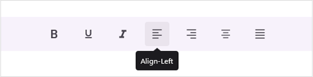

# Enable Tooltip for Toolbar items

The tooltip is enabled in the view when the [TooltipText](https://help.syncfusion.com/cr/maui/Syncfusion.Maui.Toolbar.SfToolbarItem.html#Syncfusion_Maui_Toolbar_SfToolbarItem_ToolTipText) or [Text](https://help.syncfusion.com/cr/maui/Syncfusion.Maui.Toolbar.SfToolbarItem.html#Syncfusion_Maui_Toolbar_SfToolbarItem_Text) property is set for the ToolbarItems.

## Tooltip Text

You can set the tooltip text by setting the [TooltipText](https://help.syncfusion.com/cr/maui/Syncfusion.Maui.Toolbar.SfToolbarItem.html#Syncfusion_Maui_Toolbar_SfToolbarItem_ToolTipText) property.

The following code sample demonstrates how to create a toolbar control with tooltip.





<?xml version="1.0" encoding="utf-8" ?>
<ContentPage xmlns="http://schemas.microsoft.com/dotnet/2021/maui"
             xmlns:x="http://schemas.microsoft.com/winfx/2009/xaml"
             xmlns:local="clr-namespace:ToolbarSample"
             xmlns:toolbar="clr-namespace:Syncfusion.Maui.Toolbar;assembly=Syncfusion.Maui.Toolbar"
             x:Class="ToolbarSample.MainPage">
    <StackLayout>        
        <toolbar:SfToolbar x:Name="Toolbar" HeightRequest="56">
            <toolbar:SfToolbar.Items>
                <toolbar:SfToolbarItem Name="Bold"
                                ToolTipText="Bold">
                    <toolbar:SfToolbarItem.Icon>
                        <FontImageSource Glyph="&#xE770;"
                            FontFamily="MauiMaterialAssets" />
                    </toolbar:SfToolbarItem.Icon>
                </toolbar:SfToolbarItem>
                <toolbar:SfToolbarItem Name="Underline"
                                ToolTipText="Underline">
                    <toolbar:SfToolbarItem.Icon>
                        <FontImageSource Glyph="&#xE762;"
                            FontFamily="MauiMaterialAssets" />
                    </toolbar:SfToolbarItem.Icon>
                </toolbar:SfToolbarItem>
                <toolbar:SfToolbarItem Name="Italic"
                                ToolTipText="Italic">
                    <toolbar:SfToolbarItem.Icon>
                        <FontImageSource Glyph="&#xE771;"
                            FontFamily="MauiMaterialAssets" />
                    </toolbar:SfToolbarItem.Icon>
                </toolbar:SfToolbarItem>
                <toolbar:SfToolbarItem Name="AlignLeft"
                                        ToolTipText="Align-Left">
                    <toolbar:SfToolbarItem.Icon>
                        <FontImageSource Glyph="&#xE751;"
                            FontFamily="MauiMaterialAssets" />
                    </toolbar:SfToolbarItem.Icon>
                </toolbar:SfToolbarItem>
                <toolbar:SfToolbarItem Name="AlignRight"
                                        ToolTipText="Align-Right">
                    <toolbar:SfToolbarItem.Icon>
                        <FontImageSource Glyph="&#xE753;"
                            FontFamily="MauiMaterialAssets" />
                    </toolbar:SfToolbarItem.Icon>
                </toolbar:SfToolbarItem>
                <toolbar:SfToolbarItem Name="AlignCenter"
                                        ToolTipText="Align-Center">
                    <toolbar:SfToolbarItem.Icon>
                        <FontImageSource Glyph="&#xE752;"
                            FontFamily="MauiMaterialAssets" />
                    </toolbar:SfToolbarItem.Icon>
                </toolbar:SfToolbarItem>
                <toolbar:SfToolbarItem Name="AlignJustify"
                                        ToolTipText="Align-Justify">
                    <toolbar:SfToolbarItem.Icon>
                        <FontImageSource Glyph="&#xE74F;"
                            FontFamily="MauiMaterialAssets" />
                    </toolbar:SfToolbarItem.Icon>
                </toolbar:SfToolbarItem>
            </toolbar:SfToolbar.Items>
        </toolbar:SfToolbar>
    </StackLayout>
</ContentPage>





using Syncfusion.Maui.Toolbar;

namespace ToolbarGettingStarted
{
    public partial class MainPage : ContentPage
    {
        public MainPage()
        {
            InitializeComponent();

            SfToolbar toolbar = new SfToolbar();
            toolbar.HeightRequest = 56;
            ObservableCollection<BaseToolbarItem> itemCollection = new ObservableCollection<BaseToolbarItem>
            {
                new SfToolbarItem
                {
                    Name = "Bold",
                    ToolTipText = "Bold",
                    Icon = new FontImageSource { Glyph = "\uE770", FontFamily = "MauiMaterialAssets" }
                },
                new SfToolbarItem
                {
                    Name = "Underline",
                    ToolTipText = "Underline",
                    Icon = new FontImageSource { Glyph = "\uE762", FontFamily = "MauiMaterialAssets" }
                },
                new SfToolbarItem
                {
                    Name = "Italic",
                    ToolTipText = "Italic",
                    Icon = new FontImageSource { Glyph = "\uE771", FontFamily = "MauiMaterialAssets" }
                },
                new SfToolbarItem
                {
                    Name = "AlignLeft",
                    ToolTipText = "Align-Left",
                    Icon = new FontImageSource { Glyph = "\uE751", FontFamily = "MauiMaterialAssets" }
                },
                new SfToolbarItem
                {
                    Name = "AlignRight",
                    ToolTipText = "Align-Right",
                    Icon = new FontImageSource { Glyph = "\uE753", FontFamily = "MauiMaterialAssets" }
                },
                new SfToolbarItem
                {
                    Name = "AlignCenter",
                    ToolTipText = "Align-Center",
                    Icon = new FontImageSource { Glyph = "\uE752", FontFamily = "MauiMaterialAssets" }
                },
                new SfToolbarItem
                {
                    Name = "AlignJustify",
                    ToolTipText = "Align-Justify",
                    Icon = new FontImageSource { Glyph = "\uE74F", FontFamily = "MauiMaterialAssets" }
                }
            };
            toolbar.Items = itemCollection;
            this.Content = toolbar;
        }
    }
}





## Tooltip Settings

The Toolbar control supports customizing tooltip using [ToolTipSettings](https://help.syncfusion.com/cr/maui/Syncfusion.Maui.Toolbar.SfToolbar.html#Syncfusion_Maui_Toolbar_SfToolbar_ToolTipSettings) property. You can set [Background](https://help.syncfusion.com/cr/maui/Syncfusion.Maui.Toolbar.ToolbarToolTipSettings.html#Syncfusion_Maui_Toolbar_ToolbarToolTipSettings_Background), [TextStyle](https://help.syncfusion.com/cr/maui/Syncfusion.Maui.Toolbar.ToolbarToolTipSettings.html#Syncfusion_Maui_Toolbar_ToolbarToolTipSettings_TextStyle) and [ToolTipPosition](https://help.syncfusion.com/cr/maui/Syncfusion.Maui.Toolbar.ToolbarToolTipSettings.html#Syncfusion_Maui_Toolbar_ToolbarToolTipSettings_ToolTipPosition).

The properties of ToolTipSettings are:

* **Background** : Set background color for the tooltip.
* **TextStyle** : Set text style for the tooltip text.
* **ToolTipPosition** : Set the [ToolbarRelativePosition](https://help.syncfusion.com/cr/maui/Syncfusion.Maui.Toolbar.ToolbarRelativePosition.html) for the tooltip. The options are [Auto](https://help.syncfusion.com/cr/maui/Syncfusion.Maui.Toolbar.ToolbarRelativePosition.html#Syncfusion_Maui_Toolbar_ToolbarRelativePosition_Auto), [Top](https://help.syncfusion.com/cr/maui/Syncfusion.Maui.Toolbar.ToolbarRelativePosition.html#Syncfusion_Maui_Toolbar_ToolbarRelativePosition_Top), [Bottom](https://help.syncfusion.com/cr/maui/Syncfusion.Maui.Toolbar.ToolbarRelativePosition.html#Syncfusion_Maui_Toolbar_ToolbarRelativePosition_Bottom), [Left](https://help.syncfusion.com/cr/maui/Syncfusion.Maui.Toolbar.ToolbarRelativePosition.html#Syncfusion_Maui_Toolbar_ToolbarRelativePosition_Left) and [Right](https://help.syncfusion.com/cr/maui/Syncfusion.Maui.Toolbar.ToolbarRelativePosition.html#Syncfusion_Maui_Toolbar_ToolbarRelativePosition_Right). The default value is `Auto`.

The following code sample demonstrates how to create a toolbar control with tooltip settings.





<?xml version="1.0" encoding="utf-8" ?>
<ContentPage xmlns="http://schemas.microsoft.com/dotnet/2021/maui"
             xmlns:x="http://schemas.microsoft.com/winfx/2009/xaml"
             xmlns:toolbar="clr-namespace:Syncfusion.Maui.Toolbar;assembly=Syncfusion.Maui.Toolbar"
             x:Class="ToolbarSample.MainPage">
    <VerticalStackLayout>
        <toolbar:SfToolbar x:Name="Toolbar" HeightRequest="56">
            <toolbar:SfToolbar.Items>
                <toolbar:SfToolbarItem Name="Bold"
                            ToolTipText="Bold">
                    <toolbar:SfToolbarItem.Icon>
                        <FontImageSource Glyph="&#xE770;"
                        FontFamily="MauiMaterialAssets" />
                    </toolbar:SfToolbarItem.Icon>
                </toolbar:SfToolbarItem>
                <toolbar:SfToolbarItem Name="Underline"
                            ToolTipText="Underline">
                    <toolbar:SfToolbarItem.Icon>
                        <FontImageSource Glyph="&#xE762;"
                        FontFamily="MauiMaterialAssets" />
                    </toolbar:SfToolbarItem.Icon>
                </toolbar:SfToolbarItem>
                <toolbar:SfToolbarItem Name="Italic"
                            ToolTipText="Italic">
                    <toolbar:SfToolbarItem.Icon>
                        <FontImageSource Glyph="&#xE771;"
                        FontFamily="MauiMaterialAssets" />
                    </toolbar:SfToolbarItem.Icon>
                </toolbar:SfToolbarItem>
                <toolbar:SfToolbarItem Name="AlignLeft"
                                    ToolTipText="Align-Left">
                    <toolbar:SfToolbarItem.Icon>
                        <FontImageSource Glyph="&#xE751;"
                        FontFamily="MauiMaterialAssets" />
                    </toolbar:SfToolbarItem.Icon>
                </toolbar:SfToolbarItem>
                <toolbar:SfToolbarItem Name="AlignRight"
                                    ToolTipText="Align-Right">
                    <toolbar:SfToolbarItem.Icon>
                        <FontImageSource Glyph="&#xE753;"
                        FontFamily="MauiMaterialAssets" />
                    </toolbar:SfToolbarItem.Icon>
                </toolbar:SfToolbarItem>
                <toolbar:SfToolbarItem Name="AlignCenter"
                                    ToolTipText="Align-Center">
                    <toolbar:SfToolbarItem.Icon>
                        <FontImageSource Glyph="&#xE752;"
                        FontFamily="MauiMaterialAssets" />
                    </toolbar:SfToolbarItem.Icon>
                </toolbar:SfToolbarItem>
                <toolbar:SfToolbarItem Name="AlignJustify"
                                    ToolTipText="Align-Justify">
                    <toolbar:SfToolbarItem.Icon>
                        <FontImageSource Glyph="&#xE74F;"
                        FontFamily="MauiMaterialAssets" />
                    </toolbar:SfToolbarItem.Icon>
                </toolbar:SfToolbarItem>
            </toolbar:SfToolbar.Items>
            <toolbar:SfToolbar.ToolTipSettings>
                <toolbar:ToolbarToolTipSettings Background="Red" ToolTipPosition="Bottom">
                    <toolbar:ToolbarToolTipSettings.TextStyle>
                        <toolbar:ToolbarTextStyle TextColor="Yellow"
                                    FontSize="18"
                                    FontAttributes="Italic"
                                    FontAutoScalingEnabled="True"
                                    FontFamily="OpenSansSemibold"/>
                    </toolbar:ToolbarToolTipSettings.TextStyle>
                </toolbar:ToolbarToolTipSettings>
            </toolbar:SfToolbar.ToolTipSettings>
        </toolbar:SfToolbar>
    </VerticalStackLayout>
</ContentPage>





using Syncfusion.Maui.Toolbar;

namespace ToolbarSample
{
    public partial class MainPage : ContentPage
    {
        public MainPage()
        {
            InitializeComponent();
            SfToolbar toolbar = new SfToolbar();
            toolbar.HeightRequest = 56;
            toolbar.Items = itemCollection;
            toolbar.ToolTipSettings = toolTipSettings;
            this.Content = toolbar;
        }

        ObservableCollection<BaseToolbarItem> itemCollection = new ObservableCollection<BaseToolbarItem>
            {
                new SfToolbarItem { Name = "Bold", ToolTipText = "Bold", Icon = new FontImageSource { Glyph = "\uE770", FontFamily = "MauiMaterialAssets" } },
                new SfToolbarItem { Name = "Underline", ToolTipText = "Underline", Icon = new FontImageSource { Glyph = "\uE762", FontFamily = "MauiMaterialAssets" } },
                new SfToolbarItem { Name = "Italic", ToolTipText = "Italic", Icon = new FontImageSource { Glyph = "\uE771", FontFamily = "MauiMaterialAssets" } },
                new SfToolbarItem { Name = "AlignLeft", ToolTipText = "Align-Left", Icon = new FontImageSource { Glyph = "\uE751", FontFamily = "MauiMaterialAssets" } },
                new SfToolbarItem { Name = "AlignRight", ToolTipText = "Align-Right", Icon = new FontImageSource { Glyph = "\uE753", FontFamily = "MauiMaterialAssets" } },
                new SfToolbarItem { Name = "AlignCenter", ToolTipText = "Align-Center", Icon = new FontImageSource { Glyph = "\uE752", FontFamily = "MauiMaterialAssets" } },
                new SfToolbarItem { Name = "AlignJustify", ToolTipText = "Align-Justify", Icon = new FontImageSource { Glyph = "\uE74F", FontFamily = "MauiMaterialAssets" } }
            };

        ToolbarToolTipSettings toolTipSettings = new ToolbarToolTipSettings
        {
            Background = Colors.Red,
            TextStyle = new ToolbarTextStyle
            {
                TextColor = Colors.Yellow,
                FontSize = 18,
                FontAttributes = FontAttributes.Italic,
                FontAutoScalingEnabled = true,
                FontFamily = "OpenSansSemibold"
            },
            ToolTipPosition = ToolbarRelativePosition.Bottom,
        };
    }
}





