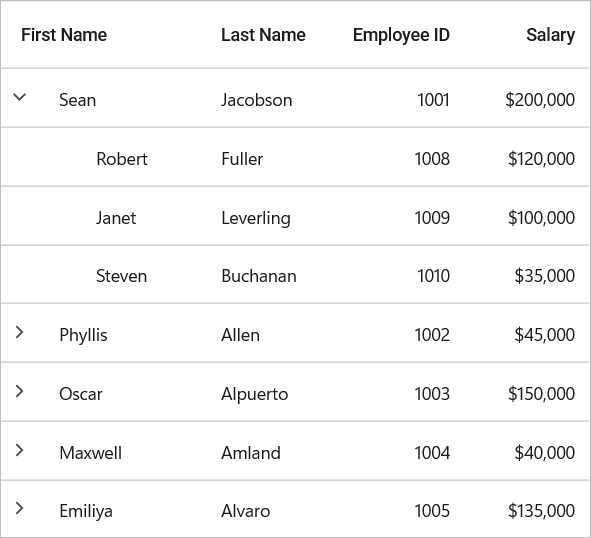

# About Syncfusion .NET MAUI Tree Grid Control

The [.NET MAUI Tree Grid]() control is used to display and manipulate hierarchical data in a tabular view. It combines the clarity of a grid with the ability to present parent-child relationships in an organized structure. Built from the ground up to deliver excellent performance, it handles large datasets efficiently while maintaining smooth interaction.

## Business use cases

- Organizational charts and reporting hierarchies.
- Sales, inventory, and project data with nested parent-child records.
- Financial or operational systems that require grouped hierarchical views.
- Analytics and reporting tools that need structured drill-down data presentation.

## Key features

- **Hierarchical data binding** — Display parent-child and self-referencing data sources.
- **Flexible data binding** — Collections, tables, and MVVM sources.
- **Rich column types** — Text, numeric, date, checkbox, image, and template columns.
- **Data operations** — Sorting and filtering.
- **Styling and customization** — Conditional formatting, stacked headers, freeze panes, and theme support.

## Related controls

- [DataGrid](https://help.syncfusion.com/maui/datagrid/overview) for displaying and manipulating data in tabular format.
- [Charts](https://help.syncfusion.com/maui/cartesian-charts/overview) for advanced data visualization and analytics.
- [ListView](https://help.syncfusion.com/maui/listview/overview) for flexible and lightweight collection display.
- [TreeMap](https://help.syncfusion.com/maui/treemap/overview) for hierarchical or comparative visualization.

## See Also

- [Getting Started]() shows a step-by-step guide to begin using the TreeGrid.
- [UI Kit](https://www.syncfusion.com/demos/maui#maui-ui-control) provides interactive demos and ready-made UI examples.
