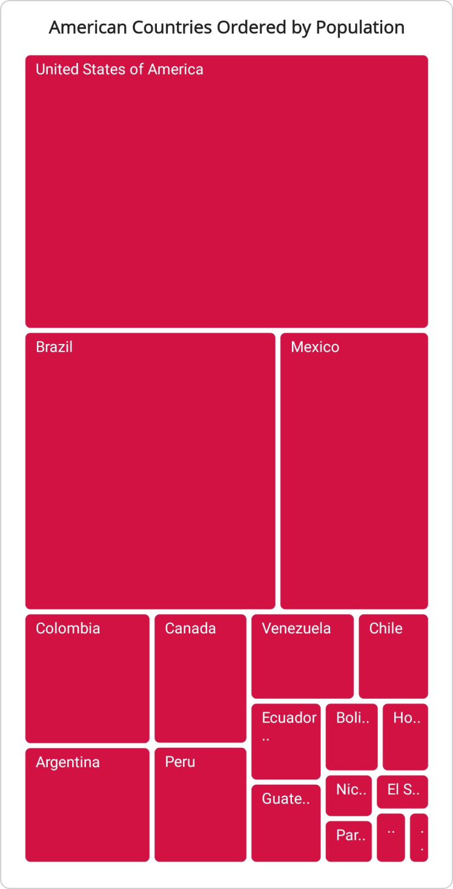
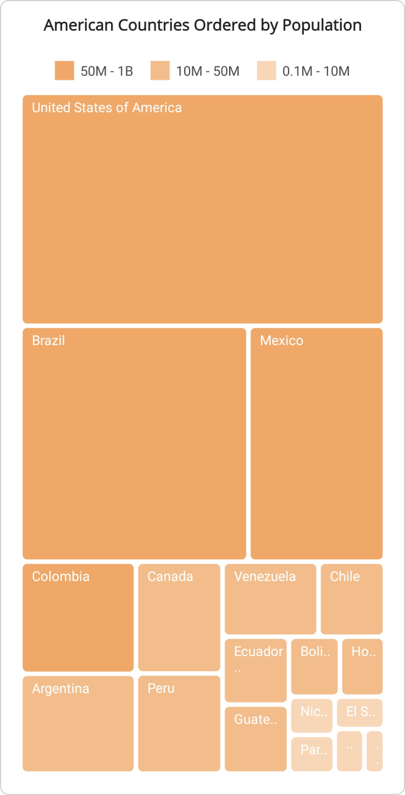
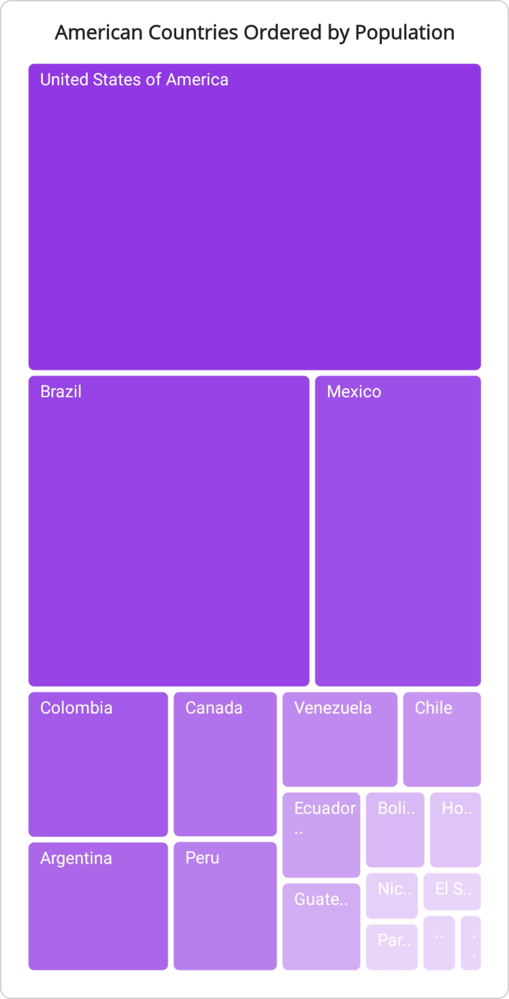

 
# Leaf Item Brush Settings in .NET MAUI TreeMap (SfTreeMap)

The brush settings are used to customize the fill colors for leaf items based on ranges or values, offering four brush settings: [UniformBrushSettings](https://help.syncfusion.com/cr/maui/Syncfusion.Maui.TreeMap.TreeMapUniformBrushSettings.html), [RangeBrushSettings](https://help.syncfusion.com/cr/maui/Syncfusion.Maui.TreeMap.TreeMapRangeBrushSettings.html), [DesaturationBrushSettings](https://help.syncfusion.com/cr/maui/Syncfusion.Maui.TreeMap.TreeMapDesaturationBrushSettings.html), and [PaletteBrushSettings](https://help.syncfusion.com/cr/maui/Syncfusion.Maui.TreeMap.TreeMapPaletteBrushSettings.html). Each setting provides unique options for defining and applying color schemes, enhancing the visualization of the treemap.

## Uniform brush settings

The uniform brush settings in [SfTreeMap](https://help.syncfusion.com/cr/maui/Syncfusion.Maui.TreeMap.SfTreeMap.html) assign a single color uniformly for leaf items representing data. Customize the background brush for treemap leaf items using the [Brush](https://help.syncfusion.com/cr/maui/Syncfusion.Maui.TreeMap.TreeMapUniformBrushSettings.html#Syncfusion_Maui_TreeMap_TreeMapUniformBrushSettings_Brush) property of [TreeMapUniformBrushSettings](https://help.syncfusion.com/cr/maui/Syncfusion.Maui.TreeMap.TreeMapUniformBrushSettings.html).




<treemap:SfTreeMap x:Name="treeMap"
                   DataSource="{Binding PopulationDetails}"
                   PrimaryValuePath="Population">
    <treemap:SfTreeMap.BindingContext>
        <local:PopulationViewModel />
    </treemap:SfTreeMap.BindingContext>
    <treemap:SfTreeMap.LeafItemSettings>
        <treemap:TreeMapLeafItemSettings LabelPath="Country">
        </treemap:TreeMapLeafItemSettings>
    </treemap:SfTreeMap.LeafItemSettings>
    <treemap:SfTreeMap.LeafItemBrushSettings>
        <treemap:TreeMapUniformBrushSettings Brush="#D21243"/>
    </treemap:SfTreeMap.LeafItemBrushSettings>
</treemap:SfTreeMap>





SfTreeMap treeMap = new SfTreeMap();
PopulationViewModel viewModel = new PopulationViewModel();
treeMap.DataSource = viewModel.PopulationDetails;
treeMap.PrimaryValuePath = "Population";
treeMap.LeafItemSettings = new TreeMapLeafItemSettings() { LabelPath = "Country" };
treeMap.LeafItemBrushSettings = new TreeMapUniformBrushSettings() { Brush = new SolidColorBrush(Color.FromArgb("#D21243")) };
this.Content = treeMap;




/// 
    
/// Represents the custom data properties.
/// 

public class PopulationDetails
{
    public string Country { get; set; }
    public string Continent { get; set; }
    public int Population { get; set; }
}




/// 
    
/// Represents demographic information for countries in the Americas for the year 2023.
/// 

public class PopulationViewModel
{
    public PopulationViewModel()
    {
        this.PopulationDetails = new ObservableCollection<PopulationDetails>()
        {
            new PopulationDetails() { Continent ="North America", Country = "United States of America", Population = 339996564 },
            new PopulationDetails() { Continent ="South America", Country = "Brazil", Population = 216422446 },
            new PopulationDetails() { Continent ="North America", Country = "Mexico", Population = 128455567 },
            new PopulationDetails() { Continent ="South America", Country = "Colombia", Population = 52085168 },
            new PopulationDetails() { Continent ="South America", Country = "Argentina", Population = 45773884 },
            new PopulationDetails() { Continent ="North America", Country = "Canada", Population = 38781292 },
            new PopulationDetails() { Continent ="South America", Country = "Peru", Population = 34352719 },
            new PopulationDetails() { Continent ="South America", Country = "Venezuela", Population = 28838499 },
            new PopulationDetails() { Continent ="South America", Country = "Chile", Population = 19629590 },
            new PopulationDetails() { Continent ="South America", Country = "Ecuador", Population = 18190484 },
            new PopulationDetails() { Continent ="North America", Country = "Guatemala", Population = 18092026 },
            new PopulationDetails() { Continent ="South America", Country = "Bolivia", Population = 12388571 },
            new PopulationDetails() { Continent ="North America", Country = "Honduras", Population = 10593798 },
            new PopulationDetails() { Continent ="North America", Country = "Nicaragua", Population = 7046311 },
            new PopulationDetails() { Continent ="South America", Country = "Paraguay", Population = 6861524 },
            new PopulationDetails() { Continent ="North America", Country = "El Salvador", Population = 6364943 },
            new PopulationDetails() { Continent ="North America", Country = "Costa Rica", Population = 5212173 },
            new PopulationDetails() { Continent ="South America", Country = "Uruguay", Population = 3423109 },
        };
    }

    public ObservableCollection<PopulationDetails> PopulationDetails
    {
        get;
        set;
    }
}




 

## Range brush settings

In [SfTreeMap](https://help.syncfusion.com/cr/maui/Syncfusion.Maui.TreeMap.SfTreeMap.html), the range brush settings assign a collection of range-based brushes. Utilize the [RangeBrushes](https://help.syncfusion.com/cr/maui/Syncfusion.Maui.TreeMap.TreeMapRangeBrushSettings.html#Syncfusion_Maui_TreeMap_TreeMapRangeBrushSettings_RangeBrushes) property of [TreeMapRangeBrushSettings](https://help.syncfusion.com/cr/maui/Syncfusion.Maui.TreeMap.TreeMapRangeBrushSettings.html) to specify a list of [TreeMapRangeBrush](https://help.syncfusion.com/cr/maui/Syncfusion.Maui.TreeMap.TreeMapRangeBrush.html) instances. Each instance defines a specific range and its associated background brush.

The [TreeMapRangeBrush](https://help.syncfusion.com/cr/maui/Syncfusion.Maui.TreeMap.TreeMapRangeBrush.html) includes the following properties:

[Brush](https://help.syncfusion.com/cr/maui/Syncfusion.Maui.TreeMap.TreeMapRangeBrush.html#Syncfusion_Maui_TreeMap_TreeMapRangeBrush_Brush): Specifies the background brush for the range in the SfTreeMap.
[From](https://help.syncfusion.com/cr/maui/Syncfusion.Maui.TreeMap.TreeMapRangeBrush.html#Syncfusion_Maui_TreeMap_TreeMapRangeBrush_From): Sets the starting value of the range for the background brush.
[To](https://help.syncfusion.com/cr/maui/Syncfusion.Maui.TreeMap.TreeMapRangeBrush.html#Syncfusion_Maui_TreeMap_TreeMapRangeBrush_To): Sets the ending value of the range for the background brush.
[LegendLabel](https://help.syncfusion.com/cr/maui/Syncfusion.Maui.TreeMap.TreeMapRangeBrush.html#Syncfusion_Maui_TreeMap_TreeMapRangeBrush_LegendLabel): Defines the text for the legend item associated with the range in the SfTreeMap.




<treemap:SfTreeMap x:Name="treeMap"
                   DataSource="{Binding PopulationDetails}"
                   PrimaryValuePath="Population"
                   RangeColorValuePath="Population">
    <treemap:SfTreeMap.BindingContext>
        <local:PopulationViewModel />
    </treemap:SfTreeMap.BindingContext>
    <treemap:SfTreeMap.LeafItemSettings>
        <treemap:TreeMapLeafItemSettings LabelPath="Country">
        </treemap:TreeMapLeafItemSettings>
    </treemap:SfTreeMap.LeafItemSettings>
    <treemap:SfTreeMap.LeafItemBrushSettings>
        <treemap:TreeMapRangeBrushSettings>
            <treemap:TreeMapRangeBrushSettings.RangeBrushes>
                <treemap:TreeMapRangeBrush LegendLabel="50M - 1B"
                                           From="50000000"
                                           To="1000000000" 
                                           Brush ="#F0A868" />
                <treemap:TreeMapRangeBrush LegendLabel="10M - 50M"
                                           From="10000000"
                                           To="50000000" 
                                           Brush ="#F3BC8B" />
                <treemap:TreeMapRangeBrush LegendLabel="0.1M - 10M"
                                           From="100000" 
                                           To="10000000"  
                                           Brush= "#F8D7B9" />
            </treemap:TreeMapRangeBrushSettings.RangeBrushes>
        </treemap:TreeMapRangeBrushSettings>
    </treemap:SfTreeMap.LeafItemBrushSettings>
    <treemap:SfTreeMap.LegendSettings>
        <treemap:TreeMapLegendSettings ShowLegend="True">
        </treemap:TreeMapLegendSettings>
    </treemap:SfTreeMap.LegendSettings>
</treemap:SfTreeMap>





SfTreeMap treeMap = new SfTreeMap();
PopulationViewModel viewModel = new PopulationViewModel();
treeMap.DataSource = viewModel.PopulationDetails;
treeMap.PrimaryValuePath = "Population";
treeMap.RangeColorValuePath = "Population";
treeMap.LeafItemSettings = new TreeMapLeafItemSettings() { LabelPath = "Country" };
treeMap.LeafItemBrushSettings = new TreeMapRangeBrushSettings()
{
    RangeBrushes = new List<TreeMapRangeBrush>()
    {
        new TreeMapRangeBrush() { LegendLabel="50M - 1B", From=50000000, To=1000000000, Brush = new SolidColorBrush(Color.FromArgb("#F0A868")) },
        new TreeMapRangeBrush() { LegendLabel="10M - 50M", From=10000000, To=50000000, Brush = new SolidColorBrush(Color.FromArgb("#F3BC8B")) },
        new TreeMapRangeBrush() { LegendLabel="0.1M - 10M", From=100000, To=10000000, Brush = new SolidColorBrush(Color.FromArgb("#F8D7B9")) },
    }
};

this.Content = treeMap;




/// 
    
/// Represents the custom data properties.
/// 

public class PopulationDetails
{
    public string Country { get; set; }
    public string Continent { get; set; }
    public int Population { get; set; }
}




/// 
    
/// Represents demographic information for countries in the Americas for the year 2023.
/// 

public class PopulationViewModel
{
    public PopulationViewModel()
    {
        this.PopulationDetails = new ObservableCollection<PopulationDetails>()
        {
            new PopulationDetails() { Continent ="North America", Country = "United States of America", Population = 339996564 },
            new PopulationDetails() { Continent ="South America", Country = "Brazil", Population = 216422446 },
            new PopulationDetails() { Continent ="North America", Country = "Mexico", Population = 128455567 },
            new PopulationDetails() { Continent ="South America", Country = "Colombia", Population = 52085168 },
            new PopulationDetails() { Continent ="South America", Country = "Argentina", Population = 45773884 },
            new PopulationDetails() { Continent ="North America", Country = "Canada", Population = 38781292 },
            new PopulationDetails() { Continent ="South America", Country = "Peru", Population = 34352719 },
            new PopulationDetails() { Continent ="South America", Country = "Venezuela", Population = 28838499 },
            new PopulationDetails() { Continent ="South America", Country = "Chile", Population = 19629590 },
            new PopulationDetails() { Continent ="South America", Country = "Ecuador", Population = 18190484 },
            new PopulationDetails() { Continent ="North America", Country = "Guatemala", Population = 18092026 },
            new PopulationDetails() { Continent ="South America", Country = "Bolivia", Population = 12388571 },
            new PopulationDetails() { Continent ="North America", Country = "Honduras", Population = 10593798 },
            new PopulationDetails() { Continent ="North America", Country = "Nicaragua", Population = 7046311 },
            new PopulationDetails() { Continent ="South America", Country = "Paraguay", Population = 6861524 },
            new PopulationDetails() { Continent ="North America", Country = "El Salvador", Population = 6364943 },
            new PopulationDetails() { Continent ="North America", Country = "Costa Rica", Population = 5212173 },
            new PopulationDetails() { Continent ="South America", Country = "Uruguay", Population = 3423109 },
        };
    }

    public ObservableCollection<PopulationDetails> PopulationDetails
    {
        get;
        set;
    }
}




N> The [TreeMapRangeBrushSettings](https://help.syncfusion.com/cr/maui/Syncfusion.Maui.TreeMap.TreeMapRangeBrushSettings.html) is only applicable when the [RangeColorValuePath](https://help.syncfusion.com/cr/maui/Syncfusion.Maui.TreeMap.SfTreeMap.html#Syncfusion_Maui_TreeMap_SfTreeMap_RangeColorValuePath) property of the [SfTreeMap](https://help.syncfusion.com/cr/maui/Syncfusion.Maui.TreeMap.SfTreeMap.html) is enabled. Additionally, you can ensure that legend items share the same background color by setting the [ShowLegend](https://help.syncfusion.com/cr/maui/Syncfusion.Maui.TreeMap.TreeMapLegendSettings.html#Syncfusion_Maui_TreeMap_TreeMapLegendSettings_ShowLegend) property within [LegendSettings](https://help.syncfusion.com/cr/maui/Syncfusion.Maui.TreeMap.SfTreeMap.html#Syncfusion_Maui_TreeMap_SfTreeMap_LegendSettings).

 

## Desaturation brush settings

The desaturation brush settings in the [SfTreeMap](https://help.syncfusion.com/cr/maui/Syncfusion.Maui.TreeMap.SfTreeMap.html) modify color saturation based on data values, enabling customization of the background brush and desaturation range.

The [TreeMapDesaturationBrushSettings](https://help.syncfusion.com/cr/maui/Syncfusion.Maui.TreeMap.TreeMapDesaturationBrushSettings.html) includes the following properties:

* [Brush](https://help.syncfusion.com/cr/maui/Syncfusion.Maui.TreeMap.TreeMapDesaturationBrushSettings.html#Syncfusion_Maui_TreeMap_TreeMapDesaturationBrushSettings_Brush): Sets the background brush for desaturation in the SfTreeMap.
* [From](https://help.syncfusion.com/cr/maui/Syncfusion.Maui.TreeMap.TreeMapDesaturationBrushSettings.html#Syncfusion_Maui_TreeMap_TreeMapDesaturationBrushSettings_From): Sets the starting value for the desaturation range.
* [To](https://help.syncfusion.com/cr/maui/Syncfusion.Maui.TreeMap.TreeMapDesaturationBrushSettings.html#Syncfusion_Maui_TreeMap_TreeMapDesaturationBrushSettings_To): Sets the ending value for the desaturation range.




<treemap:SfTreeMap x:Name="treeMap"
                   DataSource="{Binding PopulationDetails}"
                   PrimaryValuePath="Population">
    <treemap:SfTreeMap.BindingContext>
        <local:PopulationViewModel />
    </treemap:SfTreeMap.BindingContext>
    <treemap:SfTreeMap.LeafItemSettings>
        <treemap:TreeMapLeafItemSettings LabelPath="Country">
        </treemap:TreeMapLeafItemSettings>
    </treemap:SfTreeMap.LeafItemSettings>
    <treemap:SfTreeMap.LeafItemBrushSettings>
        <treemap:TreeMapDesaturationBrushSettings Brush="BlueViolet" From="1" To="0.2"/>
    </treemap:SfTreeMap.LeafItemBrushSettings>
</treemap:SfTreeMap>





SfTreeMap treeMap = new SfTreeMap();
PopulationViewModel viewModel = new PopulationViewModel();
treeMap.DataSource = viewModel.PopulationDetails;
treeMap.PrimaryValuePath = "Population";
treeMap.LeafItemSettings = new TreeMapLeafItemSettings() { LabelPath = "Country" };
treeMap.LeafItemBrushSettings = new TreeMapDesaturationBrushSettings() { Brush = Brush.BlueViolet, From = 1, To = 0.2 };
this.Content = treeMap;




/// 
    
/// Represents the custom data properties.
/// 

public class PopulationDetails
{
    public string Country { get; set; }
    public string Continent { get; set; }
    public int Population { get; set; }
}




/// 
    
/// Represents demographic information for countries in the Americas for the year 2023.
/// 

public class PopulationViewModel
{
    public PopulationViewModel()
    {
        this.PopulationDetails = new ObservableCollection<PopulationDetails>()
        {
            new PopulationDetails() { Continent ="North America", Country = "United States of America", Population = 339996564 },
            new PopulationDetails() { Continent ="South America", Country = "Brazil", Population = 216422446 },
            new PopulationDetails() { Continent ="North America", Country = "Mexico", Population = 128455567 },
            new PopulationDetails() { Continent ="South America", Country = "Colombia", Population = 52085168 },
            new PopulationDetails() { Continent ="South America", Country = "Argentina", Population = 45773884 },
            new PopulationDetails() { Continent ="North America", Country = "Canada", Population = 38781292 },
            new PopulationDetails() { Continent ="South America", Country = "Peru", Population = 34352719 },
            new PopulationDetails() { Continent ="South America", Country = "Venezuela", Population = 28838499 },
            new PopulationDetails() { Continent ="South America", Country = "Chile", Population = 19629590 },
            new PopulationDetails() { Continent ="South America", Country = "Ecuador", Population = 18190484 },
            new PopulationDetails() { Continent ="North America", Country = "Guatemala", Population = 18092026 },
            new PopulationDetails() { Continent ="South America", Country = "Bolivia", Population = 12388571 },
            new PopulationDetails() { Continent ="North America", Country = "Honduras", Population = 10593798 },
            new PopulationDetails() { Continent ="North America", Country = "Nicaragua", Population = 7046311 },
            new PopulationDetails() { Continent ="South America", Country = "Paraguay", Population = 6861524 },
            new PopulationDetails() { Continent ="North America", Country = "El Salvador", Population = 6364943 },
            new PopulationDetails() { Continent ="North America", Country = "Costa Rica", Population = 5212173 },
            new PopulationDetails() { Continent ="South America", Country = "Uruguay", Population = 3423109 },
        };
    }

    public ObservableCollection<PopulationDetails> PopulationDetails
    {
        get;
        set;
    }
}




 

## Palette brush settings

The leaf items are colored by using the [Brushes](https://help.syncfusion.com/cr/maui/Syncfusion.Maui.TreeMap.TreeMapPaletteBrushSettings.html#Syncfusion_Maui_TreeMap_TreeMapPaletteBrushSettings_Brushes) property  within the colors collection of [TreeMapPaletteBrushSettings](https://help.syncfusion.com/cr/maui/Syncfusion.Maui.TreeMap.TreeMapPaletteBrushSettings.html).




<treemap:SfTreeMap x:Name="treeMap"
                   DataSource="{Binding PopulationDetails}"
                   PrimaryValuePath="Population">
    <treemap:SfTreeMap.BindingContext>
        <local:PopulationViewModel />
    </treemap:SfTreeMap.BindingContext>
    <treemap:SfTreeMap.LeafItemSettings>
        <treemap:TreeMapLeafItemSettings LabelPath="Country">
        </treemap:TreeMapLeafItemSettings>
    </treemap:SfTreeMap.LeafItemSettings>
    <treemap:SfTreeMap.LeafItemBrushSettings>
        <treemap:TreeMapPaletteBrushSettings>
            <treemap:TreeMapPaletteBrushSettings.Brushes>
                <SolidColorBrush>#116DF9</SolidColorBrush>
                <SolidColorBrush>#9215F3</SolidColorBrush>
                <SolidColorBrush>#F4890B</SolidColorBrush>
                <SolidColorBrush>#D21243</SolidColorBrush>
                <SolidColorBrush>#E2227E</SolidColorBrush>
                <SolidColorBrush>#9215F3</SolidColorBrush>
            </treemap:TreeMapPaletteBrushSettings.Brushes>
        </treemap:TreeMapPaletteBrushSettings>
    </treemap:SfTreeMap.LeafItemBrushSettings>
</treemap:SfTreeMap>





SfTreeMap treeMap = new SfTreeMap();
PopulationViewModel viewModel = new PopulationViewModel();
treeMap.DataSource = viewModel.PopulationDetails;
treeMap.PrimaryValuePath = "Population";
treeMap.LeafItemSettings = new TreeMapLeafItemSettings() { LabelPath = "Country" };
treeMap.LeafItemBrushSettings = new TreeMapPaletteBrushSettings()
{
    Brushes = new List<Brush>()
    {
        new SolidColorBrush(Color.FromArgb("#116DF9")),
        new SolidColorBrush(Color.FromArgb("#9215F3")),
        new SolidColorBrush(Color.FromArgb("#F4890B")),
        new SolidColorBrush(Color.FromArgb("#D21243")),
        new SolidColorBrush(Color.FromArgb("#E2227E")),
        new SolidColorBrush(Color.FromArgb("#9215F3")),
    }
};

this.Content = treeMap;




/// 
    
/// Represents the custom data properties.
/// 

public class PopulationDetails
{
    public string Country { get; set; }
    public string Continent { get; set; }
    public int Population { get; set; }
}




/// 
    
/// Represents demographic information for countries in the Americas for the year 2023.
/// 

public class PopulationViewModel
{
    public PopulationViewModel()
    {
        this.PopulationDetails = new ObservableCollection<PopulationDetails>()
        {
            new PopulationDetails() { Continent ="North America", Country = "United States of America", Population = 339996564 },
            new PopulationDetails() { Continent ="South America", Country = "Brazil", Population = 216422446 },
            new PopulationDetails() { Continent ="North America", Country = "Mexico", Population = 128455567 },
            new PopulationDetails() { Continent ="South America", Country = "Colombia", Population = 52085168 },
            new PopulationDetails() { Continent ="South America", Country = "Argentina", Population = 45773884 },
            new PopulationDetails() { Continent ="North America", Country = "Canada", Population = 38781292 },
            new PopulationDetails() { Continent ="South America", Country = "Peru", Population = 34352719 },
            new PopulationDetails() { Continent ="South America", Country = "Venezuela", Population = 28838499 },
            new PopulationDetails() { Continent ="South America", Country = "Chile", Population = 19629590 },
            new PopulationDetails() { Continent ="South America", Country = "Ecuador", Population = 18190484 },
            new PopulationDetails() { Continent ="North America", Country = "Guatemala", Population = 18092026 },
            new PopulationDetails() { Continent ="South America", Country = "Bolivia", Population = 12388571 },
            new PopulationDetails() { Continent ="North America", Country = "Honduras", Population = 10593798 },
            new PopulationDetails() { Continent ="North America", Country = "Nicaragua", Population = 7046311 },
            new PopulationDetails() { Continent ="South America", Country = "Paraguay", Population = 6861524 },
            new PopulationDetails() { Continent ="North America", Country = "El Salvador", Population = 6364943 },
            new PopulationDetails() { Continent ="North America", Country = "Costa Rica", Population = 5212173 },
            new PopulationDetails() { Continent ="South America", Country = "Uruguay", Population = 3423109 },
        };
    }

    public ObservableCollection<PopulationDetails> PopulationDetails
    {
        get;
        set;
    }
}




 