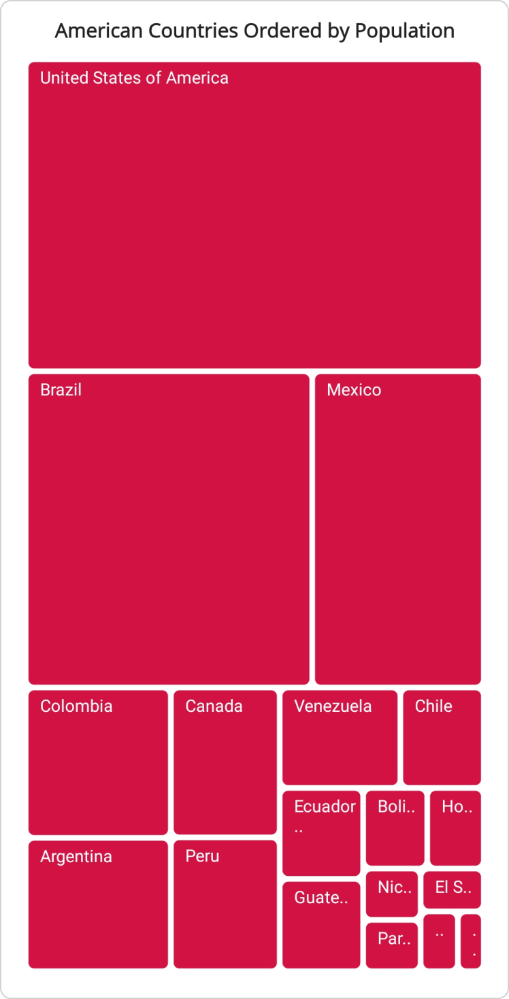
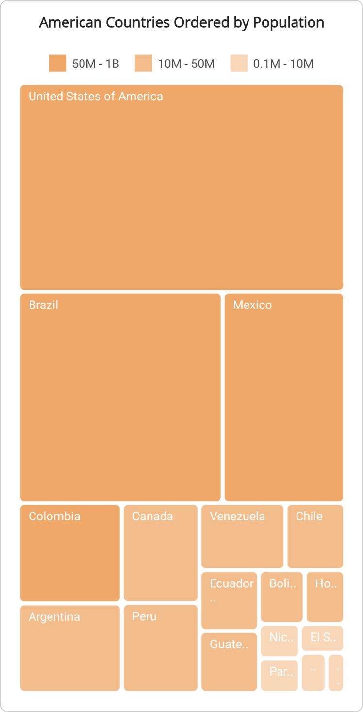
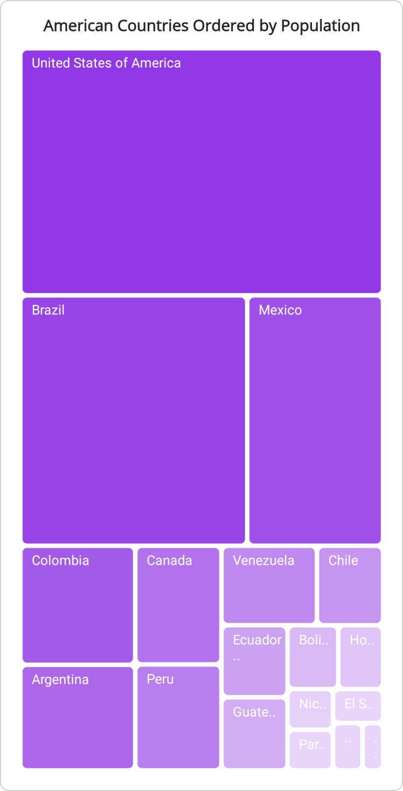
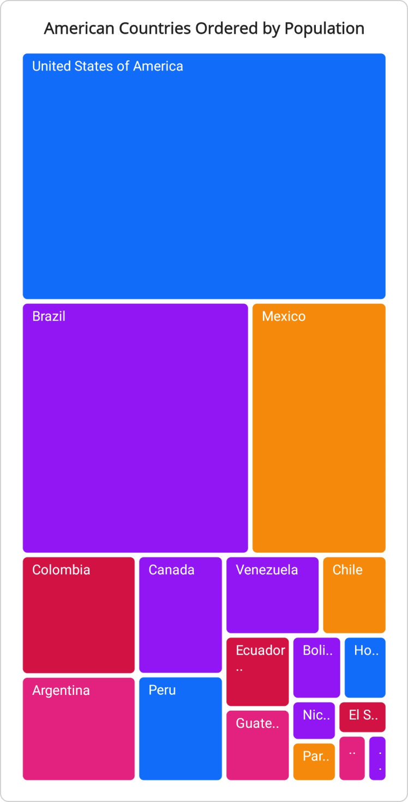

 
# Brush Settings in .NET MAUI TreeMap (SfTreeMap)

N> **Prerequisite:** Ensure that the required NuGet package is installed, the necessary namespaces are imported, and the **TreeMap** control is properly configured in your application. For detailed setup and configuration instructions, refer to the **[Getting Started](https://help.syncfusion.com/maui/tree-map/getting-started)** guide.

## Leaf Item Brush Settings

The brush settings are used to customize the fill colors for leaf items based on ranges or values, offering four brush settings: [UniformBrushSettings](https://help.syncfusion.com/cr/maui/Syncfusion.Maui.TreeMap.TreeMapUniformBrushSettings.html), [RangeBrushSettings](https://help.syncfusion.com/cr/maui/Syncfusion.Maui.TreeMap.TreeMapRangeBrushSettings.html), [DesaturationBrushSettings](https://help.syncfusion.com/cr/maui/Syncfusion.Maui.TreeMap.TreeMapDesaturationBrushSettings.html), and [PaletteBrushSettings](https://help.syncfusion.com/cr/maui/Syncfusion.Maui.TreeMap.TreeMapPaletteBrushSettings.html). Each setting provides unique options for defining and applying color schemes, enhancing the visualization of the TreeMap. By default, no `LeafItemBrushSettings` is set, and the leaf items are rendered with the default fill color.

### Uniform brush settings

The uniform brush settings in [SfTreeMap](https://help.syncfusion.com/cr/maui/Syncfusion.Maui.TreeMap.SfTreeMap.html) apply a single fill color to all leaf items. Use the [Brush](https://help.syncfusion.com/cr/maui/Syncfusion.Maui.TreeMap.TreeMapUniformBrushSettings.html#Syncfusion_Maui_TreeMap_TreeMapUniformBrushSettings_Brush) property of [TreeMapUniformBrushSettings](https://help.syncfusion.com/cr/maui/Syncfusion.Maui.TreeMap.TreeMapUniformBrushSettings.html) to set the background brush for TreeMap leaf items.




<treemap:SfTreeMap x:Name="treeMap"
                   DataSource="{Binding PopulationDetails}"
                   PrimaryValuePath="Population">
    <treemap:SfTreeMap.BindingContext>
        <local:PopulationViewModel />
    </treemap:SfTreeMap.BindingContext>
    <treemap:SfTreeMap.LeafItemSettings>
        <treemap:TreeMapLeafItemSettings LabelPath="Country">
        </treemap:TreeMapLeafItemSettings>
    </treemap:SfTreeMap.LeafItemSettings>
    <treemap:SfTreeMap.LeafItemBrushSettings>
        <treemap:TreeMapUniformBrushSettings Brush="#D21243"/>
    </treemap:SfTreeMap.LeafItemBrushSettings>
</treemap:SfTreeMap>





SfTreeMap treeMap = new SfTreeMap();
PopulationViewModel viewModel = new PopulationViewModel();
treeMap.DataSource = viewModel.PopulationDetails;
treeMap.PrimaryValuePath = "Population";
treeMap.LeafItemSettings = new TreeMapLeafItemSettings() { LabelPath = "Country" };
treeMap.LeafItemBrushSettings = new TreeMapUniformBrushSettings() { Brush = new SolidColorBrush(Color.FromArgb(0xFF, 0xD2, 0x12, 0x43)) };
//code omitted for brevity
this.Content = treeMap;




/// 
    
/// Represents the custom data properties.
/// 

public class PopulationDetails
{
    public string Country { get; set; }
    public string Continent { get; set; }
    public int Population { get; set; }
}




/// 
    
/// Represents demographic information for countries in the Americas for the year 2023.
/// 

public class PopulationViewModel
{
    public PopulationViewModel()
    {
        this.PopulationDetails = new ObservableCollection<PopulationDetails>()
        {
            new PopulationDetails() { Continent ="North America", Country = "United States of America", Population = 339996564 },
            new PopulationDetails() { Continent ="South America", Country = "Brazil", Population = 216422446 },
            new PopulationDetails() { Continent ="North America", Country = "Mexico", Population = 128455567 },
            new PopulationDetails() { Continent ="South America", Country = "Colombia", Population = 52085168 },
            new PopulationDetails() { Continent ="South America", Country = "Argentina", Population = 45773884 },
            new PopulationDetails() { Continent ="North America", Country = "Canada", Population = 38781292 },
            new PopulationDetails() { Continent ="South America", Country = "Peru", Population = 34352719 },
            new PopulationDetails() { Continent ="South America", Country = "Venezuela", Population = 28838499 },
            new PopulationDetails() { Continent ="South America", Country = "Chile", Population = 19629590 },
            new PopulationDetails() { Continent ="South America", Country = "Ecuador", Population = 18190484 },
            new PopulationDetails() { Continent ="North America", Country = "Guatemala", Population = 18092026 },
            new PopulationDetails() { Continent ="South America", Country = "Bolivia", Population = 12388571 },
            new PopulationDetails() { Continent ="North America", Country = "Honduras", Population = 10593798 },
            new PopulationDetails() { Continent ="North America", Country = "Nicaragua", Population = 7046311 },
            new PopulationDetails() { Continent ="South America", Country = "Paraguay", Population = 6861524 },
            new PopulationDetails() { Continent ="North America", Country = "El Salvador", Population = 6364943 },
            new PopulationDetails() { Continent ="North America", Country = "Costa Rica", Population = 5212173 },
            new PopulationDetails() { Continent ="South America", Country = "Uruguay", Population = 3423109 },
        };
    }

    public ObservableCollection<PopulationDetails> PopulationDetails
    {
        get;
        set;
    }
}




 

### Range brush settings

In [SfTreeMap](https://help.syncfusion.com/cr/maui/Syncfusion.Maui.TreeMap.SfTreeMap.html), the range brush settings assign a collection of range-based brushes. Use the [RangeBrushes](https://help.syncfusion.com/cr/maui/Syncfusion.Maui.TreeMap.TreeMapRangeBrushSettings.html#Syncfusion_Maui_TreeMap_TreeMapRangeBrushSettings_RangeBrushes) property of [TreeMapRangeBrushSettings](https://help.syncfusion.com/cr/maui/Syncfusion.Maui.TreeMap.TreeMapRangeBrushSettings.html) to specify a list of [TreeMapRangeBrush](https://help.syncfusion.com/cr/maui/Syncfusion.Maui.TreeMap.TreeMapRangeBrush.html) instances. Each instance defines a specific range and its associated background brush.

The [TreeMapRangeBrush](https://help.syncfusion.com/cr/maui/Syncfusion.Maui.TreeMap.TreeMapRangeBrush.html) includes the following properties:

* [Brush](https://help.syncfusion.com/cr/maui/Syncfusion.Maui.TreeMap.TreeMapRangeBrush.html#Syncfusion_Maui_TreeMap_TreeMapRangeBrush_Brush): Specifies the background brush for the range in the [SfTreeMap](https://help.syncfusion.com/cr/maui/Syncfusion.Maui.TreeMap.SfTreeMap.html).
* [From](https://help.syncfusion.com/cr/maui/Syncfusion.Maui.TreeMap.TreeMapRangeBrush.html#Syncfusion_Maui_TreeMap_TreeMapRangeBrush_From): Sets the starting value of the range for the background brush.
* [To](https://help.syncfusion.com/cr/maui/Syncfusion.Maui.TreeMap.TreeMapRangeBrush.html#Syncfusion_Maui_TreeMap_TreeMapRangeBrush_To): Sets the ending value of the range for the background brush.
* [LegendLabel](https://help.syncfusion.com/cr/maui/Syncfusion.Maui.TreeMap.TreeMapRangeBrush.html#Syncfusion_Maui_TreeMap_TreeMapRangeBrush_LegendLabel): Defines the text for the legend item associated with the range in the [SfTreeMap](https://help.syncfusion.com/cr/maui/Syncfusion.Maui.TreeMap.SfTreeMap.html).

N> The [TreeMapRangeBrushSettings](https://help.syncfusion.com/cr/maui/Syncfusion.Maui.TreeMap.TreeMapRangeBrushSettings.html) is only applicable when the [RangeColorValuePath](https://help.syncfusion.com/cr/maui/Syncfusion.Maui.TreeMap.SfTreeMap.html#Syncfusion_Maui_TreeMap_SfTreeMap_RangeColorValuePath) property of the [SfTreeMap](https://help.syncfusion.com/cr/maui/Syncfusion.Maui.TreeMap.SfTreeMap.html) is set. The `RangeColorValuePath` property maps a field from the data source whose value is compared against the `From` and `To` values of each range brush to determine the fill color of a leaf item. If a value does not fall within any defined range, the leaf item is rendered with the default fill color. To display legend items that share the same background color as the range brushes, set the [ShowLegend](https://help.syncfusion.com/cr/maui/Syncfusion.Maui.TreeMap.TreeMapLegendSettings.html#Syncfusion_Maui_TreeMap_TreeMapLegendSettings_ShowLegend) property within [LegendSettings](https://help.syncfusion.com/cr/maui/Syncfusion.Maui.TreeMap.SfTreeMap.html#Syncfusion_Maui_TreeMap_SfTreeMap_LegendSettings). For more information, refer to the [Legend](legend.md) documentation.




<treemap:SfTreeMap x:Name="treeMap"
                   DataSource="{Binding PopulationDetails}"
                   PrimaryValuePath="Population"
                   RangeColorValuePath="Population">
    <treemap:SfTreeMap.BindingContext>
        <local:PopulationViewModel />
    </treemap:SfTreeMap.BindingContext>
    <treemap:SfTreeMap.LeafItemSettings>
        <treemap:TreeMapLeafItemSettings LabelPath="Country">
        </treemap:TreeMapLeafItemSettings>
    </treemap:SfTreeMap.LeafItemSettings>
    <treemap:SfTreeMap.LeafItemBrushSettings>
        <treemap:TreeMapRangeBrushSettings>
            <treemap:TreeMapRangeBrushSettings.RangeBrushes>
                <treemap:TreeMapRangeBrush LegendLabel="50M - 1B"
                                           From="50000000"
                                           To="1000000000" 
                                           Brush ="#F0A868" />
                <treemap:TreeMapRangeBrush LegendLabel="10M - 50M"
                                           From="10000000"
                                           To="50000000" 
                                           Brush ="#F3BC8B" />
                <treemap:TreeMapRangeBrush LegendLabel="0.1M - 10M"
                                           From="100000" 
                                           To="10000000"  
                                           Brush= "#F8D7B9" />
            </treemap:TreeMapRangeBrushSettings.RangeBrushes>
        </treemap:TreeMapRangeBrushSettings>
    </treemap:SfTreeMap.LeafItemBrushSettings>
    <treemap:SfTreeMap.LegendSettings>
        <treemap:TreeMapLegendSettings ShowLegend="True">
        </treemap:TreeMapLegendSettings>
    </treemap:SfTreeMap.LegendSettings>
</treemap:SfTreeMap>





SfTreeMap treeMap = new SfTreeMap();
PopulationViewModel viewModel = new PopulationViewModel();
treeMap.DataSource = viewModel.PopulationDetails;
treeMap.PrimaryValuePath = "Population";
treeMap.RangeColorValuePath = "Population";
treeMap.LeafItemSettings = new TreeMapLeafItemSettings() { LabelPath = "Country" };
treeMap.LeafItemBrushSettings = new TreeMapRangeBrushSettings()
{
    RangeBrushes = new List<TreeMapRangeBrush>()
    {
        new TreeMapRangeBrush() { LegendLabel="50M - 1B", From=50000000, To=1000000000, Brush = new SolidColorBrush(Color.FromArgb(0xFF, 0xF0, 0xA8, 0x68)) },
        new TreeMapRangeBrush() { LegendLabel="10M - 50M", From=10000000, To=50000000, Brush = new SolidColorBrush(Color.FromArgb(0xFF, 0xF3, 0xBC, 0x8B)) },
        new TreeMapRangeBrush() { LegendLabel="0.1M - 10M", From=100000, To=10000000, Brush = new SolidColorBrush(Color.FromArgb(0xFF, 0xF8, 0xD7, 0xB9)) },
    }
};

//code omitted for brevity
this.Content = treeMap;




/// 
    
/// Represents the custom data properties.
/// 

public class PopulationDetails
{
    public string Country { get; set; }
    public string Continent { get; set; }
    public int Population { get; set; }
}




/// 
    
/// Represents demographic information for countries in the Americas for the year 2023.
/// 

public class PopulationViewModel
{
    public PopulationViewModel()
    {
        this.PopulationDetails = new ObservableCollection<PopulationDetails>()
        {
            new PopulationDetails() { Continent ="North America", Country = "United States of America", Population = 339996564 },
            new PopulationDetails() { Continent ="South America", Country = "Brazil", Population = 216422446 },
            new PopulationDetails() { Continent ="North America", Country = "Mexico", Population = 128455567 },
            new PopulationDetails() { Continent ="South America", Country = "Colombia", Population = 52085168 },
            new PopulationDetails() { Continent ="South America", Country = "Argentina", Population = 45773884 },
            new PopulationDetails() { Continent ="North America", Country = "Canada", Population = 38781292 },
            new PopulationDetails() { Continent ="South America", Country = "Peru", Population = 34352719 },
            new PopulationDetails() { Continent ="South America", Country = "Venezuela", Population = 28838499 },
            new PopulationDetails() { Continent ="South America", Country = "Chile", Population = 19629590 },
            new PopulationDetails() { Continent ="South America", Country = "Ecuador", Population = 18190484 },
            new PopulationDetails() { Continent ="North America", Country = "Guatemala", Population = 18092026 },
            new PopulationDetails() { Continent ="South America", Country = "Bolivia", Population = 12388571 },
            new PopulationDetails() { Continent ="North America", Country = "Honduras", Population = 10593798 },
            new PopulationDetails() { Continent ="North America", Country = "Nicaragua", Population = 7046311 },
            new PopulationDetails() { Continent ="South America", Country = "Paraguay", Population = 6861524 },
            new PopulationDetails() { Continent ="North America", Country = "El Salvador", Population = 6364943 },
            new PopulationDetails() { Continent ="North America", Country = "Costa Rica", Population = 5212173 },
            new PopulationDetails() { Continent ="South America", Country = "Uruguay", Population = 3423109 },
        };
    }

    public ObservableCollection<PopulationDetails> PopulationDetails
    {
        get;
        set;
    }
}




 

### Desaturation brush settings

The desaturation brush settings in the [SfTreeMap](https://help.syncfusion.com/cr/maui/Syncfusion.Maui.TreeMap.SfTreeMap.html) modify the color saturation of the background brush based on the value mapped through [RangeColorValuePath](https://help.syncfusion.com/cr/maui/Syncfusion.Maui.TreeMap.SfTreeMap.html#Syncfusion_Maui_TreeMap_SfTreeMap_RangeColorValuePath). The `From` and `To` properties define the saturation scale, where `1` represents the full-saturation brush color and `0` represents a fully desaturated (gray) color.

N> The [TreeMapDesaturationBrushSettings](https://help.syncfusion.com/cr/maui/Syncfusion.Maui.TreeMap.TreeMapDesaturationBrushSettings.html) is only applicable when the [RangeColorValuePath](https://help.syncfusion.com/cr/maui/Syncfusion.Maui.TreeMap.SfTreeMap.html#Syncfusion_Maui_TreeMap_SfTreeMap_RangeColorValuePath) property of the [SfTreeMap](https://help.syncfusion.com/cr/maui/Syncfusion.Maui.TreeMap.SfTreeMap.html) is set.

The [TreeMapDesaturationBrushSettings](https://help.syncfusion.com/cr/maui/Syncfusion.Maui.TreeMap.TreeMapDesaturationBrushSettings.html) includes the following properties:

* [Brush](https://help.syncfusion.com/cr/maui/Syncfusion.Maui.TreeMap.TreeMapDesaturationBrushSettings.html#Syncfusion_Maui_TreeMap_TreeMapDesaturationBrushSettings_Brush): Sets the background brush for desaturation in the [SfTreeMap](https://help.syncfusion.com/cr/maui/Syncfusion.Maui.TreeMap.SfTreeMap.html).
* [From](https://help.syncfusion.com/cr/maui/Syncfusion.Maui.TreeMap.TreeMapDesaturationBrushSettings.html#Syncfusion_Maui_TreeMap_TreeMapDesaturationBrushSettings_From): Sets the starting saturation value (between `0` and `1`) for the desaturation range.
* [To](https://help.syncfusion.com/cr/maui/Syncfusion.Maui.TreeMap.TreeMapDesaturationBrushSettings.html#Syncfusion_Maui_TreeMap_TreeMapDesaturationBrushSettings_To): Sets the ending saturation value (between `0` and `1`) for the desaturation range.




<treemap:SfTreeMap x:Name="treeMap"
                   DataSource="{Binding PopulationDetails}"
                   PrimaryValuePath="Population"
                   RangeColorValuePath="Population">
    <treemap:SfTreeMap.BindingContext>
        <local:PopulationViewModel />
    </treemap:SfTreeMap.BindingContext>
    <treemap:SfTreeMap.LeafItemSettings>
        <treemap:TreeMapLeafItemSettings LabelPath="Country">
        </treemap:TreeMapLeafItemSettings>
    </treemap:SfTreeMap.LeafItemSettings>
    <treemap:SfTreeMap.LeafItemBrushSettings>
        <treemap:TreeMapDesaturationBrushSettings Brush="BlueViolet" From="1" To="0.2"/>
    </treemap:SfTreeMap.LeafItemBrushSettings>
</treemap:SfTreeMap>





SfTreeMap treeMap = new SfTreeMap();
PopulationViewModel viewModel = new PopulationViewModel();
treeMap.DataSource = viewModel.PopulationDetails;
treeMap.PrimaryValuePath = "Population";
treeMap.RangeColorValuePath = "Population";
treeMap.LeafItemSettings = new TreeMapLeafItemSettings() { LabelPath = "Country" };
treeMap.LeafItemBrushSettings = new TreeMapDesaturationBrushSettings() { Brush = Brush.BlueViolet, From = 1, To = 0.2 };
//code omitted for brevity
this.Content = treeMap;




/// 
    
/// Represents the custom data properties.
/// 

public class PopulationDetails
{
    public string Country { get; set; }
    public string Continent { get; set; }
    public int Population { get; set; }
}




/// 
    
/// Represents demographic information for countries in the Americas for the year 2023.
/// 

public class PopulationViewModel
{
    public PopulationViewModel()
    {
        this.PopulationDetails = new ObservableCollection<PopulationDetails>()
        {
            new PopulationDetails() { Continent ="North America", Country = "United States of America", Population = 339996564 },
            new PopulationDetails() { Continent ="South America", Country = "Brazil", Population = 216422446 },
            new PopulationDetails() { Continent ="North America", Country = "Mexico", Population = 128455567 },
            new PopulationDetails() { Continent ="South America", Country = "Colombia", Population = 52085168 },
            new PopulationDetails() { Continent ="South America", Country = "Argentina", Population = 45773884 },
            new PopulationDetails() { Continent ="North America", Country = "Canada", Population = 38781292 },
            new PopulationDetails() { Continent ="South America", Country = "Peru", Population = 34352719 },
            new PopulationDetails() { Continent ="South America", Country = "Venezuela", Population = 28838499 },
            new PopulationDetails() { Continent ="South America", Country = "Chile", Population = 19629590 },
            new PopulationDetails() { Continent ="South America", Country = "Ecuador", Population = 18190484 },
            new PopulationDetails() { Continent ="North America", Country = "Guatemala", Population = 18092026 },
            new PopulationDetails() { Continent ="South America", Country = "Bolivia", Population = 12388571 },
            new PopulationDetails() { Continent ="North America", Country = "Honduras", Population = 10593798 },
            new PopulationDetails() { Continent ="North America", Country = "Nicaragua", Population = 7046311 },
            new PopulationDetails() { Continent ="South America", Country = "Paraguay", Population = 6861524 },
            new PopulationDetails() { Continent ="North America", Country = "El Salvador", Population = 6364943 },
            new PopulationDetails() { Continent ="North America", Country = "Costa Rica", Population = 5212173 },
            new PopulationDetails() { Continent ="South America", Country = "Uruguay", Population = 3423109 },
        };
    }

    public ObservableCollection<PopulationDetails> PopulationDetails
    {
        get;
        set;
    }
}




 

### Palette brush settings

Use the [Brushes](https://help.syncfusion.com/cr/maui/Syncfusion.Maui.TreeMap.TreeMapPaletteBrushSettings.html#Syncfusion_Maui_TreeMap_TreeMapPaletteBrushSettings_Brushes) property of [TreeMapPaletteBrushSettings](https://help.syncfusion.com/cr/maui/Syncfusion.Maui.TreeMap.TreeMapPaletteBrushSettings.html) to apply a collection of brushes to leaf items. When the number of leaf items exceeds the number of brushes in the collection, the brushes are applied cyclically.




<treemap:SfTreeMap x:Name="treeMap"
                   DataSource="{Binding PopulationDetails}"
                   PrimaryValuePath="Population">
    <treemap:SfTreeMap.BindingContext>
        <local:PopulationViewModel />
    </treemap:SfTreeMap.BindingContext>
    <treemap:SfTreeMap.LeafItemSettings>
        <treemap:TreeMapLeafItemSettings LabelPath="Country">
        </treemap:TreeMapLeafItemSettings>
    </treemap:SfTreeMap.LeafItemSettings>
    <treemap:SfTreeMap.LeafItemBrushSettings>
        <treemap:TreeMapPaletteBrushSettings>
            <treemap:TreeMapPaletteBrushSettings.Brushes>
                <SolidColorBrush Color="#116DF9"/>
                <SolidColorBrush Color="#9215F3"/>
                <SolidColorBrush Color="#F4890B"/>
                <SolidColorBrush Color="#D21243"/>
                <SolidColorBrush Color="#E2227E"/>
            </treemap:TreeMapPaletteBrushSettings.Brushes>
        </treemap:TreeMapPaletteBrushSettings>
    </treemap:SfTreeMap.LeafItemBrushSettings>
</treemap:SfTreeMap>





SfTreeMap treeMap = new SfTreeMap();
PopulationViewModel viewModel = new PopulationViewModel();
treeMap.DataSource = viewModel.PopulationDetails;
treeMap.PrimaryValuePath = "Population";
treeMap.LeafItemSettings = new TreeMapLeafItemSettings() { LabelPath = "Country" };
treeMap.LeafItemBrushSettings = new TreeMapPaletteBrushSettings()
{
    Brushes = new List<Brush>()
    {
        new SolidColorBrush(Color.FromArgb(0xFF, 0x11, 0x6D, 0xF9)),
        new SolidColorBrush(Color.FromArgb(0xFF, 0x92, 0x15, 0xF3)),
        new SolidColorBrush(Color.FromArgb(0xFF, 0xF4, 0x89, 0x0B)),
        new SolidColorBrush(Color.FromArgb(0xFF, 0xD2, 0x12, 0x43)),
        new SolidColorBrush(Color.FromArgb(0xFF, 0xE2, 0x22, 0x7E)),
    }
};

//code omitted for brevity
this.Content = treeMap;




/// 
    
/// Represents the custom data properties.
/// 

public class PopulationDetails
{
    public string Country { get; set; }
    public string Continent { get; set; }
    public int Population { get; set; }
}




/// 
    
/// Represents demographic information for countries in the Americas for the year 2023.
/// 

public class PopulationViewModel
{
    public PopulationViewModel()
    {
        this.PopulationDetails = new ObservableCollection<PopulationDetails>()
        {
            new PopulationDetails() { Continent ="North America", Country = "United States of America", Population = 339996564 },
            new PopulationDetails() { Continent ="South America", Country = "Brazil", Population = 216422446 },
            new PopulationDetails() { Continent ="North America", Country = "Mexico", Population = 128455567 },
            new PopulationDetails() { Continent ="South America", Country = "Colombia", Population = 52085168 },
            new PopulationDetails() { Continent ="South America", Country = "Argentina", Population = 45773884 },
            new PopulationDetails() { Continent ="North America", Country = "Canada", Population = 38781292 },
            new PopulationDetails() { Continent ="South America", Country = "Peru", Population = 34352719 },
            new PopulationDetails() { Continent ="South America", Country = "Venezuela", Population = 28838499 },
            new PopulationDetails() { Continent ="South America", Country = "Chile", Population = 19629590 },
            new PopulationDetails() { Continent ="South America", Country = "Ecuador", Population = 18190484 },
            new PopulationDetails() { Continent ="North America", Country = "Guatemala", Population = 18092026 },
            new PopulationDetails() { Continent ="South America", Country = "Bolivia", Population = 12388571 },
            new PopulationDetails() { Continent ="North America", Country = "Honduras", Population = 10593798 },
            new PopulationDetails() { Continent ="North America", Country = "Nicaragua", Population = 7046311 },
            new PopulationDetails() { Continent ="South America", Country = "Paraguay", Population = 6861524 },
            new PopulationDetails() { Continent ="North America", Country = "El Salvador", Population = 6364943 },
            new PopulationDetails() { Continent ="North America", Country = "Costa Rica", Population = 5212173 },
            new PopulationDetails() { Continent ="South America", Country = "Uruguay", Population = 3423109 },
        };
    }

    public ObservableCollection<PopulationDetails> PopulationDetails
    {
        get;
        set;
    }
}




 

## Group Item Brush Settings

Use the [GroupItemBrushSettings](https://help.syncfusion.com/cr/maui/Syncfusion.Maui.TreeMap.SfTreeMap.html#Syncfusion_Maui_TreeMap_SfTreeMap_GroupItemBrushSettings) property of [SfTreeMap](https://help.syncfusion.com/cr/maui/Syncfusion.Maui.TreeMap.SfTreeMap.html) to apply brush settings to group (level) items. Currently, only [TreeMapPaletteBrushSettings](https://help.syncfusion.com/cr/maui/Syncfusion.Maui.TreeMap.TreeMapPaletteBrushSettings.html) is supported for group items. Use its [Brushes](https://help.syncfusion.com/cr/maui/Syncfusion.Maui.TreeMap.TreeMapPaletteBrushSettings.html#Syncfusion_Maui_TreeMap_TreeMapPaletteBrushSettings_Brushes) property to specify the collection of brushes applied to group headers.

N> Group item brush settings are applicable only when [Levels](https://help.syncfusion.com/cr/maui/Syncfusion.Maui.TreeMap.SfTreeMap.html#Syncfusion_Maui_TreeMap_SfTreeMap_Levels) is configured. For more information about levels, refer to the [Levels](levels.md) documentation.




<treemap:SfTreeMap x:Name="treeMap"
                   DataSource="{Binding PopulationDetails}"
                   PrimaryValuePath="Population">
    <treemap:SfTreeMap.BindingContext>
        <local:PopulationViewModel />
    </treemap:SfTreeMap.BindingContext>
    <treemap:SfTreeMap.LeafItemSettings>
        <treemap:TreeMapLeafItemSettings LabelPath="Country">
        </treemap:TreeMapLeafItemSettings>
    </treemap:SfTreeMap.LeafItemSettings>
    <!-- code omitted for brevity -->
    <treemap:SfTreeMap.Levels>
        <treemap:TreeMapLevel GroupPath="Continent"/>
    </treemap:SfTreeMap.Levels>
    <treemap:SfTreeMap.GroupItemBrushSettings>
        <treemap:TreeMapPaletteBrushSettings>
            <treemap:TreeMapPaletteBrushSettings.Brushes>
                <SolidColorBrush Color="#003790"/>
                <SolidColorBrush Color="#FF8F00"/>
            </treemap:TreeMapPaletteBrushSettings.Brushes>
        </treemap:TreeMapPaletteBrushSettings>
    </treemap:SfTreeMap.GroupItemBrushSettings>
</treemap:SfTreeMap>





SfTreeMap treeMap = new SfTreeMap();
PopulationViewModel viewModel = new PopulationViewModel();
treeMap.DataSource = viewModel.PopulationDetails;
treeMap.PrimaryValuePath = "Population";
treeMap.LeafItemSettings = new TreeMapLeafItemSettings() { LabelPath = "Country" };
treeMap.Levels = new List<TreeMapLevel>()
{
    new TreeMapLevel() { GroupPath = "Continent" }
};
treeMap.GroupItemBrushSettings = new TreeMapPaletteBrushSettings()
{
    Brushes = new List<Brush>()
    {
        new SolidColorBrush(Color.FromArgb(0xFF, 0x00, 0x37, 0x90)),
        new SolidColorBrush(Color.FromArgb(0xFF, 0xFF, 0x8F, 0x00)),
    }
};

//code omitted for brevity
this.Content = treeMap;




/// 
    
/// Represents the custom data properties.
/// 

public class PopulationDetails
{
    public string Country { get; set; }
    public string Continent { get; set; }
    public int Population { get; set; }
}




public class PopulationViewModel
{
    public PopulationViewModel()
    {
        this.PopulationDetails = new ObservableCollection<PopulationDetails>()
        {
            new PopulationDetails() { Continent ="North America", Country = "United States of America", Population = 339996564 },
            new PopulationDetails() { Continent ="South America", Country = "Brazil", Population = 216422446 },
            new PopulationDetails() { Continent ="North America", Country = "Mexico", Population = 128455567 },
            new PopulationDetails() { Continent ="South America", Country = "Colombia", Population = 52085168 },
            new PopulationDetails() { Continent ="South America", Country = "Argentina", Population = 45773884 },
            new PopulationDetails() { Continent ="North America", Country = "Canada", Population = 38781292 },
            new PopulationDetails() { Continent ="South America", Country = "Peru", Population = 34352719 },
            new PopulationDetails() { Continent ="South America", Country = "Venezuela", Population = 28838499 },
            new PopulationDetails() { Continent ="South America", Country = "Chile", Population = 19629590 },
            new PopulationDetails() { Continent ="South America", Country = "Ecuador", Population = 18190484 },
            new PopulationDetails() { Continent ="North America", Country = "Guatemala", Population = 18092026 },
            new PopulationDetails() { Continent ="South America", Country = "Bolivia", Population = 12388571 },
            new PopulationDetails() { Continent ="North America", Country = "Honduras", Population = 10593798 },
            new PopulationDetails() { Continent ="North America", Country = "Nicaragua", Population = 7046311 },
            new PopulationDetails() { Continent ="South America", Country = "Paraguay", Population = 6861524 },
            new PopulationDetails() { Continent ="North America", Country = "El Salvador", Population = 6364943 },
            new PopulationDetails() { Continent ="North America", Country = "Costa Rica", Population = 5212173 },
            new PopulationDetails() { Continent ="South America", Country = "Uruguay", Population = 3423109 },
        };
    }

    public ObservableCollection<PopulationDetails> PopulationDetails
    {
        get;
        set;
    }
}




For troubleshooting tips related to brush settings, such as brushes not appearing or range brushes not being applied, verify the following:

- The `DataSource` is populated and `PrimaryValuePath` is set.
- For range and desaturation brush settings, `RangeColorValuePath` is set to the field whose values should be compared against the brush ranges.
- For group item brush settings, [Levels](https://help.syncfusion.com/cr/maui/Syncfusion.Maui.TreeMap.SfTreeMap.html#Syncfusion_Maui_TreeMap_SfTreeMap_Levels) is configured. For more information, refer to the [Levels](levels.md) documentation.