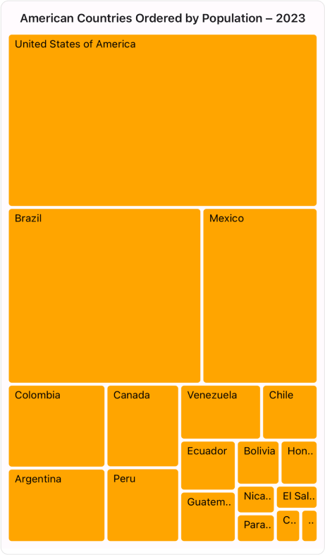
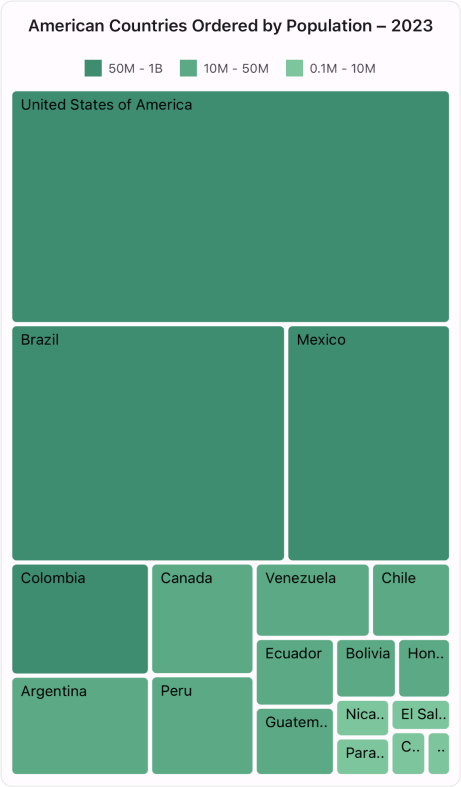

# Getting Started with the .NET MAUI TreeMap

This section provides a quick overview of how to get started with the [.NET MAUI SfTreeMap](https://www.syncfusion.com/maui-controls/maui-tree-map) for .NET MAUI and a walk-through to configure the .NET MAUI TreeMap in a real-time scenario. Follow the steps below to add .NET MAUI TreeMap control to your project.

To get start quickly with our .NET MAUI TreeMap, you can check the below video.






## Prerequisites

Before proceeding, ensure the following are setup:
1. Install [.NET 7 SDK](https://dotnet.microsoft.com/en-us/download/dotnet/7.0) or later is installed.
2. Set up a .NET MAUI environment with Visual Studio 2022 (v17.3 or later).

## Step 1: Create a New .NET MAUI Project

1. Go to **File > New > Project** and choose the **.NET MAUI App** template.
2. Name the project and choose a location. Then click **Next**.
3. Select the .NET framework version and click **Create**.

## Step 2: Install the Syncfusion&reg; .NET MAUI TreeMap NuGet Package

1. In **Solution Explorer,** right-click the project and choose **Manage NuGet Packages.**
2. Search for [Syncfusion.Maui.TreeMap](https://www.nuget.org/packages/Syncfusion.Maui.TreeMap/) and install the latest version.
3. Ensure the necessary dependencies are installed correctly, and the project is restored.

## Step 3: Register the handler

The [Syncfusion.Maui.Core](https://www.nuget.org/packages/Syncfusion.Maui.Core/) NuGet is a dependent package for all Syncfusion&reg; controls of .NET MAUI. In the **MauiProgram.cs** file, register the handler for Syncfusion&reg; core.




using Syncfusion.Maui.Core.Hosting;
public static class MauiProgram
{
    public static MauiApp CreateMauiApp()
    {
        var builder = MauiApp.CreateBuilder();
	    builder
		.ConfigureSyncfusionCore()
		.UseMauiApp<App>()
		.ConfigureFonts(fonts =>
		{
		    fonts.AddFont("OpenSans-Regular.ttf", "OpenSansRegular");
		    fonts.AddFont("OpenSans-Semibold.ttf", "OpenSansSemibold");
		});

	    return builder.Build();
	}
}




## Step 4: Add .NET MAUI TreeMap control

1. To initialize the control, import the `Syncfusion.Maui.TreeMap` namespace into your code.
2. Initialize [SfTreeMap](https://help.syncfusion.com/cr/maui/Syncfusion.Maui.TreeMap.SfTreeMap.html).




<ContentPage
    ...        
    xmlns:treemap="clr-namespace:Syncfusion.Maui.TreeMap;assembly=Syncfusion.Maui.TreeMap">

    <treemap:SfTreeMap />
</ContentPage>





using Syncfusion.Maui.TreeMap;
. . .

public partial class MainPage : ContentPage
{
    public MainPage()
    {
        InitializeComponent();
        SfTreeMap treeMap = new SfTreeMap();
        this.Content = treeMap;
    }
}








## Prerequisites

Before proceeding, ensure the following are setup:
1. Install [.NET 7 SDK](https://dotnet.microsoft.com/en-us/download/dotnet/7.0) or later is installed.
2. Set up a .NET MAUI environment with Visual Studio Code.
3. Ensure that the .NET MAUI extension is installed and configured as described [here.](https://learn.microsoft.com/en-us/dotnet/maui/get-started/installation?view=net-maui-8.0&tabs=visual-studio-code)

## Step 1: Create a New .NET MAUI Project

1. Open the command palette by pressing `Ctrl+Shift+P` and type **.NET:New Project** and enter.
2. Choose the **.NET MAUI App** template.
3. Select the project location, type the project name and press **Enter**.
4. Then choose **Create project.**

## Step 2: Install the Syncfusion&reg; .NET MAUI TreeMap NuGet Package

1. In **Solution Explorer,** right-click the project and choose **Manage NuGet Packages.**
2. Search for [Syncfusion.Maui.TreeMap](https://www.nuget.org/packages/Syncfusion.Maui.TreeMap/) and install the latest version.
3. Ensure the necessary dependencies are installed correctly, and the project is restored.

## Step 3: Register the handler

The [Syncfusion.Maui.Core](https://www.nuget.org/packages/Syncfusion.Maui.Core/) NuGet is a dependent package for all Syncfusion&reg; controls of .NET MAUI. In the **MauiProgram.cs** file, register the handler for Syncfusion&reg; core.




using Syncfusion.Maui.Core.Hosting;
public static class MauiProgram
{
    public static MauiApp CreateMauiApp()
    {
        var builder = MauiApp.CreateBuilder();
	    builder
		.ConfigureSyncfusionCore()
		.UseMauiApp<App>()
		.ConfigureFonts(fonts =>
		{
		    fonts.AddFont("OpenSans-Regular.ttf", "OpenSansRegular");
		    fonts.AddFont("OpenSans-Semibold.ttf", "OpenSansSemibold");
		});

	    return builder.Build();
	}
}




## Step 4: Add .NET MAUI TreeMap control

1. To initialize the control, import the `Syncfusion.Maui.TreeMap` namespace into your code.
2. Initialize [SfTreeMap](https://help.syncfusion.com/cr/maui/Syncfusion.Maui.TreeMap.SfTreeMap.html).




<ContentPage
    ...        
    xmlns:treemap="clr-namespace:Syncfusion.Maui.TreeMap;assembly=Syncfusion.Maui.TreeMap">

    <treemap:SfTreeMap />
</ContentPage>





using Syncfusion.Maui.TreeMap;
. . .

public partial class MainPage : ContentPage
{
    public MainPage()
    {
        InitializeComponent();
        SfTreeMap treeMap = new SfTreeMap();
        this.Content = treeMap;
    }
}









## Prerequisites

Before proceeding, ensure the following are set up:

1. Ensure you have the latest version of JetBrains Rider.
2. Install [.NET 8 SDK](https://dotnet.microsoft.com/en-us/download/dotnet/8.0) or later is installed.
3. Make sure the MAUI workloads are installed and configured as described [here.](https://www.jetbrains.com/help/rider/MAUI.html#before-you-start)

## Step 1: Create a new .NET MAUI Project

1. Go to **File > New Solution,** Select .NET (C#) and choose the .NET MAUI App template.
2. Enter the Project Name, Solution Name, and Location.
3. Select the .NET framework version and click Create.

## Step 2: Install the Syncfusion® MAUI TreeMap NuGet Package

1. In **Solution Explorer,** right-click the project and choose **Manage NuGet Packages.**
2. Search for [Syncfusion.Maui.TreeMap](https://www.nuget.org/packages/Syncfusion.Maui.TreeMap/) and install the latest version.
3. Ensure the necessary dependencies are installed correctly, and the project is restored. If not, Open the Terminal in Rider and manually run: `dotnet restore`

## Step 3: Register the handler

The [Syncfusion.Maui.Core](https://www.nuget.org/packages/Syncfusion.Maui.Core/) NuGet is a dependent package for all Syncfusion&reg; controls of .NET MAUI. In the **MauiProgram.cs** file, register the handler for Syncfusion&reg; core.




using Syncfusion.Maui.Core.Hosting;
public static class MauiProgram
{
    public static MauiApp CreateMauiApp()
    {
        var builder = MauiApp.CreateBuilder();
	    builder
		.ConfigureSyncfusionCore()
		.UseMauiApp<App>()
		.ConfigureFonts(fonts =>
		{
		    fonts.AddFont("OpenSans-Regular.ttf", "OpenSansRegular");
		    fonts.AddFont("OpenSans-Semibold.ttf", "OpenSansSemibold");
		});

	    return builder.Build();
	}
}




## Step 4: Add .NET MAUI TreeMap control

1. To initialize the control, import the `Syncfusion.Maui.TreeMap` namespace into your code.
2. Initialize [SfTreeMap](https://help.syncfusion.com/cr/maui/Syncfusion.Maui.TreeMap.SfTreeMap.html).




<ContentPage
    ...        
    xmlns:treemap="clr-namespace:Syncfusion.Maui.TreeMap;assembly=Syncfusion.Maui.TreeMap">

    <treemap:SfTreeMap />
</ContentPage>





using Syncfusion.Maui.TreeMap;
. . .

public partial class MainPage : ContentPage
{
    public MainPage()
    {
        InitializeComponent();
        SfTreeMap treeMap = new SfTreeMap();
        this.Content = treeMap;
    }
}









## Populate .NET MAUI TreeMap data source

Here are the steps to render treemap items using the .NET MAUI TreeMap control with respective data properties created in a data model class.

* Create a data model for treemap.
* Create view model.
* Bind data source for TreeMap.

#### Create a data model for treemap 

Create a simple data model in a new class file as shown in the following example code.




public class PopulationDetails
{
    public string Country { get; set; }
    public string Continent { get; set; }
    public int Population { get; set; }
}




#### Create view model

Create a view model class to set values for the properties listed in the model class as shown in the following example code.




public class PopulationViewModel
{
    public PopulationViewModel()
    {
        this.PopulationDetails = new ObservableCollection<PopulationDetails>()
        {
            new PopulationDetails() { Continent ="North America", Country = "United States of America", Population = 339996564 },
            new PopulationDetails() { Continent ="South America", Country = "Brazil", Population = 216422446 },
            new PopulationDetails() { Continent ="North America", Country = "Mexico", Population = 128455567 },
            new PopulationDetails() { Continent ="South America", Country = "Colombia", Population = 52085168 },
            new PopulationDetails() { Continent ="South America", Country = "Argentina", Population = 45773884 },
            new PopulationDetails() { Continent ="North America", Country = "Canada", Population = 38781292 },
            new PopulationDetails() { Continent ="South America", Country = "Peru", Population = 34352719 },
            new PopulationDetails() { Continent ="South America", Country = "Venezuela", Population = 28838499 },
            new PopulationDetails() { Continent ="South America", Country = "Chile", Population = 19629590 },
            new PopulationDetails() { Continent ="South America", Country = "Ecuador", Population = 18190484 },
            new PopulationDetails() { Continent ="North America", Country = "Guatemala", Population = 18092026 },
            new PopulationDetails() { Continent ="South America", Country = "Bolivia", Population = 12388571 },
            new PopulationDetails() { Continent ="North America", Country = "Honduras", Population = 10593798 },
            new PopulationDetails() { Continent ="North America", Country = "Nicaragua", Population = 7046311 },
            new PopulationDetails() { Continent ="South America", Country = "Paraguay", Population = 6861524 },
            new PopulationDetails() { Continent ="North America", Country = "El Salvador", Population = 6364943 },
            new PopulationDetails() { Continent ="North America", Country = "Costa Rica", Population = 5212173 },
            new PopulationDetails() { Continent ="South America", Country = "Uruguay", Population = 3423109 },
        };
    }

    public ObservableCollection<PopulationDetails> PopulationDetails
    {
        get;
        set;
    }
}




#### Bind data source for TreeMap

To populate the treemap items, utilize the [DataSource](https://help.syncfusion.com/cr/maui/Syncfusion.Maui.TreeMap.SfTreeMap.html#Syncfusion_Maui_TreeMap_SfTreeMap_DataSource) property of [SfTreeMap](https://help.syncfusion.com/cr/maui/Syncfusion.Maui.TreeMap.SfTreeMap.html). Additionally, ensure that the following properties of [SfTreeMap](https://help.syncfusion.com/cr/maui/Syncfusion.Maui.TreeMap.SfTreeMap.html) are mapped from corresponding properties in the [DataSource](https://help.syncfusion.com/cr/maui/Syncfusion.Maui.TreeMap.SfTreeMap.html#Syncfusion_Maui_TreeMap_SfTreeMap_DataSource) while initializing the treemap control.
* The [PrimaryValuePath](https://help.syncfusion.com/cr/maui/Syncfusion.Maui.TreeMap.SfTreeMap.html#Syncfusion_Maui_TreeMap_SfTreeMap_PrimaryValuePath) specifies the name of the property within the data object that provides the primary value used to determine the size of each item in the treemap.
* The [RangeColorValuePath](https://help.syncfusion.com/cr/maui/Syncfusion.Maui.TreeMap.SfTreeMap.html#Syncfusion_Maui_TreeMap_SfTreeMap_RangeColorValuePath) specifies the name of the property within the data object that provides the range color value for each item in the tree map. This value determines the color of the item based on a gradient or range mapping. The [Brush](https://help.syncfusion.com/cr/maui/Syncfusion.Maui.TreeMap.TreeMapRangeBrush.html#Syncfusion_Maui_TreeMap_TreeMapRangeBrush_Brush) property within [TreeMapRangeBrush](https://help.syncfusion.com/cr/maui/Syncfusion.Maui.TreeMap.TreeMapRangeBrush.html) applies colors to items based on [RangeColorValuePath](https://help.syncfusion.com/cr/maui/Syncfusion.Maui.TreeMap.SfTreeMap.html#Syncfusion_Maui_TreeMap_SfTreeMap_RangeColorValuePath) values using [TreeMapRangeBrushSettings](https://help.syncfusion.com/cr/maui/Syncfusion.Maui.TreeMap.TreeMapRangeBrushSettings.html), also defining colors for treemap legend icons, exclusive to [TreeMapRangeBrushSettings](https://help.syncfusion.com/cr/maui/Syncfusion.Maui.TreeMap.TreeMapRangeBrushSettings.html). The [RangeColorValuePath](https://help.syncfusion.com/cr/maui/Syncfusion.Maui.TreeMap.SfTreeMap.html#Syncfusion_Maui_TreeMap_SfTreeMap_RangeColorValuePath) is applicable only when the [ShowLegend](https://help.syncfusion.com/cr/maui/Syncfusion.Maui.TreeMap.TreeMapLegendSettings.html#Syncfusion_Maui_TreeMap_TreeMapLegendSettings_ShowLegend) property of [LegendSettings](https://help.syncfusion.com/cr/maui/Syncfusion.Maui.TreeMap.SfTreeMap.html#Syncfusion_Maui_TreeMap_SfTreeMap_LegendSettings) is enabled in the [SfTreeMap](https://help.syncfusion.com/cr/maui/Syncfusion.Maui.TreeMap.SfTreeMap.html).

Also, specify the path to the data property containing the text you want to display for the treemap leaf item using the [LabelPath](https://help.syncfusion.com/cr/maui/Syncfusion.Maui.TreeMap.TreeMapLeafItemSettings.html#Syncfusion_Maui_TreeMap_TreeMapLeafItemSettings_LabelPath) property of [LeafItemSettings](https://help.syncfusion.com/cr/maui/Syncfusion.Maui.TreeMap.SfTreeMap.html#Syncfusion_Maui_TreeMap_SfTreeMap_LeafItemSettings).




<treemap:SfTreeMap x:Name="treeMap"
                   DataSource="{Binding PopulationDetails}"
                   PrimaryValuePath="Population">
    <treemap:SfTreeMap.BindingContext>
        <local:PopulationViewModel />
    </treemap:SfTreeMap.BindingContext>
    <treemap:SfTreeMap.LeafItemBrushSettings>
       <treemap:TreeMapUniformBrushSettings Brush="Orange"/>
    </treemap:SfTreeMap.LeafItemBrushSettings>
</treemap:SfTreeMap>




SfTreeMap treeMap = new SfTreeMap();
PopulationViewModel viewModel = new PopulationViewModel();
treeMap.DataSource = viewModel.PopulationDetails;
treeMap.PrimaryValuePath = "Population";
treeMap.LeafItemBrushSettings = new TreeMapUniformBrushSettings() { Brush = Brush.Orange };
this.Content = treeMap;




## Add labels

To display text for the leaf items, utilize the [LabelPath](https://help.syncfusion.com/cr/maui/Syncfusion.Maui.TreeMap.TreeMapLeafItemSettings.html#Syncfusion_Maui_TreeMap_TreeMapLeafItemSettings_LabelPath) property within the [LeafItemSettings](https://help.syncfusion.com/cr/maui/Syncfusion.Maui.TreeMap.SfTreeMap.html#Syncfusion_Maui_TreeMap_SfTreeMap_LeafItemSettings) of [SfTreeMap](https://help.syncfusion.com/cr/maui/Syncfusion.Maui.TreeMap.SfTreeMap.html). This property allows you to specify the path to the data property containing the text you want to display.




<treemap:SfTreeMap x:Name="treeMap"
                   DataSource="{Binding PopulationDetails}"
                   PrimaryValuePath="Population">
    <treemap:SfTreeMap.BindingContext>
        <local:PopulationViewModel />
    </treemap:SfTreeMap.BindingContext>
    <treemap:SfTreeMap.LeafItemSettings>
        <treemap:TreeMapLeafItemSettings LabelPath="Country"/>
    </treemap:SfTreeMap.LeafItemSettings>
    <treemap:SfTreeMap.LeafItemBrushSettings>
       <treemap:TreeMapUniformBrushSettings Brush="Orange"/>
    </treemap:SfTreeMap.LeafItemBrushSettings>
</treemap:SfTreeMap>




SfTreeMap treeMap = new SfTreeMap();
PopulationViewModel viewModel = new PopulationViewModel();
treeMap.DataSource = viewModel.PopulationDetails;
treeMap.PrimaryValuePath = "Population";
treeMap.LeafItemSettings = new TreeMapLeafItemSettings() { LabelPath = "Country" };
treeMap.LeafItemBrushSettings = new TreeMapUniformBrushSettings() { Brush = Brush.Orange };
this.Content = treeMap;




public class PopulationDetails
{
    public string Country { get; set; }
    public string Continent { get; set; }
    public int Population { get; set; }
}




public class PopulationViewModel
{
    public PopulationViewModel()
    {
        this.PopulationDetails = new ObservableCollection<PopulationDetails>()
        {
            new PopulationDetails() { Continent ="North America", Country = "United States of America", Population = 339996564 },
            new PopulationDetails() { Continent ="South America", Country = "Brazil", Population = 216422446 },
            new PopulationDetails() { Continent ="North America", Country = "Mexico", Population = 128455567 },
            new PopulationDetails() { Continent ="South America", Country = "Colombia", Population = 52085168 },
            new PopulationDetails() { Continent ="South America", Country = "Argentina", Population = 45773884 },
            new PopulationDetails() { Continent ="North America", Country = "Canada", Population = 38781292 },
            new PopulationDetails() { Continent ="South America", Country = "Peru", Population = 34352719 },
            new PopulationDetails() { Continent ="South America", Country = "Venezuela", Population = 28838499 },
            new PopulationDetails() { Continent ="South America", Country = "Chile", Population = 19629590 },
            new PopulationDetails() { Continent ="South America", Country = "Ecuador", Population = 18190484 },
            new PopulationDetails() { Continent ="North America", Country = "Guatemala", Population = 18092026 },
            new PopulationDetails() { Continent ="South America", Country = "Bolivia", Population = 12388571 },
            new PopulationDetails() { Continent ="North America", Country = "Honduras", Population = 10593798 },
            new PopulationDetails() { Continent ="North America", Country = "Nicaragua", Population = 7046311 },
            new PopulationDetails() { Continent ="South America", Country = "Paraguay", Population = 6861524 },
            new PopulationDetails() { Continent ="North America", Country = "El Salvador", Population = 6364943 },
            new PopulationDetails() { Continent ="North America", Country = "Costa Rica", Population = 5212173 },
            new PopulationDetails() { Continent ="South America", Country = "Uruguay", Population = 3423109 },
        };
    }

    public ObservableCollection<PopulationDetails> PopulationDetails
    {
        get;
        set;
    }
}




## Applying leaf item brush settings

The brush settings are used to customize the fill colors for leaf items based on ranges or values, offering four brush settings: [UniformBrushSettings](https://help.syncfusion.com/cr/maui/Syncfusion.Maui.TreeMap.TreeMapUniformBrushSettings.html), [RangeBrushSettings](https://help.syncfusion.com/cr/maui/Syncfusion.Maui.TreeMap.TreeMapRangeBrushSettings.html), [DesaturationBrushSettings](https://help.syncfusion.com/cr/maui/Syncfusion.Maui.TreeMap.TreeMapDesaturationBrushSettings.html), and [PaletteBrushSettings](https://help.syncfusion.com/cr/maui/Syncfusion.Maui.TreeMap.TreeMapPaletteBrushSettings.html). Each setting provides unique options for defining and applying color schemes, enhancing the visualization of the treemap.




<treemap:SfTreeMap x:Name="treeMap"
                   DataSource="{Binding PopulationDetails}"
                   PrimaryValuePath="Population">
    <treemap:SfTreeMap.BindingContext>
        <local:PopulationViewModel />
    </treemap:SfTreeMap.BindingContext>
    <treemap:SfTreeMap.LeafItemSettings>
        <treemap:TreeMapLeafItemSettings LabelPath="Country">
        </treemap:TreeMapLeafItemSettings>
    </treemap:SfTreeMap.LeafItemSettings>
    <treemap:SfTreeMap.LeafItemBrushSettings>
        <treemap:TreeMapUniformBrushSettings Brush="Orange"/>
    </treemap:SfTreeMap.LeafItemBrushSettings>
</treemap:SfTreeMap>





SfTreeMap treeMap = new SfTreeMap();
PopulationViewModel viewModel = new PopulationViewModel();
treeMap.DataSource = viewModel.PopulationDetails;
treeMap.PrimaryValuePath = "Population";
treeMap.LeafItemBrushSettings = new TreeMapUniformBrushSettings() { Brush = Brush.Orange };
treeMap.LeafItemSettings = new TreeMapLeafItemSettings() { LabelPath = "Country" };
this.Content = treeMap;




public class PopulationDetails
{
    public string Country { get; set; }
    public string Continent { get; set; }
    public int Population { get; set; }
}




public class PopulationViewModel
{
    public PopulationViewModel()
    {
        this.PopulationDetails = new ObservableCollection<PopulationDetails>()
        {
            new PopulationDetails() { Continent ="North America", Country = "United States of America", Population = 339996564 },
            new PopulationDetails() { Continent ="South America", Country = "Brazil", Population = 216422446 },
            new PopulationDetails() { Continent ="North America", Country = "Mexico", Population = 128455567 },
            new PopulationDetails() { Continent ="South America", Country = "Colombia", Population = 52085168 },
            new PopulationDetails() { Continent ="South America", Country = "Argentina", Population = 45773884 },
            new PopulationDetails() { Continent ="North America", Country = "Canada", Population = 38781292 },
            new PopulationDetails() { Continent ="South America", Country = "Peru", Population = 34352719 },
            new PopulationDetails() { Continent ="South America", Country = "Venezuela", Population = 28838499 },
            new PopulationDetails() { Continent ="South America", Country = "Chile", Population = 19629590 },
            new PopulationDetails() { Continent ="South America", Country = "Ecuador", Population = 18190484 },
            new PopulationDetails() { Continent ="North America", Country = "Guatemala", Population = 18092026 },
            new PopulationDetails() { Continent ="South America", Country = "Bolivia", Population = 12388571 },
            new PopulationDetails() { Continent ="North America", Country = "Honduras", Population = 10593798 },
            new PopulationDetails() { Continent ="North America", Country = "Nicaragua", Population = 7046311 },
            new PopulationDetails() { Continent ="South America", Country = "Paraguay", Population = 6861524 },
            new PopulationDetails() { Continent ="North America", Country = "El Salvador", Population = 6364943 },
            new PopulationDetails() { Continent ="North America", Country = "Costa Rica", Population = 5212173 },
            new PopulationDetails() { Continent ="South America", Country = "Uruguay", Population = 3423109 },
        };
    }

    public ObservableCollection<PopulationDetails> PopulationDetails
    {
        get;
        set;
    }
}




## Applying group item brush settings

The group items are colored using the [Brushes](https://help.syncfusion.com/cr/maui/Syncfusion.Maui.TreeMap.TreeMapPaletteBrushSettings.html#Syncfusion_Maui_TreeMap_TreeMapPaletteBrushSettings_Brushes) property within the colors collection of [TreeMapPaletteBrushSettings](https://help.syncfusion.com/cr/maui/Syncfusion.Maui.TreeMap.TreeMapPaletteBrushSettings.html) in the [GroupItemBrushSettings](https://help.syncfusion.com/cr/maui/Syncfusion.Maui.TreeMap.SfTreeMap.html#Syncfusion_Maui_TreeMap_SfTreeMap_GroupItemBrushSettings) of [SfTreeMap](https://help.syncfusion.com/cr/maui/Syncfusion.Maui.TreeMap.SfTreeMap.html).




<treemap:SfTreeMap x:Name="treeMap"
                   DataSource="{Binding PopulationDetails}"
                   PrimaryValuePath="Population">
    <treemap:SfTreeMap.BindingContext>
        <local:PopulationViewModel />
    </treemap:SfTreeMap.BindingContext>
    <treemap:SfTreeMap.LeafItemSettings>
        <treemap:TreeMapLeafItemSettings LabelPath="Country">
        </treemap:TreeMapLeafItemSettings>
    </treemap:SfTreeMap.LeafItemSettings>
    <treemap:SfTreeMap.Levels>
        <treemap:TreeMapLevel GroupPath="Continent"/>
    </treemap:SfTreeMap.Levels>
    <treemap:SfTreeMap.GroupItemBrushSettings>
        <treemap:TreeMapPaletteBrushSettings>
            <treemap:TreeMapPaletteBrushSettings.Brushes>
                <SolidColorBrush>#003790</SolidColorBrush>
                <SolidColorBrush>#FF8F00</SolidColorBrush>
            </treemap:TreeMapPaletteBrushSettings.Brushes>
        </treemap:TreeMapPaletteBrushSettings>
    </treemap:SfTreeMap.GroupItemBrushSettings>
</treemap:SfTreeMap>





SfTreeMap treeMap = new SfTreeMap();
PopulationViewModel viewModel = new PopulationViewModel();
treeMap.DataSource = viewModel.PopulationDetails;
treeMap.PrimaryValuePath = "Population";
treeMap.LeafItemSettings = new TreeMapLeafItemSettings() { LabelPath = "Country" };
treeMap.Levels.Add(new TreeMapLevel() { GroupPath = "Continent" });
treeMap.GroupItemBrushSettings = new TreeMapPaletteBrushSettings()
{
    Brushes = new List<Brush>()
    {
        new SolidColorBrush(Color.FromArgb("#003790")),
        new SolidColorBrush(Color.FromArgb("#FF8F00")),
    }
};

this.Content = treeMap;




public class PopulationDetails
{
    public string Country { get; set; }
    public string Continent { get; set; }
    public int Population { get; set; }
}




public class PopulationViewModel
{
    public PopulationViewModel()
    {
        this.PopulationDetails = new ObservableCollection<PopulationDetails>()
        {
            new PopulationDetails() { Continent ="North America", Country = "United States of America", Population = 339996564 },
            new PopulationDetails() { Continent ="South America", Country = "Brazil", Population = 216422446 },
            new PopulationDetails() { Continent ="North America", Country = "Mexico", Population = 128455567 },
            new PopulationDetails() { Continent ="South America", Country = "Colombia", Population = 52085168 },
            new PopulationDetails() { Continent ="South America", Country = "Argentina", Population = 45773884 },
            new PopulationDetails() { Continent ="North America", Country = "Canada", Population = 38781292 },
            new PopulationDetails() { Continent ="South America", Country = "Peru", Population = 34352719 },
            new PopulationDetails() { Continent ="South America", Country = "Venezuela", Population = 28838499 },
            new PopulationDetails() { Continent ="South America", Country = "Chile", Population = 19629590 },
            new PopulationDetails() { Continent ="South America", Country = "Ecuador", Population = 18190484 },
            new PopulationDetails() { Continent ="North America", Country = "Guatemala", Population = 18092026 },
            new PopulationDetails() { Continent ="South America", Country = "Bolivia", Population = 12388571 },
            new PopulationDetails() { Continent ="North America", Country = "Honduras", Population = 10593798 },
            new PopulationDetails() { Continent ="North America", Country = "Nicaragua", Population = 7046311 },
            new PopulationDetails() { Continent ="South America", Country = "Paraguay", Population = 6861524 },
            new PopulationDetails() { Continent ="North America", Country = "El Salvador", Population = 6364943 },
            new PopulationDetails() { Continent ="North America", Country = "Costa Rica", Population = 5212173 },
            new PopulationDetails() { Continent ="South America", Country = "Uruguay", Population = 3423109 },
        };
    }

    public ObservableCollection<PopulationDetails> PopulationDetails
    {
        get;
        set;
    }
}




>Note: This is applicable only when [Levels](https://help.syncfusion.com/cr/maui/Syncfusion.Maui.TreeMap.SfTreeMap.html#Syncfusion_Maui_TreeMap_SfTreeMap_Levels) is enabled.

## Enable tooltip

To enable the tooltip for the TreeMap control, utilize the [ShowToolTip](https://help.syncfusion.com/cr/maui/Syncfusion.Maui.TreeMap.SfTreeMap.html#Syncfusion_Maui_TreeMap_SfTreeMap_ShowToolTip) property of [SfTreeMap](https://help.syncfusion.com/cr/maui/Syncfusion.Maui.TreeMap.SfTreeMap.html) By default, the value of [ShowToolTip](https://help.syncfusion.com/cr/maui/Syncfusion.Maui.TreeMap.SfTreeMap.html#Syncfusion_Maui_TreeMap_SfTreeMap_ShowToolTip) is set to `false.` To provide users with additional information or context about specific treemap items, simply set this property to `true.`




<treemap:SfTreeMap x:Name="treeMap"
                   DataSource="{Binding PopulationDetails}"
                   PrimaryValuePath="Population"
                   ShowToolTip="True">
    <treemap:SfTreeMap.BindingContext>
        <local:PopulationViewModel />
    </treemap:SfTreeMap.BindingContext>
    <treemap:SfTreeMap.LeafItemSettings>
        <treemap:TreeMapLeafItemSettings LabelPath="Country">
        </treemap:TreeMapLeafItemSettings>
    </treemap:SfTreeMap.LeafItemSettings>
    <treemap:SfTreeMap.LeafItemBrushSettings>
       <treemap:TreeMapUniformBrushSettings Brush="Orange"/>
    </treemap:SfTreeMap.LeafItemBrushSettings>
</treemap:SfTreeMap>




SfTreeMap treeMap = new SfTreeMap();
PopulationViewModel viewModel = new PopulationViewModel();
treeMap.DataSource = viewModel.PopulationDetails;
treeMap.PrimaryValuePath = "Population";
treeMap.ShowToolTip = true;
treeMap.LeafItemBrushSettings = new TreeMapUniformBrushSettings() { Brush = Brush.Orange };
treeMap.LeafItemSettings = new TreeMapLeafItemSettings() { LabelPath = "Country" };
this.Content = treeMap;




public class PopulationDetails
{
    public string Country { get; set; }
    public string Continent { get; set; }
    public int Population { get; set; }
}




public class PopulationViewModel
{
    public PopulationViewModel()
    {
        this.PopulationDetails = new ObservableCollection<PopulationDetails>()
        {
            new PopulationDetails() { Continent ="North America", Country = "United States of America", Population = 339996564 },
            new PopulationDetails() { Continent ="South America", Country = "Brazil", Population = 216422446 },
            new PopulationDetails() { Continent ="North America", Country = "Mexico", Population = 128455567 },
            new PopulationDetails() { Continent ="South America", Country = "Colombia", Population = 52085168 },
            new PopulationDetails() { Continent ="South America", Country = "Argentina", Population = 45773884 },
            new PopulationDetails() { Continent ="North America", Country = "Canada", Population = 38781292 },
            new PopulationDetails() { Continent ="South America", Country = "Peru", Population = 34352719 },
            new PopulationDetails() { Continent ="South America", Country = "Venezuela", Population = 28838499 },
            new PopulationDetails() { Continent ="South America", Country = "Chile", Population = 19629590 },
            new PopulationDetails() { Continent ="South America", Country = "Ecuador", Population = 18190484 },
            new PopulationDetails() { Continent ="North America", Country = "Guatemala", Population = 18092026 },
            new PopulationDetails() { Continent ="South America", Country = "Bolivia", Population = 12388571 },
            new PopulationDetails() { Continent ="North America", Country = "Honduras", Population = 10593798 },
            new PopulationDetails() { Continent ="North America", Country = "Nicaragua", Population = 7046311 },
            new PopulationDetails() { Continent ="South America", Country = "Paraguay", Population = 6861524 },
            new PopulationDetails() { Continent ="North America", Country = "El Salvador", Population = 6364943 },
            new PopulationDetails() { Continent ="North America", Country = "Costa Rica", Population = 5212173 },
            new PopulationDetails() { Continent ="South America", Country = "Uruguay", Population = 3423109 },
        };
    }

    public ObservableCollection<PopulationDetails> PopulationDetails
    {
        get;
        set;
    }
}




## Enable legend

To incorporate a legend for the TreeMap control, utilize the [ShowLegend](https://help.syncfusion.com/cr/maui/Syncfusion.Maui.TreeMap.TreeMapLegendSettings.html#Syncfusion_Maui_TreeMap_TreeMapLegendSettings_ShowLegend) property within [LegendSettings](https://help.syncfusion.com/cr/maui/Syncfusion.Maui.TreeMap.SfTreeMap.html#Syncfusion_Maui_TreeMap_SfTreeMap_LegendSettings). It is possible to customize the legend item’s color and text using the [LeafItemBrushSettings](https://help.syncfusion.com/cr/maui/Syncfusion.Maui.TreeMap.SfTreeMap.html#Syncfusion_Maui_TreeMap_SfTreeMap_LeafItemBrushSettings) and [LegendSettings](https://help.syncfusion.com/cr/maui/Syncfusion.Maui.TreeMap.SfTreeMap.html#Syncfusion_Maui_TreeMap_SfTreeMap_LegendSettings) properties of [SfTreeMap](https://help.syncfusion.com/cr/maui/Syncfusion.Maui.TreeMap.SfTreeMap.html).




<treemap:SfTreeMap x:Name="treeMap"
                   DataSource="{Binding PopulationDetails}"
                   PrimaryValuePath="Population"
                   RangeColorValuePath="Population">
    <treemap:SfTreeMap.BindingContext>
        <local:PopulationViewModel />
    </treemap:SfTreeMap.BindingContext>
    <treemap:SfTreeMap.LegendSettings>
        <treemap:TreeMapLegendSettings ShowLegend="True" />
    </treemap:SfTreeMap.LegendSettings>
    <treemap:SfTreeMap.LeafItemSettings>
        <treemap:TreeMapLeafItemSettings LabelPath="Country"/>
    </treemap:SfTreeMap.LeafItemSettings>
    <treemap:SfTreeMap.LeafItemBrushSettings>
        <treemap:TreeMapRangeBrushSettings>
            <treemap:TreeMapRangeBrushSettings.RangeBrushes>
                <treemap:TreeMapRangeBrush LegendLabel="50M - 1B"
                                           From="50000000"
                                           To="1000000000" 
                                           Brush ="#F0A868" />
                <treemap:TreeMapRangeBrush LegendLabel="10M - 50M"
                                           From="10000000"
                                           To="50000000" 
                                           Brush ="#F3BC8B" />
                <treemap:TreeMapRangeBrush LegendLabel="0.1M - 10M"
                                           From="100000" 
                                           To="10000000"  
                                           Brush= "#F8D7B9" />
            </treemap:TreeMapRangeBrushSettings.RangeBrushes>
        </treemap:TreeMapRangeBrushSettings>
    </treemap:SfTreeMap.LeafItemBrushSettings>
</treemap:SfTreeMap>




SfTreeMap treeMap = new SfTreeMap();
PopulationViewModel viewModel = new PopulationViewModel();
treeMap.DataSource = viewModel.PopulationDetails;
treeMap.PrimaryValuePath = "Population";
treeMap.RangeColorValuePath = "Population";
treeMap.LegendSettings.ShowLegend = true;
treeMap.LeafItemSettings = new TreeMapLeafItemSettings() { LabelPath = "Country" };
treeMap.LeafItemBrushSettings = new TreeMapRangeBrushSettings()
{
    RangeBrushes = new List<TreeMapRangeBrush>()
    {
        new TreeMapRangeBrush { LegendLabel = "50M - 1B", From = 50000000, To = 1000000000, Brush = new SolidColorBrush(Color.FromArgb("#F0A868")) },
        new TreeMapRangeBrush { LegendLabel = "10M - 50M", From = 10000000, To = 50000000, Brush = new SolidColorBrush(Color.FromArgb("#F3BC8B")) },
        new TreeMapRangeBrush { LegendLabel = "0.1M - 10M", From = 100000, To = 10000000, Brush = new SolidColorBrush(Color.FromArgb("#F8D7B9")) },
    }
};

this.Content = treeMap;




public class PopulationDetails
{
    public string Country { get; set; }
    public string Continent { get; set; }
    public int Population { get; set; }
}




public class PopulationViewModel
{
    public PopulationViewModel()
    {
        this.PopulationDetails = new ObservableCollection<PopulationDetails>()
        {
            new PopulationDetails() { Continent ="North America", Country = "United States of America", Population = 339996564 },
            new PopulationDetails() { Continent ="South America", Country = "Brazil", Population = 216422446 },
            new PopulationDetails() { Continent ="North America", Country = "Mexico", Population = 128455567 },
            new PopulationDetails() { Continent ="South America", Country = "Colombia", Population = 52085168 },
            new PopulationDetails() { Continent ="South America", Country = "Argentina", Population = 45773884 },
            new PopulationDetails() { Continent ="North America", Country = "Canada", Population = 38781292 },
            new PopulationDetails() { Continent ="South America", Country = "Peru", Population = 34352719 },
            new PopulationDetails() { Continent ="South America", Country = "Venezuela", Population = 28838499 },
            new PopulationDetails() { Continent ="South America", Country = "Chile", Population = 19629590 },
            new PopulationDetails() { Continent ="South America", Country = "Ecuador", Population = 18190484 },
            new PopulationDetails() { Continent ="North America", Country = "Guatemala", Population = 18092026 },
            new PopulationDetails() { Continent ="South America", Country = "Bolivia", Population = 12388571 },
            new PopulationDetails() { Continent ="North America", Country = "Honduras", Population = 10593798 },
            new PopulationDetails() { Continent ="North America", Country = "Nicaragua", Population = 7046311 },
            new PopulationDetails() { Continent ="South America", Country = "Paraguay", Population = 6861524 },
            new PopulationDetails() { Continent ="North America", Country = "El Salvador", Population = 6364943 },
            new PopulationDetails() { Continent ="North America", Country = "Costa Rica", Population = 5212173 },
            new PopulationDetails() { Continent ="South America", Country = "Uruguay", Population = 3423109 },
        };
    }

    public ObservableCollection<PopulationDetails> PopulationDetails
    {
        get;
        set;
    }
}




 

 >Note: You can refer to our [.NET MAUI TreeMap](https://www.syncfusion.com/maui-controls/maui-tree-map) feature tour page for its groundbreaking feature representations. You can also explore our [.NET MAUI TreeMap Example](https://github.com/SyncfusionExamples/maui-treemap-examples/tree/master/) that shows you how to render the TreeMap in .NET MAUI.
