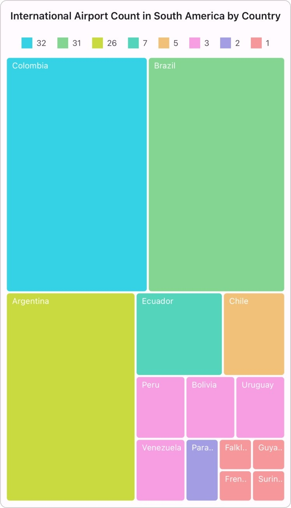
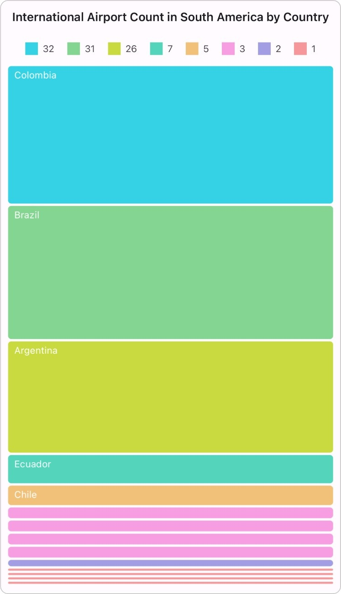
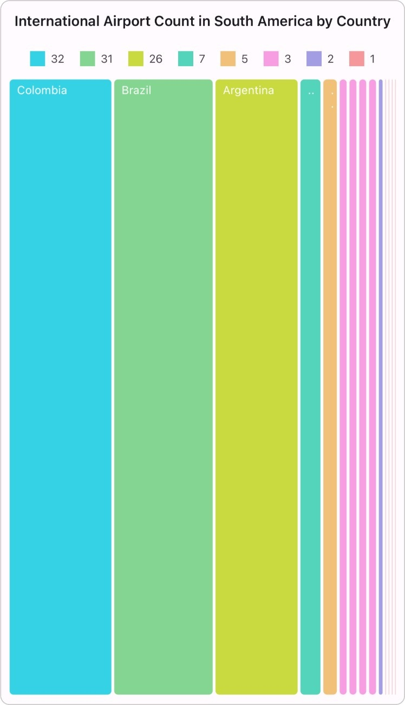
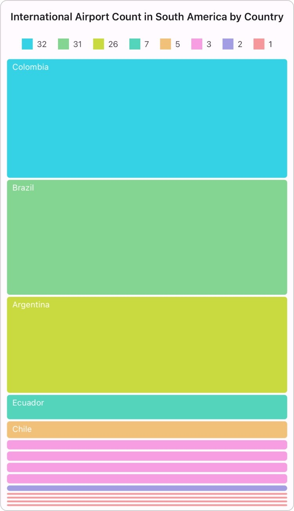

 
# Layouts in .NET MAUI TreeMap (SfTreeMap)

The TreeMap control provides multiple layout types for organizing hierarchical data effectively. You can utilize the [LayoutType](https://help.syncfusion.com/cr/maui/Syncfusion.Maui.TreeMap.SfTreeMap.html#Syncfusion_Maui_TreeMap_SfTreeMap_LayoutType) property within the [SfTreeMap](https://help.syncfusion.com/cr/maui/Syncfusion.Maui.TreeMap.SfTreeMap.html) to switch between four distinct layouts: [Squarified](https://help.syncfusion.com/cr/maui/Syncfusion.Maui.TreeMap.LayoutType.html#Syncfusion_Maui_TreeMap_LayoutType_Squarified), [SliceAndDiceAuto](https://help.syncfusion.com/cr/maui/Syncfusion.Maui.TreeMap.LayoutType.html#Syncfusion_Maui_TreeMap_LayoutType_SliceAndDiceAuto), [SliceAndDiceHorizontal](https://help.syncfusion.com/cr/maui/Syncfusion.Maui.TreeMap.LayoutType.html#Syncfusion_Maui_TreeMap_LayoutType_SliceAndDiceHorizontal), and [SliceAndDiceVertical](https://help.syncfusion.com/cr/maui/Syncfusion.Maui.TreeMap.LayoutType.html#Syncfusion_Maui_TreeMap_LayoutType_SliceAndDiceVertical).

N> **Prerequisite:** Ensure that the required NuGet package is installed, the necessary namespaces are imported, and the **TreeMap** control is properly configured in your application. For detailed setup and configuration instructions, refer to the **[Getting Started](https://help.syncfusion.com/maui/treemap/getting-started)** guide.

## Squarified

The [Squarified](https://help.syncfusion.com/cr/maui/Syncfusion.Maui.TreeMap.LayoutType.html#Syncfusion_Maui_TreeMap_LayoutType_Squarified) layout visualizes data in square-like rectangles with an optimal aspect ratio. It divides rectangles considering both the height and width of the parent view. This layout is the default rendering type for TreeMap. The size of each rectangle is calculated based on the [PrimaryValuePath](https://help.syncfusion.com/cr/maui/Syncfusion.Maui.TreeMap.SfTreeMap.html#Syncfusion_Maui_TreeMap_SfTreeMap_PrimaryValuePath) property value and the available size.




<ContentPage xmlns="http://schemas.microsoft.com/dotnet/2021/maui"
             xmlns:x="http://schemas.microsoft.com/winfx/2009/xaml"
             xmlns:treemap="clr-namespace:Syncfusion.Maui.TreeMap;assembly=Syncfusion.Maui.TreeMap"
             xmlns:local="clr-namespace:TreeMapSample">
    <ContentPage.BindingContext>
        <local:PopulationViewModel />
    </ContentPage.BindingContext>
    <treemap:SfTreeMap x:Name="treeMap"
                       DataSource="{Binding PopulationDetails}"
                       LayoutType="Squarified"
                       PrimaryValuePath="Population">
        <treemap:SfTreeMap.LeafItemSettings>
            <treemap:TreeMapLeafItemSettings LabelPath="Country">
            </treemap:TreeMapLeafItemSettings>
        </treemap:SfTreeMap.LeafItemSettings>
        <treemap:SfTreeMap.LeafItemBrushSettings>
            <treemap:TreeMapUniformBrushSettings Brush="#D21243" />
        </treemap:SfTreeMap.LeafItemBrushSettings>
    </treemap:SfTreeMap>
</ContentPage>




SfTreeMap treeMap = new SfTreeMap();
PopulationViewModel viewModel = new PopulationViewModel();
treeMap.BindingContext = viewModel;
treeMap.DataSource = viewModel.PopulationDetails;
treeMap.LayoutType = LayoutType.Squarified;
treeMap.PrimaryValuePath = "Population";
treeMap.LeafItemSettings = new TreeMapLeafItemSettings() { LabelPath = "Country" };
treeMap.LeafItemBrushSettings = new TreeMapUniformBrushSettings() { Brush = new SolidColorBrush(Color.FromArgb("#D21243")) };
this.Content = treeMap;




public class PopulationDetails
{
    public string Country { get; set; }
    public string Continent { get; set; }
    public double Population { get; set; }
}




public class PopulationViewModel
{
    public PopulationViewModel()
    {
        this.PopulationDetails = new ObservableCollection<PopulationDetails>()
        {
            new PopulationDetails() { Continent ="North America", Country = "United States of America", Population = 339996564 },
            new PopulationDetails() { Continent ="South America", Country = "Brazil", Population = 216422446 },
            new PopulationDetails() { Continent ="North America", Country = "Mexico", Population = 128455567 },
            new PopulationDetails() { Continent ="South America", Country = "Colombia", Population = 52085168 },
            new PopulationDetails() { Continent ="South America", Country = "Argentina", Population = 45773884 },
            new PopulationDetails() { Continent ="North America", Country = "Canada", Population = 38781292 },
            new PopulationDetails() { Continent ="South America", Country = "Peru", Population = 34352719 },
            new PopulationDetails() { Continent ="South America", Country = "Venezuela", Population = 28838499 },
            new PopulationDetails() { Continent ="South America", Country = "Chile", Population = 19629590 },
            new PopulationDetails() { Continent ="South America", Country = "Ecuador", Population = 18190484 },
            new PopulationDetails() { Continent ="North America", Country = "Guatemala", Population = 18092026 },
            new PopulationDetails() { Continent ="South America", Country = "Bolivia", Population = 12388571 },
            new PopulationDetails() { Continent ="North America", Country = "Honduras", Population = 10593798 },
            new PopulationDetails() { Continent ="North America", Country = "Nicaragua", Population = 7046311 },
            new PopulationDetails() { Continent ="South America", Country = "Paraguay", Population = 6861524 },
            new PopulationDetails() { Continent ="North America", Country = "El Salvador", Population = 6364943 },
            new PopulationDetails() { Continent ="North America", Country = "Costa Rica", Population = 5212173 },
            new PopulationDetails() { Continent ="South America", Country = "Uruguay", Population = 3423109 },
        };
    }

    public ObservableCollection<PopulationDetails> PopulationDetails
    {
        get;
        set;
    }
}




{:width="313" height="444" .lazy .shadow-effect}

## Slice and Dice Auto

The [SliceAndDiceAuto](https://help.syncfusion.com/cr/maui/Syncfusion.Maui.TreeMap.LayoutType.html#Syncfusion_Maui_TreeMap_LayoutType_SliceAndDiceAuto) layout visualizes data using long, thin rectangles arranged vertically or horizontally with a high aspect ratio, thereby offering a comprehensive view of the data. This layout will start to arrange each rectangle in a horizontal or vertical direction, and the size of the rectangle will be calculated based on the [PrimaryValuePath](https://help.syncfusion.com/cr/maui/Syncfusion.Maui.TreeMap.SfTreeMap.html#Syncfusion_Maui_TreeMap_SfTreeMap_PrimaryValuePath) property value.




<ContentPage xmlns="http://schemas.microsoft.com/dotnet/2021/maui"
             xmlns:x="http://schemas.microsoft.com/winfx/2009/xaml"
             xmlns:treemap="clr-namespace:Syncfusion.Maui.TreeMap;assembly=Syncfusion.Maui.TreeMap"
             xmlns:local="clr-namespace:TreeMapSample">
    <ContentPage.BindingContext>
        <local:PopulationViewModel />
    </ContentPage.BindingContext>
    <treemap:SfTreeMap x:Name="treeMap"
                       DataSource="{Binding PopulationDetails}"
                       LayoutType="SliceAndDiceAuto"
                       PrimaryValuePath="Population">
        <treemap:SfTreeMap.LeafItemSettings>
            <treemap:TreeMapLeafItemSettings LabelPath="Country">
            </treemap:TreeMapLeafItemSettings>
        </treemap:SfTreeMap.LeafItemSettings>
        <treemap:SfTreeMap.LeafItemBrushSettings>
            <treemap:TreeMapUniformBrushSettings Brush="#D21243" />
        </treemap:SfTreeMap.LeafItemBrushSettings>
    </treemap:SfTreeMap>
</ContentPage>




SfTreeMap treeMap = new SfTreeMap();
PopulationViewModel viewModel = new PopulationViewModel();
treeMap.BindingContext = viewModel;
treeMap.DataSource = viewModel.PopulationDetails;
treeMap.LayoutType = LayoutType.SliceAndDiceAuto;
treeMap.PrimaryValuePath = "Population";
treeMap.LeafItemSettings = new TreeMapLeafItemSettings() { LabelPath = "Country" };
treeMap.LeafItemBrushSettings = new TreeMapUniformBrushSettings() { Brush = new SolidColorBrush(Color.FromArgb("#D21243")) };
this.Content = treeMap;




public class PopulationDetails
{
    public string Country { get; set; }
    public string Continent { get; set; }
    public double Population { get; set; }
}




public class PopulationViewModel
{
    public PopulationViewModel()
    {
        this.PopulationDetails = new ObservableCollection<PopulationDetails>()
        {
            new PopulationDetails() { Continent ="North America", Country = "United States of America", Population = 339996564 },
            new PopulationDetails() { Continent ="South America", Country = "Brazil", Population = 216422446 },
            new PopulationDetails() { Continent ="North America", Country = "Mexico", Population = 128455567 },
            new PopulationDetails() { Continent ="South America", Country = "Colombia", Population = 52085168 },
            new PopulationDetails() { Continent ="South America", Country = "Argentina", Population = 45773884 },
            new PopulationDetails() { Continent ="North America", Country = "Canada", Population = 38781292 },
            new PopulationDetails() { Continent ="South America", Country = "Peru", Population = 34352719 },
            new PopulationDetails() { Continent ="South America", Country = "Venezuela", Population = 28838499 },
            new PopulationDetails() { Continent ="South America", Country = "Chile", Population = 19629590 },
            new PopulationDetails() { Continent ="South America", Country = "Ecuador", Population = 18190484 },
            new PopulationDetails() { Continent ="North America", Country = "Guatemala", Population = 18092026 },
            new PopulationDetails() { Continent ="South America", Country = "Bolivia", Population = 12388571 },
            new PopulationDetails() { Continent ="North America", Country = "Honduras", Population = 10593798 },
            new PopulationDetails() { Continent ="North America", Country = "Nicaragua", Population = 7046311 },
            new PopulationDetails() { Continent ="South America", Country = "Paraguay", Population = 6861524 },
            new PopulationDetails() { Continent ="North America", Country = "El Salvador", Population = 6364943 },
            new PopulationDetails() { Continent ="North America", Country = "Costa Rica", Population = 5212173 },
            new PopulationDetails() { Continent ="South America", Country = "Uruguay", Population = 3423109 },
        };
    }

    public ObservableCollection<PopulationDetails> PopulationDetails
    {
        get;
        set;
    }
}




{:width="313" height="444" .lazy .shadow-effect}

## Slice and Dice Horizontal

The [SliceAndDiceHorizontal](https://help.syncfusion.com/cr/maui/Syncfusion.Maui.TreeMap.LayoutType.html#Syncfusion_Maui_TreeMap_LayoutType_SliceAndDiceHorizontal) layout arranges data into horizontal rectangles with a high aspect ratio and displays them sorted horizontally. This layout will start to arrange each rectangle in a horizontal direction, and the size of the rectangle will be calculated based on the [PrimaryValuePath](https://help.syncfusion.com/cr/maui/Syncfusion.Maui.TreeMap.SfTreeMap.html#Syncfusion_Maui_TreeMap_SfTreeMap_PrimaryValuePath) property value.




<ContentPage xmlns="http://schemas.microsoft.com/dotnet/2021/maui"
             xmlns:x="http://schemas.microsoft.com/winfx/2009/xaml"
             xmlns:treemap="clr-namespace:Syncfusion.Maui.TreeMap;assembly=Syncfusion.Maui.TreeMap"
             xmlns:local="clr-namespace:TreeMapSample">
    <ContentPage.BindingContext>
        <local:PopulationViewModel />
    </ContentPage.BindingContext>
    <treemap:SfTreeMap x:Name="treeMap"
                       DataSource="{Binding PopulationDetails}"
                       LayoutType="SliceAndDiceHorizontal"
                       PrimaryValuePath="Population">
        <treemap:SfTreeMap.LeafItemSettings>
            <treemap:TreeMapLeafItemSettings LabelPath="Country">
            </treemap:TreeMapLeafItemSettings>
        </treemap:SfTreeMap.LeafItemSettings>
        <treemap:SfTreeMap.LeafItemBrushSettings>
            <treemap:TreeMapUniformBrushSettings Brush="#D21243" />
        </treemap:SfTreeMap.LeafItemBrushSettings>
    </treemap:SfTreeMap>
</ContentPage>




SfTreeMap treeMap = new SfTreeMap();
PopulationViewModel viewModel = new PopulationViewModel();
treeMap.BindingContext = viewModel;
treeMap.DataSource = viewModel.PopulationDetails;
treeMap.LayoutType = LayoutType.SliceAndDiceHorizontal;
treeMap.PrimaryValuePath = "Population";
treeMap.LeafItemSettings = new TreeMapLeafItemSettings() { LabelPath = "Country" };
treeMap.LeafItemBrushSettings = new TreeMapUniformBrushSettings() { Brush = new SolidColorBrush(Color.FromArgb("#D21243")) };
this.Content = treeMap;




public class PopulationDetails
{
    public string Country { get; set; }
    public string Continent { get; set; }
    public double Population { get; set; }
}




public class PopulationViewModel
{
    public PopulationViewModel()
    {
        this.PopulationDetails = new ObservableCollection<PopulationDetails>()
        {
            new PopulationDetails() { Continent ="North America", Country = "United States of America", Population = 339996564 },
            new PopulationDetails() { Continent ="South America", Country = "Brazil", Population = 216422446 },
            new PopulationDetails() { Continent ="North America", Country = "Mexico", Population = 128455567 },
            new PopulationDetails() { Continent ="South America", Country = "Colombia", Population = 52085168 },
            new PopulationDetails() { Continent ="South America", Country = "Argentina", Population = 45773884 },
            new PopulationDetails() { Continent ="North America", Country = "Canada", Population = 38781292 },
            new PopulationDetails() { Continent ="South America", Country = "Peru", Population = 34352719 },
            new PopulationDetails() { Continent ="South America", Country = "Venezuela", Population = 28838499 },
            new PopulationDetails() { Continent ="South America", Country = "Chile", Population = 19629590 },
            new PopulationDetails() { Continent ="South America", Country = "Ecuador", Population = 18190484 },
            new PopulationDetails() { Continent ="North America", Country = "Guatemala", Population = 18092026 },
            new PopulationDetails() { Continent ="South America", Country = "Bolivia", Population = 12388571 },
            new PopulationDetails() { Continent ="North America", Country = "Honduras", Population = 10593798 },
            new PopulationDetails() { Continent ="North America", Country = "Nicaragua", Population = 7046311 },
            new PopulationDetails() { Continent ="South America", Country = "Paraguay", Population = 6861524 },
            new PopulationDetails() { Continent ="North America", Country = "El Salvador", Population = 6364943 },
            new PopulationDetails() { Continent ="North America", Country = "Costa Rica", Population = 5212173 },
            new PopulationDetails() { Continent ="South America", Country = "Uruguay", Population = 3423109 },
        };
    }

    public ObservableCollection<PopulationDetails> PopulationDetails
    {
        get;
        set;
    }
}




{:width="313" height="444" .lazy .shadow-effect}

## Slice and Dice Vertical

The [SliceAndDiceVertical](https://help.syncfusion.com/cr/maui/Syncfusion.Maui.TreeMap.LayoutType.html#Syncfusion_Maui_TreeMap_LayoutType_SliceAndDiceVertical) layout organizes data into vertical rectangles with a high aspect ratio and displays them sorted vertically. This layout will start to arrange each rectangle in a vertical direction, and the size of the rectangle will be calculated based on the [PrimaryValuePath](https://help.syncfusion.com/cr/maui/Syncfusion.Maui.TreeMap.SfTreeMap.html#Syncfusion_Maui_TreeMap_SfTreeMap_PrimaryValuePath) property value.




<ContentPage xmlns="http://schemas.microsoft.com/dotnet/2021/maui"
             xmlns:x="http://schemas.microsoft.com/winfx/2009/xaml"
             xmlns:treemap="clr-namespace:Syncfusion.Maui.TreeMap;assembly=Syncfusion.Maui.TreeMap"
             xmlns:local="clr-namespace:TreeMapSample">
    <ContentPage.BindingContext>
        <local:PopulationViewModel />
    </ContentPage.BindingContext>
    <treemap:SfTreeMap x:Name="treeMap"
                       DataSource="{Binding PopulationDetails}"
                       LayoutType="SliceAndDiceVertical"
                       PrimaryValuePath="Population">
        <treemap:SfTreeMap.LeafItemSettings>
            <treemap:TreeMapLeafItemSettings LabelPath="Country">
            </treemap:TreeMapLeafItemSettings>
        </treemap:SfTreeMap.LeafItemSettings>
        <treemap:SfTreeMap.LeafItemBrushSettings>
            <treemap:TreeMapUniformBrushSettings Brush="#D21243" />
        </treemap:SfTreeMap.LeafItemBrushSettings>
    </treemap:SfTreeMap>
</ContentPage>




SfTreeMap treeMap = new SfTreeMap();
PopulationViewModel viewModel = new PopulationViewModel();
treeMap.BindingContext = viewModel;
treeMap.DataSource = viewModel.PopulationDetails;
treeMap.LayoutType = LayoutType.SliceAndDiceVertical;
treeMap.PrimaryValuePath = "Population";
treeMap.LeafItemSettings = new TreeMapLeafItemSettings() { LabelPath = "Country" };
treeMap.LeafItemBrushSettings = new TreeMapUniformBrushSettings() { Brush = new SolidColorBrush(Color.FromArgb("#D21243")) };
this.Content = treeMap;




public class PopulationDetails
{
    public string Country { get; set; }
    public string Continent { get; set; }
    public double Population { get; set; }
}




public class PopulationViewModel
{
    public PopulationViewModel()
    {
        this.PopulationDetails = new ObservableCollection<PopulationDetails>()
        {
            new PopulationDetails() { Continent ="North America", Country = "United States of America", Population = 339996564 },
            new PopulationDetails() { Continent ="South America", Country = "Brazil", Population = 216422446 },
            new PopulationDetails() { Continent ="North America", Country = "Mexico", Population = 128455567 },
            new PopulationDetails() { Continent ="South America", Country = "Colombia", Population = 52085168 },
            new PopulationDetails() { Continent ="South America", Country = "Argentina", Population = 45773884 },
            new PopulationDetails() { Continent ="North America", Country = "Canada", Population = 38781292 },
            new PopulationDetails() { Continent ="South America", Country = "Peru", Population = 34352719 },
            new PopulationDetails() { Continent ="South America", Country = "Venezuela", Population = 28838499 },
            new PopulationDetails() { Continent ="South America", Country = "Chile", Population = 19629590 },
            new PopulationDetails() { Continent ="South America", Country = "Ecuador", Population = 18190484 },
            new PopulationDetails() { Continent ="North America", Country = "Guatemala", Population = 18092026 },
            new PopulationDetails() { Continent ="South America", Country = "Bolivia", Population = 12388571 },
            new PopulationDetails() { Continent ="North America", Country = "Honduras", Population = 10593798 },
            new PopulationDetails() { Continent ="North America", Country = "Nicaragua", Population = 7046311 },
            new PopulationDetails() { Continent ="South America", Country = "Paraguay", Population = 6861524 },
            new PopulationDetails() { Continent ="North America", Country = "El Salvador", Population = 6364943 },
            new PopulationDetails() { Continent ="North America", Country = "Costa Rica", Population = 5212173 },
            new PopulationDetails() { Continent ="South America", Country = "Uruguay", Population = 3423109 },
        };
    }

    public ObservableCollection<PopulationDetails> PopulationDetails
    {
        get;
        set;
    }
}




{:width="313" height="444"}