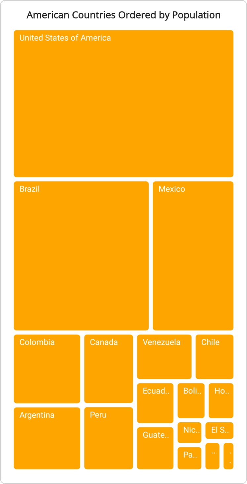
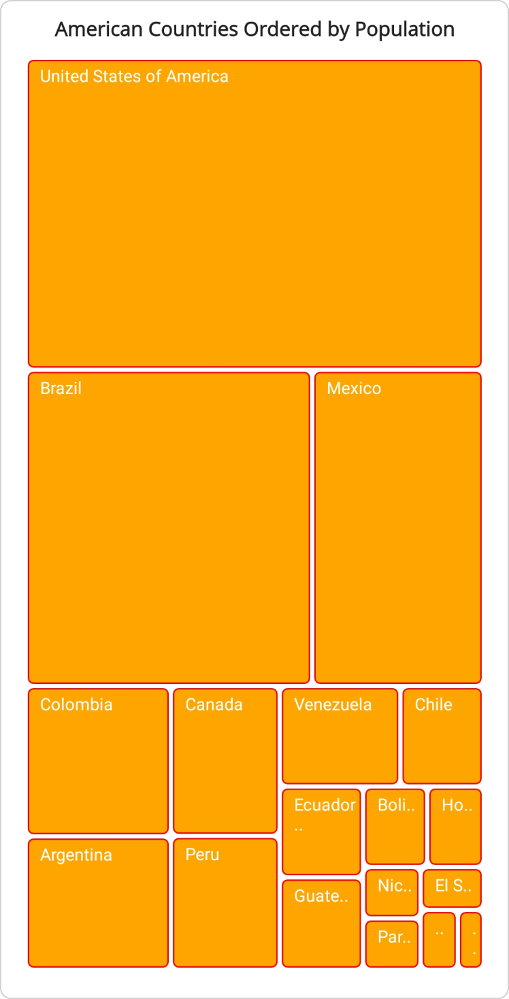
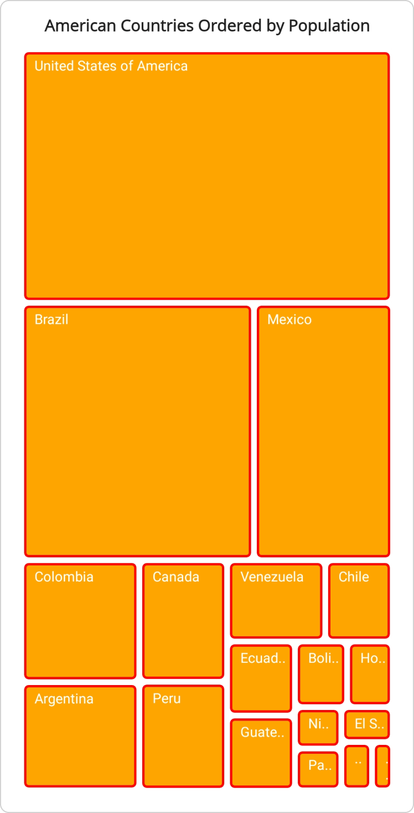
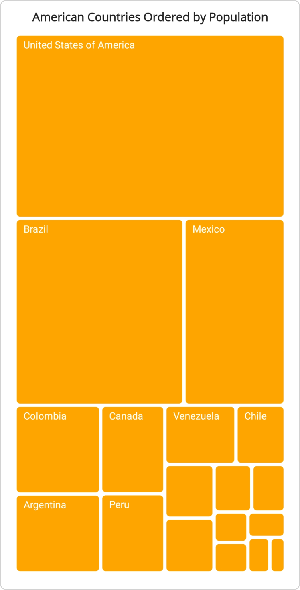
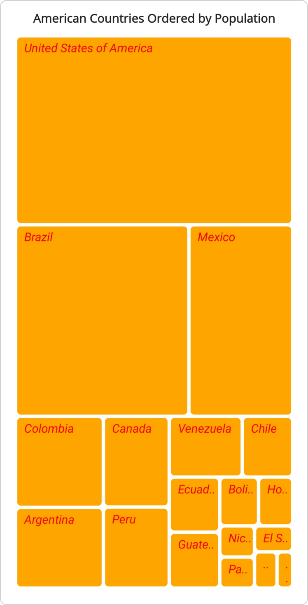

 
# Leaf Item Settings in .NET MAUI TreeMap (SfTreeMap)

A leaf item in the TreeMap represents a visualized data element. It does not contain child items but may have a parent item if levels are specified in the TreeMap control. It also allows you to customize the spacing between items, stroke color, stroke width, text style, and text format option in the TreeMap control.

## Label path

The [LabelPath](https://help.syncfusion.com/cr/maui/Syncfusion.Maui.TreeMap.TreeMapLeafItemSettings.html#Syncfusion_Maui_TreeMap_TreeMapLeafItemSettings_LabelPath) property of [LeafItemSettings](https://help.syncfusion.com/cr/maui/Syncfusion.Maui.TreeMap.SfTreeMap.html#Syncfusion_Maui_TreeMap_SfTreeMap_LeafItemSettings) in [SfTreeMap](https://help.syncfusion.com/cr/maui/Syncfusion.Maui.TreeMap.SfTreeMap.html) is used to display text for leaf items. This property enables you to specify the path to the data property containing the text you want to display.




<treemap:SfTreeMap x:Name="treeMap"
                   DataSource="{Binding PopulationDetails}"
                   PrimaryValuePath="Population">
    <treemap:SfTreeMap.BindingContext>
        <local:PopulationViewModel />
    </treemap:SfTreeMap.BindingContext>
    <treemap:SfTreeMap.LeafItemSettings>
        <treemap:TreeMapLeafItemSettings LabelPath="Country"/>
    </treemap:SfTreeMap.LeafItemSettings>
    <treemap:SfTreeMap.LeafItemBrushSettings>
        <treemap:TreeMapUniformBrushSettings Brush="Orange"/>
    </treemap:SfTreeMap.LeafItemBrushSettings>
</treemap:SfTreeMap>





SfTreeMap treeMap = new SfTreeMap();
PopulationViewModel viewModel = new PopulationViewModel();
treeMap.DataSource = viewModel.PopulationDetails;
treeMap.PrimaryValuePath = "Population";
treeMap.LeafItemSettings = new TreeMapLeafItemSettings() { LabelPath = "Country" };
treeMap.LeafItemBrushSettings = new TreeMapUniformBrushSettings() { Brush = Brush.Orange };
this.Content = treeMap;




/// 
    
/// Represents the custom data properties.
/// 

public class PopulationDetails
{
    public string Country { get; set; }
    public string Continent { get; set; }
    public int Population { get; set; }
}




/// 
    
/// Represents demographic information for countries in the Americas for the year 2023.
/// 

public class PopulationViewModel
{
    public PopulationViewModel()
    {
        this.PopulationDetails = new ObservableCollection<PopulationDetails>()
        {
            new PopulationDetails() { Continent ="North America", Country = "United States of America", Population = 339996564 },
            new PopulationDetails() { Continent ="South America", Country = "Brazil", Population = 216422446 },
            new PopulationDetails() { Continent ="North America", Country = "Mexico", Population = 128455567 },
            new PopulationDetails() { Continent ="South America", Country = "Colombia", Population = 52085168 },
            new PopulationDetails() { Continent ="South America", Country = "Argentina", Population = 45773884 },
            new PopulationDetails() { Continent ="North America", Country = "Canada", Population = 38781292 },
            new PopulationDetails() { Continent ="South America", Country = "Peru", Population = 34352719 },
            new PopulationDetails() { Continent ="South America", Country = "Venezuela", Population = 28838499 },
            new PopulationDetails() { Continent ="South America", Country = "Chile", Population = 19629590 },
            new PopulationDetails() { Continent ="South America", Country = "Ecuador", Population = 18190484 },
            new PopulationDetails() { Continent ="North America", Country = "Guatemala", Population = 18092026 },
            new PopulationDetails() { Continent ="South America", Country = "Bolivia", Population = 12388571 },
            new PopulationDetails() { Continent ="North America", Country = "Honduras", Population = 10593798 },
            new PopulationDetails() { Continent ="North America", Country = "Nicaragua", Population = 7046311 },
            new PopulationDetails() { Continent ="South America", Country = "Paraguay", Population = 6861524 },
            new PopulationDetails() { Continent ="North America", Country = "El Salvador", Population = 6364943 },
            new PopulationDetails() { Continent ="North America", Country = "Costa Rica", Population = 5212173 },
            new PopulationDetails() { Continent ="South America", Country = "Uruguay", Population = 3423109 },
        };
    }

    public ObservableCollection<PopulationDetails> PopulationDetails
    {
        get;
        set;
    }
}




 

## Customize leaf item appearance

The leaf item appearance customization can be achieved by using the [Spacing](https://help.syncfusion.com/cr/maui/Syncfusion.Maui.TreeMap.TreeMapLeafItemSettings.html#Syncfusion_Maui_TreeMap_TreeMapLeafItemSettings_Spacing), [Stroke](https://help.syncfusion.com/cr/maui/Syncfusion.Maui.TreeMap.TreeMapLeafItemSettings.html#Syncfusion_Maui_TreeMap_TreeMapLeafItemSettings_Stroke), [StrokeWidth](https://help.syncfusion.com/cr/maui/Syncfusion.Maui.TreeMap.TreeMapLeafItemSettings.html#Syncfusion_Maui_TreeMap_TreeMapLeafItemSettings_StrokeWidth), [TextStyle](https://help.syncfusion.com/cr/maui/Syncfusion.Maui.TreeMap.TreeMapLeafItemSettings.html#Syncfusion_Maui_TreeMap_TreeMapLeafItemSettings_TextStyle), and [TextFormatOption](https://help.syncfusion.com/cr/maui/Syncfusion.Maui.TreeMap.TreeMapLeafItemSettings.html#Syncfusion_Maui_TreeMap_TreeMapLeafItemSettings_TextFormatOption) properties of [LeafItemSettings](https://help.syncfusion.com/cr/maui/Syncfusion.Maui.TreeMap.SfTreeMap.html#Syncfusion_Maui_TreeMap_SfTreeMap_LeafItemSettings) in the [SfTreeMap](https://help.syncfusion.com/cr/maui/Syncfusion.Maui.TreeMap.SfTreeMap.html).

### Customize leaf item appearance using spacing

The leaf item appearance customization can be achieved by using [Spacing](https://help.syncfusion.com/cr/maui/Syncfusion.Maui.TreeMap.TreeMapLeafItemSettings.html#Syncfusion_Maui_TreeMap_TreeMapLeafItemSettings_Spacing) property of [LeafItemSettings](https://help.syncfusion.com/cr/maui/Syncfusion.Maui.TreeMap.SfTreeMap.html#Syncfusion_Maui_TreeMap_SfTreeMap_LeafItemSettings) in [SfTreeMap](https://help.syncfusion.com/cr/maui/Syncfusion.Maui.TreeMap.SfTreeMap.html). It is used to customize the spacing between the tree map leaf items and its default value is `1.`




<treemap:SfTreeMap x:Name="treeMap"
                   DataSource="{Binding PopulationDetails}"
                   PrimaryValuePath="Population">
    <treemap:SfTreeMap.BindingContext>
        <local:PopulationViewModel />
    </treemap:SfTreeMap.BindingContext>
    <treemap:SfTreeMap.LeafItemSettings>
        <treemap:TreeMapLeafItemSettings LabelPath="Country"
                                         Spacing="3"/>
    </treemap:SfTreeMap.LeafItemSettings>
    <treemap:SfTreeMap.LeafItemBrushSettings>
        <treemap:TreeMapUniformBrushSettings Brush="Orange"/>
    </treemap:SfTreeMap.LeafItemBrushSettings>
</treemap:SfTreeMap>





SfTreeMap treeMap = new SfTreeMap();
PopulationViewModel viewModel = new PopulationViewModel();
treeMap.DataSource = viewModel.PopulationDetails;
treeMap.PrimaryValuePath = "Population";
treeMap.LeafItemSettings = new TreeMapLeafItemSettings() { LabelPath = "Country", Spacing = 3 };
treeMap.LeafItemBrushSettings = new TreeMapUniformBrushSettings() { Brush = Brush.Orange };
this.Content = treeMap;




/// 
    
/// Represents the custom data properties.
/// 

public class PopulationDetails
{
    public string Country { get; set; }
    public string Continent { get; set; }
    public int Population { get; set; }
}




/// 
    
/// Represents demographic information for countries in the Americas for the year 2023.
/// 

public class PopulationViewModel
{
    public PopulationViewModel()
    {
        this.PopulationDetails = new ObservableCollection<PopulationDetails>()
        {
            new PopulationDetails() { Continent ="North America", Country = "United States of America", Population = 339996564 },
            new PopulationDetails() { Continent ="South America", Country = "Brazil", Population = 216422446 },
            new PopulationDetails() { Continent ="North America", Country = "Mexico", Population = 128455567 },
            new PopulationDetails() { Continent ="South America", Country = "Colombia", Population = 52085168 },
            new PopulationDetails() { Continent ="South America", Country = "Argentina", Population = 45773884 },
            new PopulationDetails() { Continent ="North America", Country = "Canada", Population = 38781292 },
            new PopulationDetails() { Continent ="South America", Country = "Peru", Population = 34352719 },
            new PopulationDetails() { Continent ="South America", Country = "Venezuela", Population = 28838499 },
            new PopulationDetails() { Continent ="South America", Country = "Chile", Population = 19629590 },
            new PopulationDetails() { Continent ="South America", Country = "Ecuador", Population = 18190484 },
            new PopulationDetails() { Continent ="North America", Country = "Guatemala", Population = 18092026 },
            new PopulationDetails() { Continent ="South America", Country = "Bolivia", Population = 12388571 },
            new PopulationDetails() { Continent ="North America", Country = "Honduras", Population = 10593798 },
            new PopulationDetails() { Continent ="North America", Country = "Nicaragua", Population = 7046311 },
            new PopulationDetails() { Continent ="South America", Country = "Paraguay", Population = 6861524 },
            new PopulationDetails() { Continent ="North America", Country = "El Salvador", Population = 6364943 },
            new PopulationDetails() { Continent ="North America", Country = "Costa Rica", Population = 5212173 },
            new PopulationDetails() { Continent ="South America", Country = "Uruguay", Population = 3423109 },
        };
    }

    public ObservableCollection<PopulationDetails> PopulationDetails
    {
        get;
        set;
    }
}




 

### Customize leaf item appearance using stroke

The leaf item appearance customization can be achieved by using the [Stroke](https://help.syncfusion.com/cr/maui/Syncfusion.Maui.TreeMap.TreeMapLeafItemSettings.html#Syncfusion_Maui_TreeMap_TreeMapLeafItemSettings_Stroke) property of [LeafItemSettings](https://help.syncfusion.com/cr/maui/Syncfusion.Maui.TreeMap.SfTreeMap.html#Syncfusion_Maui_TreeMap_SfTreeMap_LeafItemSettings) in [SfTreeMap](https://help.syncfusion.com/cr/maui/Syncfusion.Maui.TreeMap.SfTreeMap.html). It is used to customize the stroke color for the tree map leaf items. The default value of [Stroke](https://help.syncfusion.com/cr/maui/Syncfusion.Maui.TreeMap.TreeMapLeafItemSettings.html#Syncfusion_Maui_TreeMap_TreeMapLeafItemSettings_Stroke) property is `Transparent.`




<treemap:SfTreeMap x:Name="treeMap"
                   DataSource="{Binding PopulationDetails}"
                   PrimaryValuePath="Population">
    <treemap:SfTreeMap.BindingContext>
        <local:PopulationViewModel />
    </treemap:SfTreeMap.BindingContext>
    <treemap:SfTreeMap.LeafItemSettings>
        <treemap:TreeMapLeafItemSettings LabelPath="Country"
                                         Stroke="Red"/>
    </treemap:SfTreeMap.LeafItemSettings>
    <treemap:SfTreeMap.LeafItemBrushSettings>
        <treemap:TreeMapUniformBrushSettings Brush="Orange"/>
    </treemap:SfTreeMap.LeafItemBrushSettings>
</treemap:SfTreeMap>





SfTreeMap treeMap = new SfTreeMap();
PopulationViewModel viewModel = new PopulationViewModel();
treeMap.DataSource = viewModel.PopulationDetails;
treeMap.PrimaryValuePath = "Population";
treeMap.LeafItemSettings = new TreeMapLeafItemSettings() { LabelPath = "Country", Stroke = Brush.Red };
treeMap.LeafItemBrushSettings = new TreeMapUniformBrushSettings() { Brush = Brush.Orange };
this.Content = treeMap;




/// 
    
/// Represents the custom data properties.
/// 

public class PopulationDetails
{
    public string Country { get; set; }
    public string Continent { get; set; }
    public int Population { get; set; }
}




/// 
    
/// Represents demographic information for countries in the Americas for the year 2023.
/// 

public class PopulationViewModel
{
    public PopulationViewModel()
    {
        this.PopulationDetails = new ObservableCollection<PopulationDetails>()
        {
            new PopulationDetails() { Continent ="North America", Country = "United States of America", Population = 339996564 },
            new PopulationDetails() { Continent ="South America", Country = "Brazil", Population = 216422446 },
            new PopulationDetails() { Continent ="North America", Country = "Mexico", Population = 128455567 },
            new PopulationDetails() { Continent ="South America", Country = "Colombia", Population = 52085168 },
            new PopulationDetails() { Continent ="South America", Country = "Argentina", Population = 45773884 },
            new PopulationDetails() { Continent ="North America", Country = "Canada", Population = 38781292 },
            new PopulationDetails() { Continent ="South America", Country = "Peru", Population = 34352719 },
            new PopulationDetails() { Continent ="South America", Country = "Venezuela", Population = 28838499 },
            new PopulationDetails() { Continent ="South America", Country = "Chile", Population = 19629590 },
            new PopulationDetails() { Continent ="South America", Country = "Ecuador", Population = 18190484 },
            new PopulationDetails() { Continent ="North America", Country = "Guatemala", Population = 18092026 },
            new PopulationDetails() { Continent ="South America", Country = "Bolivia", Population = 12388571 },
            new PopulationDetails() { Continent ="North America", Country = "Honduras", Population = 10593798 },
            new PopulationDetails() { Continent ="North America", Country = "Nicaragua", Population = 7046311 },
            new PopulationDetails() { Continent ="South America", Country = "Paraguay", Population = 6861524 },
            new PopulationDetails() { Continent ="North America", Country = "El Salvador", Population = 6364943 },
            new PopulationDetails() { Continent ="North America", Country = "Costa Rica", Population = 5212173 },
            new PopulationDetails() { Continent ="South America", Country = "Uruguay", Population = 3423109 },
        };
    }

    public ObservableCollection<PopulationDetails> PopulationDetails
    {
        get;
        set;
    }
}




 

### Customize leaf item appearance using stroke width

The leaf item appearance customization can be achieved by using the [StrokeWidth](https://help.syncfusion.com/cr/maui/Syncfusion.Maui.TreeMap.TreeMapLeafItemSettings.html#Syncfusion_Maui_TreeMap_TreeMapLeafItemSettings_StrokeWidth) property of [LeafItemSettings](https://help.syncfusion.com/cr/maui/Syncfusion.Maui.TreeMap.SfTreeMap.html#Syncfusion_Maui_TreeMap_SfTreeMap_LeafItemSettings) in [SfTreeMap](https://help.syncfusion.com/cr/maui/Syncfusion.Maui.TreeMap.SfTreeMap.html). It is used to customize the width of the stroke for the tree map leaf items. The default value of [StrokeWidth](https://help.syncfusion.com/cr/maui/Syncfusion.Maui.TreeMap.TreeMapLeafItemSettings.html#Syncfusion_Maui_TreeMap_TreeMapLeafItemSettings_StrokeWidth) property is `1.`




<treemap:SfTreeMap x:Name="treeMap"
                   DataSource="{Binding PopulationDetails}"
                   PrimaryValuePath="Population">
    <treemap:SfTreeMap.BindingContext>
        <local:PopulationViewModel />
    </treemap:SfTreeMap.BindingContext>
    <treemap:SfTreeMap.LeafItemSettings>
        <treemap:TreeMapLeafItemSettings LabelPath="Country"
                                         Stroke="Red"
                                         StrokeWidth="2"/>
    </treemap:SfTreeMap.LeafItemSettings>
    <treemap:SfTreeMap.LeafItemBrushSettings>
        <treemap:TreeMapUniformBrushSettings Brush="Orange"/>
    </treemap:SfTreeMap.LeafItemBrushSettings>
</treemap:SfTreeMap>





SfTreeMap treeMap = new SfTreeMap();
PopulationViewModel viewModel = new PopulationViewModel();
treeMap.DataSource = viewModel.PopulationDetails;
treeMap.PrimaryValuePath = "Population";
treeMap.LeafItemSettings = new TreeMapLeafItemSettings() { LabelPath = "Country", Stroke = Brush.Red, StrokeWidth = 2 };
treeMap.LeafItemBrushSettings = new TreeMapUniformBrushSettings() { Brush = Brush.Orange };
this.Content = treeMap;




/// 
    
/// Represents the custom data properties.
/// 

public class PopulationDetails
{
    public string Country { get; set; }
    public string Continent { get; set; }
    public int Population { get; set; }
}




/// 
    
/// Represents demographic information for countries in the Americas for the year 2023.
/// 

public class PopulationViewModel
{
    public PopulationViewModel()
    {
        this.PopulationDetails = new ObservableCollection<PopulationDetails>()
        {
            new PopulationDetails() { Continent ="North America", Country = "United States of America", Population = 339996564 },
            new PopulationDetails() { Continent ="South America", Country = "Brazil", Population = 216422446 },
            new PopulationDetails() { Continent ="North America", Country = "Mexico", Population = 128455567 },
            new PopulationDetails() { Continent ="South America", Country = "Colombia", Population = 52085168 },
            new PopulationDetails() { Continent ="South America", Country = "Argentina", Population = 45773884 },
            new PopulationDetails() { Continent ="North America", Country = "Canada", Population = 38781292 },
            new PopulationDetails() { Continent ="South America", Country = "Peru", Population = 34352719 },
            new PopulationDetails() { Continent ="South America", Country = "Venezuela", Population = 28838499 },
            new PopulationDetails() { Continent ="South America", Country = "Chile", Population = 19629590 },
            new PopulationDetails() { Continent ="South America", Country = "Ecuador", Population = 18190484 },
            new PopulationDetails() { Continent ="North America", Country = "Guatemala", Population = 18092026 },
            new PopulationDetails() { Continent ="South America", Country = "Bolivia", Population = 12388571 },
            new PopulationDetails() { Continent ="North America", Country = "Honduras", Population = 10593798 },
            new PopulationDetails() { Continent ="North America", Country = "Nicaragua", Population = 7046311 },
            new PopulationDetails() { Continent ="South America", Country = "Paraguay", Population = 6861524 },
            new PopulationDetails() { Continent ="North America", Country = "El Salvador", Population = 6364943 },
            new PopulationDetails() { Continent ="North America", Country = "Costa Rica", Population = 5212173 },
            new PopulationDetails() { Continent ="South America", Country = "Uruguay", Population = 3423109 },
        };
    }

    public ObservableCollection<PopulationDetails> PopulationDetails
    {
        get;
        set;
    }
}




 

### Customize leaf item appearance using text format option

The leaf item appearance customization can be achieved by using the [TextFormatOption](https://help.syncfusion.com/cr/maui/Syncfusion.Maui.TreeMap.TreeMapLeafItemSettings.html#Syncfusion_Maui_TreeMap_TreeMapLeafItemSettings_TextFormatOption) property of [LeafItemSettings](https://help.syncfusion.com/cr/maui/Syncfusion.Maui.TreeMap.SfTreeMap.html#Syncfusion_Maui_TreeMap_SfTreeMap_LeafItemSettings) in [SfTreeMap](https://help.syncfusion.com/cr/maui/Syncfusion.Maui.TreeMap.SfTreeMap.html). This property, applicable only when [LabelPath](https://help.syncfusion.com/cr/maui/Syncfusion.Maui.TreeMap.TreeMapLeafItemSettings.html#Syncfusion_Maui_TreeMap_TreeMapLeafItemSettings_LabelPath) is specified, defaults to [Trim](https://help.syncfusion.com/cr/maui/Syncfusion.Maui.TreeMap.TextFormatOption.html#Syncfusion_Maui_TreeMap_TextFormatOption_Trim). Options include [Wrap](https://help.syncfusion.com/cr/maui/Syncfusion.Maui.TreeMap.TextFormatOption.html#Syncfusion_Maui_TreeMap_TextFormatOption_Wrap) or [Hide](https://help.syncfusion.com/cr/maui/Syncfusion.Maui.TreeMap.TextFormatOption.html#Syncfusion_Maui_TreeMap_TextFormatOption_Hide) for altering text appearance.




<treemap:SfTreeMap x:Name="treeMap"
                   DataSource="{Binding PopulationDetails}"
                   PrimaryValuePath="Population">
    <treemap:SfTreeMap.BindingContext>
        <local:PopulationViewModel />
    </treemap:SfTreeMap.BindingContext>
    <treemap:SfTreeMap.LeafItemSettings>
        <treemap:TreeMapLeafItemSettings LabelPath="Country"
                                         TextFormatOption="Hide"/>
    </treemap:SfTreeMap.LeafItemSettings>
    <treemap:SfTreeMap.LeafItemBrushSettings>
        <treemap:TreeMapUniformBrushSettings Brush="Orange"/>
    </treemap:SfTreeMap.LeafItemBrushSettings>
</treemap:SfTreeMap>





SfTreeMap treeMap = new SfTreeMap();
PopulationViewModel viewModel = new PopulationViewModel();
treeMap.DataSource = viewModel.PopulationDetails;
treeMap.PrimaryValuePath = "Population";
treeMap.LeafItemSettings = new TreeMapLeafItemSettings() { LabelPath = "Country", TextFormatOption = TextFormatOption.Hide };
treeMap.LeafItemBrushSettings = new TreeMapUniformBrushSettings() { Brush = Brush.Orange };
this.Content = treeMap;




/// 
    
/// Represents the custom data properties.
/// 

public class PopulationDetails
{
    public string Country { get; set; }
    public string Continent { get; set; }
    public int Population { get; set; }
}




/// 
    
/// Represents demographic information for countries in the Americas for the year 2023.
/// 

public class PopulationViewModel
{
    public PopulationViewModel()
    {
        this.PopulationDetails = new ObservableCollection<PopulationDetails>()
        {
            new PopulationDetails() { Continent ="North America", Country = "United States of America", Population = 339996564 },
            new PopulationDetails() { Continent ="South America", Country = "Brazil", Population = 216422446 },
            new PopulationDetails() { Continent ="North America", Country = "Mexico", Population = 128455567 },
            new PopulationDetails() { Continent ="South America", Country = "Colombia", Population = 52085168 },
            new PopulationDetails() { Continent ="South America", Country = "Argentina", Population = 45773884 },
            new PopulationDetails() { Continent ="North America", Country = "Canada", Population = 38781292 },
            new PopulationDetails() { Continent ="South America", Country = "Peru", Population = 34352719 },
            new PopulationDetails() { Continent ="South America", Country = "Venezuela", Population = 28838499 },
            new PopulationDetails() { Continent ="South America", Country = "Chile", Population = 19629590 },
            new PopulationDetails() { Continent ="South America", Country = "Ecuador", Population = 18190484 },
            new PopulationDetails() { Continent ="North America", Country = "Guatemala", Population = 18092026 },
            new PopulationDetails() { Continent ="South America", Country = "Bolivia", Population = 12388571 },
            new PopulationDetails() { Continent ="North America", Country = "Honduras", Population = 10593798 },
            new PopulationDetails() { Continent ="North America", Country = "Nicaragua", Population = 7046311 },
            new PopulationDetails() { Continent ="South America", Country = "Paraguay", Population = 6861524 },
            new PopulationDetails() { Continent ="North America", Country = "El Salvador", Population = 6364943 },
            new PopulationDetails() { Continent ="North America", Country = "Costa Rica", Population = 5212173 },
            new PopulationDetails() { Continent ="South America", Country = "Uruguay", Population = 3423109 },
        };
    }

    public ObservableCollection<PopulationDetails> PopulationDetails
    {
        get;
        set;
    }
}




 

### Customize leaf item appearance using style

The leaf item appearance customization can be achieved by using the [TextStyle](https://help.syncfusion.com/cr/maui/Syncfusion.Maui.TreeMap.TreeMapLeafItemSettings.html#Syncfusion_Maui_TreeMap_TreeMapLeafItemSettings_TextStyle) property of  [LeafItemSettings](https://help.syncfusion.com/cr/maui/Syncfusion.Maui.TreeMap.SfTreeMap.html#Syncfusion_Maui_TreeMap_SfTreeMap_LeafItemSettings) in [SfTreeMap](https://help.syncfusion.com/cr/maui/Syncfusion.Maui.TreeMap.SfTreeMap.html). It is used to customize the [TextColor](https://help.syncfusion.com/cr/maui/Syncfusion.Maui.TreeMap.TreeMapTextStyle.html#Syncfusion_Maui_TreeMap_TreeMapTextStyle_TextColor), [FontSize](https://help.syncfusion.com/cr/maui/Syncfusion.Maui.TreeMap.TreeMapTextStyle.html#Syncfusion_Maui_TreeMap_TreeMapTextStyle_FontSize), [FontFamily](https://help.syncfusion.com/cr/maui/Syncfusion.Maui.TreeMap.TreeMapTextStyle.html#Syncfusion_Maui_TreeMap_TreeMapTextStyle_FontFamily), and [FontAttributes](https://help.syncfusion.com/cr/maui/Syncfusion.Maui.TreeMap.TreeMapTextStyle.html#Syncfusion_Maui_TreeMap_TreeMapTextStyle_FontAttributes) of the treemap item text.




<treemap:SfTreeMap x:Name="treeMap"
                   DataSource="{Binding PopulationDetails}"
                   PrimaryValuePath="Population">
    <treemap:SfTreeMap.BindingContext>
        <local:PopulationViewModel />
    </treemap:SfTreeMap.BindingContext>
    <treemap:SfTreeMap.LeafItemSettings>
        <treemap:TreeMapLeafItemSettings LabelPath="Country">
            <treemap:TreeMapLeafItemSettings.TextStyle>
                <treemap:TreeMapTextStyle TextColor="Red"
                                          FontSize="14"
                                          FontAttributes="Italic"/>
            </treemap:TreeMapLeafItemSettings.TextStyle>
        </treemap:TreeMapLeafItemSettings>
    </treemap:SfTreeMap.LeafItemSettings>
    <treemap:SfTreeMap.LeafItemBrushSettings>
        <treemap:TreeMapUniformBrushSettings Brush="Orange"/>
    </treemap:SfTreeMap.LeafItemBrushSettings>
</treemap:SfTreeMap>





SfTreeMap treeMap = new SfTreeMap();
PopulationViewModel viewModel = new PopulationViewModel();
treeMap.DataSource = viewModel.PopulationDetails;
treeMap.PrimaryValuePath = "Population";
treeMap.LeafItemSettings = new TreeMapLeafItemSettings()
{ 
    LabelPath = "Country",
    TextStyle = new TreeMapTextStyle() { TextColor = Colors.Red, FontSize = 14, FontAttributes = FontAttributes.Italic },
};

treeMap.LeafItemBrushSettings = new TreeMapUniformBrushSettings() { Brush = Brush.Orange };
this.Content = treeMap;




/// 
    
/// Represents the custom data properties.
/// 

public class PopulationDetails
{
    public string Country { get; set; }
    public string Continent { get; set; }
    public int Population { get; set; }
}




/// 
    
/// Represents demographic information for countries in the Americas for the year 2023.
/// 

public class PopulationViewModel
{
    public PopulationViewModel()
    {
        this.PopulationDetails = new ObservableCollection<PopulationDetails>()
        {
            new PopulationDetails() { Continent ="North America", Country = "United States of America", Population = 339996564 },
            new PopulationDetails() { Continent ="South America", Country = "Brazil", Population = 216422446 },
            new PopulationDetails() { Continent ="North America", Country = "Mexico", Population = 128455567 },
            new PopulationDetails() { Continent ="South America", Country = "Colombia", Population = 52085168 },
            new PopulationDetails() { Continent ="South America", Country = "Argentina", Population = 45773884 },
            new PopulationDetails() { Continent ="North America", Country = "Canada", Population = 38781292 },
            new PopulationDetails() { Continent ="South America", Country = "Peru", Population = 34352719 },
            new PopulationDetails() { Continent ="South America", Country = "Venezuela", Population = 28838499 },
            new PopulationDetails() { Continent ="South America", Country = "Chile", Population = 19629590 },
            new PopulationDetails() { Continent ="South America", Country = "Ecuador", Population = 18190484 },
            new PopulationDetails() { Continent ="North America", Country = "Guatemala", Population = 18092026 },
            new PopulationDetails() { Continent ="South America", Country = "Bolivia", Population = 12388571 },
            new PopulationDetails() { Continent ="North America", Country = "Honduras", Population = 10593798 },
            new PopulationDetails() { Continent ="North America", Country = "Nicaragua", Population = 7046311 },
            new PopulationDetails() { Continent ="South America", Country = "Paraguay", Population = 6861524 },
            new PopulationDetails() { Continent ="North America", Country = "El Salvador", Population = 6364943 },
            new PopulationDetails() { Continent ="North America", Country = "Costa Rica", Population = 5212173 },
            new PopulationDetails() { Continent ="South America", Country = "Uruguay", Population = 3423109 },
        };
    }

    public ObservableCollection<PopulationDetails> PopulationDetails
    {
        get;
        set;
    }
}




N> This property is applicable to only when the [LabelPath](https://help.syncfusion.com/cr/maui/Syncfusion.Maui.TreeMap.TreeMapLeafItemSettings.html#Syncfusion_Maui_TreeMap_TreeMapLeafItemSettings_LabelPath) property is specified.

 