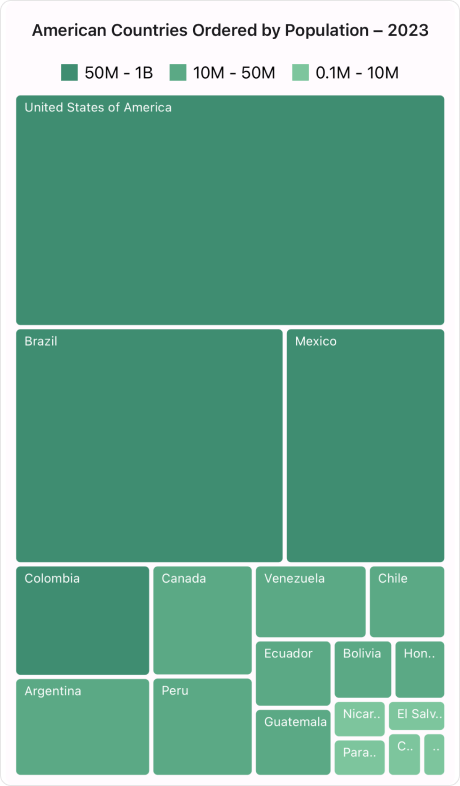
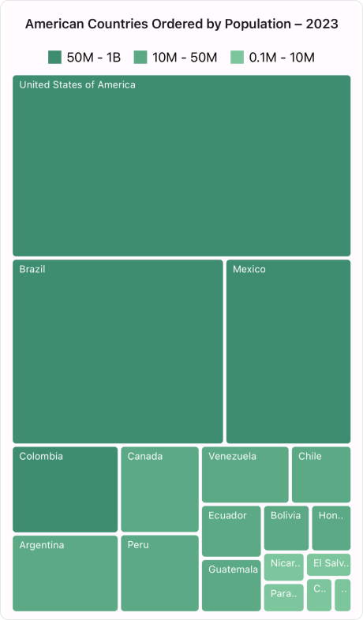
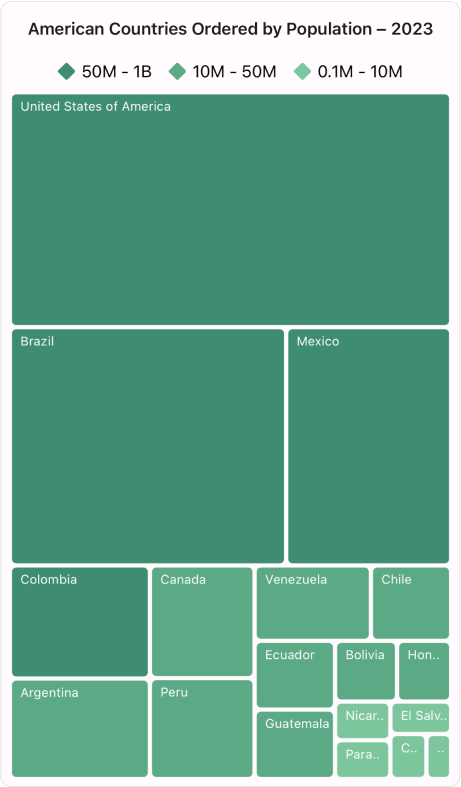
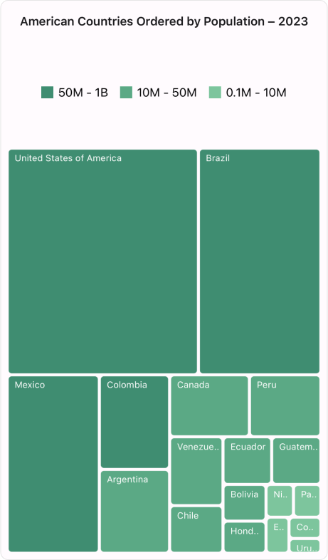
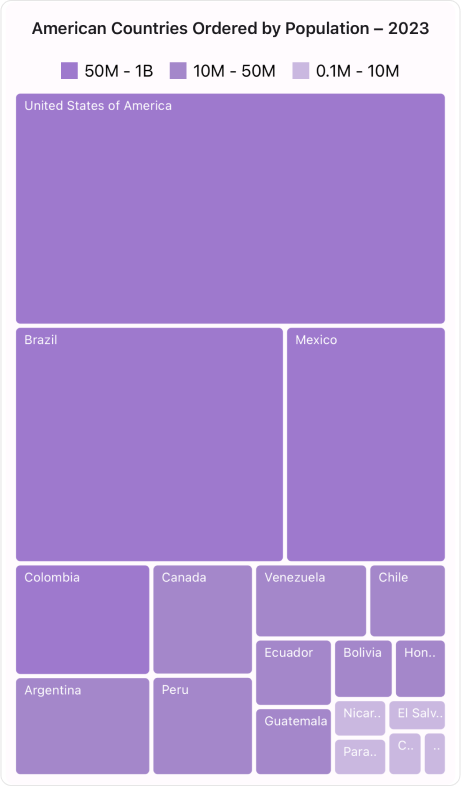
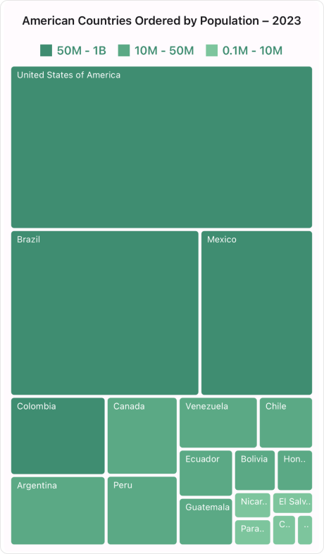

# Legend in .NET MAUI TreeMap (SfTreeMap)

The legend provides valuable information for interpreting TreeMap displays by presenting data through various colors, shapes, and other identifiers.

## Enable legend

To incorporate a legend for the TreeMap control, utilize the [ShowLegend](https://help.syncfusion.com/cr/maui/Syncfusion.Maui.TreeMap.TreeMapLegendSettings.html#Syncfusion_Maui_TreeMap_TreeMapLegendSettings_ShowLegend) property within [LegendSettings](https://help.syncfusion.com/cr/maui/Syncfusion.Maui.TreeMap.SfTreeMap.html#Syncfusion_Maui_TreeMap_SfTreeMap_LegendSettings). It is possible to customize the legend item’s color and text using the [LeafItemBrushSettings](https://help.syncfusion.com/cr/maui/Syncfusion.Maui.TreeMap.SfTreeMap.html#Syncfusion_Maui_TreeMap_SfTreeMap_LeafItemBrushSettings) and [LegendSettings](https://help.syncfusion.com/cr/maui/Syncfusion.Maui.TreeMap.SfTreeMap.html#Syncfusion_Maui_TreeMap_SfTreeMap_LegendSettings) properties of [SfTreeMap](https://help.syncfusion.com/cr/maui/Syncfusion.Maui.TreeMap.SfTreeMap.html).




<treemap:SfTreeMap x:Name="treeMap"
                   DataSource="{Binding PopulationDetails}"
                   RangeColorValuePath="Population"
                   PrimaryValuePath="Population">
    <treemap:SfTreeMap.BindingContext>
        <local:PopulationViewModel />
    </treemap:SfTreeMap.BindingContext>
    <treemap:SfTreeMap.LegendSettings>
        <treemap:TreeMapLegendSettings ShowLegend="True"/>
    </treemap:SfTreeMap.LegendSettings>
    <treemap:SfTreeMap.LeafItemSettings>
        <treemap:TreeMapLeafItemSettings LabelPath="Country">
        </treemap:TreeMapLeafItemSettings>
    </treemap:SfTreeMap.LeafItemSettings>
    <treemap:SfTreeMap.LeafItemBrushSettings>
        <treemap:TreeMapRangeBrushSettings>
            <treemap:TreeMapRangeBrushSettings.RangeBrushes>
                <treemap:TreeMapRangeBrush LegendLabel="50M - 1B"
                                           From="50000000"
                                           To="1000000000" 
                                           Brush ="#3F8D71" />
                <treemap:TreeMapRangeBrush LegendLabel="10M - 50M"
                                           From="10000000"
                                           To="50000000" 
                                           Brush ="#5BA985" />
                <treemap:TreeMapRangeBrush LegendLabel="0.1M - 10M"
                                           From="100000" 
                                           To="10000000"  
                                           Brush= "#7DC59D" />
            </treemap:TreeMapRangeBrushSettings.RangeBrushes>
        </treemap:TreeMapRangeBrushSettings>
    </treemap:SfTreeMap.LeafItemBrushSettings>
</treemap:SfTreeMap>




SfTreeMap treeMap = new SfTreeMap();
PopulationViewModel viewModel = new PopulationViewModel();
treeMap.DataSource = viewModel.PopulationDetails;
treeMap.PrimaryValuePath = "Population";
treeMap.RangeColorValuePath = "Population";
treeMap.LegendSettings.ShowLegend = true;
treeMap.LeafItemSettings = new TreeMapLeafItemSettings() { LabelPath = "Country" };
treeMap.LeafItemBrushSettings = new TreeMapRangeBrushSettings()
{
    RangeBrushes = new List<TreeMapRangeBrush>()
    {
        new TreeMapRangeBrush { LegendLabel = "50M - 1B", From = 50000000, To = 1000000000, Brush = new SolidColorBrush(Color.FromArgb("#3F8D71")) },
        new TreeMapRangeBrush { LegendLabel = "10M - 50M", From = 10000000, To = 50000000, Brush = new SolidColorBrush(Color.FromArgb("#5BA985")) },
        new TreeMapRangeBrush { LegendLabel = "0.1M - 10M", From = 100000, To = 10000000, Brush = new SolidColorBrush(Color.FromArgb("#7DC59D")) },
    }
};

this.Content = treeMap;




public class PopulationDetails
{
    public string Country { get; set; }
    public string Continent { get; set; }
    public double Population { get; set; }
}




public class PopulationViewModel
{
    public PopulationViewModel()
    {
        this.PopulationDetails = new ObservableCollection<PopulationDetails>()
        {
            new PopulationDetails() { Continent ="North America", Country = "United States of America", Population = 339996564 },
            new PopulationDetails() { Continent ="South America", Country = "Brazil", Population = 216422446 },
            new PopulationDetails() { Continent ="North America", Country = "Mexico", Population = 128455567 },
            new PopulationDetails() { Continent ="South America", Country = "Colombia", Population = 52085168 },
            new PopulationDetails() { Continent ="South America", Country = "Argentina", Population = 45773884 },
            new PopulationDetails() { Continent ="North America", Country = "Canada", Population = 38781292 },
            new PopulationDetails() { Continent ="South America", Country = "Peru", Population = 34352719 },
            new PopulationDetails() { Continent ="South America", Country = "Venezuela", Population = 28838499 },
            new PopulationDetails() { Continent ="South America", Country = "Chile", Population = 19629590 },
            new PopulationDetails() { Continent ="South America", Country = "Ecuador", Population = 18190484 },
            new PopulationDetails() { Continent ="North America", Country = "Guatemala", Population = 18092026 },
            new PopulationDetails() { Continent ="South America", Country = "Bolivia", Population = 12388571 },
            new PopulationDetails() { Continent ="North America", Country = "Honduras", Population = 10593798 },
            new PopulationDetails() { Continent ="North America", Country = "Nicaragua", Population = 7046311 },
            new PopulationDetails() { Continent ="South America", Country = "Paraguay", Population = 6861524 },
            new PopulationDetails() { Continent ="North America", Country = "El Salvador", Population = 6364943 },
            new PopulationDetails() { Continent ="North America", Country = "Costa Rica", Population = 5212173 },
            new PopulationDetails() { Continent ="South America", Country = "Uruguay", Population = 3423109 },
        };
    }

    public ObservableCollection<PopulationDetails> PopulationDetails
    {
        get;
        set;
    }
}




 

## Placement

You can position the legend items in different directions using the [Placement](https://help.syncfusion.com/cr/maui/Syncfusion.Maui.TreeMap.TreeMapLegendSettings.html#Syncfusion_Maui_TreeMap_TreeMapLegendSettings_Placement) property of [LegendSettings](https://help.syncfusion.com/cr/maui/Syncfusion.Maui.TreeMap.SfTreeMap.html#Syncfusion_Maui_TreeMap_SfTreeMap_LegendSettings) in [SfTreeMap](https://help.syncfusion.com/cr/maui/Syncfusion.Maui.TreeMap.SfTreeMap.html). The default value of the [Placement](https://help.syncfusion.com/cr/maui/Syncfusion.Maui.TreeMap.TreeMapLegendSettings.html#Syncfusion_Maui_TreeMap_TreeMapLegendSettings_Placement) property is [Top](https://help.syncfusion.com/cr/maui/Syncfusion.Maui.TreeMap.LegendPlacement.html#Syncfusion_Maui_TreeMap_LegendPlacement_Top). The possible values include [Left](https://help.syncfusion.com/cr/maui/Syncfusion.Maui.TreeMap.LegendPlacement.html#Syncfusion_Maui_TreeMap_LegendPlacement_Left), [Right](https://help.syncfusion.com/cr/maui/Syncfusion.Maui.TreeMap.LegendPlacement.html#Syncfusion_Maui_TreeMap_LegendPlacement_Right), [Top](https://help.syncfusion.com/cr/maui/Syncfusion.Maui.TreeMap.LegendPlacement.html#Syncfusion_Maui_TreeMap_LegendPlacement_Top) and [Bottom](https://help.syncfusion.com/cr/maui/Syncfusion.Maui.TreeMap.LegendPlacement.html#Syncfusion_Maui_TreeMap_LegendPlacement_Bottom).




<treemap:SfTreeMap x:Name="treeMap"
                   DataSource="{Binding PopulationDetails}"
                   RangeColorValuePath="Population"
                   PrimaryValuePath="Population">
    <treemap:SfTreeMap.BindingContext>
       <local:PopulationViewModel />
    </treemap:SfTreeMap.BindingContext>
    <treemap:SfTreeMap.LegendSettings>
        <treemap:TreeMapLegendSettings ShowLegend="True"
                                       Placement="Bottom" />
    </treemap:SfTreeMap.LegendSettings>
    <treemap:SfTreeMap.LeafItemSettings>
        <treemap:TreeMapLeafItemSettings LabelPath="Country">
        </treemap:TreeMapLeafItemSettings>
    </treemap:SfTreeMap.LeafItemSettings>
    <treemap:SfTreeMap.LeafItemBrushSettings>
        <treemap:TreeMapRangeBrushSettings>
            <treemap:TreeMapRangeBrushSettings.RangeBrushes>
                <treemap:TreeMapRangeBrush LegendLabel="50M - 1B"
                                           From="50000000"
                                           To="1000000000" 
                                           Brush ="#3F8D71" />
                <treemap:TreeMapRangeBrush LegendLabel="10M - 50M"
                                           From="10000000"
                                           To="50000000" 
                                           Brush ="#5BA985" />
                <treemap:TreeMapRangeBrush LegendLabel="0.1M - 10M"
                                           From="100000" 
                                           To="10000000"  
                                           Brush= "#7DC59D" />
            </treemap:TreeMapRangeBrushSettings.RangeBrushes>
        </treemap:TreeMapRangeBrushSettings>
    </treemap:SfTreeMap.LeafItemBrushSettings>
</treemap:SfTreeMap>




SfTreeMap treeMap = new SfTreeMap();
PopulationViewModel viewModel = new PopulationViewModel();
treeMap.DataSource = viewModel.PopulationDetails;
treeMap.PrimaryValuePath = "Population";
treeMap.RangeColorValuePath = "Population";
treeMap.LegendSettings = new TreeMapLegendSettings() { Placement = LegendPlacement.Bottom, ShowLegend = true };
treeMap.LeafItemSettings = new TreeMapLeafItemSettings() { LabelPath = "Country" };
treeMap.LeafItemBrushSettings = new TreeMapRangeBrushSettings()
{
    RangeBrushes = new List<TreeMapRangeBrush>()
    {
        new TreeMapRangeBrush { LegendLabel = "50M - 1B", From = 50000000, To = 1000000000, Brush = new SolidColorBrush(Color.FromArgb("#3F8D71")) },
        new TreeMapRangeBrush { LegendLabel = "10M - 50M", From = 10000000, To = 50000000, Brush = new SolidColorBrush(Color.FromArgb("#5BA985")) },
        new TreeMapRangeBrush { LegendLabel = "0.1M - 10M", From = 100000, To = 10000000, Brush = new SolidColorBrush(Color.FromArgb("#7DC59D")) },
    }
};

this.Content = treeMap;




public class PopulationDetails
{
    public string Country { get; set; }
    public string Continent { get; set; }
    public double Population { get; set; }
}




public class PopulationViewModel
{
    public PopulationViewModel()
    {
        this.PopulationDetails = new ObservableCollection<PopulationDetails>()
        {
            new PopulationDetails() { Continent ="North America", Country = "United States of America", Population = 339996564 },
            new PopulationDetails() { Continent ="South America", Country = "Brazil", Population = 216422446 },
            new PopulationDetails() { Continent ="North America", Country = "Mexico", Population = 128455567 },
            new PopulationDetails() { Continent ="South America", Country = "Colombia", Population = 52085168 },
            new PopulationDetails() { Continent ="South America", Country = "Argentina", Population = 45773884 },
            new PopulationDetails() { Continent ="North America", Country = "Canada", Population = 38781292 },
            new PopulationDetails() { Continent ="South America", Country = "Peru", Population = 34352719 },
            new PopulationDetails() { Continent ="South America", Country = "Venezuela", Population = 28838499 },
            new PopulationDetails() { Continent ="South America", Country = "Chile", Population = 19629590 },
            new PopulationDetails() { Continent ="South America", Country = "Ecuador", Population = 18190484 },
            new PopulationDetails() { Continent ="North America", Country = "Guatemala", Population = 18092026 },
            new PopulationDetails() { Continent ="South America", Country = "Bolivia", Population = 12388571 },
            new PopulationDetails() { Continent ="North America", Country = "Honduras", Population = 10593798 },
            new PopulationDetails() { Continent ="North America", Country = "Nicaragua", Population = 7046311 },
            new PopulationDetails() { Continent ="South America", Country = "Paraguay", Population = 6861524 },
            new PopulationDetails() { Continent ="North America", Country = "El Salvador", Population = 6364943 },
            new PopulationDetails() { Continent ="North America", Country = "Costa Rica", Population = 5212173 },
            new PopulationDetails() { Continent ="South America", Country = "Uruguay", Population = 3423109 },
        };
    }

    public ObservableCollection<PopulationDetails> PopulationDetails
    {
        get;
        set;
    }
}




N> This property will only be applicable when the [ShowLegend](https://help.syncfusion.com/cr/maui/Syncfusion.Maui.TreeMap.TreeMapLegendSettings.html#Syncfusion_Maui_TreeMap_TreeMapLegendSettings_ShowLegend) is enabled.

 

## Icon size

The [IconSize](https://help.syncfusion.com/cr/maui/Syncfusion.Maui.TreeMap.TreeMapLegendSettings.html#Syncfusion_Maui_TreeMap_TreeMapLegendSettings_IconSize) property in the legend is used to change the size of the icon. Its default value is `new Size(16, 16).`




<treemap:SfTreeMap x:Name="treeMap"
                   DataSource="{Binding PopulationDetails}"
                   RangeColorValuePath="Population"
                   PrimaryValuePath="Population">
    <treemap:SfTreeMap.BindingContext>
       <local:PopulationViewModel />
    </treemap:SfTreeMap.BindingContext>
    <treemap:SfTreeMap.LegendSettings>
        <treemap:TreeMapLegendSettings ShowLegend="True"
                                       IconSize="20,20" />
    </treemap:SfTreeMap.LegendSettings>
    <treemap:SfTreeMap.LeafItemSettings>
        <treemap:TreeMapLeafItemSettings LabelPath="Country">
        </treemap:TreeMapLeafItemSettings>
    </treemap:SfTreeMap.LeafItemSettings>
    <treemap:SfTreeMap.LeafItemBrushSettings>
        <treemap:TreeMapRangeBrushSettings>
            <treemap:TreeMapRangeBrushSettings.RangeBrushes>
                <treemap:TreeMapRangeBrush LegendLabel="50M - 1B"
                                           From="50000000"
                                           To="1000000000" 
                                           Brush ="#3F8D71" />
                <treemap:TreeMapRangeBrush LegendLabel="10M - 50M"
                                           From="10000000"
                                           To="50000000" 
                                           Brush ="#5BA985" />
                <treemap:TreeMapRangeBrush LegendLabel="0.1M - 10M"
                                           From="100000" 
                                           To="10000000"  
                                           Brush= "#7DC59D" />
            </treemap:TreeMapRangeBrushSettings.RangeBrushes>
        </treemap:TreeMapRangeBrushSettings>
    </treemap:SfTreeMap.LeafItemBrushSettings>
</treemap:SfTreeMap>




SfTreeMap treeMap = new SfTreeMap();
PopulationViewModel viewModel = new PopulationViewModel();
treeMap.DataSource = viewModel.PopulationDetails;
treeMap.PrimaryValuePath = "Population";
treeMap.RangeColorValuePath = "Population";
treeMap.LegendSettings = new TreeMapLegendSettings() { IconSize = new Size(20, 20), ShowLegend = true };
treeMap.LeafItemSettings = new TreeMapLeafItemSettings() { LabelPath = "Country" };
treeMap.LeafItemBrushSettings = new TreeMapRangeBrushSettings()
{
    RangeBrushes = new List<TreeMapRangeBrush>()
    {
        new TreeMapRangeBrush { LegendLabel = "50M - 1B", From = 50000000, To = 1000000000, Brush = new SolidColorBrush(Color.FromArgb("#3F8D71")) },
        new TreeMapRangeBrush { LegendLabel = "10M - 50M", From = 10000000, To = 50000000, Brush = new SolidColorBrush(Color.FromArgb("#5BA985")) },
        new TreeMapRangeBrush { LegendLabel = "0.1M - 10M", From = 100000, To = 10000000, Brush = new SolidColorBrush(Color.FromArgb("#7DC59D")) },
    }
};

this.Content = treeMap;




public class PopulationDetails
{
    public string Country { get; set; }
    public string Continent { get; set; }
    public double Population { get; set; }
}




public class PopulationViewModel
{
    public PopulationViewModel()
    {
        this.PopulationDetails = new ObservableCollection<PopulationDetails>()
        {
            new PopulationDetails() { Continent ="North America", Country = "United States of America", Population = 339996564 },
            new PopulationDetails() { Continent ="South America", Country = "Brazil", Population = 216422446 },
            new PopulationDetails() { Continent ="North America", Country = "Mexico", Population = 128455567 },
            new PopulationDetails() { Continent ="South America", Country = "Colombia", Population = 52085168 },
            new PopulationDetails() { Continent ="South America", Country = "Argentina", Population = 45773884 },
            new PopulationDetails() { Continent ="North America", Country = "Canada", Population = 38781292 },
            new PopulationDetails() { Continent ="South America", Country = "Peru", Population = 34352719 },
            new PopulationDetails() { Continent ="South America", Country = "Venezuela", Population = 28838499 },
            new PopulationDetails() { Continent ="South America", Country = "Chile", Population = 19629590 },
            new PopulationDetails() { Continent ="South America", Country = "Ecuador", Population = 18190484 },
            new PopulationDetails() { Continent ="North America", Country = "Guatemala", Population = 18092026 },
            new PopulationDetails() { Continent ="South America", Country = "Bolivia", Population = 12388571 },
            new PopulationDetails() { Continent ="North America", Country = "Honduras", Population = 10593798 },
            new PopulationDetails() { Continent ="North America", Country = "Nicaragua", Population = 7046311 },
            new PopulationDetails() { Continent ="South America", Country = "Paraguay", Population = 6861524 },
            new PopulationDetails() { Continent ="North America", Country = "El Salvador", Population = 6364943 },
            new PopulationDetails() { Continent ="North America", Country = "Costa Rica", Population = 5212173 },
            new PopulationDetails() { Continent ="South America", Country = "Uruguay", Population = 3423109 },
        };
    }

    public ObservableCollection<PopulationDetails> PopulationDetails
    {
        get;
        set;
    }
}




N> This property will only be applicable when the [ShowLegend](https://help.syncfusion.com/cr/maui/Syncfusion.Maui.TreeMap.TreeMapLegendSettings.html#Syncfusion_Maui_TreeMap_TreeMapLegendSettings_ShowLegend) is enabled.

 

## Icon type

The [IconType](https://help.syncfusion.com/cr/maui/Syncfusion.Maui.TreeMap.TreeMapLegendSettings.html#Syncfusion_Maui_TreeMap_TreeMapLegendSettings_IconType) property in the legend is used to change the icon shape. The default value of the [IconType](https://help.syncfusion.com/cr/maui/Syncfusion.Maui.TreeMap.TreeMapLegendSettings.html#Syncfusion_Maui_TreeMap_TreeMapLegendSettings_IconType) property is [Rectangle](https://help.syncfusion.com/cr/maui/Syncfusion.Maui.TreeMap.LegendIconType.html#Syncfusion_Maui_TreeMap_LegendIconType_Rectangle).

Here are the available options to customize the legend icon type:

  * [Rectangle](https://help.syncfusion.com/cr/maui/Syncfusion.Maui.TreeMap.LegendIconType.html#Syncfusion_Maui_TreeMap_LegendIconType_Rectangle)
  * [HorizontalLine](https://help.syncfusion.com/cr/maui/Syncfusion.Maui.TreeMap.LegendIconType.html#Syncfusion_Maui_TreeMap_LegendIconType_HorizontalLine)
  * [Circle](https://help.syncfusion.com/cr/maui/Syncfusion.Maui.TreeMap.LegendIconType.html#Syncfusion_Maui_TreeMap_LegendIconType_Circle)
  * [Diamond](https://help.syncfusion.com/cr/maui/Syncfusion.Maui.TreeMap.LegendIconType.html#Syncfusion_Maui_TreeMap_LegendIconType_Diamond)
  * [Pentagon](https://help.syncfusion.com/cr/maui/Syncfusion.Maui.TreeMap.LegendIconType.html#Syncfusion_Maui_TreeMap_LegendIconType_Pentagon)
  * [Triangle](https://help.syncfusion.com/cr/maui/Syncfusion.Maui.TreeMap.LegendIconType.html#Syncfusion_Maui_TreeMap_LegendIconType_Triangle)
  * [InvertedTriangle](https://help.syncfusion.com/cr/maui/Syncfusion.Maui.TreeMap.LegendIconType.html#Syncfusion_Maui_TreeMap_LegendIconType_InvertedTriangle)
  * [Cross](https://help.syncfusion.com/cr/maui/Syncfusion.Maui.TreeMap.LegendIconType.html#Syncfusion_Maui_TreeMap_LegendIconType_Cross)
  * [Plus](https://help.syncfusion.com/cr/maui/Syncfusion.Maui.TreeMap.LegendIconType.html#Syncfusion_Maui_TreeMap_LegendIconType_Plus)
  * [Hexagon](https://help.syncfusion.com/cr/maui/Syncfusion.Maui.TreeMap.LegendIconType.html#Syncfusion_Maui_TreeMap_LegendIconType_Hexagon)
  * [VerticalLine](https://help.syncfusion.com/cr/maui/Syncfusion.Maui.TreeMap.LegendIconType.html#Syncfusion_Maui_TreeMap_LegendIconType_VerticalLine)




<treemap:SfTreeMap x:Name="treeMap"
                   DataSource="{Binding PopulationDetails}"
                   RangeColorValuePath="Population"
                   PrimaryValuePath="Population">
    <treemap:SfTreeMap.BindingContext>
       <local:PopulationViewModel />
    </treemap:SfTreeMap.BindingContext>
    <treemap:SfTreeMap.LegendSettings>
        <treemap:TreeMapLegendSettings ShowLegend="True"
                                       IconType="Diamond" />
    </treemap:SfTreeMap.LegendSettings>
    <treemap:SfTreeMap.LeafItemSettings>
        <treemap:TreeMapLeafItemSettings LabelPath="Country">
        </treemap:TreeMapLeafItemSettings>
    </treemap:SfTreeMap.LeafItemSettings>
    <treemap:SfTreeMap.LeafItemBrushSettings>
        <treemap:TreeMapRangeBrushSettings>
            <treemap:TreeMapRangeBrushSettings.RangeBrushes>
                <treemap:TreeMapRangeBrush LegendLabel="50M - 1B"
                                           From="50000000"
                                           To="1000000000" 
                                           Brush ="#3F8D71" />
                <treemap:TreeMapRangeBrush LegendLabel="10M - 50M"
                                           From="10000000"
                                           To="50000000" 
                                           Brush ="#5BA985" />
                <treemap:TreeMapRangeBrush LegendLabel="0.1M - 10M"
                                           From="100000" 
                                           To="10000000"  
                                           Brush= "#7DC59D" />
            </treemap:TreeMapRangeBrushSettings.RangeBrushes>
        </treemap:TreeMapRangeBrushSettings>
    </treemap:SfTreeMap.LeafItemBrushSettings>
</treemap:SfTreeMap>




SfTreeMap treeMap = new SfTreeMap();
PopulationViewModel viewModel = new PopulationViewModel();
treeMap.DataSource = viewModel.PopulationDetails;
treeMap.PrimaryValuePath = "Population";
treeMap.RangeColorValuePath = "Population";
treeMap.LegendSettings = new TreeMapLegendSettings() { IconType = LegendIconType.Diamond, ShowLegend = true };
treeMap.LeafItemSettings = new TreeMapLeafItemSettings() { LabelPath = "Country" };
treeMap.LeafItemBrushSettings = new TreeMapRangeBrushSettings()
{
    RangeBrushes = new List<TreeMapRangeBrush>()
    {
        new TreeMapRangeBrush { LegendLabel = "50M - 1B", From = 50000000, To = 1000000000, Brush = new SolidColorBrush(Color.FromArgb("#3F8D71")) },
        new TreeMapRangeBrush { LegendLabel = "10M - 50M", From = 10000000, To = 50000000, Brush = new SolidColorBrush(Color.FromArgb("#5BA985")) },
        new TreeMapRangeBrush { LegendLabel = "0.1M - 10M", From = 100000, To = 10000000, Brush = new SolidColorBrush(Color.FromArgb("#7DC59D")) },
    }
};

this.Content = treeMap;




public class PopulationDetails
{
    public string Country { get; set; }
    public string Continent { get; set; }
    public double Population { get; set; }
}




public class PopulationViewModel
{
    public PopulationViewModel()
    {
        this.PopulationDetails = new ObservableCollection<PopulationDetails>()
        {
            new PopulationDetails() { Continent ="North America", Country = "United States of America", Population = 339996564 },
            new PopulationDetails() { Continent ="South America", Country = "Brazil", Population = 216422446 },
            new PopulationDetails() { Continent ="North America", Country = "Mexico", Population = 128455567 },
            new PopulationDetails() { Continent ="South America", Country = "Colombia", Population = 52085168 },
            new PopulationDetails() { Continent ="South America", Country = "Argentina", Population = 45773884 },
            new PopulationDetails() { Continent ="North America", Country = "Canada", Population = 38781292 },
            new PopulationDetails() { Continent ="South America", Country = "Peru", Population = 34352719 },
            new PopulationDetails() { Continent ="South America", Country = "Venezuela", Population = 28838499 },
            new PopulationDetails() { Continent ="South America", Country = "Chile", Population = 19629590 },
            new PopulationDetails() { Continent ="South America", Country = "Ecuador", Population = 18190484 },
            new PopulationDetails() { Continent ="North America", Country = "Guatemala", Population = 18092026 },
            new PopulationDetails() { Continent ="South America", Country = "Bolivia", Population = 12388571 },
            new PopulationDetails() { Continent ="North America", Country = "Honduras", Population = 10593798 },
            new PopulationDetails() { Continent ="North America", Country = "Nicaragua", Population = 7046311 },
            new PopulationDetails() { Continent ="South America", Country = "Paraguay", Population = 6861524 },
            new PopulationDetails() { Continent ="North America", Country = "El Salvador", Population = 6364943 },
            new PopulationDetails() { Continent ="North America", Country = "Costa Rica", Population = 5212173 },
            new PopulationDetails() { Continent ="South America", Country = "Uruguay", Population = 3423109 },
        };
    }

    public ObservableCollection<PopulationDetails> PopulationDetails
    {
        get;
        set;
    }
}




N> This property will only be applicable when the [ShowLegend](https://help.syncfusion.com/cr/maui/Syncfusion.Maui.TreeMap.TreeMapLegendSettings.html#Syncfusion_Maui_TreeMap_TreeMapLegendSettings_ShowLegend) is enabled.

 

## Legend size

The [Size](https://help.syncfusion.com/cr/maui/Syncfusion.Maui.TreeMap.TreeMapLegendSettings.html#Syncfusion_Maui_TreeMap_TreeMapLegendSettings_Size) property of [LegendSettings](https://help.syncfusion.com/cr/maui/Syncfusion.Maui.TreeMap.SfTreeMap.html#Syncfusion_Maui_TreeMap_SfTreeMap_LegendSettings) determines the dimensions of the legend displayed alongside the visualization. Adjusting this property allows you to customize the size of the legend to fit the layout requirements and ensure optimal presentation of information.

 * If the legend is positioned at the top or bottom, the default height is 40 units, and the width is set to match the layout width.
 * If the legend is placed on the left or right side:
    * For Android and iOS platforms, the default width is 100 units, and the height matches the layout height.
    * For Windows and macOS platforms, the default width is 200 units, and the height matches the layout height.




<treemap:SfTreeMap x:Name="treeMap"
                   DataSource="{Binding PopulationDetails}"
                   RangeColorValuePath="Population"
                   PrimaryValuePath="Population">
    <treemap:SfTreeMap.BindingContext>
       <local:PopulationViewModel />
    </treemap:SfTreeMap.BindingContext>
    <treemap:SfTreeMap.LegendSettings>
        <treemap:TreeMapLegendSettings ShowLegend="True"
                                       Size="300, 150" />
    </treemap:SfTreeMap.LegendSettings>
    <treemap:SfTreeMap.LeafItemSettings>
        <treemap:TreeMapLeafItemSettings LabelPath="Country">
        </treemap:TreeMapLeafItemSettings>
    </treemap:SfTreeMap.LeafItemSettings>
    <treemap:SfTreeMap.LeafItemBrushSettings>
        <treemap:TreeMapRangeBrushSettings>
            <treemap:TreeMapRangeBrushSettings.RangeBrushes>
                <treemap:TreeMapRangeBrush LegendLabel="50M - 1B"
                                           From="50000000"
                                           To="1000000000" 
                                           Brush ="#3F8D71" />
                <treemap:TreeMapRangeBrush LegendLabel="10M - 50M"
                                           From="10000000"
                                           To="50000000" 
                                           Brush ="#5BA985" />
                <treemap:TreeMapRangeBrush LegendLabel="0.1M - 10M"
                                           From="100000" 
                                           To="10000000"  
                                           Brush= "#7DC59D" />
            </treemap:TreeMapRangeBrushSettings.RangeBrushes>
        </treemap:TreeMapRangeBrushSettings>
    </treemap:SfTreeMap.LeafItemBrushSettings>
</treemap:SfTreeMap>




SfTreeMap treeMap = new SfTreeMap();
PopulationViewModel viewModel = new PopulationViewModel();
treeMap.DataSource = viewModel.PopulationDetails;
treeMap.PrimaryValuePath = "Population";
treeMap.RangeColorValuePath = "Population";
treeMap.LegendSettings = new TreeMapLegendSettings() { Size = new Size(300, 150), ShowLegend = true };
treeMap.LeafItemSettings = new TreeMapLeafItemSettings() { LabelPath = "Country" };
treeMap.LeafItemBrushSettings = new TreeMapRangeBrushSettings()
{
    RangeBrushes = new List<TreeMapRangeBrush>()
    {
        new TreeMapRangeBrush { LegendLabel = "50M - 1B", From = 50000000, To = 1000000000, Brush = new SolidColorBrush(Color.FromArgb("#3F8D71")) },
        new TreeMapRangeBrush { LegendLabel = "10M - 50M", From = 10000000, To = 50000000, Brush = new SolidColorBrush(Color.FromArgb("#5BA985")) },
        new TreeMapRangeBrush { LegendLabel = "0.1M - 10M", From = 100000, To = 10000000, Brush = new SolidColorBrush(Color.FromArgb("#7DC59D")) },
    }
};

this.Content = treeMap;




public class PopulationDetails
{
    public string Country { get; set; }
    public string Continent { get; set; }
    public double Population { get; set; }
}




public class PopulationViewModel
{
    public PopulationViewModel()
    {
        this.PopulationDetails = new ObservableCollection<PopulationDetails>()
        {
            new PopulationDetails() { Continent ="North America", Country = "United States of America", Population = 339996564 },
            new PopulationDetails() { Continent ="South America", Country = "Brazil", Population = 216422446 },
            new PopulationDetails() { Continent ="North America", Country = "Mexico", Population = 128455567 },
            new PopulationDetails() { Continent ="South America", Country = "Colombia", Population = 52085168 },
            new PopulationDetails() { Continent ="South America", Country = "Argentina", Population = 45773884 },
            new PopulationDetails() { Continent ="North America", Country = "Canada", Population = 38781292 },
            new PopulationDetails() { Continent ="South America", Country = "Peru", Population = 34352719 },
            new PopulationDetails() { Continent ="South America", Country = "Venezuela", Population = 28838499 },
            new PopulationDetails() { Continent ="South America", Country = "Chile", Population = 19629590 },
            new PopulationDetails() { Continent ="South America", Country = "Ecuador", Population = 18190484 },
            new PopulationDetails() { Continent ="North America", Country = "Guatemala", Population = 18092026 },
            new PopulationDetails() { Continent ="South America", Country = "Bolivia", Population = 12388571 },
            new PopulationDetails() { Continent ="North America", Country = "Honduras", Population = 10593798 },
            new PopulationDetails() { Continent ="North America", Country = "Nicaragua", Population = 7046311 },
            new PopulationDetails() { Continent ="South America", Country = "Paraguay", Population = 6861524 },
            new PopulationDetails() { Continent ="North America", Country = "El Salvador", Population = 6364943 },
            new PopulationDetails() { Continent ="North America", Country = "Costa Rica", Population = 5212173 },
            new PopulationDetails() { Continent ="South America", Country = "Uruguay", Population = 3423109 },
        };
    }

    public ObservableCollection<PopulationDetails> PopulationDetails
    {
        get;
        set;
    }
}




N> This property will only be applicable when the [ShowLegend](https://help.syncfusion.com/cr/maui/Syncfusion.Maui.TreeMap.TreeMapLegendSettings.html#Syncfusion_Maui_TreeMap_TreeMapLegendSettings_ShowLegend) is enabled.

 

## Items Layout 

The `ItemsLayout` property is used to customize the arrangement and position of each legend item. The default value is null. This property accepts any layout type.




<treemap:SfTreeMap x:Name="treeMap"
               DataSource="{Binding PopulationDetails}"
               RangeColorValuePath="Population"
               PrimaryValuePath="Population">

    <treemap:SfTreeMap.BindingContext>
    <local:PopulationViewModel />
    </treemap:SfTreeMap.BindingContext>
    <treemap:SfTreeMap.Resources>
        <FlexLayout x:Key="legendLayout"
                    Padding="10,10,10,10"/>
    </treemap:SfTreeMap.Resources>

    <treemap:SfTreeMap.LegendSettings>
        <treemap:TreeMapLegendSettings ShowLegend="True"
                                        ItemsLayout="{StaticResource legendLayout}"/>
    </treemap:SfTreeMap.LegendSettings>
    
    <treemap:SfTreeMap.LeafItemSettings>
        <treemap:TreeMapLeafItemSettings LabelPath="Country"/>
    </treemap:SfTreeMap.LeafItemSettings>

    <treemap:SfTreeMap.LeafItemBrushSettings>
        <treemap:TreeMapRangeBrushSettings>
            <treemap:TreeMapRangeBrushSettings.RangeBrushes>
                <treemap:TreeMapRangeBrush LegendLabel="50M - 1B"
                                                    From="50000000"
                                                    To="1000000000" 
                                                    Brush ="#3F8D71" />
                <treemap:TreeMapRangeBrush LegendLabel="10M - 50M"
                                                    From="10000000"
                                                    To="50000000" 
                                                    Brush ="#5BA985" />
                <treemap:TreeMapRangeBrush LegendLabel="0.1M - 10M"
                                                    From="100000" 
                                                    To="10000000"  
                                                    Brush= "#7DC59D" />
            </treemap:TreeMapRangeBrushSettings.RangeBrushes>
        </treemap:TreeMapRangeBrushSettings>
    </treemap:SfTreeMap.LeafItemBrushSettings>

</treemap:SfTreeMap>




SfTreeMap treeMap = new SfTreeMap();
PopulationViewModel viewModel = new PopulationViewModel();
treeMap.DataSource = viewModel.PopulationDetails;
treeMap.PrimaryValuePath = "Population";
treeMap.RangeColorValuePath = "Population";
treeMap.LegendSettings = new TreeMapLegendSettings() { ShowLegend = true, ItemsLayout = new FlexLayout() { Padding = 10, Background = Colors.LightGreen } };
treeMap.LeafItemSettings = new TreeMapLeafItemSettings() { LabelPath = "Country" };
treeMap.LeafItemBrushSettings = new TreeMapRangeBrushSettings()
{
    RangeBrushes = new List<TreeMapRangeBrush>()
    {
        new TreeMapRangeBrush { LegendLabel = "50M - 1B", From = 50000000, To = 1000000000, Brush = new SolidColorBrush(Color.FromArgb("#3F8D71")) },
        new TreeMapRangeBrush { LegendLabel = "10M - 50M", From = 10000000, To = 50000000, Brush = new SolidColorBrush(Color.FromArgb("#5BA985")) },
        new TreeMapRangeBrush { LegendLabel = "0.1M - 10M", From = 100000, To = 10000000, Brush = new SolidColorBrush(Color.FromArgb("#7DC59D")) },
    }
};
 
this.Content = treeMap;




## Items Template

The `TreeMapLegend` supports customizing the appearance of legend items using the ItemTemplate property. The default value of ItemTemplate is null.




 <treemap:SfTreeMap x:Name="treeMap"
               DataSource="{Binding PopulationDetails}"
               RangeColorValuePath="Population"
               PrimaryValuePath="Population">

        <treemap:SfTreeMap.BindingContext>
            <local:PopulationViewModel />
        </treemap:SfTreeMap.BindingContext>

        <treemap:SfTreeMap.Resources>
            <DataTemplate x:Key="legendTemplate">
                <StackLayout Orientation="Horizontal">
                    <Rectangle HeightRequest="12" 
                            WidthRequest="12" Margin="3"
                            Background="{Binding IconBrush}"/>
                    <Label Text="{Binding Text}" 
                        Margin="3"/>
                </StackLayout>
            </DataTemplate>
        </treemap:SfTreeMap.Resources>

        <treemap:SfTreeMap.LegendSettings>
            <treemap:TreeMapLegendSettings ShowLegend="True"
                                            ItemTemplate="{StaticResource legendTemplate}"/>
        </treemap:SfTreeMap.LegendSettings>

        <treemap:SfTreeMap.LeafItemSettings>
            <treemap:TreeMapLeafItemSettings LabelPath="Country"/>
        </treemap:SfTreeMap.LeafItemSettings>

        <treemap:SfTreeMap.LeafItemBrushSettings>
            <treemap:TreeMapRangeBrushSettings>
                <treemap:TreeMapRangeBrushSettings.RangeBrushes>
                    <treemap:TreeMapRangeBrush LegendLabel="50M - 1B"
                                                From="50000000"
                                                To="1000000000" 
                                                Brush ="#3F8D71" />
                    <treemap:TreeMapRangeBrush LegendLabel="10M - 50M"
                                                From="10000000"
                                                To="50000000" 
                                                Brush ="#5BA985" />
                    <treemap:TreeMapRangeBrush LegendLabel="0.1M - 10M"
                                                From="100000" 
                                                To="10000000"  
                                                Brush= "#7DC59D" />
                </treemap:TreeMapRangeBrushSettings.RangeBrushes>
            </treemap:TreeMapRangeBrushSettings>
        </treemap:SfTreeMap.LeafItemBrushSettings>

</treemap:SfTreeMap>




{:width="313" height="480"  loading="lazy" .lazy .shadow-effect .section-padding .img-padding}

N> The BindingContext of the ItemTemplate is the corresponding underlying legend item provided in the TreeMapLegendSettings class.

## Brush settings

The color and text of icons in the legend are by default determined by the [Brush](https://help.syncfusion.com/cr/maui/Syncfusion.Maui.TreeMap.TreeMapRangeBrush.html#Syncfusion_Maui_TreeMap_TreeMapRangeBrush_Brush) and [LegendLabel](https://help.syncfusion.com/cr/maui/Syncfusion.Maui.TreeMap.TreeMapRangeBrush.html#Syncfusion_Maui_TreeMap_TreeMapRangeBrush_LegendLabel) properties of [TreeMapRangeBrush](https://help.syncfusion.com/cr/maui/Syncfusion.Maui.TreeMap.TreeMapRangeBrush.html), respectively.

You can assign colors to TreeMap items based on whether the value falls within the range specified by [From](https://help.syncfusion.com/cr/maui/Syncfusion.Maui.TreeMap.TreeMapRangeBrush.html#Syncfusion_Maui_TreeMap_TreeMapRangeBrush_From) and [To](https://help.syncfusion.com/cr/maui/Syncfusion.Maui.TreeMap.TreeMapRangeBrush.html#Syncfusion_Maui_TreeMap_TreeMapRangeBrush_To) properties of [TreeMapRangeBrushSettings](https://help.syncfusion.com/cr/maui/Syncfusion.Maui.TreeMap.TreeMapRangeBrushSettings.html) Subsequently, the corresponding [Brush](https://help.syncfusion.com/cr/maui/Syncfusion.Maui.TreeMap.TreeMapRangeBrush.html#Syncfusion_Maui_TreeMap_TreeMapRangeBrush_Brush) will be applied to the respective TreeMap item.




<treemap:SfTreeMap x:Name="treeMap"
                   DataSource="{Binding PopulationDetails}"
                   RangeColorValuePath="Population"
                   PrimaryValuePath="Population">
    <treemap:SfTreeMap.BindingContext>
       <local:PopulationViewModel />
    </treemap:SfTreeMap.BindingContext>
    <treemap:SfTreeMap.LegendSettings>
        <treemap:TreeMapLegendSettings ShowLegend="True"/>
    </treemap:SfTreeMap.LegendSettings>
    <treemap:SfTreeMap.LeafItemSettings>
        <treemap:TreeMapLeafItemSettings LabelPath="Country">
        </treemap:TreeMapLeafItemSettings>
    </treemap:SfTreeMap.LeafItemSettings>
    <treemap:SfTreeMap.LeafItemBrushSettings>
        <treemap:TreeMapRangeBrushSettings>
            <treemap:TreeMapRangeBrushSettings.RangeBrushes>
                <treemap:TreeMapRangeBrush LegendLabel="50M - 1B"
                                           From="50000000"
                                           To="1000000000" 
                                           Brush ="#9E79CD" />
                <treemap:TreeMapRangeBrush LegendLabel="10M - 50M"
                                           From="10000000"
                                           To="50000000" 
                                           Brush ="#A487CA" />
                <treemap:TreeMapRangeBrush LegendLabel="0.1M - 10M"
                                           From="100000" 
                                           To="10000000"  
                                           Brush= "#CAB8E0" />
            </treemap:TreeMapRangeBrushSettings.RangeBrushes>
        </treemap:TreeMapRangeBrushSettings>
    </treemap:SfTreeMap.LeafItemBrushSettings>
</treemap:SfTreeMap>




SfTreeMap treeMap = new SfTreeMap();
PopulationViewModel viewModel = new PopulationViewModel();
treeMap.DataSource = viewModel.PopulationDetails;
treeMap.PrimaryValuePath = "Population";
treeMap.RangeColorValuePath = "Population";
treeMap.LegendSettings = new TreeMapLegendSettings() { ShowLegend = true };
treeMap.LeafItemSettings = new TreeMapLeafItemSettings() { LabelPath = "Country" };
treeMap.LeafItemBrushSettings = new TreeMapRangeBrushSettings()
{
    RangeBrushes = new List<TreeMapRangeBrush>()
    {
        new TreeMapRangeBrush { LegendLabel = "50M - 1B", From = 50000000, To = 1000000000, Brush = new SolidColorBrush(Color.FromArgb("#9E79CD")) },
        new TreeMapRangeBrush { LegendLabel = "10M - 50M", From = 10000000, To = 50000000, Brush = new SolidColorBrush(Color.FromArgb("#A487CA")) },
        new TreeMapRangeBrush { LegendLabel = "0.1M - 10M", From = 100000, To = 10000000, Brush = new SolidColorBrush(Color.FromArgb("#CAB8E0")) },
    }
};

this.Content = treeMap;




public class PopulationDetails
{
    public string Country { get; set; }
    public string Continent { get; set; }
    public double Population { get; set; }
}




public class PopulationViewModel
{
    public PopulationViewModel()
    {
        this.PopulationDetails = new ObservableCollection<PopulationDetails>()
        {
            new PopulationDetails() { Continent ="North America", Country = "United States of America", Population = 339996564 },
            new PopulationDetails() { Continent ="South America", Country = "Brazil", Population = 216422446 },
            new PopulationDetails() { Continent ="North America", Country = "Mexico", Population = 128455567 },
            new PopulationDetails() { Continent ="South America", Country = "Colombia", Population = 52085168 },
            new PopulationDetails() { Continent ="South America", Country = "Argentina", Population = 45773884 },
            new PopulationDetails() { Continent ="North America", Country = "Canada", Population = 38781292 },
            new PopulationDetails() { Continent ="South America", Country = "Peru", Population = 34352719 },
            new PopulationDetails() { Continent ="South America", Country = "Venezuela", Population = 28838499 },
            new PopulationDetails() { Continent ="South America", Country = "Chile", Population = 19629590 },
            new PopulationDetails() { Continent ="South America", Country = "Ecuador", Population = 18190484 },
            new PopulationDetails() { Continent ="North America", Country = "Guatemala", Population = 18092026 },
            new PopulationDetails() { Continent ="South America", Country = "Bolivia", Population = 12388571 },
            new PopulationDetails() { Continent ="North America", Country = "Honduras", Population = 10593798 },
            new PopulationDetails() { Continent ="North America", Country = "Nicaragua", Population = 7046311 },
            new PopulationDetails() { Continent ="South America", Country = "Paraguay", Population = 6861524 },
            new PopulationDetails() { Continent ="North America", Country = "El Salvador", Population = 6364943 },
            new PopulationDetails() { Continent ="North America", Country = "Costa Rica", Population = 5212173 },
            new PopulationDetails() { Continent ="South America", Country = "Uruguay", Population = 3423109 },
        };
    }

    public ObservableCollection<PopulationDetails> PopulationDetails
    {
        get;
        set;
    }
}




N> This property will be applicable to only when the [ShowLegend](https://help.syncfusion.com/cr/maui/Syncfusion.Maui.TreeMap.TreeMapLegendSettings.html#Syncfusion_Maui_TreeMap_TreeMapLegendSettings_ShowLegend) is enabled.

 

## Text style

You can customize the appearance of legend items text, including [TextColor](https://help.syncfusion.com/cr/maui/Syncfusion.Maui.TreeMap.TreeMapTextStyle.html#Syncfusion_Maui_TreeMap_TreeMapTextStyle_TextColor), [FontSize](https://help.syncfusion.com/cr/maui/Syncfusion.Maui.TreeMap.TreeMapTextStyle.html#Syncfusion_Maui_TreeMap_TreeMapTextStyle_FontSize), [FontFamily](https://help.syncfusion.com/cr/maui/Syncfusion.Maui.TreeMap.TreeMapTextStyle.html#Syncfusion_Maui_TreeMap_TreeMapTextStyle_FontFamily), and [FontAttributes](https://help.syncfusion.com/cr/maui/Syncfusion.Maui.TreeMap.TreeMapTextStyle.html#Syncfusion_Maui_TreeMap_TreeMapTextStyle_FontAttributes) within the TreeMap by utilizing the [TextStyle](https://help.syncfusion.com/cr/maui/Syncfusion.Maui.TreeMap.TreeMapLegendSettings.html#Syncfusion_Maui_TreeMap_TreeMapLegendSettings_TextStyle) property of [LegendSettings](https://help.syncfusion.com/cr/maui/Syncfusion.Maui.TreeMap.SfTreeMap.html#Syncfusion_Maui_TreeMap_SfTreeMap_LegendSettings).




<treemap:SfTreeMap x:Name="treeMap"
                   DataSource="{Binding PopulationDetails}"
                   RangeColorValuePath="Population"
                   PrimaryValuePath="Population">
    <treemap:SfTreeMap.BindingContext>
       <local:PopulationViewModel />
    </treemap:SfTreeMap.BindingContext>
   <treemap:SfTreeMap.LegendSettings>
    <treemap:TreeMapLegendSettings ShowLegend="True">
        <treemap:TreeMapLegendSettings.TextStyle>
            <treemap:TreeMapTextStyle TextColor="#3F8D71"
                                      FontSize="16"
                                      FontAttributes="Bold"/>
            </treemap:TreeMapLegendSettings.TextStyle>
        </treemap:TreeMapLegendSettings>
    </treemap:SfTreeMap.LegendSettings>
    <treemap:SfTreeMap.LeafItemSettings>
        <treemap:TreeMapLeafItemSettings LabelPath="Country">
        </treemap:TreeMapLeafItemSettings>
    </treemap:SfTreeMap.LeafItemSettings>
    <treemap:SfTreeMap.LeafItemBrushSettings>
        <treemap:TreeMapRangeBrushSettings>
            <treemap:TreeMapRangeBrushSettings.RangeBrushes>
                <treemap:TreeMapRangeBrush LegendLabel="50M - 1B"
                                           From="50000000"
                                           To="1000000000" 
                                           Brush ="#3F8D71" />
                <treemap:TreeMapRangeBrush LegendLabel="10M - 50M"
                                           From="10000000"
                                           To="50000000" 
                                           Brush ="#5BA985" />
                <treemap:TreeMapRangeBrush LegendLabel="0.1M - 10M"
                                           From="100000" 
                                           To="10000000"  
                                           Brush= "#7DC59D" />
            </treemap:TreeMapRangeBrushSettings.RangeBrushes>
        </treemap:TreeMapRangeBrushSettings>
    </treemap:SfTreeMap.LeafItemBrushSettings>
</treemap:SfTreeMap>




SfTreeMap treeMap = new SfTreeMap();
PopulationViewModel viewModel = new PopulationViewModel();
treeMap.DataSource = viewModel.PopulationDetails;
treeMap.PrimaryValuePath = "Population";
treeMap.RangeColorValuePath = "Population";
treeMap.LegendSettings = new TreeMapLegendSettings() { ShowLegend = true, TextStyle = new TreeMapTextStyle() { TextColor = Color.FromArgb("#3F8D71"), FontSize = 16, FontAttributes = FontAttributes.Bold } };
treeMap.LeafItemSettings = new TreeMapLeafItemSettings() { LabelPath = "Country" };
treeMap.LeafItemBrushSettings = new TreeMapRangeBrushSettings()
{
    RangeBrushes = new List<TreeMapRangeBrush>()
    {
        new TreeMapRangeBrush { LegendLabel = "50M - 1B", From = 50000000, To = 1000000000, Brush = new SolidColorBrush(Color.FromArgb("#3F8D71")) },
        new TreeMapRangeBrush { LegendLabel = "10M - 50M", From = 10000000, To = 50000000, Brush = new SolidColorBrush(Color.FromArgb("#5BA985")) },
        new TreeMapRangeBrush { LegendLabel = "0.1M - 10M", From = 100000, To = 10000000, Brush = new SolidColorBrush(Color.FromArgb("#7DC59D")) },
    }
};

this.Content = treeMap;




public class PopulationDetails
{
    public string Country { get; set; }
    public string Continent { get; set; }
    public double Population { get; set; }
}




public class PopulationViewModel
{
    public PopulationViewModel()
    {
        this.PopulationDetails = new ObservableCollection<PopulationDetails>()
        {
            new PopulationDetails() { Continent ="North America", Country = "United States of America", Population = 339996564 },
            new PopulationDetails() { Continent ="South America", Country = "Brazil", Population = 216422446 },
            new PopulationDetails() { Continent ="North America", Country = "Mexico", Population = 128455567 },
            new PopulationDetails() { Continent ="South America", Country = "Colombia", Population = 52085168 },
            new PopulationDetails() { Continent ="South America", Country = "Argentina", Population = 45773884 },
            new PopulationDetails() { Continent ="North America", Country = "Canada", Population = 38781292 },
            new PopulationDetails() { Continent ="South America", Country = "Peru", Population = 34352719 },
            new PopulationDetails() { Continent ="South America", Country = "Venezuela", Population = 28838499 },
            new PopulationDetails() { Continent ="South America", Country = "Chile", Population = 19629590 },
            new PopulationDetails() { Continent ="South America", Country = "Ecuador", Population = 18190484 },
            new PopulationDetails() { Continent ="North America", Country = "Guatemala", Population = 18092026 },
            new PopulationDetails() { Continent ="South America", Country = "Bolivia", Population = 12388571 },
            new PopulationDetails() { Continent ="North America", Country = "Honduras", Population = 10593798 },
            new PopulationDetails() { Continent ="North America", Country = "Nicaragua", Population = 7046311 },
            new PopulationDetails() { Continent ="South America", Country = "Paraguay", Population = 6861524 },
            new PopulationDetails() { Continent ="North America", Country = "El Salvador", Population = 6364943 },
            new PopulationDetails() { Continent ="North America", Country = "Costa Rica", Population = 5212173 },
            new PopulationDetails() { Continent ="South America", Country = "Uruguay", Population = 3423109 },
        };
    }

    public ObservableCollection<PopulationDetails> PopulationDetails
    {
        get;
        set;
    }
}




N> This property will only be applicable when the [ShowLegend](https://help.syncfusion.com/cr/maui/Syncfusion.Maui.TreeMap.TreeMapLegendSettings.html#Syncfusion_Maui_TreeMap_TreeMapLegendSettings_ShowLegend) is enabled.

