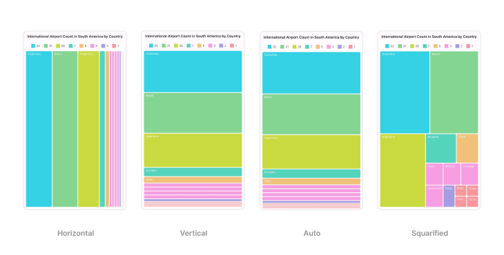
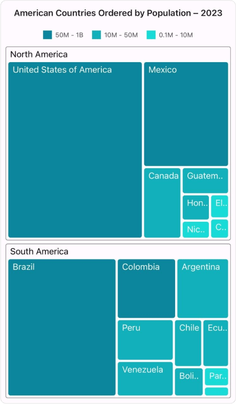
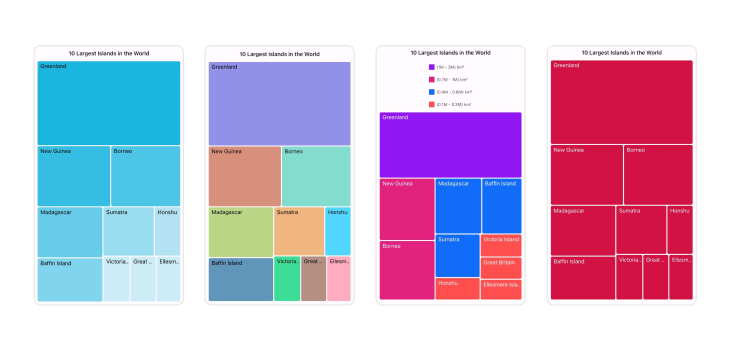
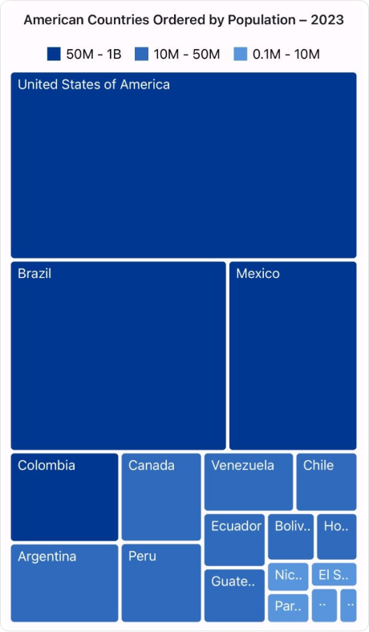
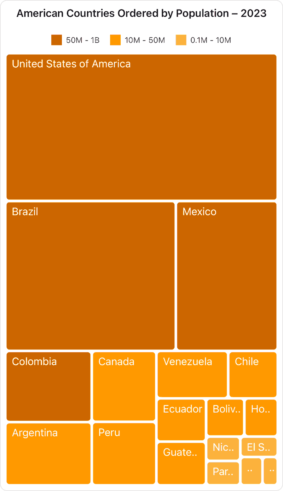
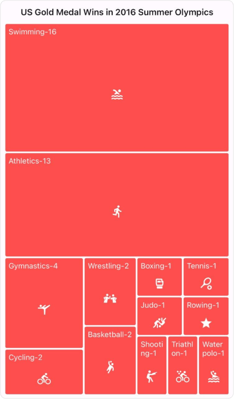

 
# Overview of .NET MAUI TreeMap (SfTreeMap)

The Syncfusion&reg; [.NET MAUI TreeMap](https://www.syncfusion.com/maui-controls/maui-tree-map) control allows you to visually represent hierarchical data with rectangles that are sized and colored based on underlying values. It efficiently displays grouped and nested data structures, offering various layout options, extensive customization options, supporting item selection, data binding to different sources, and more.

 

## Key features 
 
 * **Data Binding**: Seamlessly bind the TreeMap control to hierarchical data structures.
 * **Layout**: Offers various layout options such as SliceAndDiceHorizontal, SliceAndDiceVertical, SliceAndDiceAuto, and the Squarified.

 

 * **Levels**: Offers multi-level support for hierarchical collection data.

 

 * **Brush Settings**: Utilize brush settings within the TreeMap to customize fill colors for leaf items based on ranges or values.

 * **Legend**: Enhance TreeMap interpretation with the legend feature, incorporating various colors, shapes, and more. 

 * **Tooltip**: Interactive tooltip support provides additional details about the tree map items.

 * **Interaction**: The TreeMap control allows you to select or highlight the specific tree map items.
 * **Accessibility support**:  Ensure inclusivity with built-in accessibility support for the TreeMap control, enabling seamless interaction for all users.
 * **Keyboard support**: Navigate between TreeMap items using implemented keyboard support.
 * **Customization**: Customize the tree map appearances.

 