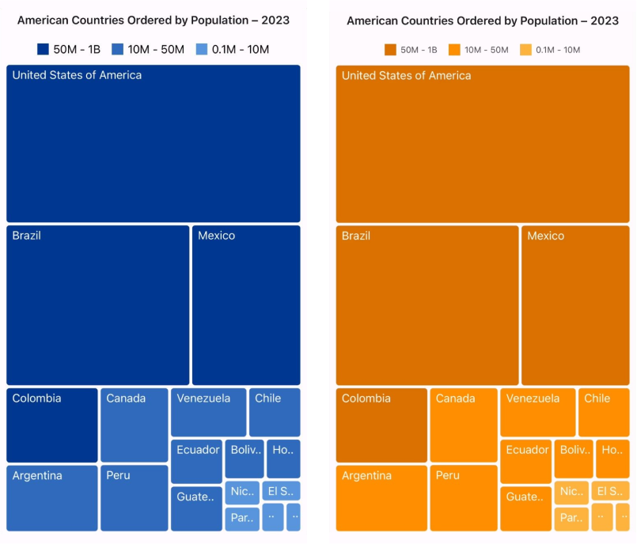
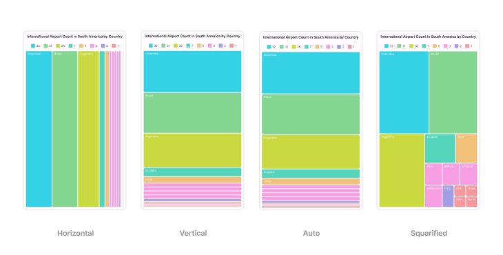
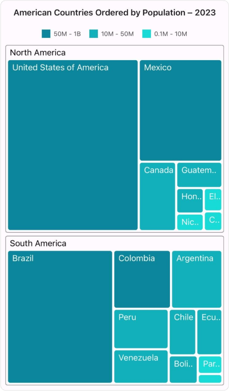
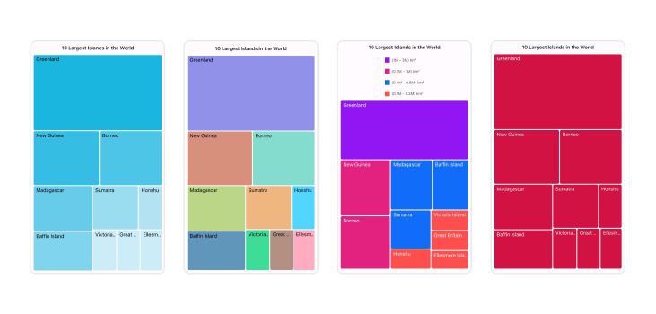
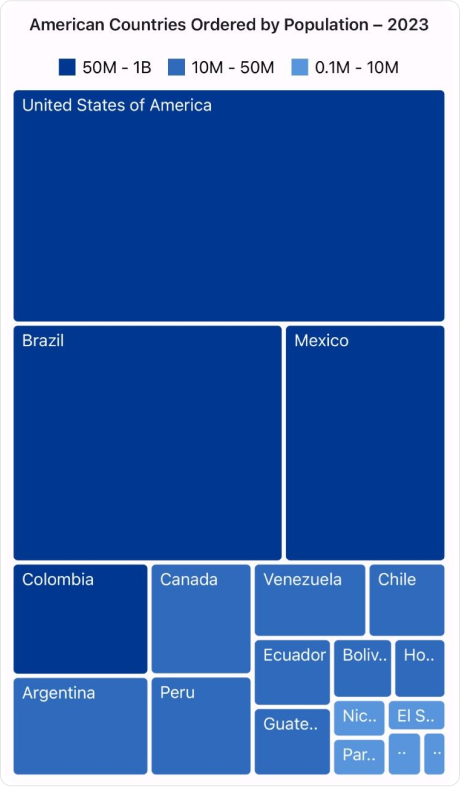
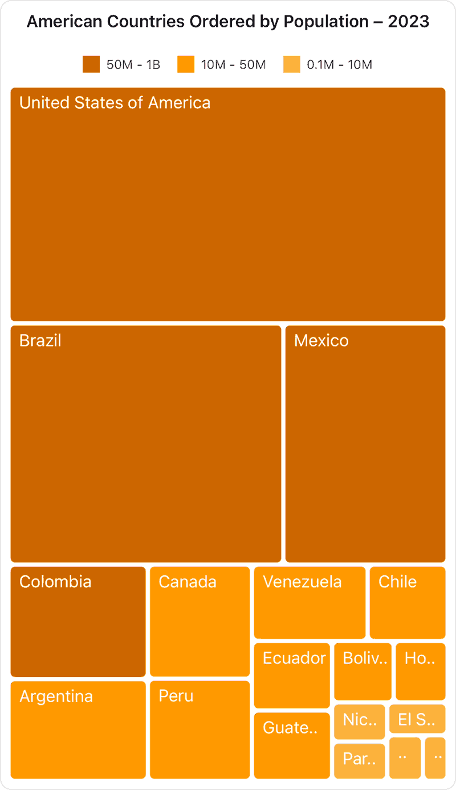
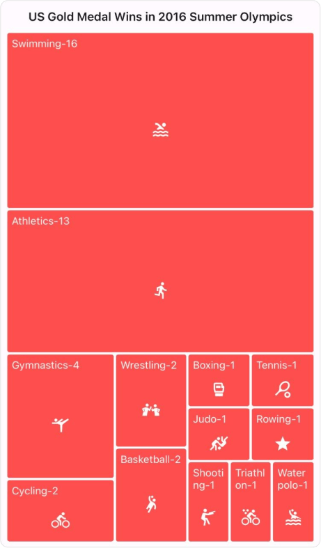

 
# Overview of .NET MAUI TreeMap (SfTreeMap)

The Syncfusion&reg; [.NET MAUI TreeMap](https://www.syncfusion.com/maui-controls/maui-tree-map) control allows you to visually represent hierarchical data with rectangles that are sized and colored based on underlying values. It efficiently displays grouped and nested data structures, offering various layout options, extensive customization options, supporting item selection, data binding to different sources, and more.

 

## Business use cases

- Business intelligence applications that require **visualizing hierarchical data such as categories, subcategories, and performance metrics**.  
- Financial dashboards that display **portfolio distribution, revenue contribution, or market segmentation**.  
- Analytics applications that require **comparing proportional values across grouped datasets**.  
- Data-driven applications that need **efficient visualization of large hierarchical datasets in a compact layout**.  
  
## Key features 
 
- **Data Binding** allows binding structured data with multiple levels and categories.
- **Layout** allows choosing between layouts such as slice and dice or squarified for optimal visualization. 

    

- **Levels** allows representing nested data structures with clear parent-child relationships. 

    

- **Brush Settings** allows applying colors based on value ranges or categories for better interpretation.

    

- **Legend** allows providing visual guidance for understanding color and data mapping. 

    

- **Tooltip** allows displaying additional information on interaction with tree map items.

    

- **Interaction** allows selecting and highlighting items for focused analysis.  
- **Accessibility and keyboard** allows improving usability with keyboard navigation and inclusive design.  
- **Appearance customization** allows modifying styles, layouts, and visual properties to match application requirements.

    

## Globalization

The following table summarizes the globalization support available in the [SfTreeMap](https://www.syncfusion.com/maui-controls/maui-tree-map) control.

 Full Support  
 Partial Support   
 No Support  

<table>
<tr>
<th align="center">Control</th>
<th align="center">Localization</th>
<th align="center">RTL</th>
<th align="center">Time zone</th>
<th align="center">Screen reader</th>
<th align="center">Keyboard navigation</th>
</tr>
<tr>
<td><a href="/maui/treemap/overview">TreeMap</a></td>
<td align="center"></td>
<td align="center"></td>
<td align="center"></td>
<td align="center"></td>
<td align="center"></td>
</tr> 
</table>

## Related controls

- **[Sunburst Chart](https://help.syncfusion.com/maui/sunburstchart/overview)** for visualizing hierarchical data using a radial layout.
- **[Cartesian Chart](https://help.syncfusion.com/maui/cartesian-charts/overview)** for analyzing data trends using axis-based charts.
- **[Maps](https://help.syncfusion.com/maui/maps/overview)** for visualizing location-based hierarchical data.  

## Next steps

Explore further resources:

- [Getting Started](https://help.syncfusion.com/maui/treemap/getting-started) - step-by-step guide to begin using the TreeMap control.
- [Layouts](https://help.syncfusion.com/maui/treemap/layouts) - configure layout types and data arrangement.  
- [Drilldown](https://help.syncfusion.com/maui/treemap/drilldown) - Drilldown – dive into details by exploring data hierarchies step by step. 
- [UI Kit](https://www.syncfusion.com/demos/maui#maui-ui-control) - explore interactive demos and ready‑made UI examples.

## Learnings

<!-- Card 1 -->
<a href="https://www.syncfusion.com/blogs/category/net-maui" class="form-card" target="_blank">
  

    <h3 class="form-title">Explore Blogs</h3>
    

      Read insights, tutorials, and developer journeys.
    

  

</a>
<!-- Card 2 -->
<a href="https://support.syncfusion.com/kb/cross-platforms/category/76" class="form-card" target="_blank">
  

    <h3 class="form-title">Explore KB's</h3>
    

      Find quick solutions and step‑by‑step guidance.
    

  

</a>
<!-- Card 3 -->
<a href="https://www.syncfusion.com/maui-controls/maui-tree-map" class="form-card" target="_blank">
  

    <h3 class="form-title">Feature Tour</h3>
    

      Walk through highlights and core capabilities.
    

  

</a>
<!-- Card 4 -->
<a href="https://github.com/syncfusion/maui-demos/tree/master/MAUI/TreeMap" class="form-card" target="_blank">
  

    <h3 class="form-title">Showcase Samples</h3>
    

      Explore sample scenarios for real apps.
    

  

</a>
<!-- Card 5 -->
<a href="https://www.syncfusion.com/tutorial-videos/maui/treemap" class="form-card" target="_blank">
  

    <h3 class="form-title">Tutorial Videos</h3>
    

      Step‑by‑step guidance through video tutorials.
    

  

</a>
