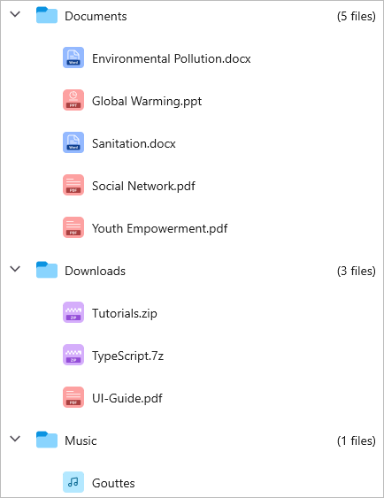
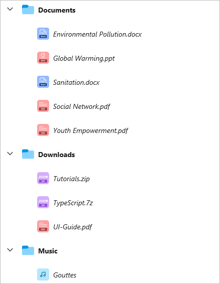

# Appearance in .NET MAUI TreeView (SfTreeView)

The `SfTreeView` allows customizing the appearance of the underlying data and provides different functionalities to the end user.

## ItemTemplate
 
A template can be used to present the data in a way that makes sense for the application by using different controls.

The TreeView allows you to customize the appearance of the content view and expander view by setting the `ItemTemplate` and `ExpanderTemplate` properties.



<?xml version="1.0" encoding="utf-8" ?>
<ContentPage xmlns="http://schemas.microsoft.com/dotnet/2021/maui"
             xmlns:x="http://schemas.microsoft.com/winfx/2009/xaml"
             xmlns:syncfusion="clr-namespace:Syncfusion.Maui.TreeView;assembly=Syncfusion.Maui.TreeView"
             xmlns:local="clr-namespace:GettingStarted;assembly=GettingStarted"
             x:Class="GettingStarted.MainPage">
    <ContentPage.BindingContext>
       <local:FileManagerViewModel x:Name="viewModel"></local:FileManagerViewModel>
    </ContentPage.BindingContext>
    <ContentPage.Content>
       <syncfusion:SfTreeView x:Name="treeView"
                              ChildPropertyName="SubFiles"
                              ItemsSource="{Binding ImageNodeInfo}"/>
             <syncfusion:SfTreeView.ItemTemplate>
                <DataTemplate>
                    <Grid Padding="5,0,0,0">
                        <Label Text="{Binding ItemName}" 
                               VerticalTextAlignment="Center"/>
                   </Grid>
                </DataTemplate>
            </syncfusion:SfTreeView.ItemTemplate>
       </syncfusion:SfTreeView>
    </ContentPage.Content>
</ContentPage>


using Syncfusion.Maui.TreeView;

namespace GettingStarted
{
    public class MainPage : ContentPage
    {
        SfTreeView treeView;
        public MainPage()
        {
            InitializeComponent();
            treeView = new SfTreeView();
            FileManagerViewModel viewModel = new FileManagerViewModel();
            treeView.ChildPropertyName = "SubFiles";
            treeView.ItemsSource = viewModel.ImageNodeInfo; 
            treeView.ItemTemplate = new DataTemplate(() => {
                var grid = new Grid ();
                var itemName = new Label;
                itemName.SetBinding(Label.TextProperty, new Binding("ItemName"));
                grid.Children.Add(itemName);
                return grid;
            });
            this.Content = treeView;
        }
    }
}




## BindingContext for ItemTemplate

By default, the binding context of the tree view item will be the data model object for Bound Mode and `TreeViewNode` for Unbound Mode.

For Bound Mode, you can change the binding context of the treeview items using the `ItemTemplateContextType` property.



<?xml version="1.0" encoding="utf-8" ?>
<ContentPage xmlns="http://schemas.microsoft.com/dotnet/2021/maui"
             xmlns:x="http://schemas.microsoft.com/winfx/2009/xaml"
             xmlns:syncfusion="clr-namespace:Syncfusion.Maui.TreeView;assembly=Syncfusion.Maui.TreeView"
             xmlns:local="clr-namespace:GettingStarted;assembly=GettingStarted"
             x:Class="GettingStarted.MainPage">
    <ContentPage.BindingContext>
       <local:FileManagerViewModel x:Name="viewModel"></local:FileManagerViewModel>
    </ContentPage.BindingContext>
    <ContentPage.Content>
       <syncfusion:SfTreeView x:Name="treeView"
                              ItemTemplateContextType="Node"
                              ChildPropertyName="SubFiles"
                              ItemsSource="{Binding ImageNodeInfo}"/>
             <syncfusion:SfTreeView.ItemTemplate>
                <DataTemplate>
                    <Grid Padding="5,0,0,0">
                        <Label Text="{Binding Content.ItemName}" 
                               VerticalTextAlignment="Center"/>
                   </Grid>
                </DataTemplate>
            </syncfusion:SfTreeView.ItemTemplate>
       </syncfusion:SfTreeView>
    </ContentPage.Content>
</ContentPage>


using Syncfusion.Maui.TreeView;

namespace GettingStarted
{
    public class MainPage : ContentPage
    {
        SfTreeView treeView;
        public MainPage()
        {
            InitializeComponent();
            treeView = new SfTreeView();
            FileManagerViewModel viewModel = new FileManagerViewModel());
            treeView.ChildPropertyName = "SubFiles";
            treeView.ItemTemplateContextType = ItemTemplateContextType.Node;
            treeView.ItemsSource = viewModel.ImageNodeInfo; 
            treeView.ItemTemplate = new DataTemplate(() => {
                var grid = new Grid ();
                var itemName = new Label;
                itemName.SetBinding(Label.TextProperty, new Binding("Content.ItemName"));
                grid.Children.Add(itemName);
                return grid;
            });
            this.Content = treeView;
        }
    }
}



Similarly, you can customize the expander view using the `ExpanderTemplate` property, as shown in the example above.

## ItemTemplate Selector

The TreeView allows you to customize the appearance of each item with different templates based on specific constraints using the `DataTemplateSelector`. You can choose a `DataTemplate` for each item at runtime based on the value of the data-bound property using the `DataTemplateSelector`.

### Create a data template selector

Create a custom class that inherits from the `DataTemplateSelector`, and overrides the `OnSelectTemplate` method to return the `DataTemplate` for that item. At runtime, the TreeView invokes the `OnSelectTemplate` method for each item and passes the data object as parameter.

Create different templates and load them using `DataTemplateSelector` in the `OnSelectTemplate` based on the requirements.



public class ItemTemplateSelector : DataTemplateSelector
{
    public DataTemplate Template1 { get; set; }
    public DataTemplate Template2 { get; set; }
    public ItemTemplateSelector()
    {
        this.Template1 = new DataTemplate(typeof(Template1));
        this.Template2 = new DataTemplate(typeof(Template2));
    }
    protected override DataTemplate OnSelectTemplate(object item, BindableObject container)
    {
        var treeviewNode = item as TreeViewNode;
        if (treeviewNode == null)
            return null;

        if (treeviewNode.Level == 0)
            return Template1;
        else
            return Template2;
    }
}



### Applying a data template selector

Assign a custom `DataTemplateSelector` to the ItemTemplate, either in XAML or C#.

The following code example illustrates how to load different templates for treeview items using the `DataTemplateSelector` based on different levels.



<ContentPage  xmlns="http://schemas.microsoft.com/dotnet/2021/maui"
             xmlns:x="http://schemas.microsoft.com/winfx/2009/xaml"
             xmlns:syncfusion="clr-namespace:Syncfusion.Maui.TreeView;assembly=Syncfusion.Maui.TreeView"
             xmlns:local="clr-namespace:GettingStarted;assembly=GettingStarted"
             x:Class="GettingStarted.MainPage">
  <ContentPage.Resources>
    <ResourceDictionary>
      <local:ItemTemplateSelector x:Key="ItemTemplateSelector" />
    </ResourceDictionary>
  </ContentPage.Resources>
     <ContentPage.Content>
        <syncfusion:SfTreeView x:Name="treeView" 
                               ItemTemplate="{StaticResource ItemTemplateSelector}"/>
    </ContentPage.Content>
</ContentPage>


SfTreeView treeView = new SfTreeView();
treeView.ItemTemplate = new ItemTemplateSelector();



Download the entire source code from GitHub [here](https://github.com/SyncfusionExamples/data-template-selector-demo-in-.net-maui-treeview).

Similarly, you can provide a `DataTemplateSelector` for the `ExpanderTemplate` property.

## Indentation

The TreeView allows for customization of the indent spacing of items by setting the `Indentation` property. The default value of this property is `30d`, but it can be customized at runtime.



<syncfusion:SfTreeView x:Name="treeView" Indentation="40">


SfTreeView treeView = new SfTreeView();
treeView.Indentation = 40;



## ExpanderWidth

The TreeView allows customization of the width of the expander view by setting the `ExpanderWidth` property. The default value of this property is `32d`. This property can be customized at runtime.



<syncfusion:SfTreeView x:Name="treeView" ExpanderWidth="40">


SfTreeView treeView = new SfTreeView();
treeView.ExpanderWidth = 40;



## ExpanderPosition

The TreeView allows you to change the position of the expander view by setting the `ExpanderPosition` property. The default value of this property is `Start`.This property has the following two positions:

* `Start`: Allows displaying the expander view at the start position.
* `End`: Allows displaying the expander view at the end position.



<syncfusion:SfTreeView x:Name="treeView" ExpanderPosition="End">


SfTreeView treeView = new SfTreeView();
treeView.ExpanderPosition = TreeViewExpanderPosition.End;



## Level based styling

The TreeView allows you to customize the style of the `TreeViewItem` based on different levels by using the `IValueConverter`.



<ContentPage  xmlns="http://schemas.microsoft.com/dotnet/2021/maui"
             xmlns:x="http://schemas.microsoft.com/winfx/2009/xaml"
             xmlns:syncfusion="clr-namespace:Syncfusion.Maui.TreeView;assembly=Syncfusion.Maui.TreeView"
             xmlns:local="clr-namespace:GettingStarted;assembly=GettingStarted"
             x:Class="GettingStarted.MainPage">
<ContentPage.Resources>
    <ResourceDictionary>
        <local:FontAttributeConverter x:Key="FontAttributeConverter"/>
    </ResourceDictionary>
</ContentPage.Resources>
<ContentPage.Content>
    <syncfusion:SfTreeView x:Name="treeView"
                           ChildPropertyName="SubFolder"
                           AutoExpandMode="AllNodesExpanded"
                           ItemTemplateContextType="Node"
                           ItemsSource="{Binding Folders}">
        <syncfusion:SfTreeView.ItemTemplate>
            <DataTemplate>
                        <Label LineBreakMode="NoWrap"
                               Text="{Binding Content.FolderName}"
                               FontSize="Medium"
                               FontAttributes="{Binding Level,Converter={x:StaticResource FontAttributeConverter}}"/>
            </DataTemplate>
        </syncfusion:SfTreeView.ItemTemplate>
    </syncfusion:SfTreeView>
</ContentPage.Content>
</ContentPage>





public class FontAttributeConverter : IValueConverter
{
    public object Convert(object value, Type targetType, object parameter, CultureInfo culture)
    {
        var level = (int)value;
        return level == 0 ? FontAttributes.Bold : FontAttributes.Italic;
    }

    public object ConvertBack(object value, Type targetType, object parameter, CultureInfo culture)
    {
        throw new NotImplementedException();
    }
}



Download the entire source code from GitHub [here](https://github.com/SyncfusionExamples/node-level-based-styling-in-.net.maui-treeview).

