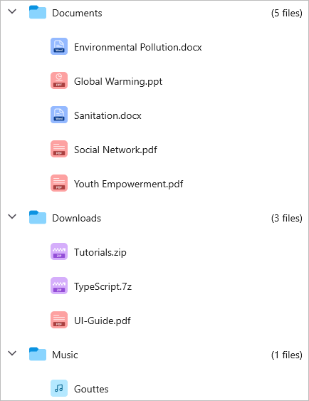
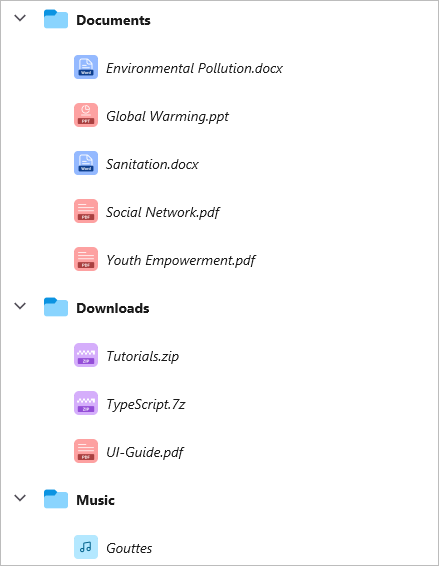
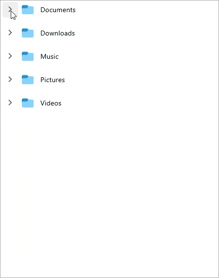

# Appearance in .NET MAUI TreeView (SfTreeView)

The `SfTreeView` allows customizing the appearance of the underlying data and provides different functionalities to the end user.

## ItemTemplate

A template can be used to present the data using controls that make sense for the application.

The `SfTreeView` allows you to customize the appearance of the content view and expander view by setting the [ItemTemplate](https://help.syncfusion.com/cr/maui/Syncfusion.Maui.TreeView.SfTreeView.html#Syncfusion_Maui_TreeView_SfTreeView_ItemTemplate) and [ExpanderTemplate](https://help.syncfusion.com/cr/maui/Syncfusion.Maui.TreeView.SfTreeView.html#Syncfusion_Maui_TreeView_SfTreeView_ExpanderTemplate) properties.



<?xml version="1.0" encoding="utf-8" ?>
<ContentPage xmlns="http://schemas.microsoft.com/dotnet/2021/maui"
             xmlns:x="http://schemas.microsoft.com/winfx/2009/xaml"
             xmlns:syncfusion="clr-namespace:Syncfusion.Maui.TreeView;assembly=Syncfusion.Maui.TreeView"
             xmlns:local="clr-namespace:GettingStarted;assembly=GettingStarted"
             x:Class="GettingStarted.MainPage">
    <ContentPage.BindingContext>
       <local:FileManagerViewModel x:Name="viewModel"></local:FileManagerViewModel>
    </ContentPage.BindingContext>
    <ContentPage.Content>
       <syncfusion:SfTreeView x:Name="treeView"
                              ChildPropertyName="SubFiles"
                              ItemsSource="{Binding ImageNodeInfo}">
             <syncfusion:SfTreeView.ItemTemplate>
                <DataTemplate>
                    <Grid Padding="5,0,0,0">
                        <Label Text="{Binding ItemName}" 
                               VerticalTextAlignment="Center"/>
                   </Grid>
                </DataTemplate>
            </syncfusion:SfTreeView.ItemTemplate>
       </syncfusion:SfTreeView>
    </ContentPage.Content>
</ContentPage>


using Syncfusion.Maui.TreeView;
using Microsoft.Maui.Controls;
using Microsoft.Maui;

namespace GettingStarted
{
    public class MainPage : ContentPage
    {
        SfTreeView treeView;
        public MainPage()
        {
            InitializeComponent();
            treeView = new SfTreeView();
            FileManagerViewModel viewModel = new FileManagerViewModel();
            treeView.ChildPropertyName = "SubFiles";
            treeView.ItemsSource = viewModel.ImageNodeInfo; 
            treeView.ItemTemplate = new DataTemplate(() => {
                var grid = new Grid ();
                var itemName = new Label();
                itemName.SetBinding(Label.TextProperty, new Binding("ItemName"));
                grid.Children.Add(itemName);
                return grid;
            });
            this.Content = treeView;
        }
    }
}



## BindingContext for ItemTemplate

By default, the binding context of the treeview item is the data model object for Bound Mode and the [TreeViewNode](https://help.syncfusion.com/cr/maui/Syncfusion.TreeView.Engine.TreeViewNode.html) for Unbound Mode.

For Bound Mode, you can change the binding context of the treeview items using the [ItemTemplateContextType](https://help.syncfusion.com/cr/maui/Syncfusion.Maui.TreeView.SfTreeView.html#Syncfusion_Maui_TreeView_SfTreeView_ItemTemplateContextType) property. This property has the following two values:

* `Item`: The binding context of the treeview item will be the data model object (default).
* `Node`: The binding context of the treeview item will be the `TreeViewNode`, allowing access to node-level properties such as `Level` and `Content`.



<?xml version="1.0" encoding="utf-8" ?>
<ContentPage xmlns="http://schemas.microsoft.com/dotnet/2021/maui"
             xmlns:x="http://schemas.microsoft.com/winfx/2009/xaml"
             xmlns:syncfusion="clr-namespace:Syncfusion.Maui.TreeView;assembly=Syncfusion.Maui.TreeView"
             xmlns:local="clr-namespace:GettingStarted;assembly=GettingStarted"
             x:Class="GettingStarted.MainPage">
    <ContentPage.BindingContext>
       <local:FileManagerViewModel x:Name="viewModel"></local:FileManagerViewModel>
    </ContentPage.BindingContext>
    <ContentPage.Content>
       <syncfusion:SfTreeView x:Name="treeView"
                              ItemTemplateContextType="Node"
                              ChildPropertyName="SubFiles"
                              ItemsSource="{Binding ImageNodeInfo}">
             <syncfusion:SfTreeView.ItemTemplate>
                <DataTemplate>
                    <Grid Padding="5,0,0,0">
                        <Label Text="{Binding Content.ItemName}" 
                               VerticalTextAlignment="Center"/>
                   </Grid>
                </DataTemplate>
            </syncfusion:SfTreeView.ItemTemplate>
       </syncfusion:SfTreeView>
    </ContentPage.Content>
</ContentPage>


using Syncfusion.Maui.TreeView;
using Microsoft.Maui.Controls;
using Microsoft.Maui;

namespace GettingStarted
{
    public class MainPage : ContentPage
    {
        SfTreeView treeView;
        public MainPage()
        {
            InitializeComponent();
            treeView = new SfTreeView();
            FileManagerViewModel viewModel = new FileManagerViewModel();
            treeView.ChildPropertyName = "SubFiles";
            treeView.ItemTemplateContextType = ItemTemplateContextType.Node;
            treeView.ItemsSource = viewModel.ImageNodeInfo; 
            treeView.ItemTemplate = new DataTemplate(() => {
                var grid = new Grid ();
                var itemName = new Label();
                itemName.SetBinding(Label.TextProperty, new Binding("Content.ItemName"));
                grid.Children.Add(itemName);
                return grid;
            });
            this.Content = treeView;
        }
    }
}



Similarly, you can customize the expander view using the [ExpanderTemplate](https://help.syncfusion.com/cr/maui/Syncfusion.Maui.TreeView.SfTreeView.html#Syncfusion_Maui_TreeView_SfTreeView_ExpanderTemplate) property. The binding context of the `ExpanderTemplate` is the `TreeViewNode`, which exposes properties such as `IsExpanded` and `ChildNodes` that can be used to drive the expander appearance.



<syncfusion:SfTreeView x:Name="treeView"
                      ChildPropertyName="SubFiles"
                      ItemsSource="{Binding ImageNodeInfo}">
    <syncfusion:SfTreeView.ExpanderTemplate>
        <DataTemplate>
            <Grid>
                <Image Source="{OnPlatform Android='arrow_android.png',
                                          WinUI='arrow_winui.png',
                                          iOS='arrow_ios.png',
                                          MacCatalyst='arrow_mac.png'}"
                       HorizontalOptions="Center"
                       VerticalOptions="Center"/>
            </Grid>
        </DataTemplate>
    </syncfusion:SfTreeView.ExpanderTemplate>
</syncfusion:SfTreeView>


using Syncfusion.Maui.TreeView;

public class MainPage : ContentPage
{
    public MainPage()
    {
        InitializeComponent();

        SfTreeView treeView = new SfTreeView();
        treeView.ExpanderTemplate = new DataTemplate(() =>
        {
            var grid = new Grid();
            var expanderIcon = new Image
            {
                Source = "expand_arrow.png",
                HorizontalOptions = LayoutOptions.Center,
                VerticalOptions = LayoutOptions.Center
            };
            // Swap the icon based on the expanded state of the node.
            expanderIcon.SetBinding(Image.SourceProperty,
                new Binding("IsExpanded", converter: new ExpanderIconConverter()));
            grid.Children.Add(expanderIcon);
            return grid;
        });
    }
}



## ItemTemplate selector

The `SfTreeView` allows you to customize the appearance of each item with different templates based on specific constraints using the [DataTemplateSelector](https://learn.microsoft.com/en-us/dotnet/api/microsoft.maui.controls.datatemplateselector?view=net-maui-7.0). You can choose a [DataTemplate](https://learn.microsoft.com/en-us/dotnet/maui/fundamentals/datatemplate) for each item at runtime based on the value of a data-bound property.

### Create a data template selector

Create a custom class that inherits from `DataTemplateSelector` and overrides the `OnSelectTemplate` method to return the `DataTemplate` for that item. At runtime, the `SfTreeView` invokes the [OnSelectTemplate](https://learn.microsoft.com/en-us/dotnet/api/microsoft.maui.controls.datatemplateselector.onselecttemplate?view=net-maui-7.0) method for each item and passes the data object as the parameter.

Define different templates and select them inside `OnSelectTemplate` based on your requirements.



using Syncfusion.Maui.TreeView;
using Microsoft.Maui.Controls;

public class ItemTemplateSelector : DataTemplateSelector
{
    public DataTemplate Template1 { get; set; }
    public DataTemplate Template2 { get; set; }
    public ItemTemplateSelector()
    {
        this.Template1 = new DataTemplate(typeof(Template1));
        this.Template2 = new DataTemplate(typeof(Template2));
    }
    protected override DataTemplate OnSelectTemplate(object item, BindableObject container)
    {
        var treeviewNode = item as TreeViewNode;
        if (treeviewNode == null)
            return null;

        if (treeviewNode.Level == 0)
            return Template1;
        else
            return Template2;
    }
}



### Applying a data template selector

Assign a custom [DataTemplateSelector](https://learn.microsoft.com/en-us/dotnet/api/microsoft.maui.controls.datatemplateselector?view=net-maui-7.0) to the [ItemTemplate](https://help.syncfusion.com/cr/maui/Syncfusion.Maui.TreeView.SfTreeView.html#Syncfusion_Maui_TreeView_SfTreeView_ItemTemplate) property, either in XAML or C#.

The following code example illustrates how to load different templates for treeview items using the `DataTemplateSelector` based on different levels.

N> When the `DataTemplateSelector` accesses node-level properties such as `Level`, set `ItemTemplateContextType="Node"` so the binding context passed to the selector is a `TreeViewNode`.



<ContentPage  xmlns="http://schemas.microsoft.com/dotnet/2021/maui"
             xmlns:x="http://schemas.microsoft.com/winfx/2009/xaml"
             xmlns:syncfusion="clr-namespace:Syncfusion.Maui.TreeView;assembly=Syncfusion.Maui.TreeView"
             xmlns:local="clr-namespace:GettingStarted;assembly=GettingStarted"
             x:Class="GettingStarted.MainPage">
  <ContentPage.Resources>
    <ResourceDictionary>
      <local:ItemTemplateSelector x:Key="ItemTemplateSelector" />
    </ResourceDictionary>
  </ContentPage.Resources>
     <ContentPage.Content>
        <syncfusion:SfTreeView x:Name="treeView" 
                               ItemTemplateContextType="Node"
                               ItemTemplate="{StaticResource ItemTemplateSelector}"/>
    </ContentPage.Content>
</ContentPage>


using Syncfusion.Maui.TreeView;

public class MainPage : ContentPage
{
    public MainPage()
    {
        InitializeComponent();

        SfTreeView treeView = new SfTreeView();
        treeView.ItemTemplateContextType = ItemTemplateContextType.Node;
        treeView.ItemTemplate = new ItemTemplateSelector();
    }
}



Download the entire source code from GitHub [here](https://github.com/SyncfusionExamples/data-template-selector-demo-in-.net-maui-treeview).

Similarly, you can assign a `DataTemplateSelector` to the [ExpanderTemplate](https://help.syncfusion.com/cr/maui/Syncfusion.Maui.TreeView.SfTreeView.html#Syncfusion_Maui_TreeView_SfTreeView_ExpanderTemplate) property to apply different expander templates per item.

## Layout properties

The `SfTreeView` exposes properties to control the indentation and the size and placement of the expander view.

### Indentation

The `SfTreeView` allows you to customize the indent spacing of items by setting the [Indentation](https://help.syncfusion.com/cr/maui/Syncfusion.Maui.TreeView.SfTreeView.html#Syncfusion_Maui_TreeView_SfTreeView_Indentation) property. The default value of this property is `30d`, and it can be customized at runtime.



<syncfusion:SfTreeView x:Name="treeView" Indentation="40">


using Syncfusion.Maui.TreeView;

public class MainPage : ContentPage
{
    public MainPage()
    {
        InitializeComponent();

        SfTreeView treeView = new SfTreeView();
        treeView.Indentation = 40;
    }
}



### ExpanderWidth

The `SfTreeView` allows you to customize the width of the expander view by setting the [ExpanderWidth](https://help.syncfusion.com/cr/maui/Syncfusion.Maui.TreeView.SfTreeView.html#Syncfusion_Maui_TreeView_SfTreeView_ExpanderWidth) property. The default value of this property is `32d`, and it can be customized at runtime.



<syncfusion:SfTreeView x:Name="treeView" ExpanderWidth="40">


using Syncfusion.Maui.TreeView;

public class MainPage : ContentPage
{
    public MainPage()
    {
        InitializeComponent();

        SfTreeView treeView = new SfTreeView();
        treeView.ExpanderWidth = 40;
    }
}



### ExpanderPosition

The `SfTreeView` allows you to change the position of the expander view by setting the [ExpanderPosition](https://help.syncfusion.com/cr/maui/Syncfusion.Maui.TreeView.SfTreeView.html#Syncfusion_Maui_TreeView_SfTreeView_ExpanderPosition) property. The default value of this property is `Start`. This property has the following two positions:

* `Start`: Displays the expander view at the start position (before the item content). This is the default.
* `End`: Displays the expander view at the end position (after the item content).



<syncfusion:SfTreeView x:Name="treeView" ExpanderPosition="End">


using Syncfusion.Maui.TreeView;

public class MainPage : ContentPage
{
    public MainPage()
    {
        InitializeComponent();

        SfTreeView treeView = new SfTreeView();
        treeView.ExpanderPosition = TreeViewExpanderPosition.End;
    }
}



## Level based styling

The `SfTreeView` allows you to customize the style of the `TreeViewItem` based on different levels by using the [IValueConverter](https://learn.microsoft.com/en-us/dotnet/api/microsoft.maui.controls.ivalueconverter?view=net-maui-7.0).



<ContentPage  xmlns="http://schemas.microsoft.com/dotnet/2021/maui"
             xmlns:x="http://schemas.microsoft.com/winfx/2009/xaml"
             xmlns:syncfusion="clr-namespace:Syncfusion.Maui.TreeView;assembly=Syncfusion.Maui.TreeView"
             xmlns:local="clr-namespace:GettingStarted;assembly=GettingStarted"
             x:Class="GettingStarted.MainPage">
<ContentPage.Resources>
    <ResourceDictionary>
        <local:FontAttributeConverter x:Key="FontAttributeConverter"/>
    </ResourceDictionary>
</ContentPage.Resources>
<ContentPage.Content>
    <syncfusion:SfTreeView x:Name="treeView"
                           ChildPropertyName="SubFolder"
                           AutoExpandMode="AllNodesExpanded"
                           ItemTemplateContextType="Node"
                           ItemsSource="{Binding Folders}">
        <syncfusion:SfTreeView.ItemTemplate>
            <DataTemplate>
                        <Label LineBreakMode="NoWrap"
                               Text="{Binding Content.FolderName}"
                               FontSize="Medium"
                               FontAttributes="{Binding Level,Converter={StaticResource FontAttributeConverter}}"/>
            </DataTemplate>
        </syncfusion:SfTreeView.ItemTemplate>
    </syncfusion:SfTreeView>
</ContentPage.Content>
</ContentPage>


using System;
using System.Globalization;
using Microsoft.Maui.Controls;

public class FontAttributeConverter : IValueConverter
{
    public object Convert(object value, Type targetType, object parameter, CultureInfo culture)
    {
        if (value is int level)
        {
            return level == 0 ? FontAttributes.Bold : FontAttributes.Italic;
        }

        return FontAttributes.None;
    }

    public object ConvertBack(object value, Type targetType, object parameter, CultureInfo culture)
    {
        throw new NotImplementedException();
    }
}



Download the entire source code from GitHub [here](https://github.com/SyncfusionExamples/node-level-based-styling-in-.net.maui-treeview).

## Animation

The `SfTreeView` supports animation when expanding or collapsing the [TreeViewNode](https://help.syncfusion.com/cr/maui/Syncfusion.TreeView.Engine.TreeViewNode.html). To enable or disable the animation, use the [IsAnimationEnabled](https://help.syncfusion.com/cr/maui/Syncfusion.Maui.TreeView.SfTreeView.html#Syncfusion_Maui_TreeView_SfTreeView_IsAnimationEnabled) property of `SfTreeView`.
 
N> The default value of the `IsAnimationEnabled` property is `false`.



<syncfusion:SfTreeView x:Name="treeView" 
                       IsAnimationEnabled="true">


using Syncfusion.Maui.TreeView;

public class MainPage : ContentPage
{
    public MainPage()
    {
        InitializeComponent();

        SfTreeView treeView = new SfTreeView();
        treeView.IsAnimationEnabled = true;
    }
}



When `IsAnimationEnabled` is `true`, the expand and collapse operations animate the height of the child items over a fixed duration defined by the control. The animation is applied only to the visual transition; it does not affect the underlying data or node state.

## How to

### Disable the ripple effect on item click

To disable the ripple effect when clicking a `TreeViewItem`, set the color value `Transparent` for the built-in theme key `SfTreeViewRippleBackground` within a `SyncfusionThemeDictionary`.



<ContentPage xmlns="http://schemas.microsoft.com/dotnet/2021/maui"
                xmlns:x="http://schemas.microsoft.com/winfx/2009/xaml"
                xmlns:syncfusion="clr-namespace:Syncfusion.Maui.TreeView;assembly=Syncfusion.Maui.TreeView"
                xmlns:syncTheme="clr-namespace:Syncfusion.Maui.Themes;assembly=Syncfusion.Maui.Core"
                x:Class="GettingStarted.MainPage">
	<ContentPage.Resources>
        <syncTheme:SyncfusionThemeDictionary>
            <syncTheme:SyncfusionThemeDictionary.MergedDictionaries>
                <ResourceDictionary>
                   <Color x:Key="SfTreeViewRippleBackground">Transparent</Color>
                </ResourceDictionary>
            </syncTheme:SyncfusionThemeDictionary.MergedDictionaries>
        </syncTheme:SyncfusionThemeDictionary>
    </ContentPage.Resources>
    <ContentPage.Content>
        <syncfusion:SfTreeView x:Name="treeView"
                               ChildPropertyName="SubFiles"
                               ItemsSource="{Binding ImageNodeInfo}"/>
    </ContentPage.Content>
</ContentPage>				



