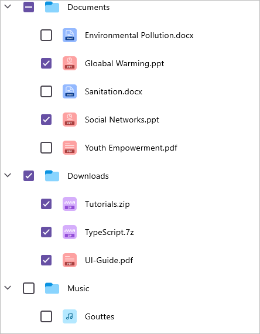
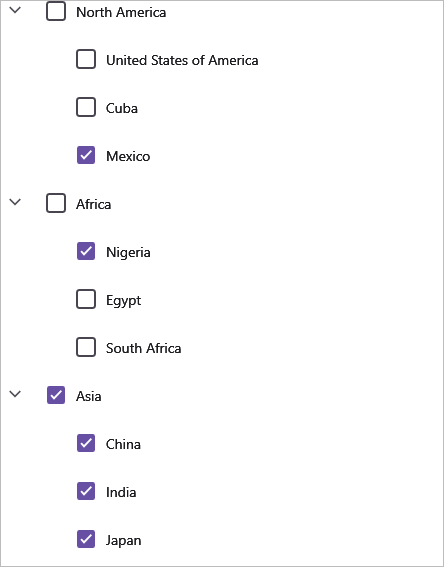

# Checkbox in .NET MAUI TreeView (SfTreeView)

The `SfTreeView` provides built-in checkbox support for each node, enabling users to check or uncheck the corresponding node.

The built-in checkbox tracks its state through the [TreeViewNode.IsChecked](https://help.syncfusion.com/cr/maui/Syncfusion.TreeView.Engine.TreeViewNode.html#Syncfusion_TreeView_Engine_TreeViewNode_IsChecked) property. When populating treeview nodes from [ItemsSource](https://help.syncfusion.com/cr/maui/Syncfusion.Maui.TreeView.SfTreeView.html#Syncfusion_Maui_TreeView_SfTreeView_ItemsSource), the checked items can be accessed or modified using the [CheckedItems](https://help.syncfusion.com/cr/maui/Syncfusion.Maui.TreeView.SfTreeView.html#Syncfusion_Maui_TreeView_SfTreeView_CheckedItems) property.

## CheckBox state

The `SfTreeView` handles the [IsChecked](https://help.syncfusion.com/cr/maui/Syncfusion.TreeView.Engine.TreeViewNode.html#Syncfusion_TreeView_Engine_TreeViewNode_IsChecked) property (checkbox state) of `TreeViewNode` based on the [CheckBoxMode](https://help.syncfusion.com/cr/maui/Syncfusion.Maui.TreeView.SfTreeView.html#Syncfusion_Maui_TreeView_SfTreeView_CheckBoxMode) property. The `CheckBoxMode` property determines the behavior of the parent and child node's checkbox states when users check or uncheck a node. Its default value is `None`. The checkbox mode contains the following three states:

* `None`: Checking and unchecking are only reflected in the view and do not impact the `CheckedItems` collection.
* `Individual`: The state of the checkbox only affects the individual node and does not alter the checkbox state or `IsChecked` property value of parent or child nodes.
* `Recursive`: When a node's checkbox is checked or unchecked, it influences the checkbox states of both parent and child nodes checkbox state. For instance, if a parent node's checkbox is checked or unchecked, all its child node's checkbox will follow suit. Similarly, if all child nodes within a parent node are either checked or unchecked, the parent node's checkbox will reflect this state accordingly. Additionally, if any of the child nodes are checked, the parent node's checkbox will enter an intermediate state.

N> Set the [NodePopulationMode](https://help.syncfusion.com/cr/maui/Syncfusion.Maui.TreeView.SfTreeView.html#Syncfusion_Maui_TreeView_SfTreeView_NodePopulationMode) as `Instant` and the [CheckBoxMode](https://help.syncfusion.com/cr/maui/Syncfusion.Maui.TreeView.SfTreeView.html#Syncfusion_Maui_TreeView_SfTreeView_CheckBoxMode) as `Recursive` to support recursive check programmatically through `CheckedItems`.



<syncfusion:SfTreeView x:Name="TreeView"
                        CheckBoxMode="Recursive"
                        ItemsSource="{Binding Folders}"
                        AutoExpandMode="AllNodesExpanded"
                        NodePopulationMode="Instant"/>


treeView.CheckBoxMode = CheckBoxMode.Recursive;



N> In recursive mode, the parent nodes checkbox state or `IsChecked` property value is updated only on UI interaction.

N> When the `CheckBoxMode` is enabled, the `ItemTapped` and `ItemDoubleTapped` events will not be triggered in `SfTreeView` since the checkbox will handle the touch interaction, only the `NodeChecked` event is triggered.

## CheckBoxWidth

The `CheckBoxWidth` property reserves the width for the built-in checkbox in the tree view items. Its default value is `42`.



<syncfusion:SfTreeView x:Name="treeView"
                       CheckBoxMode="Recursive"
                       CheckBoxWidth="50"/>


treeView.CheckBoxWidth = 50;



N> The checkbox column is reserved only when the [CheckBoxMode](https://help.syncfusion.com/cr/maui/Syncfusion.Maui.TreeView.SfTreeView.html#Syncfusion_Maui_TreeView_SfTreeView_CheckBoxMode) is set to a value other than `None`.

## CheckBoxPosition

The `CheckBoxPosition` property determines the position of the built-in checkbox in the tree view item. The checkbox can be placed on the start or end side of the content. Its default value is `Start`. The `TreeViewCheckBoxPosition` enumeration defines the available options:

* `Start`: Specifies the checkbox position on the start side of the content.
* `End`: Specifies the checkbox position on the end side of the content.



<syncfusion:SfTreeView x:Name="treeView"
                       CheckBoxMode="Recursive"
                       CheckBoxPosition="End"/>


treeView.CheckBoxPosition = TreeViewCheckBoxPosition.End;



## CheckActionTarget

The `CheckActionTarget` property determines whether a node can be checked or unchecked by tapping only the checkbox or by tapping the entire node. Its default value is `CheckBox`. The `TreeViewCheckActionTarget` enumeration defines the available options:

* `CheckBox`: Specifies that nodes can only be checked and unchecked by tapping the checkbox.
* `Node`: Specifies that nodes can be checked and unchecked by tapping either the checkbox or the content view.



<syncfusion:SfTreeView x:Name="treeView"
                       CheckBoxMode="Recursive"
                       CheckActionTarget="Node"/>


treeView.CheckActionTarget = TreeViewCheckActionTarget.Node;



## Checked Items

The checkbox state of a node can be bound and manipulated either through the underlying data in bound mode or directly through the [TreeViewNode](https://help.syncfusion.com/cr/maui/Syncfusion.TreeView.Engine.TreeViewNode.html) in unbound mode. To enable the checkbox in the TreeView, set the [CheckBoxMode](https://help.syncfusion.com/cr/maui/Syncfusion.Maui.TreeView.SfTreeView.html#Syncfusion_Maui_TreeView_SfTreeView_CheckBoxMode) property to a value other than `None`. The checkbox will be displayed automatically in the position determined by the `CheckBoxPosition` property.

### Bound mode

In bound mode, the checkbox states are tracked against the underlying data through the [CheckedItems](https://help.syncfusion.com/cr/maui/Syncfusion.Maui.TreeView.SfTreeView.html#Syncfusion_Maui_TreeView_SfTreeView_CheckedItems) property. You can get or set a list of items to be checked or un-checked using the `CheckedItems` property.

The SfTreeView facilitates the checking of multiple items by binding the `CheckedItems` property in the view model with `ObservableCollection<object>` type.

N> TreeView process and sets `TreeViewNode.IsChecked` based on `CheckedItems` only during the binding of `ItemsSource`.



<ContentPage.BindingContext>
    <local:FileManagerViewModel x:Name="fileManagerViewModel"/>
</ContentPage.BindingContext>
<syncfusion:SfTreeView x:Name="treeView"
                ItemsSource="{Binding Folders}"
                CheckBoxMode="Recursive"
                CheckedItems="{Binding CheckedItems}"
                NodePopulationMode="Instant">
</syncfusion:SfTreeView>


public class FileManagerViewModel
{
    private ObservableCollection<object>? checkedItems;
    
    public ObservableCollection<object>? CheckedItems
    {
        get { return checkedItems; }
        set { this.checkedItems = value; }
    }

    public ObservableCollection<Folder> Folders { get; set; }

    public FileManagerViewModel()
    {
        this.Folders = GenerateItem();
    }

    private ObservableCollection<Folder> GenerateItem()
    {

        var doc = new Folder() { FolderName = "Documents", ImageIcon = "folder.png" };
        var download = new Folder() { FolderName = "Downloads", ImageIcon = "folder.png" };
        var music = new Folder() { FolderName = "Music", ImageIcon = "folder.png" };
        var picture = new Folder() { FolderName = "Pictures", ImageIcon = "folder.png" };
        var videos = new Folder() { FolderName = "Videos", ImageIcon = "folder.png" };

        var pollution = new File() { FolderName = "Environmental Pollution.docx", ImageIcon = "Word.png" };
        var global = new File { FolderName = "Gloabal Warming.ppt", ImageIcon = "ppt.png" };
        var sanitation = new File() { FolderName = "Sanitation.docx", ImageIcon = "Word.png" };
        var socialNetwork = new File { FolderName = "Social Networks.ppt", ImageIcon = "ppt.png" };
        var youthEmpowerment = new File { FolderName = "Youth Empowerment.pdf", ImageIcon = "pdfimage.png" };

        var tutorials = new File() { FolderName = "Tutorials.zip", ImageIcon = "zip.png" };
        var typeScript = new File() { FolderName = "TypeScript.7z", ImageIcon = "zip.png" };
        var uiGuide = new File() { FolderName = "UI-Guide.pdf", ImageIcon = "pdfimage.png" };

        var song = new File() { FolderName = "Gouttes", ImageIcon = "Audio.png" };

        var camera = new File() { FolderName = "Camera Roll", ImageIcon = "folder.png" };
        var stone = new File() { FolderName = "Stone.jpg", ImageIcon = "image.png" };
        var wind = new File() { FolderName = "Wind.jpg", ImageIcon = "image.png" };

        var pic1 = new SubFiles() { FolderName = "WIN_20160726_09.JPG", ImageIcon = "people_circle23.png" };
        var pic2 = new SubFiles() { FolderName = "WIN_20160726.Png", ImageIcon = "people_circle2.png" };

        var video1 = new File() { FolderName = "Naturals.mp4", ImageIcon = "video.png" };
        var video2 = new File() { FolderName = "Wild.mpeg", ImageIcon = "video.png" };

        doc.FilesInfo = new ObservableCollection<File>();
        doc.FilesInfo.Add(pollution);
        doc.FilesInfo.Add(global);
        doc.FilesInfo.Add(sanitation);
        doc.FilesInfo.Add(socialNetwork);
        doc.FilesInfo.Add(youthEmpowerment);

        download.FilesInfo = new ObservableCollection<File>();
        download.FilesInfo.Add(tutorials);
        download.FilesInfo.Add(typeScript);
        download.FilesInfo.Add(uiGuide);

        music.FilesInfo = new ObservableCollection<File>();
        music.FilesInfo.Add(song);

        picture.FilesInfo = new ObservableCollection<File>();
        picture.FilesInfo.Add(camera);
        picture.FilesInfo.Add(stone);
        picture.FilesInfo.Add(wind);

        videos.FilesInfo = new ObservableCollection<File>();
        videos.FilesInfo.Add(video1);
        videos.FilesInfo.Add(video2);

        camera.SubFiles = new ObservableCollection<SubFiles>();
        camera.SubFiles.Add(pic1);
        camera.SubFiles.Add(pic2);

        var deviceList = new ObservableCollection<Folder>();
        deviceList.Add(doc);
        deviceList.Add(download);
        deviceList.Add(music);
        deviceList.Add(picture);
        deviceList.Add(videos);

        checkedItems = new ObservableCollection<object>();
        checkedItems.Add(video1);
        checkedItems.Add(global);
        checkedItems.Add(camera);
        checkedItems.Add(socialNetwork);

        return deviceList;
    }
}



N> [View sample in GitHub](https://github.com/SyncfusionExamples/load-checkbox-in-each-nodes-in-.net-maui-treeview)

The individual `TreeViewNode` or collection of `TreeViewNode` can be programmatically checked by manipulating the `CheckedItems` property or adding items to the `CheckedItems` property based on the `CheckBoxMode`.

N> Programmatically adding or removing the node value does not impact the checkbox states of their parent and child nodes.




treeView.CheckedItems.Add(viewModel.Folders[2]);
treeView.CheckedItems.Add(viewModel.Folders[3]);




### Unbound mode

You can directly set the checkbox state of a node by setting the [TreeViewNode.IsChecked](https://help.syncfusion.com/cr/maui/Syncfusion.TreeView.Engine.TreeViewNode.html#Syncfusion_TreeView_Engine_TreeViewNode_IsChecked) property value while creating nodes. Set the [CheckBoxMode](https://help.syncfusion.com/cr/maui/Syncfusion.Maui.TreeView.SfTreeView.html#Syncfusion_Maui_TreeView_SfTreeView_CheckBoxMode) property to enable the checkbox in unbound mode and the built-in checkbox will be displayed automatically.



<syncfusion:SfTreeView x:Name="treeView" 
                    CheckBoxMode="Recursive"
                    SelectionMode="None">

    <syncfusion:SfTreeView.Nodes>
        <treeviewengine:TreeViewNode Content="North America" IsExpanded="True">
            <treeviewengine:TreeViewNode.ChildNodes>
                <treeviewengine:TreeViewNode Content="United States of America"/>
                <treeviewengine:TreeViewNode Content="Cuba"/>
                <treeviewengine:TreeViewNode Content="Mexico" IsChecked="True"/>
            </treeviewengine:TreeViewNode.ChildNodes>
        </treeviewengine:TreeViewNode>
        <treeviewengine:TreeViewNode Content="Africa" IsExpanded="True">
            <treeviewengine:TreeViewNode.ChildNodes>
                <treeviewengine:TreeViewNode Content="Nigeria" IsChecked="True"/>
                <treeviewengine:TreeViewNode Content="Egypt"/>
                <treeviewengine:TreeViewNode Content="South Africa"/>
            </treeviewengine:TreeViewNode.ChildNodes>
            .....
            .....
            .....
    </syncfusion:SfTreeView.Nodes>
</syncfusion:SfTreeView>



N> [View sample in GitHub](https://github.com/SyncfusionExamples/load-checkbox-in-each-nodes-with-unbound-mode-in-.net-maui-treeview)

You can get the list of checked nodes using the [GetCheckedNodes](https://help.syncfusion.com/cr/maui/Syncfusion.Maui.TreeView.SfTreeView.html#Syncfusion_Maui_TreeView_SfTreeView_GetCheckedNodes) method and set the checkbox state by setting [TreeViewNode.IsChecked](https://help.syncfusion.com/cr/maui/Syncfusion.TreeView.Engine.TreeViewNode.html#Syncfusion_TreeView_Engine_TreeViewNode_IsChecked) property.



    
treeView.GetCheckedNodes();



## Checkbox Template Customization

By default, the `SfTreeView` renders a built-in checkbox when the [CheckBoxMode](https://help.syncfusion.com/cr/maui/Syncfusion.Maui.TreeView.SfTreeView.html#Syncfusion_Maui_TreeView_SfTreeView_CheckBoxMode) is enabled, and the checkbox column is reserved based on the `CheckBoxWidth` property. To use a custom checkbox, hide the built-in checkbox column by setting the `CheckBoxWidth` property to `0` and add the `SfCheckBox` to the `ItemTemplate`.

### Checkbox template in bound mode

In bound mode, bind the `SfCheckBox` in the [ItemTemplate](https://help.syncfusion.com/cr/maui/Syncfusion.Maui.TreeView.SfTreeView.html#Syncfusion_Maui_TreeView_SfTreeView_ItemTemplate) to the [TreeViewNode.IsChecked](https://help.syncfusion.com/cr/maui/Syncfusion.TreeView.Engine.TreeViewNode.html#Syncfusion_TreeView_Engine_TreeViewNode_IsChecked) property.

N> Set the [ItemTemplateContextType](https://help.syncfusion.com/cr/maui/Syncfusion.Maui.TreeView.SfTreeView.html#Syncfusion_Maui_TreeView_SfTreeView_ItemTemplateContextType) as `Node` in order to bind the [TreeViewNode.IsChecked](https://help.syncfusion.com/cr/maui/Syncfusion.TreeView.Engine.TreeViewNode.html#Syncfusion_TreeView_Engine_TreeViewNode_IsChecked) property to `SfCheckBox` within the `ItemTemplate`. To know more about `ItemTemplateContextType` click [here](https://help.syncfusion.com/maui/treeview/appearance#bindingcontext-for-itemtemplate).



<syncfusion:SfTreeView x:Name="treeView"
                    ItemsSource="{Binding Folders}"
                    AutoExpandMode="AllNodesExpanded"
                    CheckBoxMode="Recursive"
                    CheckBoxWidth="0"
                    ItemTemplateContextType="Node"
                    CheckedItems="{Binding CheckedItems}"
                    NodePopulationMode="Instant"
                    SelectionMode="None">

    <syncfusion:SfTreeView.ItemTemplate>
        <DataTemplate>
            <Grid>
                <Grid.ColumnDefinitions>
                    <ColumnDefinition Width="40" />
                    <ColumnDefinition Width="40" />
                    <ColumnDefinition Width="*" />
                </Grid.ColumnDefinitions>
                <Grid Grid.Column="0">
                    <checkbox:SfCheckBox VerticalOptions="Center"
                                        HorizontalOptions="Center"
                                        IsChecked="{Binding IsChecked, Mode=TwoWay}"/>
                </Grid>
                <Grid Grid.Column="1">
                    <Image Source="{Binding Content.ImageIcon}"
                        VerticalOptions="Center"
                        HorizontalOptions="Center"
                        HeightRequest="24"
                        WidthRequest="24"/>
                </Grid>
                <Grid Grid.Column="2" RowSpacing="1" Padding="1,0,0,0" VerticalOptions="Center">
                    <Label LineBreakMode="NoWrap"
                        Margin="5,0,0,0"
                        Text="{Binding Content.FolderName}"
                        CharacterSpacing="0.25"
                        FontFamily="Roboto-Regular"
                        FontSize="14"
                        VerticalTextAlignment="Center" />
                </Grid>
            </Grid>
        </DataTemplate>
    </syncfusion:SfTreeView.ItemTemplate>
</syncfusion:SfTreeView>



### Checkbox template in unbound mode

The checkbox state of each node can be set directly by setting the [TreeViewNode.IsChecked](https://help.syncfusion.com/cr/maui/Syncfusion.TreeView.Engine.TreeViewNode.html#Syncfusion_TreeView_Engine_TreeViewNode_IsChecked) property while creating nodes, and the `SfCheckBox.IsChecked` in the `ItemTemplate` is bound to the same property.

N> In unbound mode, the binding context of the `ItemTemplate` is the [TreeViewNode](https://help.syncfusion.com/cr/maui/Syncfusion.TreeView.Engine.TreeViewNode.html) by default, so the [ItemTemplateContextType](https://help.syncfusion.com/cr/maui/Syncfusion.Maui.TreeView.SfTreeView.html#Syncfusion_Maui_TreeView_SfTreeView_ItemTemplateContextType) property does not need to be set.



<syncfusion:SfTreeView x:Name="treeView"
                    CheckBoxMode="Recursive"
                    CheckBoxWidth="0"
                    SelectionMode="None">

    <syncfusion:SfTreeView.Nodes>
        <treeviewengine:TreeViewNode Content="North America" IsExpanded="True">
            <treeviewengine:TreeViewNode.ChildNodes>
                <treeviewengine:TreeViewNode Content="United States of America"/>
                <treeviewengine:TreeViewNode Content="Cuba"/>
                <treeviewengine:TreeViewNode Content="Mexico" IsChecked="True"/>
            </treeviewengine:TreeViewNode.ChildNodes>
        </treeviewengine:TreeViewNode>
        <treeviewengine:TreeViewNode Content="Africa" IsExpanded="True">
            <treeviewengine:TreeViewNode.ChildNodes>
                <treeviewengine:TreeViewNode Content="Nigeria" IsChecked="True"/>
                <treeviewengine:TreeViewNode Content="Egypt"/>
                <treeviewengine:TreeViewNode Content="South Africa"/>
            </treeviewengine:TreeViewNode.ChildNodes>
            .....
            .....
            .....
    </syncfusion:SfTreeView.Nodes>

    <syncfusion:SfTreeView.ItemTemplate>
        <DataTemplate>
            <Grid Padding="5">
                <checkbox:SfCheckBox Text="{Binding Content}"
                                    IsChecked="{Binding IsChecked, Mode=TwoWay}"/>
            </Grid>
        </DataTemplate>
    </syncfusion:SfTreeView.ItemTemplate>
</syncfusion:SfTreeView>



## Events and Commands

### NodeChecked event

The [NodeChecked](https://help.syncfusion.com/cr/maui/Syncfusion.Maui.TreeView.SfTreeView.html#Syncfusion_Maui_TreeView_SfTreeView_NodeChecked) event is raised when checking and unchecking the CheckBox at run time. The [NodeCheckedEventArgs](https://help.syncfusion.com/cr/maui/Syncfusion.Maui.TreeView.NodeCheckedEventArgs.html) has the following members, which provide information for the `NodeChecked` event.

* [Node](https://help.syncfusion.com/cr/maui/Syncfusion.Maui.TreeView.NodeCheckedEventArgs.html#Syncfusion_Maui_TreeView_NodeCheckedEventArgs_Node): Gets the `TreeViewNode` and data associated with the checked item as its arguments.



     
treeView.NodeChecked += OnTreeViewNodeChecked;

private void OnTreeViewNodeChecked(object sender, Syncfusion.Maui.TreeView.NodeCheckedEventArgs e)
{
    
}



### NodeCheckedCommand

The [NodeCheckedCommand](https://help.syncfusion.com/cr/maui/Syncfusion.Maui.TreeView.SfTreeView.html#Syncfusion_Maui_TreeView_SfTreeView_NodeCheckedCommand) will be executed when checking and unchecking the CheckBox at run time. The command parameter will be of type [NodeCheckedEventArgs](https://help.syncfusion.com/cr/maui/Syncfusion.Maui.TreeView.NodeCheckedEventArgs.html), which provides information about the checked node.

* [Node](https://help.syncfusion.com/cr/maui/Syncfusion.Maui.TreeView.NodeCheckedEventArgs.html#Syncfusion_Maui_TreeView_NodeCheckedEventArgs_Node): Gets the `TreeViewNode` and data associated with the checked item as its arguments.



public class CommandViewModel
{
    private Command<NodeCheckedEventArgs>? nodeCheckedCommand;

    public Command<NodeCheckedEventArgs>? NodeCheckedCommand
    {
        get { return nodeCheckedCommand; }
        set { nodeCheckedCommand = value; }
    }

    public CommandViewModel()
    {
        NodeCheckedCommand = new Command<NodeCheckedEventArgs>(NodeCheckedCommandMethod);
    }

    private void NodeCheckedCommandMethod(NodeCheckedEventArgs args)
    {
        // Handle node checked command
    }
}



N> `NodeChecked` event and `NodeCheckedCommand` occurs only on UI interactions.