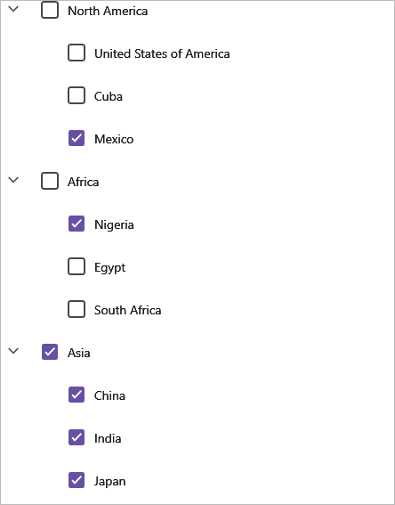

# Checkbox in .NET MAUI TreeView (SfTreeView)

SfTreeView provides support for loading [CheckBox]() in each node and enables users to check/uncheck the corresponding node. So, you should add a checkbox in the [ItemTemplate](https://help.syncfusion.com/cr/maui/Syncfusion.Maui.TreeView.SfTreeView.html#Syncfusion_Maui_TreeView_SfTreeView_ItemTemplate) of the `SfTreeView` and bind the [IsChecked]() property of the [TreeViewNode](https://help.syncfusion.com/cr/maui/Syncfusion.TreeView.Engine.TreeViewNode.html).

## Working with Checkbox in BoundMode

When populating treeview nodes from [ItemsSource](https://help.syncfusion.com/cr/maui/Syncfusion.Maui.TreeView.SfTreeView.html#Syncfusion_Maui_TreeView_SfTreeView_ItemsSource), accessing or modifying checked items can be achieved using [CheckedItems]() property.

SfTreeView facilitates the checking of multiple items by binding the [CheckedItems]() property from view model with `ObservableCollection<object>` type.

N> Set the [ItemTemplateContextType](https://help.syncfusion.com/cr/maui/Syncfusion.Maui.TreeView.SfTreeView.html#Syncfusion_Maui_TreeView_SfTreeView_ItemTemplateContextType) as `Node` in order to bind the `TreeViewNode.IsChecked` property to `CheckBox` within the `ItemTemplate`. To know more about `ItemTemplateContextType` click [here](https://help.syncfusion.com/maui/treeview/appearance#bindingcontext-for-itemtemplate). 

N> TreeView process and sets [TreeViewNode.IsChecked](()) based on `CheckedItems` only during the binding of `ItemsSource`.



         
    <?xml version="1.0" encoding="utf-8" ?>
    <ContentPage xmlns="http://schemas.microsoft.com/dotnet/2021/maui"
             xmlns:x="http://schemas.microsoft.com/winfx/2009/xaml"
             x:Class="BoundModeCheckbox.MainPage"
             xmlns:treeview="clr-namespace:Syncfusion.Maui.TreeView;assembly=Syncfusion.Maui.TreeView"
             xmlns:treeviewengine="clr-namespace:Syncfusion.TreeView.Engine;assembly=Syncfusion.Maui.TreeView"
             xmlns:checkbox="clr-namespace:Syncfusion.Maui.Buttons;assembly=Syncfusion.Maui.Buttons"
             xmlns:local="clr-namespace:BoundModeCheckbox">

        <ContentPage.BindingContext>
            <local:FileManagerViewModel x:Name="fileManagerViewModel"/>
        </ContentPage.BindingContext>

        <treeview:SfTreeView x:Name="treeView"
                            ItemsSource="{Binding Folders}"
                            AutoExpandMode="AllNodesExpanded"
                            CheckBoxMode="Recursive"
                            ItemTemplateContextType="Node"
                            CheckedItems="{Binding CheckedItems}"
                            NodePopulationMode="Instant"
                            SelectionMode="None">

            <treeview:SfTreeView.HierarchyPropertyDescriptors>
                <treeviewengine:HierarchyPropertyDescriptor TargetType="{x:Type local:Folder}" ChildPropertyName="FilesInfo"/>
                <treeviewengine:HierarchyPropertyDescriptor TargetType="{x:Type local:File}" ChildPropertyName="SubFiles"/>
            </treeview:SfTreeView.HierarchyPropertyDescriptors>
            
            <treeview:SfTreeView.ItemTemplate >
                <DataTemplate>
                    <Grid>
                        <Grid.ColumnDefinitions>
                            <ColumnDefinition Width="40" />
                            <ColumnDefinition Width="40" />
                            <ColumnDefinition Width="*" />
                        </Grid.ColumnDefinitions>
                        <Grid Grid.Column="0" >
                            <checkbox:SfCheckBox VerticalOptions="Center"
                                                HorizontalOptions="Center"
                                                IsChecked="{Binding IsChecked, Mode=TwoWay}"/>
                        </Grid>
                        <Grid Grid.Column="1">
                            <Image Source="{Binding Content.ImageIcon}"
                                VerticalOptions="Center"
                                HorizontalOptions="Center"
                                HeightRequest="24" 
                                WidthRequest="24"/>
                        </Grid>
                        <Grid Grid.Column="2" RowSpacing="1" Padding="1,0,0,0" VerticalOptions="Center">
                            <Label LineBreakMode="NoWrap"
                                Margin="5,0,0,0"
                                Text="{Binding Content.FolderName}"
                                CharacterSpacing="0.25" 
                                FontFamily="Roboto-Regular" 
                                FontSize="14"
                                VerticalTextAlignment="Center" />
                        </Grid>
                    </Grid>
                </DataTemplate>
            </treeview:SfTreeView.ItemTemplate>
        </treeview:SfTreeView>

    </ContentPage>






    public class Folder : INotifyPropertyChanged
    {
        private string? folderName;
        private string? imageIcon;
        private ObservableCollection<File>? filesInfo;

        public Folder()
        {
        }

        public string? FolderName
        {
            get
            {
                return folderName;
            }

            set
            {
                folderName = value;
                RaisedOnPropertyChanged("FolderName");
            }
        }

        public string? ImageIcon
        {
            get
            {
                return imageIcon;
            }

            set
            {
                imageIcon = value;
                RaisedOnPropertyChanged("Icon");
            }
        }

        public ObservableCollection<File>? FilesInfo
        {
            get
            {
                return filesInfo;
            }
            set
            {
                filesInfo = value;
                RaisedOnPropertyChanged("FilesInfo");

            }
        }

        private void RaisedOnPropertyChanged(string propertyName)
        {
            if (PropertyChanged != null)
            {
                PropertyChanged(this, new PropertyChangedEventArgs(propertyName));
            }
        }

        public event PropertyChangedEventHandler? PropertyChanged;
    }
    public class File : INotifyPropertyChanged
    {
        private string? folderName;
        private string? imageIcon;
        private ObservableCollection<SubFiles>? subFiles;

        public string? FolderName
        {
            get
            {
                return folderName;
            }

            set
            {
                folderName = value;
                RaiseOnPropertyChanged("FolderName");

            }
        }
        public string? ImageIcon
        {
            get
            {
                return imageIcon;
            }

            set
            {
                imageIcon = value;
                RaiseOnPropertyChanged("Icon");
            }
        }
        public ObservableCollection<SubFiles>? SubFiles
        {
            get
            {
                return subFiles;
            }

            set
            {
                subFiles = value;
                RaiseOnPropertyChanged("SubFiles");

            }
        }

        private void RaiseOnPropertyChanged(string propertyName)
        {
            if (PropertyChanged != null)
            {
                PropertyChanged(this, new PropertyChangedEventArgs(propertyName));
            }
        }
        public event PropertyChangedEventHandler? PropertyChanged;
    }

    public class SubFiles : INotifyPropertyChanged
    {
        private string? folderName;
        private string? imageIcon;
        public SubFiles()
        {
        }

        public string? FolderName
        {
            get
            {
                return folderName;
            }

            set
            {
                folderName = value;
                RaiseOnPropertyChanged("FolderName");

            }
        }
        public string? ImageIcon
        {
            get
            {
                return imageIcon;
            }

            set
            {
                imageIcon = value;
                RaiseOnPropertyChanged("Icon");
            }
        }

        private void RaiseOnPropertyChanged(string propertyName)
        {
            if (PropertyChanged != null)
            {
                PropertyChanged(this, new PropertyChangedEventArgs(propertyName));
            }
        }

        public event PropertyChangedEventHandler? PropertyChanged;
    }







    internal class FileManagerViewModel
    {
        private ObservableCollection<object>? checkedItems;
        public ObservableCollection<Folder> Folders { get; set; }
        public ObservableCollection<object>? CheckedItems
        {
            get { return checkedItems; }
            set { this.checkedItems = value; }
        }

        public FileManagerViewModel()
        {
            this.Folders = GenerateItem();
        }

        private ObservableCollection<Folder> GenerateItem()
        {

            var doc = new Folder() { FolderName = "Documents", ImageIcon = "folder.png" };
            var download = new Folder() { FolderName = "Downloads", ImageIcon = "folder.png" };
            var music = new Folder() { FolderName = "Music", ImageIcon = "folder.png" };
            var picture = new Folder() { FolderName = "Pictures", ImageIcon = "folder.png" };
            var videos = new Folder() { FolderName = "Videos", ImageIcon = "folder.png" };

            var pollution = new File() { FolderName = "Environmental Pollution.docx", ImageIcon = "Word.png" };
            var global = new File { FolderName = "Gloabal Warming.ppt", ImageIcon = "ppt.png" };
            var sanitation = new File() { FolderName = "Sanitation.docx", ImageIcon = "Word.png" };
            var socialNetwork = new File { FolderName = "Social Networks.ppt", ImageIcon = "ppt.png" };
            var youthEmpowerment = new File { FolderName = "Youth Empowerment.pdf", ImageIcon = "pdfimage.png" };

            var tutorials = new File() { FolderName = "Tutorials.zip", ImageIcon = "zip.png" };
            var typeScript = new File() { FolderName = "TypeScript.7z", ImageIcon = "zip.png" };
            var uiGuide = new File() { FolderName = "UI-Guide.pdf", ImageIcon = "pdfimage.png" };

            var song = new File() { FolderName = "Gouttes", ImageIcon = "Audio.png" };

            var camera = new File() { FolderName = "Camera Roll", ImageIcon = "folder.png" };
            var stone = new File() { FolderName = "Stone.jpg", ImageIcon = "image.png" };
            var wind = new File() { FolderName = "Wind.jpg", ImageIcon = "image.png" };

            var pic1 = new SubFiles() { FolderName = "WIN_20160726_09.JPG", ImageIcon = "people_circle23.png" };
            var pic2 = new SubFiles() { FolderName = "WIN_20160726.Png", ImageIcon = "people_circle2.png" };

            var video1 = new File() { FolderName = "Naturals.mp4", ImageIcon = "video.png" };
            var video2 = new File() { FolderName = "Wild.mpeg", ImageIcon = "video.png" };

            doc.FilesInfo = new ObservableCollection<File>();
            doc.FilesInfo.Add(pollution);
            doc.FilesInfo.Add(global);
            doc.FilesInfo.Add(sanitation);
            doc.FilesInfo.Add(socialNetwork);
            doc.FilesInfo.Add(youthEmpowerment);

            download.FilesInfo = new ObservableCollection<File>();
            download.FilesInfo.Add(tutorials);
            download.FilesInfo.Add(typeScript);
            download.FilesInfo.Add(uiGuide);

            music.FilesInfo = new ObservableCollection<File>();
            music.FilesInfo.Add(song);

            picture.FilesInfo = new ObservableCollection<File>();
            picture.FilesInfo.Add(camera);
            picture.FilesInfo.Add(stone);
            picture.FilesInfo.Add(wind);

            videos.FilesInfo = new ObservableCollection<File>();
            videos.FilesInfo.Add(video1);
            videos.FilesInfo.Add(video2);

            camera.SubFiles = new ObservableCollection<SubFiles>();
            camera.SubFiles.Add(pic1);
            camera.SubFiles.Add(pic2);

            var deviceList = new ObservableCollection<Folder>();
            deviceList.Add(doc);
            deviceList.Add(download);
            deviceList.Add(music);
            deviceList.Add(picture);
            deviceList.Add(videos);

            checkedItems = new ObservableCollection<object>();
            checkedItems.Add(video1);
            checkedItems.Add(global);
            checkedItems.Add(camera);
            checkedItems.Add(socialNetwork);

            return deviceList;
        }
    }



Download the entire source code from GitHub [here]().

## Working with Checkbox in UnboundMode

You can directly set the checkbox state by setting the [TreeViewNode.IsChecked]() property value while creating nodes.




    <?xml version="1.0" encoding="utf-8" ?>
    <ContentPage xmlns="http://schemas.microsoft.com/dotnet/2021/maui"
             xmlns:x="http://schemas.microsoft.com/winfx/2009/xaml"
             x:Class="UnboundModeCheckbox.MainPage"
             xmlns:treeview="clr-namespace:Syncfusion.Maui.TreeView;assembly=Syncfusion.Maui.TreeView"
             xmlns:treeviewengine="clr-namespace:Syncfusion.TreeView.Engine;assembly=Syncfusion.Maui.TreeView"
             xmlns:checkbox="clr-namespace:Syncfusion.Maui.Buttons;assembly=Syncfusion.Maui.Buttons">
    
        <ContentPage.Content>
            <treeview:SfTreeView x:Name="treeView" 
                                CheckBoxMode="Recursive"
                                SelectionMode="None">

                <treeview:SfTreeView.Nodes>
                    <treeviewengine:TreeViewNode Content="North America" IsExpanded="True">
                        <treeviewengine:TreeViewNode.ChildNodes>
                            <treeviewengine:TreeViewNode Content="United States of America"/>
                            <treeviewengine:TreeViewNode Content="Cuba"/>
                            <treeviewengine:TreeViewNode Content="Mexico" IsChecked="True"/>
                        </treeviewengine:TreeViewNode.ChildNodes>
                    </treeviewengine:TreeViewNode>
                    <treeviewengine:TreeViewNode Content="Africa" IsExpanded="True">
                        <treeviewengine:TreeViewNode.ChildNodes>
                            <treeviewengine:TreeViewNode Content="Nigeria" IsChecked="True"/>
                            <treeviewengine:TreeViewNode Content="Egypt"/>
                            <treeviewengine:TreeViewNode Content="South Africa"/>
                        </treeviewengine:TreeViewNode.ChildNodes>
                    </treeviewengine:TreeViewNode>
                    <treeviewengine:TreeViewNode Content="Asia" IsExpanded="True">
                        <treeviewengine:TreeViewNode.ChildNodes>
                            <treeviewengine:TreeViewNode Content="China"/>
                            <treeviewengine:TreeViewNode Content="India"/>
                            <treeviewengine:TreeViewNode Content="Japan"/>
                        </treeviewengine:TreeViewNode.ChildNodes>
                    </treeviewengine:TreeViewNode>
                    <treeviewengine:TreeViewNode Content="Europe" IsExpanded="True">
                        <treeviewengine:TreeViewNode.ChildNodes>
                            <treeviewengine:TreeViewNode Content="Denmark" IsChecked="True"/>
                            <treeviewengine:TreeViewNode Content="Finland"/>
                            <treeviewengine:TreeViewNode Content="Austria" IsChecked="True"/>
                        </treeviewengine:TreeViewNode.ChildNodes>
                    </treeviewengine:TreeViewNode>
                    <treeviewengine:TreeViewNode Content="South America" IsExpanded="True">
                        <treeviewengine:TreeViewNode.ChildNodes>
                            <treeviewengine:TreeViewNode Content="Brazil"/>
                            <treeviewengine:TreeViewNode Content="Colombia"/>
                            <treeviewengine:TreeViewNode Content="Argentina"/>
                            <treeviewengine:TreeViewNode Content="Peru"/>
                            <treeviewengine:TreeViewNode Content="Chile"/>
                        </treeviewengine:TreeViewNode.ChildNodes>
                    </treeviewengine:TreeViewNode>
                    <treeviewengine:TreeViewNode Content="Oceania" IsExpanded="True">
                        <treeviewengine:TreeViewNode.ChildNodes>
                            <treeviewengine:TreeViewNode Content="Australia"/>
                            <treeviewengine:TreeViewNode Content="New Zealand"/>
                            <treeviewengine:TreeViewNode Content="Samoa"/>
                            <treeviewengine:TreeViewNode Content="Tonga"/>
                            <treeviewengine:TreeViewNode Content="Vanuatu"/>
                        </treeviewengine:TreeViewNode.ChildNodes>
                    </treeviewengine:TreeViewNode>
                </treeview:SfTreeView.Nodes>

                <treeview:SfTreeView.ItemTemplate>
                    <DataTemplate>
                        <Grid Padding="5">
                            <checkbox:SfCheckBox Text="{Binding Content}" IsChecked="{Binding IsChecked, Mode=TwoWay}"/>
                        </Grid>
                    </DataTemplate>
                </treeview:SfTreeView.ItemTemplate>
            </treeview:SfTreeView>

        </ContentPage.Content>
    </ContentPage>



Download the entire source code from GitHub [here]().

## CheckBox State

The SfTreeView handles the [IsChecked](()) property (checkbox state) of `TreeViewNode` based on [CheckBoxMode]() property. `CheckBoxMode` property determines the behavior of parent and child node's checkbox states when users check or uncheck a node. Its default value is None. Checkbox contains the  following three states:

* `None`: Checking and unchecking are only reflected in the view and do not impact the CheckedItems collection.
* `Individual`: The state of the checkbox only affects the individual node and does not alter the checkbox state or IsChecked property value of parent or child nodes.
* `Recursive`: When a node's checkbox is checked or unchecked, it influences the checkbox states of both parent and child nodes checkbox state. For instance, if a parent node's checkbox is checked or unchecked, all its child node's checkboxes will follow suit. Similarly, if all child nodes within a parent node are either checked or unchecked, the parent node's checkbox will reflect this state accordingly. Additionally, if any of the child nodes are checked, the parent node's checkbox will enter an intermediate state.



     
    <syncfusion:SfTreeView x:Name="TreeView" CheckBoxMode="Recursive"/>


     
    TreeView.CheckBoxMode = CheckBoxMode.Recursive;



N> In recursive mode, the parent nodes checkbox state or `IsChecked` property value is updated only in UI interaction.

N> When the `CheckBoxMode` is enabled, the `ItemTapped` and `ItemDoubleTapped` events will not be triggered in `SfTreeView` since the `CheckBox` will handle the touch interaction, only the `NodeChecked` event is triggered.

## Get or Set Checked Items

### Get or Set Checked Items in Bound Mode

You can get or set a list of items to be checked or un-checked using [CheckedItems]() property.

When the [CheckBoxMode]() is set to a value other than `None`, the individual `TreeViewNode` or collection of `TreeViewNode` can be programmatically checked by manipulating the  `CheckedItems`property or adding items to the `CheckedItems` property based on the `CheckBoxMode`.

N> Programmatically adding or removing the node value does not impact the checkbox states of their parent and child nodes.




    treeView.CheckedItems.Add(viewModel.Folders[2]);
    treeView.CheckedItems.Add(viewModel.Folders[3]);




### Get or Set Checked Nodes in Unbound Mode

You can get the list of checked nodes using the [GetCheckedNodes]() method. You can set the checkbox state by setting [TreeViewNode.IsChecked]() property.



    
    treeView.GetCheckedNodes();



## Events

### NodeChecked event

The [NodeChecked]() event is raised when checking and unchecking the checkbox at run time. The [NodeCheckedEventArgs]() has the following members, which provide information for the `NodeChecked` event.

* `Node`: Gets the `TreeViewNode` and data associated with the checked item as its arguments.



     
    treeView.NodeChecked += TreeView_NodeChecked;

    private void TreeView_NodeChecked(object sender, Syncfusion.Maui.TreeView.NodeCheckedEventArgs e)
    {
     
    }



N> `NodeChecked` event occurs only in UI interactions.
