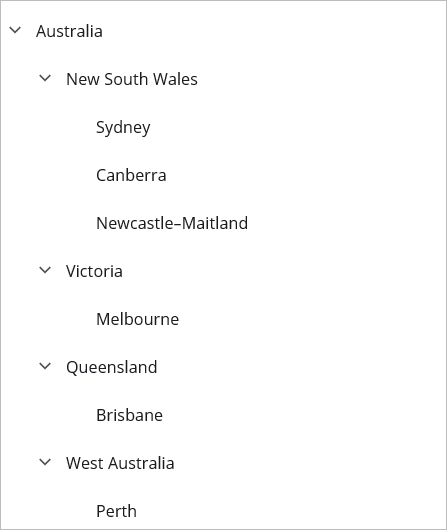

# Data Population in .NET MAUI TreeView (SfTreeView)

TreeView can be populated either with the data source by using a [ItemsSource](https://help.syncfusion.com/cr/maui/Syncfusion.Maui.TreeView.SfTreeView.html#Syncfusion_Maui_TreeView_SfTreeView_ItemsSource) property or by creating and adding the [TreeViewNode](https://help.syncfusion.com/cr/maui/Syncfusion.TreeView.Engine.TreeViewNode.html) in hierarchical structure to [Nodes](https://help.syncfusion.com/cr/maui/Syncfusion.Maui.TreeView.SfTreeView.html#Syncfusion_Maui_TreeView_SfTreeView_Nodes) property.

## Populating Nodes by data binding - Bound Mode

[Nodes](https://help.syncfusion.com/cr/maui/Syncfusion.Maui.TreeView.SfTreeView.html#Syncfusion_Maui_TreeView_SfTreeView_Nodes) can be populated in bound mode includes following steps.

* [Create hierarchical data model](#create-data-model-for-treeview)
* [Bind data model to treeview](#bind-to-hierarchical-datasource)

To update the collection changes in UI, it is necessary to define [NotificationSubscriptionMode](https://help.syncfusion.com/cr/maui/Syncfusion.TreeView.Engine.TreeViewNotificationSubscriptionMode.html) to Treeview as `CollectionChanged/PropertyChanged`. 
`NotificationSubscriptionMode` enum has following members:
* [CollectionChange](https://help.syncfusion.com/cr/maui/Syncfusion.Maui.Data.NotificationSubscriptionMode.html#Syncfusion_Maui_Data_NotificationSubscriptionMode_CollectionChange) - Updates its tree structure when the child items collection is changed.
* [PropertyChange](https://help.syncfusion.com/cr/maui/Syncfusion.Maui.Data.NotificationSubscriptionMode.html#Syncfusion_Maui_Data_NotificationSubscriptionMode_PropertyChange) - Updates its ChildItems when the associated collection property is changed.
* [None](https://help.syncfusion.com/cr/maui/Syncfusion.Maui.Data.NotificationSubscriptionMode.html#Syncfusion_Maui_Data_NotificationSubscriptionMode_None) - It is a default mode and it doesnot reflect collection or property changes in UI.

To decide how to populate the nodes, it is necessary to set this [NodePopulationMode](https://help.syncfusion.com/cr/maui/Syncfusion.Maui.TreeView.SfTreeView.html#Syncfusion_Maui_TreeView_SfTreeView_NodePopulationMode) API to Treeview. 

The `NodePopulationMode` API has following enum values:

* [OnDemand](https://help.syncfusion.com/cr/maui/Syncfusion.TreeView.Engine.TreeNodePopulationMode.html#Syncfusion_TreeView_Engine_TreeNodePopulationMode_OnDemand) - Populate the child nodes only when the parent nodes is expanded. It is the default value.
* [Instant](https://help.syncfusion.com/cr/maui/Syncfusion.TreeView.Engine.TreeNodePopulationMode.html#Syncfusion_TreeView_Engine_TreeNodePopulationMode_Instant) - Populates all the child nodes when Treeview control is initially loaded.

### Create Data Model for treeview

Create a simple data source as shown in the following code example in a new class file, and save it as `FileManager.cs` file: 




public class FileManager : INotifyPropertyChanged
{
   private string itemName;
   private ImageSource imageIcon;
   private ObservableCollection<FileManager> subFiles;

   public ObservableCollection<FileManager> SubFiles
   {
      get { return subFiles; }
      set
      {
         subFiles = value;
         RaisedOnPropertyChanged("SubFiles");
      }
   }

   public string ItemName
   {
      get { return itemName; }
      set
      {
         itemName = value;
         RaisedOnPropertyChanged("ItemName");
      }
   }

   public ImageSource ImageIcon
   {
       get { return imageIcon; }
       set
       {
          imageIcon = value;
          RaisedOnPropertyChanged("ImageIcon");
       }
   }

   public event PropertyChangedEventHandler PropertyChanged;

   public void RaisedOnPropertyChanged(string _propertyName)
   {
      if (PropertyChanged != null)
      {
         PropertyChanged(this, new PropertyChangedEventArgs(_propertyName));
      }
   }
}




Create a model repository class with ImageNodeInfo collection property initialized with the required number of data objects in a new class file as shown in the following code example, and save it as `FileManagerViewModel.cs` file:




public class FileManagerViewModel
{
   private ObservableCollection<FileManager> imageNodeInfo;

   public FileManagerViewModel()
   {
      GenerateSource();
   }

   public ObservableCollection<FileManager> ImageNodeInfo
   {
      get { return imageNodeInfo; }
      set { this.imageNodeInfo = value; }
   }

   private void GenerateSource()
   {
      var nodeImageInfo = new ObservableCollection<FileManager>();
      var doc = new FileManager() { ItemName = "Documents", ImageIcon = "folder.png" };
      var download = new FileManager() { ItemName = "Downloads", ImageIcon = "folder.png" };
      var mp3 = new FileManager() { ItemName = "Music", ImageIcon ="folder.png" };
      var pictures = new FileManager() { ItemName = "Pictures", ImageIcon = "folder.png" };
      var video = new FileManager() { ItemName = "Videos", ImageIcon ="folder.png" };

      var pollution = new FileManager() { ItemName = "Environmental Pollution.docx", ImageIcon = "word.png" };
      var globalWarming = new FileManager() { ItemName = "Global Warming.ppt", ImageIcon = "ppt.png" };
      var sanitation = new FileManager() { ItemName = "Sanitation.docx", ImageIcon = "word.png"};
      var socialNetwork = new FileManager() { ItemName = "Social Network.pdf", ImageIcon ="pdfimage.png" };
      var youthEmpower = new FileManager() { ItemName = "Youth Empowerment.pdf", ImageIcon = "pdfimage.png" };

      
      var tutorials = new FileManager() { ItemName = "Tutorials.zip", ImageIcon = "zip.png" };
      var typeScript = new FileManager() { ItemName = "TypeScript.7z", ImageIcon ="zip.png" };
      var uiGuide = new FileManager() { ItemName = "UI-Guide.pdf", ImageIcon = "pdfimage.png"};

      var song = new FileManager() { ItemName = "Gouttes", ImageIcon = "audio.png" };

      var camera = new FileManager() { ItemName = "Camera Roll", ImageIcon = "folder.png" };
      var stone = new FileManager() { ItemName = "Stone.jpg", ImageIcon = "image.png" };
      var wind = new FileManager() { ItemName = "Wind.jpg", ImageIcon = "image.png"};

      var img0 = new FileManager() { ItemName = "WIN_20160726_094117.JPG", ImageIcon = "people_circle23.png" };
      var img1 = new FileManager() { ItemName = "WIN_20160726_094118.JPG", ImageIcon = "people_circle2.png" };

      var video1 = new FileManager() { ItemName = "Naturals.mp4", ImageIcon = "video.png" };
      var video2 = new FileManager() { ItemName = "Wild.mpeg", ImageIcon = "video.png" };

      doc.SubFiles = new ObservableCollection<FileManager>
      {
         pollution,
         globalWarming,
         sanitation,
         socialNetwork,
         youthEmpower
      };

      download.SubFiles = new ObservableCollection<FileManager>
      {
         tutorials,
         TypeScript,
         uiGuide
      };

      mp3.SubFiles = new ObservableCollection<FileManager>
      {
         song
      };

      pictures.SubFiles = new ObservableCollection<FileManager>
      {
         camera,
         stone,
         wind
      };

      camera.SubFiles = new ObservableCollection<FileManager>
      {
         img0,
         img1
      };

      video.SubFiles = new ObservableCollection<FileManager>
      {
         video1,
         video2
      };

      nodeImageInfo.Add(doc);
      nodeImageInfo.Add(download);
      nodeImageInfo.Add(mp3);
      nodeImageInfo.Add(pictures);
      nodeImageInfo.Add(video);
      imageNodeInfo = nodeImageInfo;
  }
}




### Bind to hierarchical datasource

To create a tree view using data binding, set a hierarchical data collection to the [ItemsSource](https://help.syncfusion.com/cr/maui/Syncfusion.Maui.TreeView.SfTreeView.html#Syncfusion_Maui_TreeView_SfTreeView_ItemsSource) property. And set the child object name to the [ChildPropertyName](https://help.syncfusion.com/cr/maui/Syncfusion.Maui.TreeView.SfTreeView.html#Syncfusion_Maui_TreeView_SfTreeView_ChildPropertyName) property.



<?xml version="1.0" encoding="utf-8" ?>
<ContentPage xmlns="http://schemas.microsoft.com/dotnet/2021/maui"
             xmlns:x="http://schemas.microsoft.com/winfx/2009/xaml"
             xmlns:syncfusion="clr-namespace:Syncfusion.Maui.TreeView;assembly=Syncfusion.Maui.TreeView"
             x:Class="GettingStarted.MainPage">
    <ContentPage.BindingContext>
       <local:FileManagerViewModel x:Name="viewModel"></local:FileManagerViewModel>
    </ContentPage.BindingContext>
    <ContentPage.Content>
       <syncfusion:SfTreeView x:Name="treeView"
                              ChildPropertyName="SubFiles"
                              ItemsSource="{Binding ImageNodeInfo}"/>
       </syncfusion:SfTreeView>
    </ContentPage.Content>
</ContentPage>



SfTreeView treeView = new SfTreeView();
FileManagerViewModel viewModel = new FileManagerViewModel ();
treeView.ChildPropertyName = "SubFiles";
treeView.ItemsSource = viewModel.ImageNodeInfo; 
this.Content = treeView;




Download the entire source code from GitHub [here](https://github.com/SyncfusionExamples/data-binding-in-.net-maui-treeview).

## Populating Nodes without data binding - Unbound Mode

You can create and manage the [TreeViewNode](https://help.syncfusion.com/cr/maui/Syncfusion.TreeView.Engine.TreeViewNode.html) objects by yourself to display the data in a hierarchical view. Create the node hierarchy by adding one or more root nodes to the [Nodes](https://help.syncfusion.com/cr/maui/Syncfusion.Maui.TreeView.SfTreeView.html#Syncfusion_Maui_TreeView_SfTreeView_Nodes) collection. Each `TreeViewNode` can then have more nodes added to its Children collection. You can nest the tree view nodes to any depth you need. By using the [Content](https://help.syncfusion.com/cr/maui/Syncfusion.TreeView.Engine.TreeViewNode.html#Syncfusion_TreeView_Engine_TreeViewNode_Content) property, you can get the data object associated with the tree view node. For the Bound node, you can bind the data object using the `Content` property by setting the `ItemTemplateContextType` to `Node`. For Unbound node, you can directly set the `Content` value. You can get the parent node of the treeview nodes by using the [ParentNode](https://help.syncfusion.com/cr/maui/Syncfusion.TreeView.Engine.TreeViewNode.html#Syncfusion_TreeView_Engine_TreeViewNode_ParentNode) property of the TreeViewNode. By using the Level property of the `TreeViewNode`, you can get the zero-based depth of the tree node in the TreeView control. For the [Level](https://help.syncfusion.com/cr/maui/Syncfusion.TreeView.Engine.TreeViewNode.html#Syncfusion_TreeView_Engine_TreeViewNode_Level) property, the root node is considered the first level of nesting and returns 0.




<?xml version="1.0" encoding="utf-8" ?>
<ContentPage xmlns="http://schemas.microsoft.com/dotnet/2021/maui"
             xmlns:x="http://schemas.microsoft.com/winfx/2009/xaml"
             xmlns:syncfusion="clr-namespace:Syncfusion.Maui.TreeView;assembly=Syncfusion.Maui.TreeView"
             xmlns:treeviewengine="clr-namespace:Syncfusion.TreeView.Engine;assembly=Syncfusion.Maui.TreeView">
    <ContentPage.Content>
       <syncfusion:SfTreeView x:Name="treeView">
            <syncfusion:SfTreeView.Nodes>
                <treeviewengine:TreeViewNode Content="Australia">
                    <treeviewengine:TreeViewNode.ChildNodes>
                        <treeviewengine:TreeViewNode Content="New South Wales">
                            <treeviewengine:TreeViewNode.ChildNodes>
                                <treeviewengine:TreeViewNode Content="Sydney"/>
                            </treeviewengine:TreeViewNode.ChildNodes>  
                        </treeviewengine:TreeViewNode>
                    </treeviewengine:TreeViewNode.ChildNodes>
                </treeviewengine:TreeViewNode>
                <treeviewengine:TreeViewNode Content="United States of America">
                    <treeviewengine:TreeViewNode.ChildNodes>
                        <treeviewengine:TreeViewNode Content="New York"/>
                        <treeviewengine:TreeViewNode Content="California">
                            <treeviewengine:TreeViewNode.ChildNodes>
                                <treeviewengine:TreeViewNode Content="San Francisco"/>
                            </treeviewengine:TreeViewNode.ChildNodes>
                        </treeviewengine:TreeViewNode>
                    </treeviewengine:TreeViewNode.ChildNodes>
                </treeviewengine:TreeViewNode>
            </syncfusion:SfTreeView.Nodes>
        </syncfusion:SfTreeView>
    </ContentPage.Content>
</ContentPage>




using Microsoft.Maui.Controls;
using Syncfusion.Maui.TreeView;
using Syncfusion.TreeView.Engine;
using System;

namespace GettingStarted
{
    public class MainPage : ContentPage
    {
        SfTreeView treeView;
        public MainPage()
        {
            treeView = new SfTreeView();
            var australia = new TreeViewNode() { Content = "Australia" };
            var nsw = new TreeViewNode() { Content = "New South Wales" };
            var sydney = new TreeViewNode() { Content = "Sydney" };
            australia.ChildNodes.Add(nsw);
            nsw.ChildNodes.Add(sydney);
 
            var usa = new TreeViewNode() { Content = "United States of America" };
            var newYork = new TreeViewNode() { Content = "New York," };
            var california = new TreeViewNode() { Content = "California" };
            var sanFrancisco = new TreeViewNode() { Content = "San Francisco" };
            usa.ChildNodes.Add(newYork);
            usa.ChildNodes.Add(california);
            california.ChildNodes.Add(sanFrancisco);
            treeView.Nodes.Add(australia);
            treeView.Nodes.Add(usa);

            this.Content = treeView;
        }
    }
}




Download the entire source code from GitHub [here](https://github.com/SyncfusionExamples/populate-the-nodes-in-unbound-mode-in-.net-maui-treeview).

